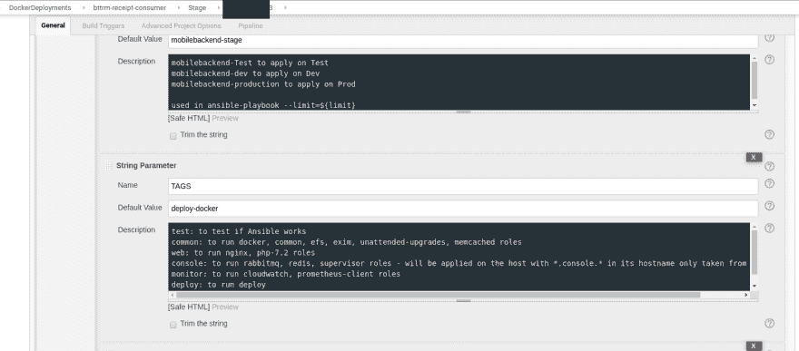

# Jenkins: Docker 使用 ECR 身份验证从 Ansible 构建部署

> 原文:[https://dev . to/setevoy/Jenkins-docker-compose-deployment-from-ansi ble-with-ECR-authentic ation-34 D1](https://dev.to/setevoy/jenkins-docker-compose-deployment-from-ansible-with-ecr-authentication-34d1)

[](https://res.cloudinary.com/practicaldev/image/fetch/s--ZNr-ArAg--/c_limit%2Cf_auto%2Cfl_progressive%2Cq_auto%2Cw_880/https://rtfm.co.ua/wp-content/uploads/2016/01/Jenkins.sh-600x600-e1453134979914.png) 除了 [AWS:创建一个弹性容器注册表和 Jenkins 部署作业](https://rtfm.co.ua/en/aws-create-an-elastic-container-registry-and-jenkins-deploy-job/)post-下一部分，我们将创建一个新的 Jenkins 作业来部署一个 Docker 合成文件以运行我们的 Docker 映像。

Docker Compose 文件将由一个名为 docker-deploy 的角色更新，该角色将设置所需的*标记*，将该文件复制到主机，并将启动一个 systemd 服务。

为了使这个部署工作——需要在主机上为 Docker 守护进程创建一个身份验证——让我们使用[Amazon-ECR-credential-helper](https://github.com/awslabs/amazon-ecr-credential-helper)来完成这个任务。

在本帖中，我们将回顾:

*   [亚马逊-ECR-凭证-助手](https://rtfm.co.ua/en/jenkins-docker-compose-deployment-from-ansible-with-ecr-authentication/#Amazon-ecr-credential-helper)
*   [负责部署角色](https://rtfm.co.ua/en/jenkins-docker-compose-deployment-from-ansible-with-ecr-authentication/#Ansible_deploy_role)
*   [詹金斯的工作](https://rtfm.co.ua/en/jenkins-docker-compose-deployment-from-ansible-with-ecr-authentication/#Jenkins_job)

### [](#amazonecrcredentialhelper)亚马逊-ECR-凭证-助手

首先，让我们手动运行它。

由于没有现成的包或 Debian OS——创建一个 bash 脚本，它将通过`docker` :
触发[Amazon-ECR-credential-helper](https://github.com/awslabs/amazon-ecr-credential-helper)

```
#!/usr/bin/env bash
SECRET=$(docker run --rm -e METHOD=$1 -e REGISTRY=$(cat -) -v $HOME/.aws/credentials:/root/.aws/credentials pottava/amazon-ecr-credential-helper)
echo $SECRET | grep Secret 
```

设置可执行权限:

```
root@bttrm-dev-console:/home/admin# chmod +x /usr/bin/docker-credential-ecr-login 
```

创建一个 AWS 概要文件，这样 AWS CLI 将创建一个将由[Amazon-ECR-credential-helper](https://github.com/awslabs/amazon-ecr-credential-helper):
使用的`~/.aws/credentials`文件

```
root@bttrm-dev-console:/home/admin# aws configure
AWS Access Key ID [None]: AKI***6EZ
AWS Secret Access Key [None]: PpN***GNr
Default region name [None]: us-east-2
Default output format [None]: json 
```

更新`~/.docker/config.json`配置:

```
{
    "credHelpers": {
        "534***85.dkr.ecr.us-east-2.amazonaws.com": "ecr-login"
    }
} 
```

这里我们使用`ecr-login`授权器为*534 * * * 85 . dkr . ECR . us-east-2 . Amazon AWS . com*仓库设置认证。

拉图:

```
root@bttrm-dev-console:/home/admin# docker pull pottava/amazon-ecr-credential-helper
Using default tag: latest
latest: Pulling from pottava/amazon-ecr-credential-helper
...
Status: Downloaded newer image for pottava/amazon-ecr-credential-helper:latest 
```

并尝试为这个 ECR 存储库运行一些`docker pull`:

```
root@bttrm-dev-console:/home/admin# docker pull 534***385.dkr.ecr.us-east-2.amazonaws.com/bttrm-receipt-consumer
Using default tag: latest
latest: Pulling from bttrm-receipt-consumer
Digest: sha256:3bb7cebd34d7642b10fe44ad8ab375e5fd772fc82b4f6fa997c59833445fdef5
Status: Image is up to date for 534***385.dkr.ecr.us-east-2.amazonaws.com/bttrm-receipt-consumer:latest 
```

好的——它起作用了。

现在，我们需要对 Ansible 做同样的事情。

### [](#ansible-deploy-role)可部署角色

创建 Docker 配置模板-`roles/deploy-docker/templates/config.json.j2`:

```
{
    "credHelpers": {
        "{{ bttrm_queue_consumer_repo }}": "ecr-login"
    }
} 
```

AWS CLI 认证文件—`roles/deploy-docker/templates/aws-credentials.j2`:

```
[default]
aws_access_key_id = {{ bttrm_queue_consumer_login }}
aws_secret_access_key = {{ bttrm_queue_consumer_pass }} 
```

在`group_vars/mobilebackend-dev.yml` :
中添加变量

```
...
bttrm_queue_consumer_repo: "534***385.dkr.ecr.us-east-2.amazonaws.com"
bttrm_queue_consumer_image: "bttrm-receipt-consumer"
bttrm_queue_consumer_login: "AKI***6EZ"
bttrm_queue_consumer_pass: "PpN***GNr"
... 
```

创建 bash 脚本模板-`roles/deploy-docker/templates/docker-credential-ecr-login-sh.j2`:

```
#!/usr/bin/env bash
SECRET=$(docker run --rm -e METHOD=$1 -e REGISTRY=$(cat -) -v $HOME/.aws/credentials:/root/.aws/credentials pottava/amazon-ecr-credential-helper)
echo $SECRET | grep Secret 
```

以及一个用于 Docker 编写文件的模板，该文件将启动容器—`roles/deploy-docker/templates/bttrm-queue-consumer-compose.yml.j2`:

```
version: '3.5'

services:

  receipts:
    container_name: bttrm-queue-consumer-{{ backend_project_name }}
    image: {{ bttrm_queue_consumer_repo}}/{{ bttrm_queue_consumer_image}}:{{ bttrm_queue_consumer_tag }}
    environment:
      - APPLICATION_ENV={{ env }}
      ... 
```

在这样的合成文件中，Ansible 将从 Jenkins 作业的参数中获取的所需的*标记*设置为默认值“*最新*”:

[T2】](https://rtfm.co.ua/wp-content/uploads/2019/09/Screenshot_20190926_155630-1.png)

为服务创建一个 systemd-unit 文件-`roles/deploy-docker/templates/bttrm-queue-consumer-systemd.yml.j2`:

```
[Unit]
Description=bttrm-queue-consumer client
Requires=docker.service
After=docker.service
[Service]
Restart=always
WorkingDirectory={{ bttrm_queue_consumer_home }}
# Compose up
ExecStart=/usr/local/bin/docker-compose -f bttrm-queue-consumer-compose.yml up
# Compose down, remove containers and volumes
ExecStop=/usr/local/bin/docker-compose -f bttrm-queue-consumer-compose.yml down -v
[Install]
WantedBy=multi-user.target 
```

在`roles/deploy-docker/tasks/main.yml`中添加文件复制和服务启动任务:

```
- name: "Copy Docker config"
  template:
    src: "templates/config.json.j2"
    dest: "/root/.docker/config.json"
  when: "'console' in inventory_hostname"
- name: "Copy AWS CLI credentials config"
  template:
    src: "templates/aws-credentials.j2"
    dest: "/root/.aws/credentials"
  when: "'console' in inventory_hostname"

- name: "Copy Docker ECR credentials script"
  template:
    src: "templates/docker-credential-ecr-login-sh.j2"
    dest: "/usr/bin/docker-credential-ecr-login"
  when: "'console' in inventory_hostname"    

- name: "Set Docker ECR credentials script executable"
  file: 
    path: "/usr/bin/docker-credential-ecr-login"
    mode: 0755
  when: "'console' in inventory_hostname"
- name: "Create bttrm-queue-consumer home"
  file:
    path: "{{ bttrm_queue_consumer_home }}"
    state: directory
    mode: 0775
    recurse: yes
  when: "'console' in inventory_hostname"
- name: "Copy bttrm-queue-consumer Compose file"
  template:
    src: "templates/bttrm-queue-consumer-compose.yml.j2"
    dest: "{{ bttrm_queue_consumer_home }}/bttrm-queue-consumer-compose.yml"
  when: "'console' in inventory_hostname"
- name: "Copy bttrm-queue-consumer systemd file"
  template:
    src: "templates/bttrm-queue-consumer-systemd.yml.j2"
    dest: "/etc/systemd/system/bttrm-queue-consumer.service"
  when: "'console' in inventory_hostname"
- name: "Start bttrm-queue-consumer service"
  service:
    name: "bttrm-queue-consumer"
    state: restarted
    enabled: yes
    daemon_reload: yes
  when: "'console' in inventory_hostname" 
```

### [](#jenkins-job)詹金斯工作

使用函数`ansibleApply()` :
创建一个 Jenkins 管道作业

```
...
def ansibleApply(app_rsa_id='1', bastion_rsa_id='2', tags='3', limit='4', playbookFile='5', passfile_id='6', connection='7') {

    docker.image('projectname/projectname-ansible:1.1').inside('-v /var/run/docker.sock:/var/run/docker.sock') {

        stage('Ansible apply') {
            withCredentials([
                file(credentialsId: "${app_rsa_id}", variable: 'app_rsa'),
                file(credentialsId: "${passfile_id}", variable: 'passfile'),
                file(credentialsId: "${bastion_rsa_id}", variable: 'bastion_rsa')
            ]) {
                sh "ansible-playbook --private-key ${bastion_rsa} --tags ${tags} --limit=${limit} ${playbookFile} --vault-password-file ${passfile} --extra-vars \
                    \"ansible_connection=${connection} \
                    app_rsa_pem_key=${app_rsa} \
                    bastion_rsa_pem_key=${bastion_rsa}\""
               }
        }
    }
}
... 
```

从`Jenkinsfile` :
调用

```
node {
...
        // infra for CloudFormation
        // from Jenkins job's parameters
        TAGS = "${env.TAGS}"
        // limit for hosts.ini
        LIMIT = "${env.LIMIT}"

        // playbook to run, e.g. mobilebackend.yml
        PLAYBOOK = "${env.PLAYBOOK}"

        // file with ansible vault password
        // to be used in ansibleApply()'s withCredentials()
        PASSFILE_ID = "${env.PASSFILE_ID}"

        provision.ansibleRolesInstall()
        provision.ansbileSyntaxCheck("${LIMIT}", "${PLAYBOOK}")
        ...
        // ansibleApply(rsa_id='1', tags='2', limit='3', playbookFile='4', passfile_id='5', connection='6')
        provision.ansibleApply( "${APP_RSA_ID}", "${BASTION_RSA_ID}", "${TAGS}", "${LIMIT}", "${PLAYBOOK}", "${PASSFILE_ID}", "${CONN}")
    }
}
... 
```

这里，我们将 *deploy-docker* 标记从 Jenkins 作业的参数传递到 Ansible 剧本:

[T2】](https://rtfm.co.ua/wp-content/uploads/2019/09/Screenshot_20190926_155354.png)

通过这个标签–ansi ble 将关闭要应用的角色-`tags: deploy-docker`:

```
...
    - role: deploy-docker
      tags: deploy-docker
      backend_project_name: "{{ lookup('env','APP_PROJECT_NAME') }}"
      bttrm_queue_consumer_tag: "{{ lookup('env','BTTRM_QUEUE_CONSUMER_TAG') }}"
      when: "'backend-bastion' not in inventory_hostname" 
```

并在此期间用 *bttrm_queue_consumer_tag* 值更新 Docker 合成文件。

部署，检查:

```
root@bttrm-stage-console:/opt/bttrm-queue-consumer# systemctl status bttrm-queue-consumer
● bttrm-queue-consumer.service - bttrm-queue-consumer client
Loaded: loaded (/etc/systemd/system/bttrm-queue-consumer.service; enabled; vendor preset: enabled)
...
Sep 26 16:06:23 bttrm-stage-console docker-compose[21251]: bttrm-queue-consumer-projectname-me-v3 | time="2019-09-26T13:06:23Z" level=info msg="Connecting as projectname_me_v3 to stage.backend-db3-master.example.world:3306/projectname_me_v3"

Sep 26 16:06:23 bttrm-stage-console docker-compose[21251]: bttrm-queue-consumer-projectname-me-v3 | time="2019-09-26T13:06:23Z" level=info msg="Declaring Queue (itunes-receipts)"

Sep 26 16:06:23 bttrm-stage-console docker-compose[21251]: bttrm-queue-consumer-projectname-me-v3 | time="2019-09-26T13:06:23Z" level=info msg="Waiting for queue messages..." 
```

完成了。

### [](#similar-posts)类似的帖子

*   <small>06/18/2019</small>[sonar cube:在 Docker](https://rtfm.co.ua/en/sonarqube-running-tests-from-jenkins-pipeline-from-docker/) 运行来自 Jenkins 管道的测试
*   <small>03/10/2019</small>[Prometheus:RTFM 博客监控与 ansi ble–Grafana、Loki 和 promtail 一起设置](https://rtfm.co.ua/en/prometheus-rtfm-blog-monitoring-set-up-with-ansible-grafana-loki-and-promtail/)