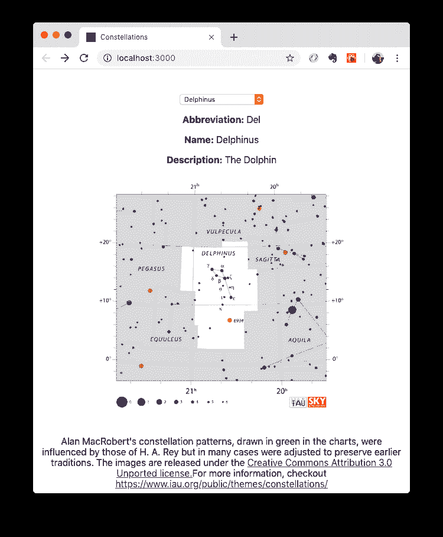

# 使用 MicroProfile 创建 TomEE / React 应用程序——第 1 部分

> 原文：<https://dev.to/geefygeorge/creating-a-tomee-react-application-using-microprofile-part-1-24>

在本文和后续文章中，我将构建一个提供 REST 接口的 TomEE 应用程序。然后，React JavaScript 前端将查询该接口。具体来说，后端将通过 JAX-RS 公开一个 REST 接口，提供关于星座的信息。React 前端将允许用户选择一个星座来获得更多关于它的细节。最终产品看起来会像这样:

[](https://res.cloudinary.com/practicaldev/image/fetch/s--uI17pq3_--/c_limit%2Cf_auto%2Cfl_progressive%2Cq_auto%2Cw_880/https://davidsalter.uk/asseimg/tomeereact.png)

## 创建后端

创建星座 API 的最快方法是使用[微概要启动器](https://start.microprofile.io)。这使得为微概要文件 Maven 应用程序创建的所有脚手架成为可能。对于该应用，选择了以下选项:

*   `groupId` - com.davidsalter
*   `artifactId` - constellationapi
*   `MicroProfile Version` - 2.1
*   `MicroProfile Server`汤姆

在撰写本文时，MicroProfile Starter 上 TomEE 的最新可用版本是 8.0.0.M3，但是自上次更新 Starter 以来，已经发布了 8.0.0 版本。因此，第一个任务是更新到项目的 pom.xml 文件中 TomEE 的正确(最新)版本。

```
<properties>
  <tomee.version>8.0.0</tomee.version>
...

<plugin>
  <groupId>org.apache.tomee.maven</groupId>
  <artifactId>tomee-maven-plugin</artifactId>
  <version>${tomee.version}</version> 
```

为了方便地访问 API 中的星座，我希望将它们存储在数据库中，并使用 JPA 查询它们。为此，我需要在应用程序中添加一些 Java EE 8。这是通过将`javaee-api`依赖项添加到`pom.xml`
中实现的

```
<dependency>
  <groupId>org.apache.tomee</groupId>
  <artifactId>javaee-api</artifactId>
  <version>8.0-2</version>
  <scope>provided</scope>
</dependency> 
```

完整的`pom.xml`看起来像:

```
<?xml version="1.0" encoding="UTF-8"?>
<project
  xsi:schemaLocation="http://maven.apache.org/POM/4.0.0 http://maven.apache.org/xsd/maven-4.0.0.xsd"
  xmlns="http://maven.apache.org/POM/4.0.0"
  xmlns:xsi="http://www.w3.org/2001/XMLSchema-instance">
  <modelVersion>4.0.0</modelVersion>
  <groupId>com.davidsalter</groupId>
  <artifactId>constellationapi</artifactId>
  <version>1.0-SNAPSHOT</version>
  <packaging>war</packaging>
  <properties>
    <final.name>constellationapi</final.name>
    <tomee.version>8.0.0</tomee.version>
    <failOnMissingWebXml>false</failOnMissingWebXml>
    <maven.compiler.source>1.8</maven.compiler.source>
    <maven.compiler.target>1.8</maven.compiler.target>
  </properties>
  <dependencies>
    <dependency>
      <groupId>org.eclipse.microprofile</groupId>
      <artifactId>microprofile</artifactId>
      <version>2.1</version>
      <type>pom</type>
      <scope>provided</scope>
    </dependency>
    <dependency>
      <groupId>org.apache.tomee</groupId>
      <artifactId>javaee-api</artifactId>
      <version>8.0-2</version>
      <scope>provided</scope>
    </dependency>
  </dependencies>
  <build>
    <finalName>constellationapi</finalName>
  </build>
  <profiles>
    <profile>
      <id>tomee</id>
      <activation>
        <activeByDefault>true</activeByDefault>
      </activation>
      <build>
        <plugins>
          <plugin>
            <groupId>org.apache.tomee.maven</groupId>
            <artifactId>tomee-maven-plugin</artifactId>
            <version>${tomee.version}</version>
            <executions>
              <execution>
                <id>executable-jar</id>
                <phase>package</phase>
                <goals>
                  <goal>exec</goal>
                </goals>
              </execution>
            </executions>
            <configuration>
              <context>ROOT</context>
              <tomeeClassifier>microprofile</tomeeClassifier>
              <tomeeHttpPort>8080</tomeeHttpPort>
              <tomeeShutdownPort>8005</tomeeShutdownPort>
              <tomeeAjpPort>8009</tomeeAjpPort>
            </configuration>
          </plugin>
        </plugins>
      </build>
    </profile>
  </profiles>
</project> 
```

现在我们已经创建了项目的基本框架，使用 MicroProfile Starter 并手动编辑`pom.xml`，我们需要做 3 件事情来完成 API。

1.  创建一个持久层来保存所有星座的细节
2.  填充持久层
3.  创建一个 JAX-RS 端点来查询持久层

## 创建持久层

因为我们使用 JPA，所以我们需要创建一个`@Entity`类来表示一个星座，并创建一个 DAO 类来从后端数据库表中检索数据。由于我用的是 TomEE，所以可以使用内嵌的 HSQLDB，不需要安装任何新的驱动。所有必需的依赖项都是现成的。

首先，我们需要创建一个`@Entity`类

```
package com.davidsalter.constellationapi.entity;

import javax.persistence.Entity;
import javax.persistence.Id;
import javax.persistence.NamedQuery;
import javax.persistence.Table;

@Entity
@Table(name = "Constellation")
@NamedQuery(name = "Constellation.findAll", query = "SELECT c FROM Constellation c")
public class Constellation {
  private static final long serialVersionUID = 1L;

  public Constellation() {
  }

  private String name;

  @Id
  private String abbreviation;

  private String description;

  // Getters / Setters omitted 
```

从这段代码中，我们可以看到已经定义了一个`@Entity`类，它由一个名为`Constellation`的数据库表支持。这个表有 3 个字段

* * *

| 田 | 描述 |
| --- | --- |
| 名字 | 星座的名字。 |
| 缩写 | 星座的缩写。这就是 PK |
| 描述 | 对星座的描述， |

* * *

该类还定义了一个`@NamedQuery`来从数据库中获取所有星座的列表。

因此，`Constellation`类代表一个单独的实体，所以我们需要编写一个 DAO 类来从数据库中检索所有的实体。

`ConstellationDao`类如下所示:

```
package com.davidsalter.constellationapi.controller;

import java.util.List;

import javax.enterprise.context.RequestScoped;
import javax.persistence.EntityManager;
import javax.persistence.PersistenceContext;

import com.davidsalter.constellationapi.entity.Constellation;

@RequestScoped
public class ConstellationDao {

  @PersistenceContext(name = "constellation-pu")
  private EntityManager em;

  public List<Constellation> findAllConstellations() {
    return em.createNamedQuery("Constellation.findAll", Constellation.class).getResultList();
  }
} 
```

这个类只是提供了一个方法(`findAllConstellations`)，该方法执行我们在`Constellation`类中创建的`@NamedQuery`。

该类利用一个`EntityManager`来查询数据库。这反过来使用一个名为`constellation-pu`的持久性单元来定义数据库及其创建方式。

在`META-INF/persistence.xml`文件中，我们将持久性单元定义如下:

```
<persistence version="2.2"
  xmlns="http://java.sun.com/xml/ns/persistence"
  xmlns:xsi="http://www.w3.org/2001/XMLSchema-instance"
  xsi:schemaLocation="http://java.sun.com/xml/ns/persistence http://java.sun.com/xml/ns/persistence/persistence_2_1.xsd">
  <persistence-unit name="constellation-pu">
    <provider>org.apache.openjpa.persistence.PersistenceProviderImpl
    </provider>

    <jta-data-source>constellationDatasource</jta-data-source>
    <properties>
      <property name="openjpa.jdbc.DBDictionary" value="hsql" />

      <property
        name="javax.persistence.schema-generation.database.action"
        value="drop-and-create" />
      <property
        name="javax.persistence.schema-generation.create-source"
        value="metadata" />
      <property
        name="javax.persistence.schema-generation.drop-source"
        value="metadata" />
      <property name="javax.persistence.sql-load-script-source"
        value="META-INF/import.sql" />
    </properties>
  </persistence-unit>
</persistence> 
```

这个持久性单元指定它使用一个名为`constellationDatasource`的 JTA 数据源。我们一会儿会看到这是如何定义的。但是现在，让我们看看我们为数据源定义的属性。

首先，我们告诉 OpenJPA 我们使用的是一个 HSQL 数据库。然后，我们定义每次运行应用程序时，必须删除并创建模式(`drop-and-create`)。在这个示例应用程序中，我们在每次运行应用程序时都植入数据库，因为我们将使用内存中的数据库。这种删除和创建数据库的技术很可能不适合生产使用！

接下来的两个属性告诉 JPA 如何创建和删除数据库表。在这种情况下，使用为`Consteallation`类定义的元数据，而不是通过用户定义的脚本。

最后，`sql-load-script-source`告诉 JPA 运行脚本`META-INF/import.sql`来播种数据库。我们稍后再看这个。

所以，持久性单元指定我们使用一个名为`constellationDatasource`的 JTA 数据源，但是它是在哪里定义的呢？在 TomEE 中，在这个实例中，数据源可以在名为`META-INF/resources.xml`的文件中定义，如下:

```
<Resource id="constellationDatasource" type="javax.sql.DataSource">
    defaultAutoCommit = true
    jdbcDriver = org.hsqldb.jdbcDriver
    jdbcUrl = jdbc:hsqldb:mem:hsqldb
    jtaManaged = true
    maxActive = 20
    password =
    passwordCipher = PlainText
    userName = sa
</Resource> 
```

这段代码简单地定义了一个内存中的 hsql 数据库，它通过一个名为`constellationDatasource`的数据源进行访问。

## 填充持久层

我们之前简单地讨论过这个问题。在持久性单元中，JPA 允许我们指定一个脚本，每当应用程序启动时运行该脚本，用预定义的数据播种数据库。

```
<property name="javax.persistence.sql-load-script-source"
  value="META-INF/import.sql" /> 
```

为了将星座数据加载到数据库中，该文件包含每个星座的插入语句，例如

```
insert into constellation(name, abbreviation, description) values ('Andromeda', 'And', 'The Chained Maiden');
insert into constellation(name, abbreviation, description) values ('Antila', 'Ant', 'The Air Pump');
etc. 
```

请记住，我们不必像 JPA 那样创建数据库表，我们也不必担心数据库中的重复条目，因为 JPA 会在每次执行应用程序(和脚本)时删除并创建模式。

## 创建 JAX-RS 端点

我们快到了！

在前面的章节中，我们已经创建了一个框架应用程序，创建了一个持久层，并在数据库中植入了数据。现在剩下要做的就是开发一个 REST 端点来查询数据。

要使用 JPA，我们需要定义一个`Application`来指定端点的基本 URI。微文件启动器在`ConstellationapiRestApplication`类
中为我们自动完成了这项工作

```
package com.davidsalter.constellationapi;

import javax.ws.rs.ApplicationPath;
import javax.ws.rs.core.Application;

@ApplicationPath("/api")
public class ConstellationapiRestApplication extends Application {
} 
```

这个类简单地定义了端点的基本 URI 将是`/api`

为了实现端点，我们需要编写一个资源，该资源使用我们之前创建的 DAO 来查询数据库。如下所示:

```
package com.davidsalter.constellationapi.boundary;

import java.util.List;

import javax.enterprise.context.RequestScoped;
import javax.inject.Inject;
import javax.ws.rs.GET;
import javax.ws.rs.Produces;
import javax.ws.rs.core.MediaType;

import com.davidsalter.constellationapi.controller.ConstellationDao;
import com.davidsalter.constellationapi.entity.Constellation;

@Path("constellations")
@RequestScoped
public class ConstellationResource {

  @Inject
  private ConstellationDao constellationDao;

  @GET
  @Produces(MediaType.APPLICATION_JSON)
  public List<Constellation> getConstellations() {
    return constellationDao.findAllConstellations();
  }
} 
```

这个类简单地注入我们的`ConstellationDao`的一个实例，在其上调用方法`findAllConstellations`，然后将结果作为 JSON 返回给调用者。

好的。我们到了吗？

我们已经构建了一个将返回所需数据的端点。我们可以使用:
来构建和执行端点

```
$ mvn clean package tomee:run 
```

然后用
进行测试

```
$ curl http://localhost/api/constellations
[{"abbreviation":"And","description":"The Chained Maiden","name":"Andromeda"},
etc... 
```

目前看来一切正常。然而，由于我们的 React 网站是独立于 TomEE 运行的，我们需要在 TomEE 中配置 [CORS](https://developer.mozilla.org/en-US/docs/Web/HTTP/CORS) 来使 React 应用程序调用 TomEE web 服务。我们将在第 2 部分中看到如何做到这一点。