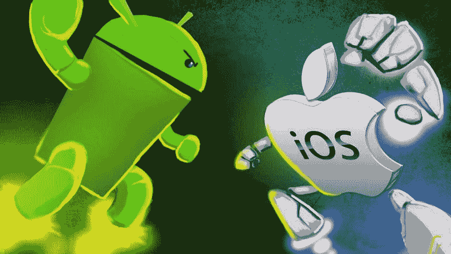
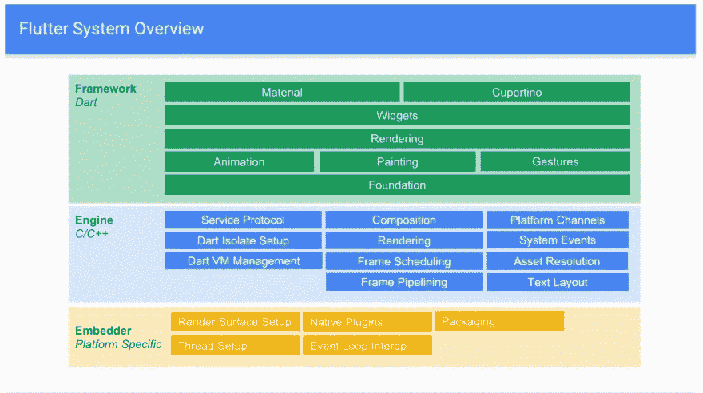

# React Native vs Flutter:哪个更好？

> 原文:[https://dev . to/x-team/react-native-vs-flutter-2kp 0](https://dev.to/x-team/react-native-vs-flutter-which-one-is-better-2kp0)

几年前，为 iOS 和 Android 构建原生移动应用程序需要为每个单独的操作系统(OS)编写代码。你需要既能为 Android 编写 Java 或 Kotlin，又能为 iOS 编写 Swift 或 Objective-C 的人。

公司通常有一个团队专门研究 iOS，另一个团队专门研究 Android。这往往会导致不同设备上本应相同的应用程序之间出现细微或有时不那么细微的差异。

[T2】](https://res.cloudinary.com/practicaldev/image/fetch/s--ldDtZKp5--/c_limit%2Cf_auto%2Cfl_progressive%2Cq_auto%2Cw_880/https://res.cloudinary.com/dukp6c7f7/image/upload/f_auto%2Cfl_lossy%2Cq_auto/s3-ghost/2019/02/platforms.jpg)

随着移动应用变得越来越重要，公司开始寻找改善这一过程的方法；让它更有效率。毕竟，如果我们只需要开发一次我们的应用程序，不是更好吗？如果我们可以有一种编程语言和一个团队，而不是两个团队同时用于 iOS 和 Android？

2015 年脸书 React Native 的发布和 2017 年谷歌的颤振让这一切成为可能。它们都是流行的跨平台框架，允许公司为 iOS 和 Android 提供一个移动应用代码库。但是这两种框架有什么不同呢？一个明显比另一个好，还是取决于上下文？请继续阅读，寻找答案...

## 不同的编程语言

React Native 使用 JavaScript 作为其编程语言。Flutter 使用一种叫做 Dart 的语言，它是 JavaScript 和 Java 的强类型混合。这应该会立即让 React Native 在 Flutter 上占据优势，因为几乎所有的 web 开发人员都知道 JavaScript。拥有一些移动经验的 web 开发人员的公司可以使用 React Native 编写一个移动应用程序。

这在某种程度上是对的，但也不是全部事实。JavaScript 是为网络而写的，不是为移动应用而写的。它碰巧在手机上运行得很好，但也不是完美无缺的。有一些令人尴尬的怪癖，您需要找到解决方法，尤其是在使用某些 JavaScript APIs 时。

Flutter 的语言 Dart 也不是为移动应用程序发明的，但至少它是由 Android 的开发者谷歌管理的。它也不是 100%完美的，但是与 React Native 相比，您需要的变通方法更少。此外，因为 Dart 是强类型的，所以它允许 Flutter 以不同于 React Native 的方式进行编译。但稍后会详细介绍。

## 现成的特性

React Native 自带了很多[内置组件](https://facebook.github.io/react-native/docs/components-and-apis.html)。等同于组件的东西在 Flutter 中被称为小部件，而且 Flutter 中的[小部件](https://flutter.io/docs/development/ui/widgets)比 React Native 中的组件多得多。任何在 React Native 中稍微高级一点的东西可能都必须由您来构建。

然而，尽管 Flutter 的窗口小部件越来越多，但它们并不是真正自适应的。他们拥抱材料设计。这意味着你的应用在两个操作系统上看起来完全一样。如果你想在 iOS 上开发一个不同于 Android 的应用程序，你必须手动进行这些更改。

React Native 的情况就不是这样了。虽然它允许您编写一次代码，但您还需要弄清楚您将在哪个操作系统上运行代码，并根据操作系统加载不同的组件。它不会自动调整组件的样式。

因此，在这里，你需要考虑你是否希望你的应用程序在两个操作系统上完全相同，或者你是否希望区分两者，并尽可能利用每个操作系统的独特功能。

## 生态系统

React Native 比 Flutter 存在的时间更长，因此拥有更丰富的生态系统。此外，由于使用了 JavaScript，您可以使用一些(但不是全部)JS 库。React Native 也被脸书(当然)、沃尔玛、优步、特斯拉和 Skype 等大公司使用。

<figure>

[T2】](https://res.cloudinary.com/practicaldev/image/fetch/s--8Qg7QORg--/c_limit%2Cf_auto%2Cfl_progressive%2Cq_auto%2Cw_880/https://res.cloudinary.com/dukp6c7f7/image/upload/f_auto%2Cfl_lossy%2Cq_auto/s3-ghost/2019/02/RN-Apps.JPG)

<figcaption>Some of the apps built with React Native</figcaption>

</figure>

但是也不要丢弃 Flutter。谷歌在这方面投资巨大，也在内部使用。新的包不断地被发布，这个框架有相当多的宣传推动它向前发展。

## 表现

让我们先说这两个框架都足够快，可以满足几乎所有公司的需求。也就是说，两种框架编译代码的方式有一个有趣的区别。

考虑到 JavaScript 不是强类型语言，它很难编译成 Java 或 Objective-C。相反，React 本机架构由本机代码和 JavaScript 虚拟机组成。

React Native 使用 Objective-C API 渲染到 iOS 组件，使用 Java APIs 渲染到 Android 组件。本地线程和 JavaScript 线程之间有一个桥梁。

([这篇文章](https://www.reactnative.guide/3-react-native-internals/3.1-react-native-internals.html)详细介绍了 React Native 的内部机制)

颤动使它不那么复杂。它将 Dart 编译成 C/C++库。这比具有 React Native is 的桥更快地被本机代码消耗。因此，颤振性能往往更好。

<figure>

[T2】](https://res.cloudinary.com/practicaldev/image/fetch/s--gKxQbObD--/c_limit%2Cf_auto%2Cfl_progressive%2Cq_auto%2Cw_880/https://res.cloudinary.com/dukp6c7f7/image/upload/f_auto%2Cfl_lossy%2Cq_auto/s3-ghost/2019/02/Flutter-Layer.JPG)

<figcaption>From the excellent Flutter documentation</figcaption>

</figure>

## 总之

React Native 是一个更成熟的框架，拥有更大的社区。它使用 JavaScript 的事实也意味着你可以处理 iOS、Android *和 web 应用*，这对小项目来说是完美的。

话虽如此，尽管 Flutter 还很年轻，但已经有很多来自开发者的积极反馈。谷歌似乎决心推进它的框架，结果它越来越受欢迎。

你更喜欢哪种框架？为什么呢？请在下面的评论中告诉我！