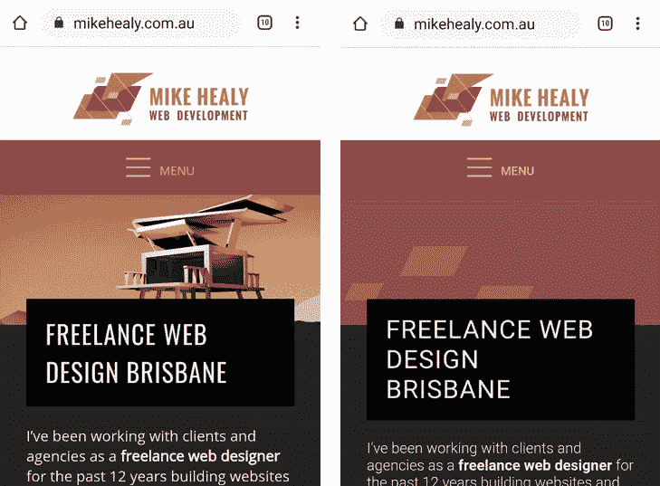

# 通过保存数据提高低带宽用户的性能

> 原文:[https://dev . to/Mike _ has arms/improving-performance-for-low-bandwidth-users-with-save-data-e1g](https://dev.to/mike_hasarms/improving-performance-for-low-bandwidth-users-with-save-data-e1g)

每个人都喜欢快速的网站，但一些用户的连接和数据计划使其变得尤为重要。在一些地方带宽很贵，任何你不需要服务的字节都可以为你的用户省钱。

我最近了解到客户可能发送的表示他们想要更低带宽体验的[‘save-data’HTTP 头](https://nooshu.github.io/blog/2019/09/01/speeding-up-the-web-with-save-data-header/)。单独的标题并不能做太多，但是它让你清楚的知道他们的偏好，这样你就可以做你自己的优化。

在移动 Chrome 上，这个设置被称为“精简模式”。桌面用户可以安装浏览器扩展来启用标题。其他浏览器可能有自己的方式来启用该设置。

一旦检测到此设置，您可能会选择不同的元素样式(例如放下大背景图像)，避免装饰性背景视频，或者跳过可能会延迟渲染并增加带宽成本的自定义字体。

通过在 JS 中查找 HTTP 头(save-data=on)或客户端为您的 CSS 选择器设置一个标志，可以在服务器端检测到该设置。

```
//PHP example
function saveData() {
   return (isset($_SERVER["HTTP_SAVE_DATA"]) && strtolower($_SERVER["HTTP_SAVE_DATA"]) === 'on');
}

//JS example (courtesy of Nooshu)
//add save-data class name to document element for CSS selectors
if ("connection" in navigator) {
    if (navigator.connection.saveData === true) {
        document.documentElement.classList.add('save-data');
    }
} 
```

<svg width="20px" height="20px" viewBox="0 0 24 24" class="highlight-action crayons-icon highlight-action--fullscreen-on"><title>Enter fullscreen mode</title></svg> <svg width="20px" height="20px" viewBox="0 0 24 24" class="highlight-action crayons-icon highlight-action--fullscreen-off"><title>Exit fullscreen mode</title></svg>

通过适当的检测，您可以忽略对低带宽用户来说不重要的元素。例如，在我的 WordPress 网站上，我跳过了谷歌定制字体的排队，去掉了我的刊头背景图片。

```
// functions.php
if( !saveData() ) {
  wp_enqueue_style( 'fonts', 'https://fonts.googleapis.com/css?family=Open+Sans|Oswald:300,400,600');
}

/*
N.B. in WP it's good practice to prefix functions to avoid naming clashes.
I've skipped that for this example */ 
```

<svg width="20px" height="20px" viewBox="0 0 24 24" class="highlight-action crayons-icon highlight-action--fullscreen-on"><title>Enter fullscreen mode</title></svg> <svg width="20px" height="20px" viewBox="0 0 24 24" class="highlight-action crayons-icon highlight-action--fullscreen-off"><title>Exit fullscreen mode</title></svg>

这是我在有和没有精简模式的移动 Chrome 上的站点(又名 sava-data)。

[T2】](https://res.cloudinary.com/practicaldev/image/fetch/s--GBAuxmra--/c_limit%2Cf_auto%2Cfl_progressive%2Cq_auto%2Cw_880/https://thepracticaldev.s3.amazonaws.com/i/81yho034jqmdzk2zmqu7.png)

对于低带宽用户来说，这是一个非常容易的改变，可以快速提高性能。对于较重的站点，或者如果在站点开发过程中也考虑了标题，改进可能会更大。

(本帖最初发表于[mikehealy.com.au](https://www.mikehealy.com.au/))