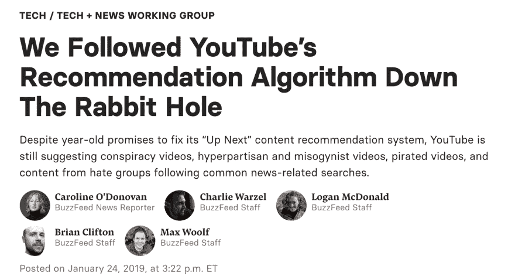

# BuzzFeed 的技术团队如何帮助记者权威报道技术

> 原文:[https://dev . to/BuzzFeed tech/how-BuzzFeed-s-tech-team-helps-journalists-report-on-technology-with-authority-3a cl](https://dev.to/buzzfeedtech/how-buzzfeed-s-tech-team-helps-journalists-report-on-technology-with-authority-3acl)

记者:有人能快速浏览一下 codepen 上的一些代码并帮助我理解它的功能吗？

这个问题——以及许多许多其他类似的问题——源自一个名为“技术+新闻工作组”的倡议，这是记者和技术部门几乎每个角色之间的 BuzzFeed 新闻合作，包括 sre、SWE、数据科学家和产品经理。BuzzFeed 技术团队有“7%的时间”，即每周半天，来学习新东西。对于我们这些工作小组中的技术人员来说，这 7%的时间是用来把我们的技术专长带到新闻编辑室的。

BuzzFeed Tech 的主要价值是培养一个实验性和协作性的工作场所；一种实现的方式是通过技术+新闻工作组。这个团队的基础是由前 BuzzFeed Tech SRE [斯里雷](https://medium.com/@sricola)奠定的，他在这里的时间里为新闻编辑室提供了无数[的支持](https://www.buzzfeednews.com/article/azeenghorayshi/grindr-hiv-status-privacy)。记者开始接触技术和 IT 团队的人员，帮助他们理解术语、挖掘技巧，或者验证他们从情报人员那里收到的文件的安全性。这种伙伴关系让技术团队能够从记者那里学习，并考虑我们工作的更广泛的影响。反过来，作为技术行业的业内人士，新闻编辑室在报道技术、安全和商业故事时受益于我们的工具和视角。

像其他获奖的新闻编辑室一样，BuzzFeed News 有一个专门的[数据新闻团队](https://github.com/BuzzFeedNews/everything)，使用数据和编程来帮助他们的报道。但是一年前，我们意识到技术团队也可以帮助报道。

我们决定扩大并正式确定我们的合作，建立一个开放的 Slack 渠道，包括来自我们技术和新闻机构的成员，以支持关于故事的日常咨询和更大的正在进行的项目，以及新的使命声明:

> 我们(科技新闻工作组)的使命是，利用我们的技术技能，通过指导和协助，成为新闻编辑室工作的提升力量。我们在 BuzzFeed 的新闻团队努力揭示我们今天面临的最重要的问题。目前，这意味着人们越来越关注互联网和技术对新闻报道的一系列主题的影响。作为一个技术专家团队，我们在这一领域拥有独一无二的优势。

[T2】](https://res.cloudinary.com/practicaldev/image/fetch/s--MAdH1HP3--/c_limit%2Cf_auto%2Cfl_progressive%2Cq_auto%2Cw_880/https://miro.medium.com/max/3390/1%2A9n31gtXJT7nb9JtxbZs0nw.png)

从那时起，我们与新闻编辑室合作开发报道工具，包括一个名为 Tubeviewer 的项目，它带我们进入了 YouTube 的兔子洞。通过 Tubeviewer，我们发现 Up Next 算法偶尔会将用户推向包含分裂、阴谋、有时甚至是仇恨内容的超级艺术家视频。Tubeviewer 模拟了给定一组特定搜索词的真实人类观看 YouTube 视频的观看体验。打开它，走开，然后回来全面了解您的观看体验。我们已经使用这样的工具来审计跨技术平台的算法。我们还开发了将专利信息摘要发送到 Slack 或从 NYSCEF 等归档系统收集数据的机器人。我们开发了通过 Wireshark 进行网络分析的模式，并用数据对文章进行了可视化。

我们收到了数百个请求，从帮助从网站查找数据到解释如何使用身份认证令牌，不一而足:

> 记者:我正在撰写一篇关于使用 google/fb 登录的视频游戏中基于令牌的身份验证漏洞的文章，希望有人对使用基于令牌的身份验证的限制/风险做出评论

有时，如果没有快速简单的技术解决方案，我们会收到一些需要大量手工劳动的帮助请求:

> 记者:这是一个奇怪的请求
> 我为
> 道歉，但是有人能数一下这个标签下的故事数量吗
> 如果有一个简单的方法可以做到这一点…
> 
> 工程师:可以做 JS，计算项目列表类的数量

当我们创建这个小组时，我们不知道这个频道会有多受欢迎，但是这些请求是我们日常“真实”工作中的一个有趣的突破。有时候，技术团队在回答记者提出的问题时投入的精力比记者预想的要多。有一次，我们花了令人尴尬的大量时间，试图确定杰西卡·辛普森用什么软件为这条推文制作图形(后来 EXIF 做了大量调查，我们仍然没有弄清楚，记者已经完全离开了)。最终，我们促成了一系列故事和独家新闻，并在整个组织的记者和技术人员之间建立了信任纽带。

> 记者:我把这个独家新闻归功于这里的提问小组，所以谢谢你

好工程师的心态和记者差不多；两者都需要提出好的问题，并坚持不懈地寻找准确的答案，即使系统中可能存在错误。在过去的一年里，在 BuzzFeed 的新闻和技术团队之间建立一座更强大的桥梁是有趣和有益的，我们只希望这项工作能够继续下去。通过合作，两个团队都得到了发展:技术团队的成员有与记者携手工作的特权，而新闻编辑室能够更权威地报道技术。

* * *

*原帖发表于[Tech @ BuzzFeed publication on Medium，2019 年 9 月 4 日](https://tech.buzzfeed.com/tech-and-news-working-group-7dabaaa38e45)。*