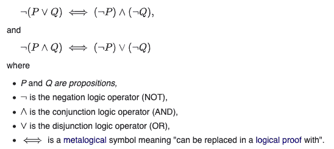

# CS 基础:如何重构布尔表达式

> 原文：<https://dev.to/jose/cs-basics-how-to-refactor-a-boolean-expression-4pja>

# 系列介绍

计算机科学听起来如此枯燥，如此学术，以至于有时很难知道是否有任何对我们构建实际软件的工作有用的知识。

当然，我是半开玩笑。计算机科学对于理解计算机中发生的事情非常重要，但我知道这听起来不如学习行业中需要的特定技术有吸引力。

通过这一系列的文章，我将试着从那些冗长乏味的书中提取一些我们可以马上开始应用的东西，我希望你会觉得有用。

我总是从最直接的实际部分开始，然后我会解释更多的潜在原因和术语。

今天让我们从一些布尔表达式开始。

# 重构一个布尔表达式为什么有用？

在我身上发生过很多次，当重构一个条件时，我必须改变它来创建一个在类中有意义的方法。让我们举一个简单的例子。

假设我们有下面的类(在 Javascript 中，但几乎可以应用于任何语言):

```
class Person {
  constructor(name, active, email = null) {
    this.name = name;
    this.active = active;
    this.email = email;
  }

  hasEmail() {
    return this.email !== null;
  }

  isActive() {
    return this.active;
  }

  sendEmail() {
    if (!this.isActive() || !this.hasEmail()) {
      return false;
    }
    // ... send email ...
  }
} 
```

<svg width="20px" height="20px" viewBox="0 0 24 24" class="highlight-action crayons-icon highlight-action--fullscreen-on"><title>Enter fullscreen mode</title></svg> <svg width="20px" height="20px" viewBox="0 0 24 24" class="highlight-action crayons-icon highlight-action--fullscreen-off"><title>Exit fullscreen mode</title></svg>

在某种程度上，我们意识到拥有一个内部方法来告诉我们用户是否可以接收电子邮件可能更容易。根据代码，这意味着它是一个活跃的用户，并有一个电子邮件设置。

我们可以这样做:

```
 canReceiveEmail() {
    return ; // What do we return here? 🤔
  }

  sendEmail() {
    if (!this.canReceiveEmail()) {
      return false;
    }
    // ...
  } 
```

<svg width="20px" height="20px" viewBox="0 0 24 24" class="highlight-action crayons-icon highlight-action--fullscreen-on"><title>Enter fullscreen mode</title></svg> <svg width="20px" height="20px" viewBox="0 0 24 24" class="highlight-action crayons-icon highlight-action--fullscreen-off"><title>Exit fullscreen mode</title></svg>

如你所见，*sendmeil*方法现在可读性更好了，**但是我们应该在 *canReceiveEmail()* 方法**中放什么呢？

我让你想一会儿...🙂

🤔🤔🤔🤔🤔🤔🤔🤔🤔🤔🤔🤔🤔🤔🤔🤔🤔🤔

🤔🤔🤔🤔🤔🤔🤔🤨🐶🤨🤔🤔🤔🤔🤔🤔🤔🤔

🤔🤔🤔🤔🤔🤔🤔🤔🤔🤔🤔🤔🤔🤔🤔🤔🤔🤔

你想通了吗？

我们需要的是条件的相反值:

```
!this.isActive() || !this.hasEmail(); 
```

<svg width="20px" height="20px" viewBox="0 0 24 24" class="highlight-action crayons-icon highlight-action--fullscreen-on"><title>Enter fullscreen mode</title></svg> <svg width="20px" height="20px" viewBox="0 0 24 24" class="highlight-action crayons-icon highlight-action--fullscreen-off"><title>Exit fullscreen mode</title></svg>

该表达式的否定形式是:

```
this.isActive() && this.hasEmail(); 
```

<svg width="20px" height="20px" viewBox="0 0 24 24" class="highlight-action crayons-icon highlight-action--fullscreen-on"><title>Enter fullscreen mode</title></svg> <svg width="20px" height="20px" viewBox="0 0 24 24" class="highlight-action crayons-icon highlight-action--fullscreen-off"><title>Exit fullscreen mode</title></svg>

我想凭直觉我们可以理解，如果我们要找的是:

*   用户未激活*或*没有电子邮件；

相反的情况是:

*   用户是活跃的*并且*有电子邮件。

所以最后一个类应该是这样的:

```
class Person {
  constructor(name, active, email = null) {
    this.name = name;
    this.active = active;
    this.email = email;
  }

  hasEmail() {
    return this.email !== null;
  }

  isActive() {
    return this.active;
  }

  canReceiveEmail() {
    return this.isActive() && this.hasEmail();
  }

  sendEmail() {
    if (!this.canReceiveEmail()) { // Notice negation of the method with !
      return false;
    }
    // ... send email ...
  }
} 
```

<svg width="20px" height="20px" viewBox="0 0 24 24" class="highlight-action crayons-icon highlight-action--fullscreen-on"><title>Enter fullscreen mode</title></svg> <svg width="20px" height="20px" viewBox="0 0 24 24" class="highlight-action crayons-icon highlight-action--fullscreen-off"><title>Exit fullscreen mode</title></svg>

[(参见 JSbin)](https://jsbin.com/lusafuv/edit?js,console)

我们也可以创建负版本 *cannotReceiveEmail* ，但是我更喜欢使用“正”方法名，因为它们在代码的其他地方更有用。然而，如果我们这样做了，结果将是:

```
cannotReceiveEmail() {
  return !(this.isActive() && this.hasEmail());
}

sendEmail() {
  if (this.cannotReceiveEmail()) {
    return false;
  }
  // ... send email ...
} 
```

<svg width="20px" height="20px" viewBox="0 0 24 24" class="highlight-action crayons-icon highlight-action--fullscreen-on"><title>Enter fullscreen mode</title></svg> <svg width="20px" height="20px" viewBox="0 0 24 24" class="highlight-action crayons-icon highlight-action--fullscreen-off"><title>Exit fullscreen mode</title></svg>

# 计算机科学背后的解决方案

你刚才看到的并不是最近才发现的，提出这个解决方案的数学家奥古斯都·德·摩根于 1871 年去世。

这条规则，连同我们稍后会看到的另一条，被称为“德摩根定律”。它们是一个更大的数学领域的一部分，在任何计算机科学课程中都有学习，叫做布尔代数。

另一条规则如下。如果我们有这个表达式:

```
const willDieSoon = !this.isYoung && !this.worksOut 
```

<svg width="20px" height="20px" viewBox="0 0 24 24" class="highlight-action crayons-icon highlight-action--fullscreen-on"><title>Enter fullscreen mode</title></svg> <svg width="20px" height="20px" viewBox="0 0 24 24" class="highlight-action crayons-icon highlight-action--fullscreen-off"><title>Exit fullscreen mode</title></svg>

相当于:

```
const willDieSoon = !(this.isYoung || this.worksOut) 
```

<svg width="20px" height="20px" viewBox="0 0 24 24" class="highlight-action crayons-icon highlight-action--fullscreen-on"><title>Enter fullscreen mode</title></svg> <svg width="20px" height="20px" viewBox="0 0 24 24" class="highlight-action crayons-icon highlight-action--fullscreen-off"><title>Exit fullscreen mode</title></svg>

如果你没有得到这个，想想在所有可能的情况下会发生什么:

考虑*是年轻的*是真/假和*工作出*是真/假。表达式的结果会是什么？这和第一种情况不一样吗？

为了真正理解这一点，创建一个可能性的小表格通常是有用的。最后一列代表: *willDieSoon* 。

| 年轻的 | 工作区 | *年轻或不工作* | *！(年轻或工作时间)* |
| --- | --- | --- | --- |
| 错误的 | 错误的 | 错误的 | 真实的 |
| 真实的 | 错误的 | 真实的 | 错误的 |
| 错误的 | 真实的 | 真实的 | 错误的 |
| 真实的 | 真实的 | 真实的 | 错误的 |

同样的表可以应用于第一个表达式:

| 年轻的 | 工作区 | *！isYoung 和！工作时间* |
| --- | --- | --- |
| 错误的 | 错误的 | 真实的 |
| 真实的 | 错误的 | 错误的 |
| 错误的 | 真实的 | 错误的 |
| 真实的 | 真实的 | 错误的 |

## 摩根定律

因此，以正式方式编写的两条规则是:

[](https://res.cloudinary.com/practicaldev/image/fetch/s--OYnPDA3V--/c_limit%2Cf_auto%2Cfl_progressive%2Cq_auto%2Cw_880/https://josemdev.cimg/morgan_laws.png)

这张图片来自维基百科，因为我不知道如何在 dev.to 中添加数学符号😞。

所以在 Javascript 中，我们可以这样说:

```
!(P || Q) == !P && !Q

!(P && Q) == !P || !Q 
```

<svg width="20px" height="20px" viewBox="0 0 24 24" class="highlight-action crayons-icon highlight-action--fullscreen-on"><title>Enter fullscreen mode</title></svg> <svg width="20px" height="20px" viewBox="0 0 24 24" class="highlight-action crayons-icon highlight-action--fullscreen-off"><title>Exit fullscreen mode</title></svg>

我们使用了第二种方法来重构我们的代码。

我们从*开始！P ||！问*并以*结束！(P & & Q)* 。现在就来回顾一下:

```
// we started with this condition to check before sending the email:
!this.isActive() || !this.hasEmail()

// Then, we moved the logic to canReceiveEmail()
this.isActive() && this.hasEmail()

// And used the negation of that:
!this.isActive() || !this.hasEmail() == !(this.canReceiveEmail())

// Which is:
!this.isActive() || !this.hasEmail() == !(this.isActive() && this.hasEmail());

// So:
!P || !Q == !(P && B) 
```

<svg width="20px" height="20px" viewBox="0 0 24 24" class="highlight-action crayons-icon highlight-action--fullscreen-on"><title>Enter fullscreen mode</title></svg> <svg width="20px" height="20px" viewBox="0 0 24 24" class="highlight-action crayons-icon highlight-action--fullscreen-off"><title>Exit fullscreen mode</title></svg>

## 其他布尔代数法则

如果你不知道布尔代数定律，不要担心！你可能在应用其他的，比如:

[](https://res.cloudinary.com/practicaldev/image/fetch/s--MaW3QMt0--/c_limit%2Cf_auto%2Cfl_progressive%2Cq_auto%2Cw_880/https://josemdev.cimg/commutativity.png)

那些意味着:

```
(weAreInChrome() || weAreInFirefox()) === (weAreInFirefox() || weAreInChrome())

(isRaining() && isCloudy()) === (isCloudy() && isRaining()) 
```

<svg width="20px" height="20px" viewBox="0 0 24 24" class="highlight-action crayons-icon highlight-action--fullscreen-on"><title>Enter fullscreen mode</title></svg> <svg width="20px" height="20px" viewBox="0 0 24 24" class="highlight-action crayons-icon highlight-action--fullscreen-off"><title>Exit fullscreen mode</title></svg>

所以，也许凭直觉，你知道有两个值的布尔条件可以按顺序交换，结果是一样的(🤓🗯️ *这就是交换性！*)。

还有许多其他有用的布尔定律，所以我可能会在后面的系列文章中用不那么直观的布尔逻辑做第二部分。

你觉得这个有用吗？请在 Twitter 上告诉我[！👋 🙂](https://twitter.com/jmgilgado)

## 参考文献

*   [布尔代数](https://en.wikipedia.org/wiki/Boolean_algebra)
*   [德摩根定律](https://en.wikipedia.org/wiki/De_Morgan%27s_laws)