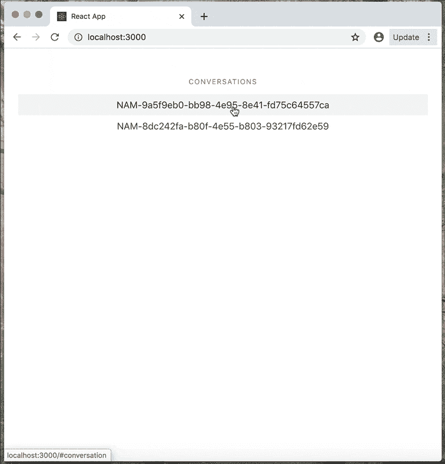
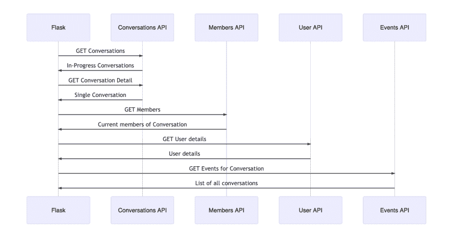

# 如何使用 Flask、React 和 Nexmo 构建实时对话的仪表板

> 原文：<https://dev.to/vonagedev/how-to-build-a-dashboard-of-live-conversations-with-flask-react-and-nexmo-1kdh>

Nexmo 最近推出了[对话 API](https://developer.nexmo.com/conversation/overview) 。这个 API 使您能够拥有不同风格的通信(语音、消息和视频)并将它们相互连接起来。

现在，一个应用程序中的多个对话可以同时进行，并保留所有这些渠道的上下文！能够记录和处理对话的历史对企业和客户都非常有价值，所以，正如你所想象的，我们对此非常兴奋。

> 在 Vonage Campus 了解更多关于可编程对话的内容，我们的首次客户和开发者大会将于 10 月 29 日至 30 日在旧金山举行。参加是免费的，所以[现在就请求您的邀请](https://web.cvent.com/event/9bba9ffb-c9b5-4022-a9b8-3a8184c70aa8/register)！

## 仪表盘的作用

本教程介绍了如何用 Flask 和 React 构建一个仪表板，来监控一个应用程序中的所有当前对话。目标是实时展示当前正在进行的实时对话的相关数据。

当从当前对话列表中选择单个[对话](https://developer.nexmo.com/conversation/concepts/conversation)时，将显示已连接的[成员](https://developer.nexmo.com/conversation/concepts/member)和[事件](https://developer.nexmo.com/conversation/concepts/event)。然后可以选择一个单独的成员来显示与该特定的[用户](https://developer.nexmo.com/conversation/concepts/user)相关的更多信息。

[](https://www.nexmo.com/wp-content/uploads/2019/09/5d894f3a32766539224729.gif)

## 对话 API 是做什么的？

Nexmo [Conversation API](https://developer.nexmo.com/conversation/overview) 使您能够构建能够跨多种媒体进行通信的对话功能，包括 IP 消息、PSTN 语音、SMS 以及 WebRTC 音频和视频。对话的上下文是通过对话中发生的每个通信事件来维护的，无论使用何种媒介。

将对话想象成两个或更多用户之间交流的容器。可以是单个交互，也可以是它们之间所有交互的全部历史。

该 API 还允许您创建事件和分支，以支持两个用户之间的文本、语音和视频通信，并将它们存储在对话中。

## 申请的工作流程

[](https://www.nexmo.com/wp-content/uploads/2019/09/flowofapp.png)

### 创建一个 Nexmo 应用

要完成本教程，您需要一个 [Nexmo 帐户](https://dashboard.nexmo.com/sign-up?utm_source=DEV_REL&utm_medium=github&utm_campaign=https://github.com/nexmo-community/nexmo-python-capi)。如果您还没有帐户，现在就可以免费注册。

本教程还假设您将运行 [Ngrok](https://ngrok.com/) 来本地运行您的 [webhook](https://developer.nexmo.com/concepts/guides/webhooks) 服务器。

如果您不熟悉 Ngrok，请在继续之前参考我们的 [Ngrok 教程](https://www.nexmo.com/blog/2017/07/04/local-development-nexmo-ngrok-tunnel-dr/)。

首先，您需要创建一个 Nexmo 应用程序:

```
nexmo app:create "Conversation App" http://demo.ngrok.io:3000/webhooks/answer http://demo.ngrok.io:3000/webhooks/event --keyfile private.key 
```

<svg width="20px" height="20px" viewBox="0 0 24 24" class="highlight-action crayons-icon highlight-action--fullscreen-on"><title>Enter fullscreen mode</title></svg> <svg width="20px" height="20px" viewBox="0 0 24 24" class="highlight-action crayons-icon highlight-action--fullscreen-off"><title>Exit fullscreen mode</title></svg>

接下来，假设您已经租用了一个 Nexmo 号(`NEXMO_NUMBER`)，您可以通过命令行将您的 Nexmo 号与您的应用程序链接起来:

```
nexmo link:app NEXMO_NUMBER APP_ID 
```

<svg width="20px" height="20px" viewBox="0 0 24 24" class="highlight-action crayons-icon highlight-action--fullscreen-on"><title>Enter fullscreen mode</title></svg> <svg width="20px" height="20px" viewBox="0 0 24 24" class="highlight-action crayons-icon highlight-action--fullscreen-off"><title>Exit fullscreen mode</title></svg>

### 克隆 [Git 回购](https://github.com/nexmo-community/nexmo-python-capi)

要让这个应用程序在你的本地机器上运行，首先要克隆[这个库](https://github.com/nexmo-community/nexmo-python-capi) :

```
git clone https://github.com/nexmo-community/nexmo-python-capi 
```

<svg width="20px" height="20px" viewBox="0 0 24 24" class="highlight-action crayons-icon highlight-action--fullscreen-on"><title>Enter fullscreen mode</title></svg> <svg width="20px" height="20px" viewBox="0 0 24 24" class="highlight-action crayons-icon highlight-action--fullscreen-off"><title>Exit fullscreen mode</title></svg>

然后安装依赖项:

```
npm install 
```

<svg width="20px" height="20px" viewBox="0 0 24 24" class="highlight-action crayons-icon highlight-action--fullscreen-on"><title>Enter fullscreen mode</title></svg> <svg width="20px" height="20px" viewBox="0 0 24 24" class="highlight-action crayons-icon highlight-action--fullscreen-off"><title>Exit fullscreen mode</title></svg>

使用以下命令复制示例`.env.example`文件:

```
cp .env.example > .env 
```

<svg width="20px" height="20px" viewBox="0 0 24 24" class="highlight-action crayons-icon highlight-action--fullscreen-on"><title>Enter fullscreen mode</title></svg> <svg width="20px" height="20px" viewBox="0 0 24 24" class="highlight-action crayons-icon highlight-action--fullscreen-off"><title>Exit fullscreen mode</title></svg>

打开这个新的`.env`文件，并填写我们刚刚在创建 Nexmo 应用程序时生成的应用程序 ID 和您的`private.key`的路径。

### 烧瓶后端

在我们的 Flask 文件中需要检查的重要文件是`server.py`文件，因为它建立了所有不同的端点`Conversation API`。

函数`make_capi_request()`连接到 Nexmo 并验证应用:

```
def make_capi_request(api_uri):
   nexmo_client = nexmo.Client(
       application_id=os.getenv("APPLICATION_ID"), private_key=os.getenv("PRIVATE_KEY")
   )
   try:
       response = nexmo_client._jwt_signed_get(request_uri=api_uri)
   except nexmo.errors.ClientError:
       response = {}

   return jsonify(response) 
```

<svg width="20px" height="20px" viewBox="0 0 24 24" class="highlight-action crayons-icon highlight-action--fullscreen-on"><title>Enter fullscreen mode</title></svg> <svg width="20px" height="20px" viewBox="0 0 24 24" class="highlight-action crayons-icon highlight-action--fullscreen-off"><title>Exit fullscreen mode</title></svg>

在那下面，我们创建必要的路线:

```
@app.route("/")
def index():  # Index page structure
   return render_template("index.html")

@app.route("/conversations")
def conversations():  # List of conversations
   return make_capi_request(api_uri="/beta/conversations")

@app.route("/conversation")
def conversation():# Conversation detail
   cid = request.args.get("cid")
   return make_capi_request(api_uri=f"/beta/conversations/{cid}")

@app.route("/user")
def user():  # User detail
   uid = request.args.get("uid")
   return make_capi_request(api_uri=f"/beta/users/{uid}")

@app.route("/events")
def events(): # Event detail
   cid = request.args.get("cid")
   return make_capi_request(api_uri=f"/beta/conversations/{cid}/events") 
```

<svg width="20px" height="20px" viewBox="0 0 24 24" class="highlight-action crayons-icon highlight-action--fullscreen-on"><title>Enter fullscreen mode</title></svg> <svg width="20px" height="20px" viewBox="0 0 24 24" class="highlight-action crayons-icon highlight-action--fullscreen-off"><title>Exit fullscreen mode</title></svg>

一旦通过身份验证，这些路由中的每一个都会基于应用程序 ID 并最终基于会话或用户 ID 来访问会话 API。

### 反应前端

我们将利用 React 的能力将我们的代码分解成模块化和可重用的组件。我们需要的组件有:

[](https://www.nexmo.com/wp-content/uploads/2019/09/components.png)

在`App.js`级别，注意在构造函数中调用了`"/conversations"`端点。这意味着如果应用程序中有任何当前对话，它们会立即显示在页面上。

```
fetch("/conversations").then(response =>
  response.json().then(
    data => {
      this.setState({ conversations: data._embedded.conversations });
    },
    err => console.log(err)
  )
); 
```

<svg width="20px" height="20px" viewBox="0 0 24 24" class="highlight-action crayons-icon highlight-action--fullscreen-on"><title>Enter fullscreen mode</title></svg> <svg width="20px" height="20px" viewBox="0 0 24 24" class="highlight-action crayons-icon highlight-action--fullscreen-off"><title>Exit fullscreen mode</title></svg>

然后，用户可以从列表中选择一个对话，并显示该对话的元细节，如名称和时间戳。

```
<div>
  <article className="message is-info">
    <div className="message-header">
      <p>{this.props.conversation.uuid}</p>
    </div>
    <div className="message-body">
      <ul>
        <li>Name: {this.props.conversation.name}</li>
        <li>ttl: {this.props.conversation.properties.ttl}</li>
        <li>Timestamp: {this.props.conversation.timestamp.created}</li>
      </ul>
    </div>
  </article>
  <Tabs
    members={this.props.conversation.members}
    events={this.props.events}
    conversation={this.props.conversation}
  /> </div> 
```

<svg width="20px" height="20px" viewBox="0 0 24 24" class="highlight-action crayons-icon highlight-action--fullscreen-on"><title>Enter fullscreen mode</title></svg> <svg width="20px" height="20px" viewBox="0 0 24 24" class="highlight-action crayons-icon highlight-action--fullscreen-off"><title>Exit fullscreen mode</title></svg>

请注意，一旦选择了某个特定的`conversation`，就会出现两个选项卡:`Events`和`Members`。

`Members`设置为默认状态，即首先显示。在这一点上，`"/conversation"`和`"/events"`端点被调用。使用在状态中传递的`cid`，现在可以获得当前成员和事件的详细信息。

```
refreshMembers = () => {
  fetch("/conversation?cid=" + this.props.conversation.uuid)
    .then(results => results.json())
    .then(data => {
      this.setState({ members: data.members });
    });
};

refreshEvents = () => {
  fetch("/events?cid=" + this.props.conversation.uuid)
    .then(results => results.json())
    .then(data => {
      this.setState({ events: data });
    });
}; 
```

<svg width="20px" height="20px" viewBox="0 0 24 24" class="highlight-action crayons-icon highlight-action--fullscreen-on"><title>Enter fullscreen mode</title></svg> <svg width="20px" height="20px" viewBox="0 0 24 24" class="highlight-action crayons-icon highlight-action--fullscreen-off"><title>Exit fullscreen mode</title></svg>

`MembersList.js`组件将调用`/user`端点来检索关于该特定用户的更多数据，然后显示在`MemberDetail.js`组件中。

```
showMemberDetails = user_id => {
  fetch("/user?uid=" + user_id)
    .then(results => results.json())
    .then(data => {
      this.setState({ member: data });
    });
}; 
```

<svg width="20px" height="20px" viewBox="0 0 24 24" class="highlight-action crayons-icon highlight-action--fullscreen-on"><title>Enter fullscreen mode</title></svg> <svg width="20px" height="20px" viewBox="0 0 24 24" class="highlight-action crayons-icon highlight-action--fullscreen-off"><title>Exit fullscreen mode</title></svg>

### 把这一切连接在一起

要启动后端，运行 Flask 命令:

```
export FLASK_APP=server.py && flask run 
```

<svg width="20px" height="20px" viewBox="0 0 24 24" class="highlight-action crayons-icon highlight-action--fullscreen-on"><title>Enter fullscreen mode</title></svg> <svg width="20px" height="20px" viewBox="0 0 24 24" class="highlight-action crayons-icon highlight-action--fullscreen-off"><title>Exit fullscreen mode</title></svg>

在终端的另一个选项卡中，运行 React 命令:

```
cd frontend-react && npm start 
```

<svg width="20px" height="20px" viewBox="0 0 24 24" class="highlight-action crayons-icon highlight-action--fullscreen-on"><title>Enter fullscreen mode</title></svg> <svg width="20px" height="20px" viewBox="0 0 24 24" class="highlight-action crayons-icon highlight-action--fullscreen-off"><title>Exit fullscreen mode</title></svg>

在浏览器中打开`http://localhost:3000`，你的应用就会启动并运行！

该连接的应用程序中当前正在运行的任何对话现在都可以在该控制面板中看到。

恭喜你。现在，您已经用 Flask、React 和 Nexmo 的[对话 API](https://developer.nexmo.com/conversation) 创建了一个应用程序。现在，您可以监控与您的应用程序对话相关的各种事情。我们鼓励您继续使用和探索这个 API 的功能。

### 贡献和下一步

在 Nexmo，[对话 API](https://developer.nexmo.com/conversation) 目前处于测试阶段，并根据您的输入和反馈不断发展。一如既往，我们很乐意在我们的[社区 slack](https://developer.nexmo.com/community/slack) 或[support@nexmo.com](mailto:support@nexmo.com)中帮助解决任何问题。

帖子[如何用 Flask 和 React](https://www.nexmo.com/blog/2019/09/24/how-to-build-a-dashboard-of-live-conversations-with-flask-and-react-dr) 构建一个实时对话的仪表板最先出现在 [Nexmo 开发者博客](https://www.nexmo.com/blog)上。