# 在 vue . js 中开发计算器-在云中托管项目

> [https://dev . to/azure/development-in-view-js 计算器-主持-na-cloud-2695](https://dev.to/azure/desenvolvendo-calculadora-em-vue-js-hospedando-o-projeto-na-nuvem-2695)项目

在 **[【最后一个岗位】](https://dev.to/azure/desenvolvendo-calculadora-em-vue-js-refatorando-o-projeto-53l6-temp-slug-3537923)** 我们完成了我们的项目，现在正是我们想要和想把它托管在云中的时候，大家都能看到你实际开发的东西。

在本文中，我们将使用 Azure Web App Service 使用 Azure 来部署我们的应用程序！

我们开始吧？！

## [](#o-que-%C3%A9-azure-app-service)O que é Azure App 服务？

**[【azure app service】](https://azure.microsoft.com/services/app-service/?WT.mc_id=devto-blog-gllemos)**是一项允许您以不同语言快速部署和托管 Web 应用程序的服务:. NET、. NET Core、Node.js、Java、PHP、Ruby 或 Python。

无论您使用的是 Windows 还是 Linux 操作系统。您还可以使用 GitHub、azure devops 或任何其他 Git 存储库自动执行代码。

如果您想了解如何在 azure app service(位于:Node.js 和静态 HTML 站点)中部署/托管 Web 应用程序，请使用以下链接进行阅读:

*   **[在 Azure App Service](https://docs.microsoft.com/azure/app-service/app-service-web-get-started-nodejs?WT.mc_id=devto-blog-gllemos)** 中创建 Node.js 应用程序

*   **[在 Azure App Service](https://docs.microsoft.com/azure/app-service/app-service-web-get-started-html?WT.mc_id=devto-blog-gllemos)** 中创建静态 html 应用程序

此外，您还可以使用 Visual Studio 代码实现 Azure App 服务。要了解更多信息，请使用以下链接:

*   **[使用 App 服务](https://code.visualstudio.com/tutorials/app-service-extension/getting-started?WT.mc_id=devto-blog-gllemos)** 部署到 Azure

*   **[部署静态网站到 Azure](https://code.visualstudio.com/tutorials/static-website/getting-started?WT.mc_id=devto-blog-gllemos)**

但是，请放心，我们将逐步指导您如何实施/托管我们的应用程序！😉

## [](#criando-conta-no-azure)创建蓝色账户

为了实施我们的云应用程序，我们需要创建一个 Azure 帐户。帐户类型有两种:

*   **[【蓝色账户】](https://azure.microsoft.com/?WT.mc_id=devto-blog-gllemos)** :这是非学生的常用账户。

*   **[学生用蓝色](https://azure.microsoft.com/free/students/?WT.mc_id=devto-blog-gllemos)** :这是大学生专用的蓝色账户，允许免费使用价值 100.00 美元，无需信用卡。

由于 post 这一部分的重点是实施我们的云应用程序，因此有一个完全免费的课程可以教您如何轻松方便地创建蓝色帐户:

*   **[创建蓝色账户](https://docs.microsoft.com/learn/modules/create-an-azure-account/?WT.mc_id=devto-blog-gllemos)**

完成本课程后，您将自动创建一个蓝色帐户。完成后，我们可以继续我们的帖子！

## [](#hospedando-a-aplica%C3%A7%C3%A3o-no-azure-app-service)托管在 Azure App 服务中的应用

### [](#executando-o-comando-build)执行‘build’命令

在实施和托管我们的应用程序之前，我们需要做的第一件事是在我们的应用程序中运行命令`build`。

在运行命令`package.json`之前，需要对文件`package.json`进行一些重大更改。

打开文件`package.json`并更改以下程序包版本:

```
"optimize-css-assets-webpack-plugin":  "^3.2.0", 
```

<svg width="20px" height="20px" viewBox="0 0 24 24" class="highlight-action crayons-icon highlight-action--fullscreen-on"><title>Enter fullscreen mode</title></svg> <svg width="20px" height="20px" viewBox="0 0 24 24" class="highlight-action crayons-icon highlight-action--fullscreen-off"><title>Exit fullscreen mode</title></svg>

然后在命令提示下运行命令:

```
rm -rf node_modules 
```

<svg width="20px" height="20px" viewBox="0 0 24 24" class="highlight-action crayons-icon highlight-action--fullscreen-on"><title>Enter fullscreen mode</title></svg> <svg width="20px" height="20px" viewBox="0 0 24 24" class="highlight-action crayons-icon highlight-action--fullscreen-off"><title>Exit fullscreen mode</title></svg>

此命令将卸载我们的文件夹“`node_modules`”。之后，现在执行命令:

```
npm install 
```

<svg width="20px" height="20px" viewBox="0 0 24 24" class="highlight-action crayons-icon highlight-action--fullscreen-on"><title>Enter fullscreen mode</title></svg> <svg width="20px" height="20px" viewBox="0 0 24 24" class="highlight-action crayons-icon highlight-action--fullscreen-off"><title>Exit fullscreen mode</title></svg>

执行上述步骤后，我们可以执行以下命令:

```
> npm run build 
```

<svg width="20px" height="20px" viewBox="0 0 24 24" class="highlight-action crayons-icon highlight-action--fullscreen-on"><title>Enter fullscreen mode</title></svg> <svg width="20px" height="20px" viewBox="0 0 24 24" class="highlight-action crayons-icon highlight-action--fullscreen-off"><title>Exit fullscreen mode</title></svg>

运行此命令时，将在项目中创建一个文件夹“`dist`”。而正是包含在此文件夹中的文件，我们需要发送这些文件才能在云中实施。

现在可以托管我们的应用程序了。

### [](#criando-um-resource-group-no-portal-azure)Criando um 资源组 no Portal Azure

立即进入[【蓝色门户】](https://azure.microsoft.com/features/azure-portal/?WT.mc_id=devto-blog-gllemos) 并按照以下步骤进行操作:

1 -团 em **资源组**

[T2】](https://postimg.cc/nCSJq5pn)

2 -集团无 boto**添加新资源组**

[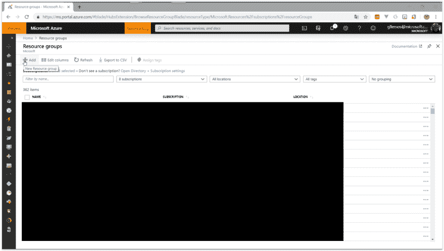T2】](https://postimg.cc/mt030Qyn)

3 -选择将为您显示的订阅，然后为字段“**资源组”**创建名称。就我而言，会是:**calvueresourcegroup**。最后，选择**地区**，就我而言，我将选择**(美国中部)**

[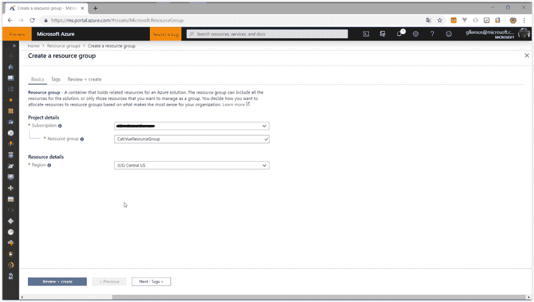T2】](https://postimg.cc/XXcFNK3f)

4 -然后点击按钮:**复习并创建**，再**创建**

[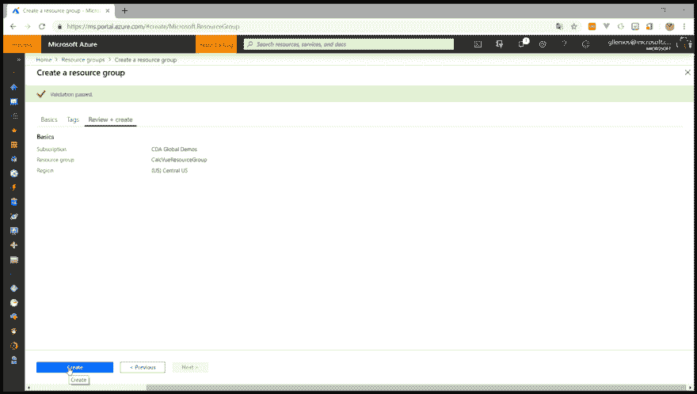T2】](https://postimg.cc/bDRJPTbd)

完成此操作后，您已经为您的应用程序创建了一个“**资源组”(**resource group)。让我们继续！

### [](#criando-um-resource-web-app)创建资源:Web 应用程序

请执行以下步骤:

1 -单击按钮:**创建资源**，其中有+符号

[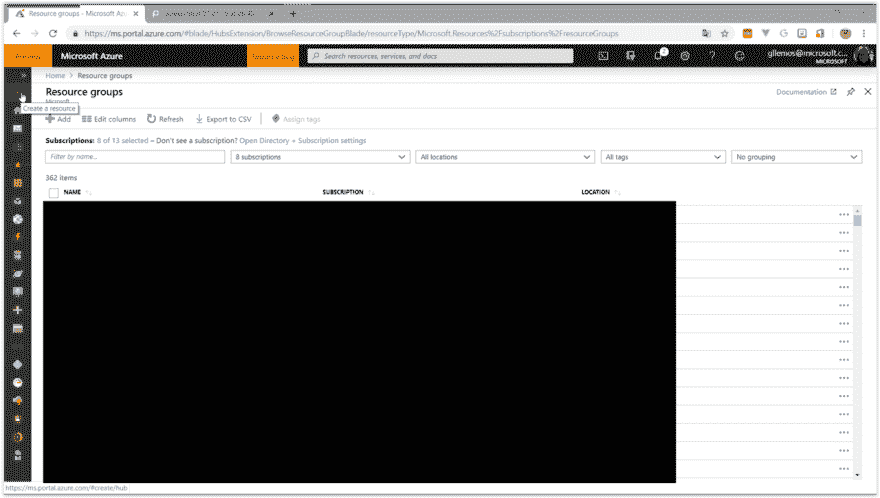T2】](https://postimg.cc/xX2JvgR9)

2 -在搜索框中键入: **Web App** ，然后单击按钮: **Create**

[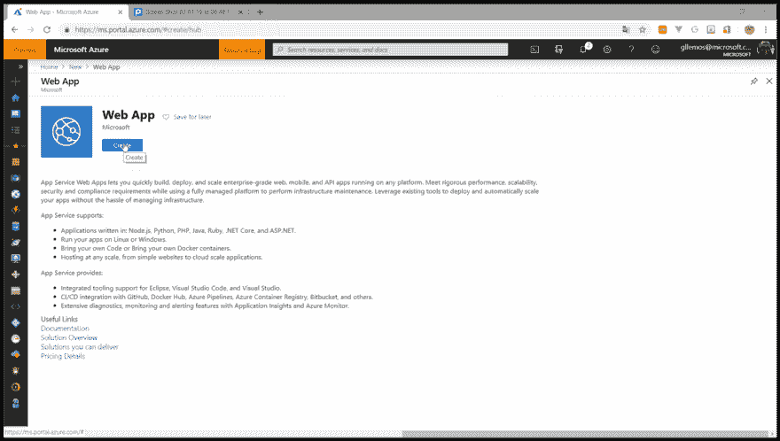T2】](https://postimg.cc/K17CJHyK)

3 -将出现另一个窗口，您必须在其中按如下方式填写:

*   **订阅:**(与上一步相同的订阅)

*   **资源组:**选择您在上一个步骤中创建的资源组。以我为例:**calvueresourcegroup**

*   **Web 应用程序名称:**我们将在此处放置我们应用程序的链接名称。它必须是唯一的名称。就我而言，我会放:**glau-calc-view**

*   **发布:**选择**代码**选项

*   **运行时栈:**在这里我们必须选择运行时。由于我们正在使用 JavaScript，因此我们将选择版本: **Node 10.0**

*   **操作系统:**选择版本 **Windows**

*   **地区:**与我们在上一步中选择的地区相同。以我为例:**美国中部**

应如下所示:

[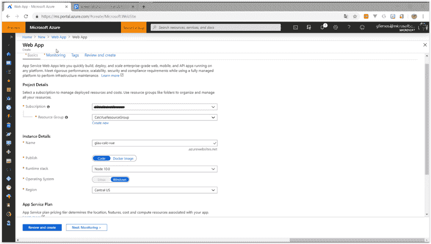T2】](https://postimg.cc/CnLjpdZT)

在 App Service Plan 部分，我们将创建一个新的。为此，单击按钮: - >创建新名称:**【calvueserviceplan】**->

 **[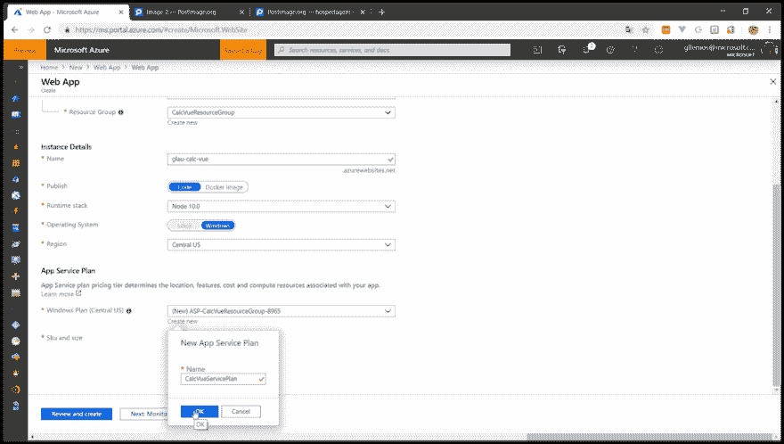T2】](https://postimg.cc/47F3n3LT)

现在，蛋糕樱桃！我们将把计划改为免费住宿。要执行此操作，请执行以下操作:

1-em**SKU 及大小**按一下**变更大小**。之后将打开以下窗口:

[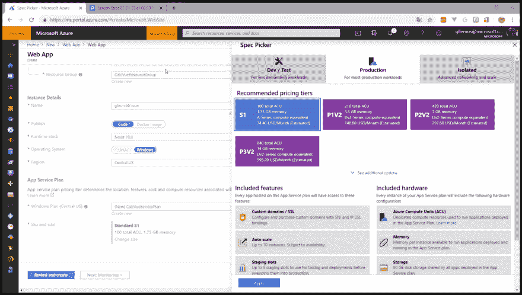T2】](https://postimg.cc/p9sW1Ttn)

2 -点击方框: **Dev/Test** ，然后选择**->选项，再点击**【应用】按钮****

 **[T2】](https://postimg.cc/w1WZCs7H)

3 -在标记**监视**中，使用**选项禁用**应用提示****

[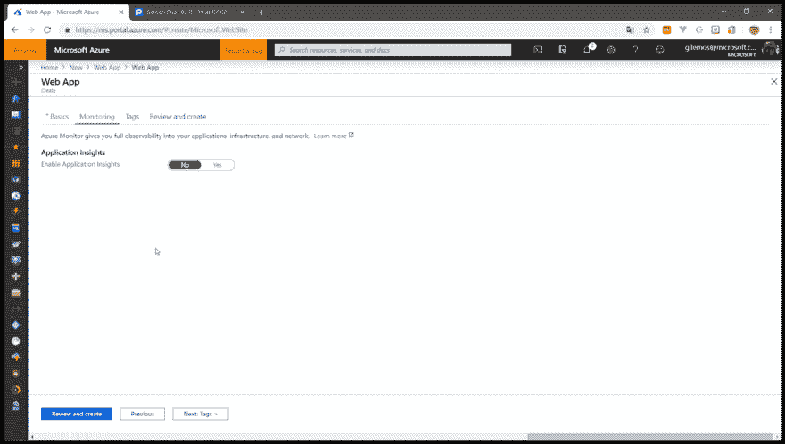T2】](https://postimg.cc/PP02YzpC)

4 - E 最后点击按钮:**复习并创建** - > **创建**

[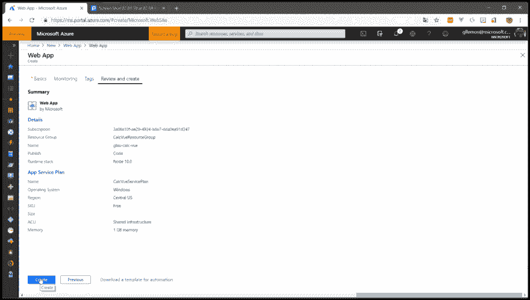T2】](https://postimg.cc/bdBTfHRm)

完成后，将为我们创建一个“t0”web app！

5 -现在点击**转到资源**

[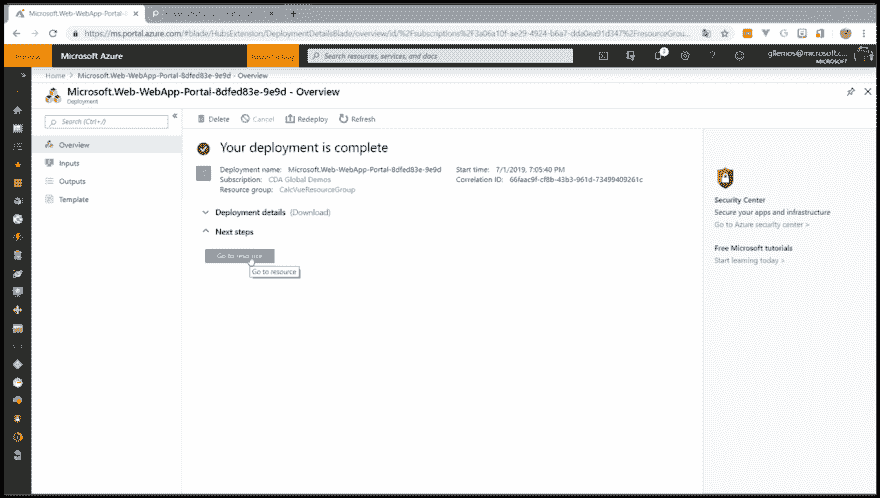T2】](https://postimg.cc/m1tK2LqJ)

6 号秀！将出现另一个屏幕。此屏幕显示了我们应用程序的所有配置。在此屏幕上，单击应用程序 URL:[【https://glau-calc-view . azure sites . net】](https://glau-calc-vue.azurewebsites.net)

[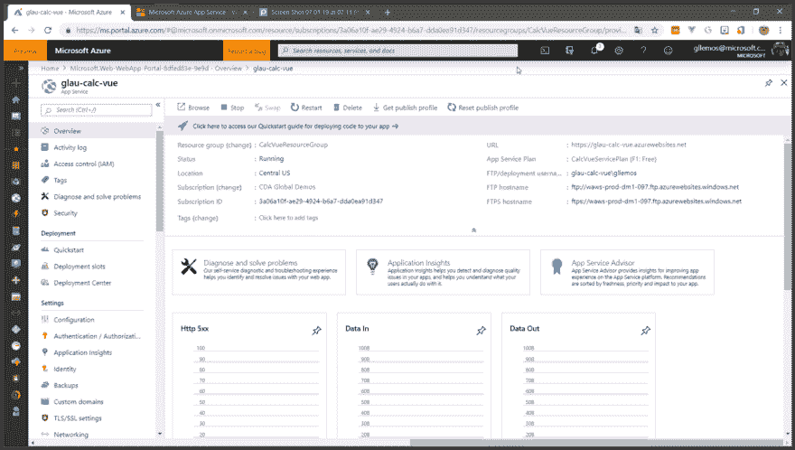T2】](https://postimg.cc/0rsfkygw)

将打开以下页面:

[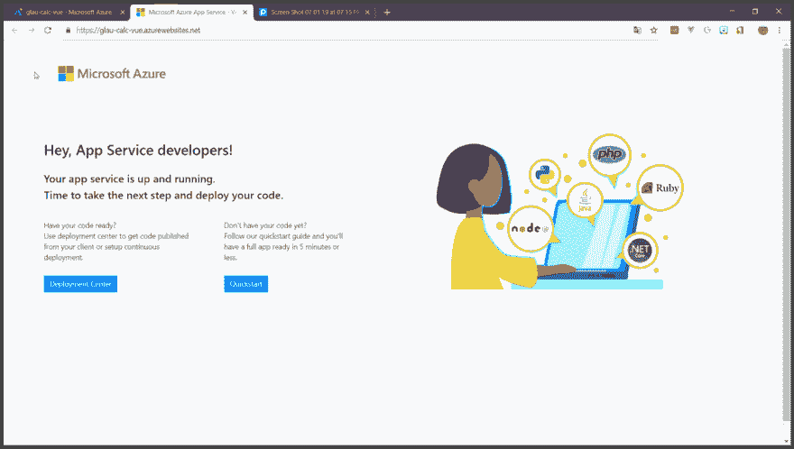T2】](https://postimg.cc/jWy7mySk)

7 -让我们进入我们应用的 Kudu's。为此，我们需要将`scm`放在应用程序的 url 上，输入如下:`https://glau-calc-vue.scm.azurewebsites.net/`

8 -打开以下页面:

[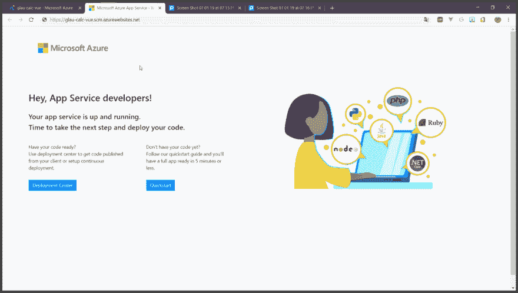T2】](https://postimg.cc/Rq2nSPJb)

9 -然后按一下 **CMD**

[T2】](https://postimg.cc/ppDy2PHp)

10 -然后按一下:->**【wwwroot】**

[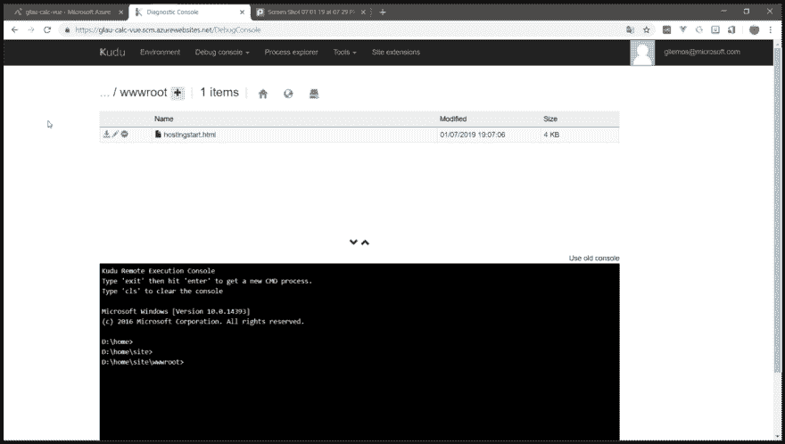T2】](https://postimg.cc/TLDfCc2p)

11 -到此为止，我们现在将按照下面的 gif 将项目中的`dist`文件夹中的所有文件下载到此页中:

[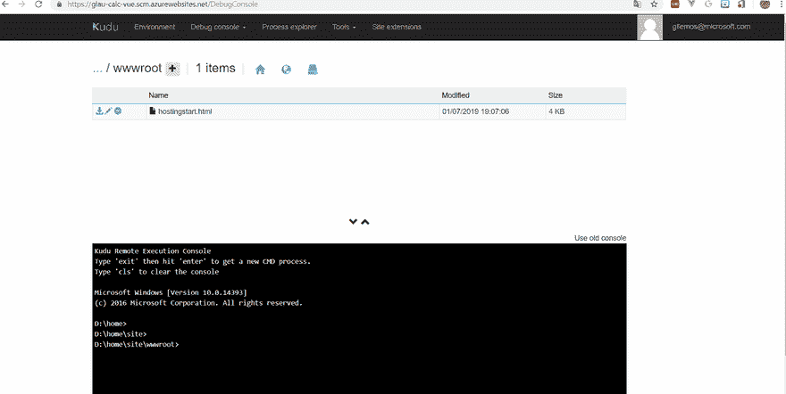T2】](https://gifyu.com/image/EmRI)

12 -完成后，键入应用程序 URL:`https://glau-calc-vue.azurewebsites.net/`，并看到该应用程序将在线免费运行和托管在云上！

[T2】](https://postimg.cc/2qJB1TX6)

还有另一种方法，我们可以更好地免费托管我们的应用程序:使用**[【visual studio code】](https://code.visualstudio.com/?WT.mc_id=devto-blog-gllemos)**！我们现在也要学吗？！

## [](#o-que-%C3%A9-azure-storage-account)O que é Azure 储帐？

与上述步骤不同，这次我们将把我们的申请托管在[【azure storage account】](https://docs.microsoft.com/pt-br/azure/storage/?WT.mc_id=devto-blog-gllemos)

但是什么是 Azure Storage Account？！它是一项由 Microsoft 管理的服务，可提供高可用性、安全、持久、可扩展且可缩减的云存储。此存储包括:

*   **蓝色 blobs(物体)**
*   **Azure 数据湖存储第二代**
*   **Azure 文件**
*   **蔚蓝色的队列**
*   **蔚蓝色的桌子**

就我们而言，由于我们的应用程序是静态应用程序，所以我们将托管在[【存储容器】](https://docs.microsoft.com/pt-br/azure/storage/blobs/storage-blob-static-website?WT.mc_id=devto-blog-gllemos) 。通过它，我们可以提供静态内容:HTML、CSS 和 javascript 包括图像文件。

为了更方便地托管我们的云应用程序，我们将使用:

*   **[Visual Studio 代码](https://code.visualstudio.com/?WT.mc_id=devto-blog-gllemos)**
*   **[【扩展-蓝色阵列】](https://marketplace.visualstudio.com/items?itemName=ms-azuretools.vscode-azurestorage&WT.mc_id=devto-blog-gllemos)**
*   **[【延伸-蓝色工具】](https://marketplace.visualstudio.com/items?itemName=ms-vscode.vscode-node-azure-pack&WT.mc_id=devto-blog-gllemos)**

这两个插件可帮助我们更轻松、更动态地进入蓝色门户，而无需打开门户并直接在 Visual Studio 代码中托管所有内容！

## [](#hospedando-a-aplica%C3%A7%C3%A3o-no-azure-storage-account-no-visual-studio-code)托管在 Visual Studio 代码中的蓝色存储账户中的应用

现在您已经下载了扩展插件**【azure tools】**和**【azure storage account】**，我们将在云中托管我们的应用程序，以便所有人都能看到我们开发的东西！请记住，您需要一个蓝色帐户才能继续此部分研讨会！

1.  打开 Visual Studio 代码并打开项目。登录蓝色帐户，如下所示:

[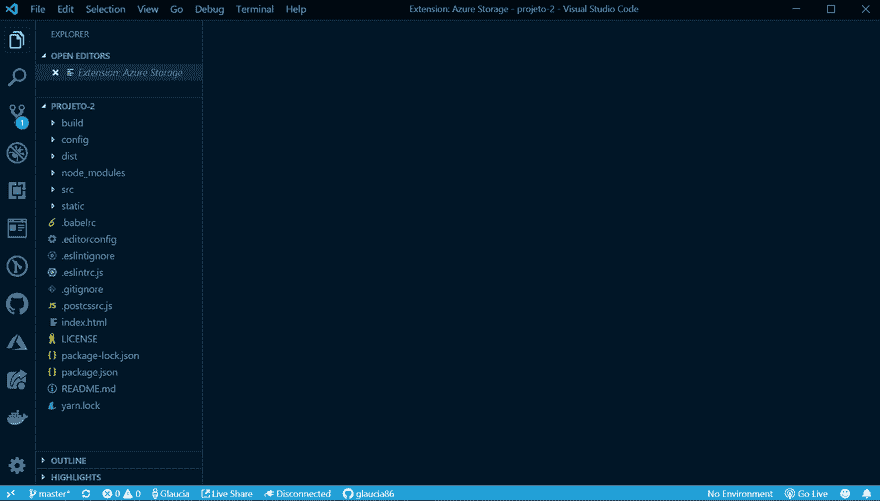T2】](https://gifyu.com/image/E04p)

1.  打开命令提示并执行以下命令:

```
> npm run build 
```

<svg width="20px" height="20px" viewBox="0 0 24 24" class="highlight-action crayons-icon highlight-action--fullscreen-on"><title>Enter fullscreen mode</title></svg> <svg width="20px" height="20px" viewBox="0 0 24 24" class="highlight-action crayons-icon highlight-action--fullscreen-off"><title>Exit fullscreen mode</title></svg>

执行上述命令后，将在项目中创建一个文件夹“`dist`”。这是非常重要的，因为只有这个文件夹中的文件我们会发送到蓝色阵列。

1.  现在，我们将在 azure storage 和 container blob 中设置一个帐户。要执行此操作，请单击“T0”蓝色工具的扩展部分“azure storage”，然后右键单击“T2”订阅，并单击**【创建存储帐户】**。

[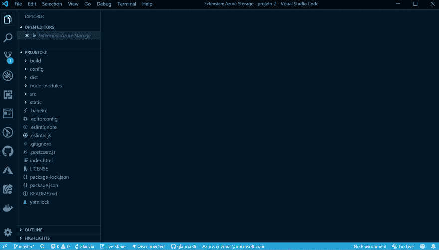T2】](https://gifyu.com/image/E04f)

1.  此时将显示一个框。在此框中，我们必须为我们的存储帐户创建一个唯一的名称。然后按`Enter`按钮。

2.  之后，我们必须创造一种新的`Resource Group`

3.  最后，我们必须选择一个区域来托管我们的应用程序。理想的是选择我国最近的地区。

要进一步了解步骤 4-6，请参阅下面的 gif:

[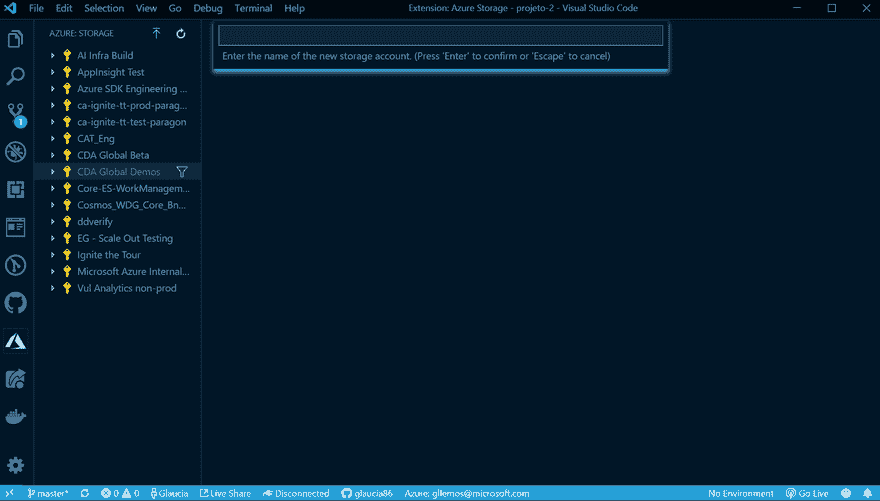T2】](https://gifyu.com/image/E04e)

1.  执行上述步骤时，他将为我们创建一个存储帐户。现在，右键单击您创建的存储帐户，然后单击“`Configure Static Website`”。

2.  创建文档:`Enter`，然后单击`Enter`。

3.  并再次创建一个名为:`Enter`的文档，然后单击`Enter`。

请参阅下面 gif 中的步骤 7-9:

[T2】](https://gifyu.com/image/E06S)

完成步骤 1 到步骤 9 后，我们将准备好发送“`dist`”文件夹中的文件，并最终将我们的应用程序放入云中！让我们继续！

## [](#realizando-deploy-da-aplica%C3%A7%C3%A3o-no-azure-storage-account-no-visual-studio-code)实现部署应用程序没有 Azure 存储帐户没有 Visual Studio 代码

现在，我们已经使用 Visual Studio 代码在 Azure 阵列上创建了一个帐户，我们现在缺少的只是将应用程序部署到 Azure 阵列，以便最终在云中使用我们的应用程序。让我们继续下面的步骤:

1.  打开 Visual Studio 代码中的应用程序，右键单击“`dist`”文件夹，然后选择选项:`Deploy to Static Website`

2.  然后选择`Subscription`和`Azure Storage Account`，在议程 19 中创建。完成后，我们可以单击 url，我们的应用程序将出现在云中！请参阅下面的 gif 步骤:

[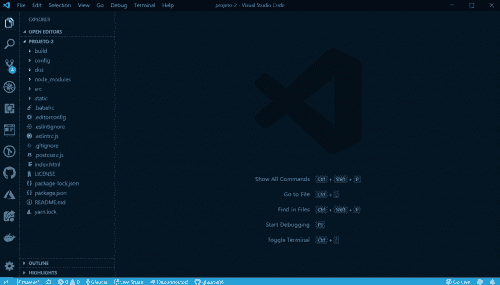T2】](https://gifyu.com/image/E063)

去吧！我们的云端应用程式也可以使用！

很酷吧？！

## [](#palavras-finais)结语

在本系列中，您将学习如何在 vue . js 中创建项目，以及如何更轻松地在蓝色中托管静态项目。更好的是:完全免费！

如果您希望看到整个项目准备就绪，只需访问

此存储库中还包含逐步指导您如何开发此项目的视频。#坚持住

还有，如果你想知道更多的消息，请继续关注我在 twitter 上！

[T2】](https://twitter.com/glaucia_lemos86)

再见了！下次个人节目见！😍****