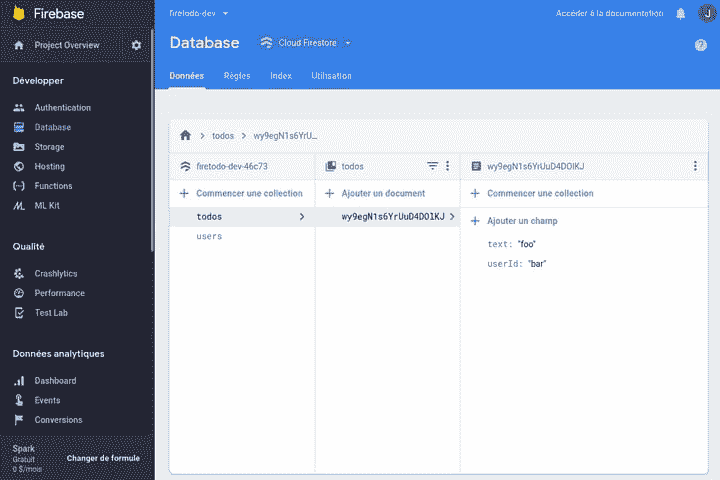
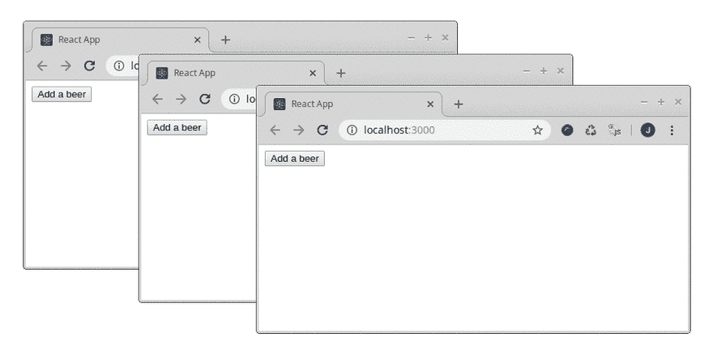
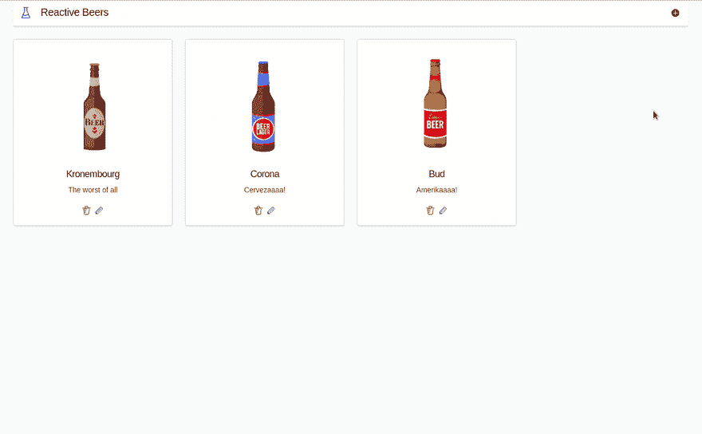

# 开源云 Firestore 的替代品？

> 原文:[https://dev . to/juliendemangeon/couch db-the-open-source-cloud-firestore-alternative-2gc 0](https://dev.to/juliendemangeon/couchdb-the-open-source-cloud-firestore-alternative-2gc0)

*注:此帖子最初发布于[marmelab.com](https://marmelab.com/blog/2019/09/25/couchdb_pouchdb_serious_firebase_alternative.html)。*

在我们最近的一个客户项目中，我们使用谷歌的后端即服务软件 [**Firebase**](https://firebase.google.com/) 作为我们的后端。尽管我们对这个“全包”套件整体上感到满意，但我们仍然对其专有方面感到失望。

[T2】](https://res.cloudinary.com/practicaldev/image/fetch/s--rvJm_jMO--/c_limit%2Cf_auto%2Cfl_progressive%2Cq_auto%2Cw_880/https://marmelab.com/static/0f8a741fb7fd02afba2b32f07a1362a4/f711f/firebaselogo.webp)

这就是为什么我主动寻找 Firebase 的开源替代品，它可以满足我们所有的需求，而不需要依赖第三方服务。

这一探索的第一步是找到一个网络实时 NoSQL 数据库的替代品[](https://firebase.google.com/docs/firestore)**。**

 **## [](#what-do-we-need)我们需要什么？

使用 Firestore 而不是更经典的数据库并不简单。这通常是因为需要快速开发具有以下特性的应用程序:

*   **离线首先**，客户端写入与远程数据库同步的本地数据库
*   **实时**，远程更改必须与我们的本地数据库同步

有一些解决方案可以满足这一需求，其中大部分基于 **NoSQL 数据库**，如 [MongoDB](https://www.mongodb.com/fr) 、 [Cassandra](http://cassandra.apache.org/) 、 [RethinkDB](https://www.rethinkdb.com/) 、 [Gun](https://gun.eco) 或其他基于 MongoDB 的解决方案，如 [Minimongo](https://docs.meteor.com/api/collections.html) 、 [turtleDB](https://turtle-db.github.io/) 或 [tortoiseDB](https://github.com/turtle-DB/tortoiseDB) 。

在我们的例子中，我们将尝试一下 [CouchDB](http://couchdb.apache.org/) (以及 [PouchDB](https://pouchdb.com/) )作为前端，因为从我们的角度来看，这是更健壮和最好的解决方案。

## [](#couchdb-amp-pouchdb)CouchDB & PouchDB

CouchDB 是一款**开源** / **跨平台**面向文档的数据库软件。它是在**面向并发的** [Erlang](https://en.wikipedia.org/wiki/Erlang_(programming_language)) 语言的基础上开发的，这让它受益于高度的可扩展性。它使用 **JSON** 来存储数据，并使用 **HTTP API** 来公开数据。

CouchDB 诞生于 2005 年。自 2008 年以来，CouchDB 成为了 Apache 软件基金会的一个项目，这使得它能够从大量的支持和庞大的社区中获益。

以下是 CouchDB 的主要特性:

*   **多版本**并发控制(让您轻松构建离线优先的解决方案)
*   具有**复制的分布式架构**
*   文档存储
*   HTTP / REST API

由于 **CouchDB 运行在服务器**上，由于它提供的 HTTP 接口，许多客户端库允许与它通信。

最广为人知的 couch db web 客户端库叫做 PouchDB。PouchDB 是一个开源的 Javascript 数据库,设计用于在浏览器中运行。通过这种方式，它允许**在本地**离线存储数据，并在用户重新上线时与远程 CouchDB 服务器同步。

## [](#couchdb-amp-pouchdb-in-practice)CouchDB & PouchDB 在练习

介绍够了，说点实际的吧！在这一节中，我将逐步描述使用 CouchDB 和 PouchDB 作为数据库系统开发一个 [ReactJS](https://reactjs.org/) 应用程序。同时，我会尽我所能，将 CouchDB 实现与 Firestore 实现进行比较。

此外，我将向您展示一些我最近喜欢的 Javascript librairies 术语:[最终形式](https://github.com/final-form/final-form)、 [ElasticUI](https://elastic.github.io/eui/) 和[指示性](https://github.com/poppinss/indicative)。

在这个项目中，我将创建一个啤酒注册表，它允许用户跟踪他们的啤酒库存。

### [](#project-setup)项目设置

为了使本教程尽可能简单，我将使用 [create-react-app](https://github.com/facebook/create-react-app) 创建一个 ReactJS 应用程序。

```
create-react-app reactive-beers && cd reactive-beers

npm install -S pouchdb 
```

<svg width="20px" height="20px" viewBox="0 0 24 24" class="highlight-action crayons-icon highlight-action--fullscreen-on"><title>Enter fullscreen mode</title></svg> <svg width="20px" height="20px" viewBox="0 0 24 24" class="highlight-action crayons-icon highlight-action--fullscreen-off"><title>Exit fullscreen mode</title></svg>

应用程序框架如下所示:

```
julien@julien-P553UA:~/Projets/marmelab/reactive-beers$ tree -L 1
.
├── node_modules
├── package.json
├── package-lock.json
├── public
├── README.md
└── src 
```

<svg width="20px" height="20px" viewBox="0 0 24 24" class="highlight-action crayons-icon highlight-action--fullscreen-on"><title>Enter fullscreen mode</title></svg> <svg width="20px" height="20px" viewBox="0 0 24 24" class="highlight-action crayons-icon highlight-action--fullscreen-off"><title>Exit fullscreen mode</title></svg>

然后，由于我不想直接在我的机器上安装 CouchDB，我将使用 [Docker](https://www.docker.com/) 。因此，第一步是配置一个`docker-compose.yml`文件和相关的`Makefile`来改善开发人员的体验。

```
// ./docker-compose.yml

version: "2.1"

services:
  couchdb:
    image: couchdb:2.3.0
    ports:
      - "5984:5984"

  node:
    image: node:10
    command: npm start
    working_dir: "/app"
    volumes:
      - ".:/app"
    ports:
      - "4242:3000"
    depends_on:
      - couchdb 
```

<svg width="20px" height="20px" viewBox="0 0 24 24" class="highlight-action crayons-icon highlight-action--fullscreen-on"><title>Enter fullscreen mode</title></svg> <svg width="20px" height="20px" viewBox="0 0 24 24" class="highlight-action crayons-icon highlight-action--fullscreen-off"><title>Exit fullscreen mode</title></svg>

```
# ./Makefile

USER_ID = $(shell id -u)
GROUP_ID = $(shell id -g)

export UID = $(USER_ID)
export GID = $(GROUP_ID)

DOCKER_COMPOSE_DEV = docker-compose -p reactive-beers

help: ## Display available commands
    @fgrep -h "##" $(MAKEFILE_LIST) | fgrep -v fgrep | awk 'BEGIN {FS = ":.*?## "}; {printf "\033[36m%-30s\033[0m %s\n", $$1, $$2}'

install: ## Install docker stack
    $(DOCKER_COMPOSE_DEV) run --rm node bash -ci 'npm install'

start: ## Start all the stack
    $(DOCKER_COMPOSE_DEV) up -d

stop: ## Stop all the containers
    $(DOCKER_COMPOSE_DEV) down

log: ## Show logs
    $(DOCKER_COMPOSE_DEV) logs -f node 
```

<svg width="20px" height="20px" viewBox="0 0 24 24" class="highlight-action crayons-icon highlight-action--fullscreen-on"><title>Enter fullscreen mode</title></svg> <svg width="20px" height="20px" viewBox="0 0 24 24" class="highlight-action crayons-icon highlight-action--fullscreen-off"><title>Exit fullscreen mode</title></svg>

因此，我们现在准备使用`make install start`开始我们的完整堆栈。

```
julien@julien-P553UA:~/Projets/marmelab/reactive-beers$ docker ps
CONTAINER ID        IMAGE            COMMAND                  CREATED       STATUS       PORTS                                        NAMES
6884f92c5341        node:10          "npm start"              3 hours ago   Up 3 hours   0.0.0.0:4242->3000/tcp                       reactive-beers_node_1
21897f166ce4        couchdb:2.3.0    "tini -- /docker-ent…"   3 hours ago   Up 3 hours   4369/tcp, 9100/tcp, 0.0.0.0:5984->5984/tcp   reactive-beers_couchdb_1 
```

<svg width="20px" height="20px" viewBox="0 0 24 24" class="highlight-action crayons-icon highlight-action--fullscreen-on"><title>Enter fullscreen mode</title></svg> <svg width="20px" height="20px" viewBox="0 0 24 24" class="highlight-action crayons-icon highlight-action--fullscreen-off"><title>Exit fullscreen mode</title></svg>

一切启动。您可能已经注意到了在我们的`docker-compose.yml`文件中暴露了`5984`端口，它是 CouchDB api。然后，如果你在浏览器中打开`localhost:5984`，你会看到类似下面的内容。

```
{  "couchdb":  "Welcome",  "version":  "2.3.0",  "git_sha":  "07ea0c7",  "uuid":  "49f4e7520f0e110687dcbc8fbbb5409c",  "features":  ["pluggable-storage-engines",  "scheduler"],  "vendor":  {  "name":  "The Apache Software Foundation"  }  } 
```

<svg width="20px" height="20px" viewBox="0 0 24 24" class="highlight-action crayons-icon highlight-action--fullscreen-on"><title>Enter fullscreen mode</title></svg> <svg width="20px" height="20px" viewBox="0 0 24 24" class="highlight-action crayons-icon highlight-action--fullscreen-off"><title>Exit fullscreen mode</title></svg>

## [](#accessing-the-document-store)访问文档库

好了，我们的服务器启动并运行了。但是，有没有一个像 Firestore 那样的**界面来可视化/监督** CouchDB 呢？答案是肯定的！CouchDB 已经包含了一个名为`Fauxton`的管理界面。我们可以在`http://localhost:5984/_utils/`浏览。

[](https://res.cloudinary.com/practicaldev/image/fetch/s--No3nf0jm--/c_limit%2Cf_auto%2Cfl_progressive%2Cq_auto%2Cw_880/https://marmelab.com/static/fdcdf33d6e0063a5389376d90d9ba863/5e3ff/firestore.webp)

<figure>

<figcaption>Firestore 管理界面</figcaption>

</figure>

[](https://res.cloudinary.com/practicaldev/image/fetch/s--zNGaYUdn--/c_limit%2Cf_auto%2Cfl_progressive%2Cq_auto%2Cw_880/https://marmelab.com/static/c378a34f9c75a0d001af9b8ae2a31db7/5e3ff/fauxton.webp) 

<figure>

<figcaption>Fauxton 管理界面</figcaption>

</figure>

`Fauxton`界面允许访问数据库、设置节点和集群、配置复制、设置权限等。虽然实用，**但最好还是用专用脚本自动完成这些管理任务**。

## [](#react-kicks-in)反应过来

现在，我们可以开始开发我们的第一个 PouchDB powered 接口了。然后，这里是我们的主`App.js`入口点和`Home.js`开始屏幕。

```
// ./src/App.js

import React from 'react';
import { Home } from './screens/Home';

const App = () => <Home />;

export default App; 
```

<svg width="20px" height="20px" viewBox="0 0 24 24" class="highlight-action crayons-icon highlight-action--fullscreen-on"><title>Enter fullscreen mode</title></svg> <svg width="20px" height="20px" viewBox="0 0 24 24" class="highlight-action crayons-icon highlight-action--fullscreen-off"><title>Exit fullscreen mode</title></svg>

`App.js`文件暂时没有兴趣。当我们将来需要添加更多的路线和屏幕时，它肯定会变得有用。

```
// ./src/screens/Home.js

import React, { useState, useEffect } from 'react';
import { addBeer, getBeers, onBeersChange } from '../api/beers';

export const Home = () => {
  const [beers, setBeers] = useState([]);

  const refreshBeers = () => getBeers().then(setBeers);

  useEffect(() => {
    // We fetch beers the first time (at mounting)
    refreshBeers();

    // Each change in our beers database will call refreshBeers
    const observer = onBeersChange(refreshBeers);
    return () => {
        // Don't forget to unsubscribe our listener at unmounting
        observer.cancel();
    };
  }, []);

  return (
    <div>
      <button onClick={() => addBeer({ title: 'Beer X' })}>Add a beer</button>
      <ul>
        {/* beer._id is an unique id generated by CouchDB */}
        {beers.map(beer => <li key={beer._id}>{beer.title}</li>)}
      </ul>
    </div>
  );
}; 
```

<svg width="20px" height="20px" viewBox="0 0 24 24" class="highlight-action crayons-icon highlight-action--fullscreen-on"><title>Enter fullscreen mode</title></svg> <svg width="20px" height="20px" viewBox="0 0 24 24" class="highlight-action crayons-icon highlight-action--fullscreen-off"><title>Exit fullscreen mode</title></svg>

## CouchDB 比 Firestore 需要更多的请求

正如您所看到的，在这个例子中，我们使用了一个监听器(`onBeersChange`)和一个查询(`getBeers`)的组合来获取初始的啤酒列表，并在数据库发生变化时刷新它。

与 Firestore 提供的操作相比，这种操作并不是最佳的。事实上，虽然 **pouchdb 无法将更改和数据**返回给我们，但 Firestore 能够做到这一点要感谢一个`QuerySnapshot`系统，从而减少了服务器的往返行程。自己看下面 Firestore 的例子:

```
 db.collection("anything")
    .onSnapshot(function(querySnapshot) {
        querySnapshot.forEach(function(doc) {
          // This forEach loop is executed at first execution
          // And executed each time the query result changes
        });
    }); 
```

<svg width="20px" height="20px" viewBox="0 0 24 24" class="highlight-action crayons-icon highlight-action--fullscreen-on"><title>Enter fullscreen mode</title></svg> <svg width="20px" height="20px" viewBox="0 0 24 24" class="highlight-action crayons-icon highlight-action--fullscreen-off"><title>Exit fullscreen mode</title></svg>

因此，如果我们使用 Firestore，它看起来会是这样的:

```
 //...

  const [beers, setBeers] = useState([]);

  useEffect(() => {
    const unsubscribe =  db.collection("beers")
      .onSnapshot(function(querySnapshot) {
          const snapBeers = [];
          querySnapshot.forEach(function(doc) {
              snapBeers.push(doc.data());
          });

          setBeers(snapBeers);
      });

    return () => {
        unsubscribe();
    };
  }, []);

  // ... 
```

<svg width="20px" height="20px" viewBox="0 0 24 24" class="highlight-action crayons-icon highlight-action--fullscreen-on"><title>Enter fullscreen mode</title></svg> <svg width="20px" height="20px" viewBox="0 0 24 24" class="highlight-action crayons-icon highlight-action--fullscreen-off"><title>Exit fullscreen mode</title></svg>

还可以在`querySnapshot.docs`属性上使用`.map`以一种“非命令性”的方式检索所有文档。不幸的是，官方文档没有充分涵盖这一功能。

## [](#the-model)模型

就像在后端开发中一样，我喜欢在我的前端应用程序中将模型逻辑与视图逻辑分开。下面是我们啤酒的 API 文件:

```
// ./src/api/beers.js

import PouchDB from 'pouchdb';

// We declare a PouchDB instance that is "remote only"
// There's no "offline" capability for the moment, everything is sync
export const beersDatabase = new PouchDB('http://localhost:5984/beers');

// If the beers database does not already exist
// => The database is automatically created when an object is added to it
export const addBeer = beer => beersDatabase.post(beer);

// Here, we list all the documents from our beers database
// A lot of options exists. Eg: we can paginate using "startKey", "endKey" or "limit"
export const getBeers = () =>
  beersDatabase
    .allDocs({
      include_docs: true,
      descending: true,
    })
    .then(doc => doc.rows.map(row => row.doc));

// We listen all the changes that happen since now
// We can also apply a "limit" option to this method
export const onBeersChange = callback => beersDatabase
    .changes({ since: 'now', live: true })
    .on('change', callback); 
```

<svg width="20px" height="20px" viewBox="0 0 24 24" class="highlight-action crayons-icon highlight-action--fullscreen-on"><title>Enter fullscreen mode</title></svg> <svg width="20px" height="20px" viewBox="0 0 24 24" class="highlight-action crayons-icon highlight-action--fullscreen-off"><title>Exit fullscreen mode</title></svg>

这是我们第一个 CouchDB 应用程序的运行结果。正如你所看到的，所有的东西在多个窗口之间是同步的。

[T2】](https://res.cloudinary.com/practicaldev/image/fetch/s--UXeD_sG3--/c_limit%2Cf_auto%2Cfl_progressive%2Cq_66%2Cw_880/https://marmelab.com/sync-beers-b5961268f0dda773642fcd11173a5715.gif)

### [](#offline-sync)离线同步

遗憾的是，我们的实际版本只有在互联网接入正常运行时才有效。在其他情况下，如网络膨胀或数据包丢失，啤酒永远不会(或缓慢地...)被添加到啤酒列表中，因为“仅远程”同步。

避免这个问题的正确方法是保持**本地优先**的方法。这意味着我们必须在本地数据库上完成所有的数据库操作，然后在互联网接入恢复时与远程数据库同步。

[T2】](https://res.cloudinary.com/practicaldev/image/fetch/s--Cnc9fGBX--/c_limit%2Cf_auto%2Cfl_progressive%2Cq_auto%2Cw_880/https://marmelab.com/static/f10e78636cdc43ba0a8ab24292528975/5443b/nointernet.webp)

因此，第一步是用数据库名称而不是远程数据库 url 声明一个新的 PouchDB 实例。这样，PouchDB 会自动检测到我们想要实例化一个本地数据库。

```
import PouchDB from 'pouchdb';

// Declare local database
const beersDatabase = new PouchDB('beers');

// Declare remote database
const remoteBeersDatabase = new PouchDB(`http://localhost:5984/beers`);

// Keep local and remote databases in sync
PouchDB.sync(beersDatabase, remoteBeersDatabase, {
  live: true, // replicate changes in live
  timeout: false, // disable timeout
  retry: true, // retry sync if fail
}); 
```

<svg width="20px" height="20px" viewBox="0 0 24 24" class="highlight-action crayons-icon highlight-action--fullscreen-on"><title>Enter fullscreen mode</title></svg> <svg width="20px" height="20px" viewBox="0 0 24 24" class="highlight-action crayons-icon highlight-action--fullscreen-off"><title>Exit fullscreen mode</title></svg>

`PouchDB.sync`指令相当于本地和远程数据库之间的双向`PouchDB.replicate`指令。

```
PouchDB.replicate(beersDatabase, remoteBeersDatabase);
PouchDB.replicate(remoteBeersDatabase, beersDatabase); 
```

<svg width="20px" height="20px" viewBox="0 0 24 24" class="highlight-action crayons-icon highlight-action--fullscreen-on"><title>Enter fullscreen mode</title></svg> <svg width="20px" height="20px" viewBox="0 0 24 24" class="highlight-action crayons-icon highlight-action--fullscreen-off"><title>Exit fullscreen mode</title></svg>

默认情况下，PouchDB 使用 [IndexedDB](https://developers.google.com/web/ilt/pwa/working-with-indexeddb) 作为本地数据库(顺便说一下就像 Firestore 一样)。因此，现在我们的设置已经完成，我们可以使用 Chrome 控制台查看我们的本地数据库。

[T2】](https://res.cloudinary.com/practicaldev/image/fetch/s--ejbUOEkR--/c_limit%2Cf_auto%2Cfl_progressive%2Cq_auto%2Cw_880/https://marmelab.com/static/f43455cb45fcdd00845ea719ce4ee1fd/5e3ff/indexeddbcapture.webp)

如你所见，我们找到了我们创造的啤酒的完整列表。每一个都由从`_id`和`_rev` CouchDB 属性构建的`key`唯一标识。

```
{
  "_id": "0c2738a3-d363-405f-b9bb-0ab6f5ec9655",
  "_rev": "3-b90bd9d62fbe04e36fe262a267efbd42",
  "title": "Beer X"
} 
```

<svg width="20px" height="20px" viewBox="0 0 24 24" class="highlight-action crayons-icon highlight-action--fullscreen-on"><title>Enter fullscreen mode</title></svg> <svg width="20px" height="20px" viewBox="0 0 24 24" class="highlight-action crayons-icon highlight-action--fullscreen-off"><title>Exit fullscreen mode</title></svg>

而`_id`代表一个唯一的文档，`_rev`代表该文档的**版本**标识符。事实上，文档的每一次修改都意味着它的一个新版本，这使得管理冲突成为可能。

与 CouchDB 不同，Firestore 文档没有**修订版** id。所以，使用 Firestore 不与冲突斗争的唯一方法是使用 [**事务**](https://firebase.google.com/docs/firestore/manage-data/transactions) 。

此外，由于 CouchDB 记录每一个提交的变更，**有可能在第二时间**返回或解决冲突，这对于避免丢失数据的风险是至关重要的。

有关使用 PouchDB 进行冲突管理的更多信息，请查看 PouchDB 冲突文档。

既然我们能够与本地和远程数据库进行通信，我们就可以将注意力集中在业务逻辑和用户界面上。此外，它将允许我们从**乐观渲染**中受益，同时使我们的应用**在解决网络问题**时更加灵活。

## [](#forms-amp-validation)表单&验证

在本节中，我们将实现一个能够添加新啤酒的表单。为此，我将使用`final-form`(和`react-final-form`，ReactJS 的适配器)。

```
npm install -S final-form react-final-form 
```

<svg width="20px" height="20px" viewBox="0 0 24 24" class="highlight-action crayons-icon highlight-action--fullscreen-on"><title>Enter fullscreen mode</title></svg> <svg width="20px" height="20px" viewBox="0 0 24 24" class="highlight-action crayons-icon highlight-action--fullscreen-off"><title>Exit fullscreen mode</title></svg>

因此，我们可以创建一个简单的表单来处理用户输入。

```
// ./src/components/BeerForm.js

import React from 'react';
import { Form, Field } from 'react-final-form';

export const BeerForm = ({ onSubmit }) => (
  <Form
    validate={() => ({})}
    onSubmit={onSubmit}
    render={({
      handleSubmit,
      hasValidationErrors,
      pristine,
      invalid,
      submitErrors,
      submitting,
      form,
    }) => (
        <form onSubmit={handleSubmit}>
         <div>
            <label>Title</label>
            <Field name="title" component="input" />
          </div>
          <div>
            <label>Description</label>
            <Field
              name="description"
              component="textarea"
              rows={2}
              placeholder="Tape your description here..."
            />
          <div/>
          <button type="submit" disabled={pristine || hasValidationErrors || submitting}>
            Submit
          </button>
          {submitErrors && submitErrors.global && (
            <p>{submitErrors.global}</p>
          )}
        </form>
      )
    }
  /> ); 
```

<svg width="20px" height="20px" viewBox="0 0 24 24" class="highlight-action crayons-icon highlight-action--fullscreen-on"><title>Enter fullscreen mode</title></svg> <svg width="20px" height="20px" viewBox="0 0 24 24" class="highlight-action crayons-icon highlight-action--fullscreen-off"><title>Exit fullscreen mode</title></svg>

然后，我们可以用主屏幕中的表单替换我们的操作按钮。

```
// ./src/screens/Home.js

import React, { useState, useEffect } from 'react';
import { addBeer, getBeers, onBeersChange } from '../api/beers';

export const Home = () => {
  const [beers, setBeers] = useState([]);

  /* ... */

  return (
    <div>
      <BeerForm onSubmit={beer => queries.addBeer(beer)} />
      <ul>
        {/* beer._id is an unique id generated by CouchDB */}
        {beers.map(beer => <li key={beer._id}>{beer.title}</li>)}
      </ul>
    </div>
  );
}; 
```

<svg width="20px" height="20px" viewBox="0 0 24 24" class="highlight-action crayons-icon highlight-action--fullscreen-on"><title>Enter fullscreen mode</title></svg> <svg width="20px" height="20px" viewBox="0 0 24 24" class="highlight-action crayons-icon highlight-action--fullscreen-off"><title>Exit fullscreen mode</title></svg>

## [](#data-validation-with-indicative)数据验证带有指示性

因此，我们有一个表单，但目前没有数据验证。用户此时可以发送任何他们想要的内容。这就是为什么我们要使用`indicative`建立一个数据验证器，这是我刚刚发现的一个库，我想尝试一下。

```
npm install -S indicative 
```

<svg width="20px" height="20px" viewBox="0 0 24 24" class="highlight-action crayons-icon highlight-action--fullscreen-on"><title>Enter fullscreen mode</title></svg> <svg width="20px" height="20px" viewBox="0 0 24 24" class="highlight-action crayons-icon highlight-action--fullscreen-off"><title>Exit fullscreen mode</title></svg>

指示性 API 非常简单。它由一个使用一组验证规则的`Validator`对象和一个`formatter`组成。下面是一个用法示例:

```
import Validator from 'indicative/builds/validator';
import { Vanilla as VanillaFormatter } from 'indicative/builds/formatters';
import { required, email } from 'indicative/builds/validations';

const validator = Validator({ required, email }, VanillaFormatter);

const rules = {
  name: 'required',
  email: 'required|email',
};

const messages = {
  'required': '{{ field }} field is required', // This message works for all required rules
  'email.required': 'You must provide an email!', // This message is specific for required email
  'email.email': 'The email adress is invalid',
};

const values = {
  email: 'bad email',
};

// Validator.validate is async

validator
  .validate(values, rules, messages)
  .then(() => /* everything is ok! */)
  .catch((errors) => {
    /*
      [
        { field: 'name', message: 'name field is required!' },
        { field: 'email', message: 'The email adress is invalid' },
      ]
    */
  }); 
```

<svg width="20px" height="20px" viewBox="0 0 24 24" class="highlight-action crayons-icon highlight-action--fullscreen-on"><title>Enter fullscreen mode</title></svg> <svg width="20px" height="20px" viewBox="0 0 24 24" class="highlight-action crayons-icon highlight-action--fullscreen-off"><title>Exit fullscreen mode</title></svg>

这是我们为`BeerForm.js`定制的实现。

```
// ./src/components/BeerForm.js

import React from 'react';
import { Form, Field } from 'react-final-form';
import { Vanilla } from 'indicative/builds/formatters';
import Validator from 'indicative/builds/validator';
import { required } from 'indicative/builds/validations';

const validator = Validator({ required }, Vanilla);

const rules = {
  title: 'required',
  description: 'required',
};

const messages = {
  'title.required': 'Beer title is required',
  'description.required': 'Beer description is required',
};

const validate = async values =>
  validator
    .validate(values, rules, messages)
    .then(() => ({}))
    .catch(errors => {
      return errors.reduce((acc, error) => {
        acc[error.field] = error.message;
        return acc;
      }, {});
    }); 
```

<svg width="20px" height="20px" viewBox="0 0 24 24" class="highlight-action crayons-icon highlight-action--fullscreen-on"><title>Enter fullscreen mode</title></svg> <svg width="20px" height="20px" viewBox="0 0 24 24" class="highlight-action crayons-icon highlight-action--fullscreen-off"><title>Exit fullscreen mode</title></svg>

最终表单需要一个对象作为错误模型，所以我们使用一个`reduce`来格式化`catch`中的错误。或者，也可以使用[自定义指示格式器](https://indicative.adonisjs.com/docs/formatters#_creating_your_own)。

现在我们有了自定义的验证函数，我们可以替换空的验证函数。

```
export const BeerForm = ({ onSubmit }) => (
  <Form
-  validate={() => ({})} +  validate={validate} 
```

<svg width="20px" height="20px" viewBox="0 0 24 24" class="highlight-action crayons-icon highlight-action--fullscreen-on"><title>Enter fullscreen mode</title></svg> <svg width="20px" height="20px" viewBox="0 0 24 24" class="highlight-action crayons-icon highlight-action--fullscreen-off"><title>Exit fullscreen mode</title></svg>

还有 tadaaa！我们经过验证的表单已经启动并运行，我们已经准备好使用它了。

[T2】](https://res.cloudinary.com/practicaldev/image/fetch/s--QVQtBZFv--/c_limit%2Cf_auto%2Cfl_progressive%2Cq_66%2Cw_880/https://marmelab.com/finalformexample-01ec0a572c0ec1fa17489fca7b68df3e.gif)

## [](#lets-make-it-beautiful)让我们把它变漂亮！

总之，我们可以展示啤酒，我们可以添加啤酒，一切离线工作，并与远程服务器同步。但是现在，它不太美观，我也不敢呈现给我婆婆。那么，把它弄得漂亮一点怎么样？

在这一节中，我将使用开发 ElasticSearch 的公司 [Elastic](https://www.elastic.co/fr/) 使用的 [Elastic UI](https://elastic.github.io/eui/) 框架(又名`eui`)。

我想我们都同意，我们必须删除这个卑鄙的名单，代之以一个漂亮的网格。幸运的是，Eui 允许它很容易。

[T2】](https://res.cloudinary.com/practicaldev/image/fetch/s--QZ3ouHs6--/c_limit%2Cf_auto%2Cfl_progressive%2Cq_auto%2Cw_880/https://marmelab.com/static/e8d11cc732ffe9172914a6b8b72c0d93/5e3ff/beergridfull.webp)

如你所见，我们抓住机会从网格中添加编辑和删除啤酒。我们还将把表单放在页面右侧的滑动面板中。这样，我们可以直接从导航栏中的“+”按钮添加啤酒，或者直接从网格中编辑啤酒，而无需更改页面。

## [](#handling-image-attachments)处理图片附件

我不知道你怎么想，但看到这些灰色啤酒罐让我心碎。所以是时候允许在表单中上传图片了。

```
// ./src/components/BeerForm.js

const handleIllustration = async files => {
  if (files.length === 0) {
    form.change('_image', undefined);
    return;
  }

  const file = files[0];

  form.change('_image', {
    data: file,
    type: file.type,
  });
};

<EuiFormRow label="Beer Illustration">
  <EuiFilePicker onChange={handleIllustration} /> </EuiFormRow> 
```

<svg width="20px" height="20px" viewBox="0 0 24 24" class="highlight-action crayons-icon highlight-action--fullscreen-on"><title>Enter fullscreen mode</title></svg> <svg width="20px" height="20px" viewBox="0 0 24 24" class="highlight-action crayons-icon highlight-action--fullscreen-off"><title>Exit fullscreen mode</title></svg>

我刚刚添加到 beer 对象的自定义属性`_image`将由我们的 beer api 处理，并被视为一个 [**PouchDB 附件**](https://pouchdb.com/guides/attachments.html) 。

```
// ./src/api/queries.js

const saveBeer = async ({ _image, ...beer }) =>
  store
    .collection('beers')
    .post(beer)
    .then(
      ({ id, rev }) =>
        // if an "_image" attribute is present, we put an attachement to the document
        _image &&
        store
          .collection('beers')
          .putAttachment(id, 'image', rev, _image.data, _image.type)
    );

const getBeers = () =>
  store
    .collection('beers')
    .allDocs({
      include_docs: true,
      descending: true,
      attachments: true, // We include images in the output, so we can display them
    })
    .then(doc => doc.rows.map(row => row.doc));
}; 
```

<svg width="20px" height="20px" viewBox="0 0 24 24" class="highlight-action crayons-icon highlight-action--fullscreen-on"><title>Enter fullscreen mode</title></svg> <svg width="20px" height="20px" viewBox="0 0 24 24" class="highlight-action crayons-icon highlight-action--fullscreen-off"><title>Exit fullscreen mode</title></svg>

在 CouchDB 中，每个文件都可以作为一个`attachement`直接附加到相应的文档中。这个概念在 Firestore 是不存在的。然后最好通过它的 bucket 系统使用 [Firebase Storage](https://firebase.google.com/docs/storage) (谷歌云存储)在 Firestore 中存储文件和存储路径。

[T2】](https://res.cloudinary.com/practicaldev/image/fetch/s--IdJ_DVLW--/c_limit%2Cf_auto%2Cfl_progressive%2Cq_66%2Cw_880/https://marmelab.com/beerregistry-24aa02cf340233c71fdb4429a3d8851e.gif)

## [](#conclusion)结论

我的啤酒注册申请的最终结果可以在 GitHub 上获得，地址如下:[github.com/marmelab/reactive-beers](https://github.com/marmelab/reactive-beers)。欢迎随时评论改进！

虽然一开始我对 CouchDB 的能力表示怀疑，但我很快就被它的稳定性和 API 的易用性征服了。

由于我还没有在生产环境中部署过这种类型的应用程序，所以我无法对这种类型的数据库的易维护性发表评论。尽管如此，我还是更倾向于推荐使用 **Firestore 进行概念验证**，并首先使用**第三方服务，如 [Couchbase](https://www.couchbase.com/products/data-platform) 或 [IBM Cloudant](https://www.ibm.com/cloud/cloudant) 进行关键应用**。

虽然这次经历让我能够平衡每个数据库主要特性的优缺点，但我不可能达到我预期的程度。

事实上，我没有时间讨论许多关键点，如*文档访问安全*、*权限管理*、*服务器端文档验证*、*数据分页*或*部署*。但不管怎样，我决心就这些话题多写点文章。

所以，敬请期待！**