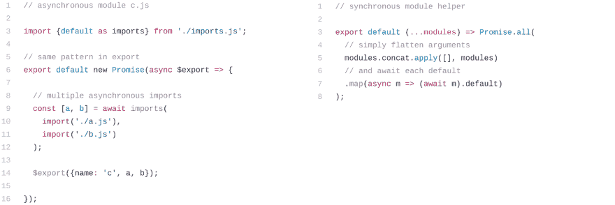

# 2019-2020 年你可能不知道的 Javascript 特性

> 原文:[https://dev . to/dg92/JavaScript-feature-you-may-not-know-in-2019-2020-4p 5d](https://dev.to/dg92/javascript-feature-you-might-not-know-in-2019-2020-4p5d)

# [](#private-class-field)私有类字段👇

在 ES6 之前，我们不能直接声明私有属性。是的，有像下划线约定(_propertyName)、[闭包、符号或弱映射这样的方法。](https://curiosity-driven.org/private-properties-in-javascript)

但是现在私有类字段使用 hash #前缀。让我们通过一个例子来学习它。

```
class Test {
  a = 1;          // .a is public
  #b = 2;         // .#b is private
  static #c = 3;  // .#c is private and static
  incB() {
    this.#b++;
  }
}
const testInstance = new Test();
// runs OK
testInstance.incB();
// error - private property cannot be modified outside class
testInstance.#b = 0; 
```

*注意:到目前为止还没有办法定义私有函数，尽管一个 [TC39 第三阶段:提议草案](https://github.com/tc39/proposal-private-methods)建议在名字上使用 hash #前缀。🤞*

# [](#stringmatchall)String.matchAll()👇

如果我有一个字符串，带有一个包含许多捕获组的全局正则表达式，我经常想遍历所有的组。目前，我的选择如下:

1.  **string . prototype . match()with/g**—如果我们使用。match()使用设置了标志/g 的正则表达式，您可以在一个数组中获得它的所有完全匹配。

2.  **string . prototype . split()**—如果我们使用拆分字符串和正则表达式来指定分隔符，并且如果它包含至少一个捕获组，则。split()返回子字符串交错排列的数组。

上述方法的问题是，只有在正则表达式和属性上设置了/g 时，它们才有效。每次出现匹配时，正则表达式的 lastIndex 都会改变。这使得在多个位置使用同一个正则表达式很危险。

matchAll() 有助于解决上述所有问题。让我们看看它的定义和用法

给定一个字符串和一个正则表达式，。matchAll()返回与正则表达式匹配的所有结果，包括捕获组。

```
let regexp = /t(e)(st(\d?))/g;
let str = 'test1test2';
let array = [...str.matchAll(regexp)];
console.log(array[0]);
// expected output: Array ["test1", "e", "st1", "1"] 
```

*注:。matchAll()返回一个迭代器，而不是一个真正的可重启 iterable。也就是说，一旦结果用尽，就需要再次调用方法并创建一个新的迭代器。*

# [](#numeric-separators)数字分隔符👇

如果你很难读懂一长串数字，这就是你搜索的终点。

数字分隔符允许人眼快速解析，尤其是当有大量重复数字时:

```
1000000000000 -> 1_000_000_000_000
1019436871.42 -> 1_019_436_871.42 
```

现在更容易分辨第一个数字是万亿，第二个数字是 10 亿量级。

它也适用于其他基地，例如:

```
const fileSystemPermission = 0b111_111_000;
const bytes = 0b1111_10101011_11110000_00001101;
const words = 0xFAB_F00D; 
```

您也可以在分数和指数中使用分隔符:

```
const massOfElectronInKg = 9.109_383_56e-31;
const trillionInShortScale = 1e1_2; 
```

*注意:解析 _ 分隔的整数可能很棘手，因为 Number('123_456 ')给出 NAN，而 parseInt('123_456 ')给出 123。*

# [](#bigints)BigInt 的👇

BigInts 是 JavaScript 中的一个新的数字原语，可以表示精度大于 2⁵-1 的整数。使用 BigInts，您可以安全地存储和操作大整数，甚至超过数字的安全整数限制。

BigInts 正确执行整数运算，不会溢出。让我们通过一个例子来理解:-

```
const max = Number.MAX_SAFE_INTEGER;
// 9007199254740991
max+1;
// 9007199254740992
max+2;
// 9007199254740991 
```

我们可以看到，max + 1 产生的结果与 max + 2 相同。

对安全整数范围之外的整数的任何计算(即从数字。MIN_SAFE_INTEGER to Number。MAX_SAFE_INTEGER)可能会丢失精度。为此，我们只能依赖安全范围内的数字整数值。

因此，BigInts 应运而生，BigInts 可以通过在任意整数文字上加上 n 后缀来创建。例如，123 变成 123n，或者可以使用全局 BigInt(number)函数将数字转换为 BigInts。

让我们用 BigInts
重新看看上面的例子

```
BigInt(Number.MAX_SAFE_INTEGER) + 2n;
// 9007199254740993n
typeof 123n
// "bigint2" 
```

*注意:数字分隔符对 BigInts 特别有用，例如:*

```
const massOfEarthInKg = 6_000_000_000_000_000_000_000_000n; 
```

BigInts 支持最常见的运算符。Binary +、-、*和** 都按预期工作。/和%工作，并根据需要四舍五入到零。

```
(7 + 6 - 5) * 4 ** 3 / 2 % 3;
// → 1
(7n + 6n - 5n) * 4n ** 3n / 2n % 3n;
// → 1n 
```

*注意:有一个问题是不允许在 BigInts 和 Numbers 之间混合操作*

# [](#locale-string-with-bigint)带 BigInt 的区域设置字符串👇

toLocaleString()方法返回一个字符串，其中包含 BigInt 的语言敏感表示。

```
let bigint = 123456789123456789n;

// German uses period for thousands
console.log(bigint.toLocaleString('de-DE'));
// → 123.456.789.123.456.789

// Arabic in most Arabic speaking countries uses Eastern Arabic digits
console.log(bigint.toLocaleString('ar-EG'));
// → ١٢٣٬٤٥٦٬٧٨٩٬١٢٣٬٤٥٦٬٧٨٩

// India uses thousands/lakh/crore separators
console.log(bigint.toLocaleString('en-IN'));
// → 1,23,45,67,89,12,34,56,789

// the nu extension key requests a numbering system, e.g. Chinese decimal
console.log(bigint.toLocaleString('zh-Hans-CN-u-nu-hanidec'));
// → 一二三,四五六,七八九,一二三,四五六,七八九

// when requesting a language that may not be supported, such as
// Balinese, include a fallback language, in this case Indonesian
console.log(bigint.toLocaleString(['ban', 'id']));
// → 123.456.789.123.456.789 
```

# [](#globalthis-keyword)GlobalThis 关键字👇

JavaScript 的变量作用域是嵌套的，形成一棵树，它的根是全局作用域，这个关键字的值是对“拥有”当前正在执行的代码或函数的对象的引用。

要了解更多关于这个关键字和全球范围的信息，请阅读我下面的文章

1.  [Javascript 中的作用域](https://overflowjs.com/posts/Scopes-in-Javascript-2019.html)

2.  [理解 Javascript“this”关键字(上下文)](https://overflowjs.com/posts/This-keyword-In-Javascript-2019-Javascript-Context.html)

通常我们使用类似于
的函数来计算全局

```
const getGlobalThis = () => {

  // in webworker or service worker
  if (typeof self !== 'undefined') return self;

  // in browser 
  if (typeof window !== 'undefined') return window;

  // in Node.js
  if (typeof global !== 'undefined') return global;

  // Standalone javascript shell
  if (typeof this !== 'undefined') return this;

  throw new Error('Unable to locate global object');
};
const theGlobalThis = getGlobalThis(); 
```

上面的函数并没有涵盖我们需要全局这个值时的所有情况。

在 use strict 的情况下，这个值是未定义的。

当我们在 javascript 中形成一个包时，它通常被一些可能与全局不同的代码所包裹。

在独立的 javascript 引擎外壳环境中，上述代码将不起作用。

为了解决上述问题，引入了 globalThis 关键字，该关键字在任何环境下、任何时间返回 global this 对象。

注意:由于向后兼容性，全局对象现在被认为是 JavaScript 无法摆脱的错误。它会对性能产生负面影响，并且通常会引起混淆。

# [](#promiseallsettled)Promise.allSettled()👇

如果你想知道 javascript 中的承诺是什么，那么看看这个— [JavaScript 承诺:简介。](https://developers.google.com/web/fundamentals/primers/promises)

有一点要点，承诺是 JavaScript 向您承诺工作将会完成(或者如果工作无法完成可能会失败)的方式。

新方法返回一个承诺，该承诺在所有给定承诺都已解决(即解决或拒绝)后解决，并带有一个对象数组，每个对象描述每个承诺的结果。

```
const promise1 = Promise.resolve(3);
const promise2 = new Promise((resolve, reject) => setTimeout(reject, 100, 'foo'));
const promises = [promise1, promise2];
Promise.allSettled(promises).
  then((results) => results.forEach((result) => console.log(result.status)));
// expected output:
// "fulfilled"
// "rejected" 
```

这不同于 Promise.all，因为它拒绝 iterable 对象中的一个承诺。

下面是比较当前支持的承诺方法
[](https://res.cloudinary.com/practicaldev/image/fetch/s--bOwBvNhM--/c_limit%2Cf_auto%2Cfl_progressive%2Cq_auto%2Cw_880/https://thepracticaldev.s3.amazonaws.com/i/zm5kfhu1dxaeacmnpgkj.png)

# [](#dynamic-import)动态导入👇

[T2】](https://res.cloudinary.com/practicaldev/image/fetch/s---OdaIA0w--/c_limit%2Cf_auto%2Cfl_progressive%2Cq_auto%2Cw_880/https://thepracticaldev.s3.amazonaws.com/i/1wpoe7wmuqiul5ufqzxu.png)

这个很疯狂在我们深入之前，我们先来看看什么是静态导入。

静态导入只接受字符串作为模块说明符，并通过运行前“链接”过程将绑定引入局部范围。

静态导入语法只能在文件的顶层使用。

```
import * as module from './utils.mjs'; 
```

静态导入支持重要的用例，例如静态分析、捆绑工具和树抖动。

但是关于什么

1.  按需(或有条件地)导入模块

2.  在运行时计算模块说明符

3.  从常规脚本中导入模块(与模块相对)

这是不可能的，直到 dynamic imports-import(module specifier)为所请求的模块的模块名称空间对象返回一个承诺，这是在获取、实例化和评估模块的所有依赖项以及模块本身之后创建的。

```
<script type="module">
  (async () => {
    const moduleSpecifier = './utils.mjs';
    const module = await import(moduleSpecifier)
    module.default();
    // → logs 'Hi from the default export!'
    module.doStuff();
    // → logs 'Doing stuff…'
  })();
</script> 
```

*注意:对于初始绘制依赖项，使用静态导入，尤其是对于文件夹上的内容。在其他情况下，可以考虑使用动态导入()按需加载依赖项。*

# [](#stable-sorting-consistent-and-reliable-result-now)稳定排序—(现在一致可靠的结果)👇

算法意义上的稳定意味着:它保持了顺序还是“相等”的项目？

让我们通过一个例子来理解

```
const people = [
  {name: 'Gary', age: 20},
  {name: 'Ann', age: 20},
  {name: 'Bob', age: 17},
  {name: 'Sue', age: 21},
  {name: 'Sam', age: 17},
];

// Sort people by name
people.sort( (p1, p2) => {
  if (p1.name < p2.name) return -1;
  if (p1.name > p2.name) return 1;
  return 0;
});

console.log(people.map(p => p.name));
// ['Ann', 'Bob', 'Gary', 'Sam', 'Sue']
// Re-sort people by age

people.sort( (p1, p2) => {
  if (p1.age < p2.age) return -1;
  if (p1.age > p2.age) return 1;
  return 0;
});

console.log(people.map(p => p.name));
// We're expecting people sorted by age, then by name within age group:
// ['Bob', 'Sam', 'Ann', 'Gary', 'Sue']
// But we might get any of these instead, depending on the browser:
// ['Sam', 'Bob', 'Ann', 'Gary', 'Sue']
// ['Bob', 'Sam', 'Gary', 'Ann', 'Sue']
// ['Sam', 'Bob', 'Gary', 'Ann', 'Sue'] 
```

如果你得到的是最后三个结果中的一个，那么你可能正在使用 Google Chrome，或者可能是一种没有实现 Array.sort()作为“稳定”算法的浏览器。

这是因为不同的 JS 引擎(跨不同的浏览器)采用不同的路线来实现排序，而且，一些 javascript 引擎对短数组使用稳定排序，而对长数组使用不稳定排序。

这导致排序稳定性行为不一致和许多混乱。这就是为什么在开发环境中，与排序相关的一切似乎都可以工作，但在生产环境中，由于测试排序的阵列大小不同，我们开始看到其他情况。

*注意:有第三方库，我强烈推荐 [Lodash](https://lodash.com/) ，它有稳定的排序*

但是现在这个问题已经解决了，我们在大多数浏览器上都有一个稳定的排序。语法保持不变。

由于这篇文章有很多需要消化和测试的特性，我们将在下一篇文章中继续介绍更多的新特性。

**注:本文原载于[overflowjs.com](https://overflowjs.com/)T3】**

如果你想加入我的电子邮件列表，请考虑在这里输入你的电子邮件地址，并在 dev.to 上关注我，阅读更多关于 javascript 的文章，在 [GitHub](https://github.com/dg92) 上查看我的疯狂代码。

谢谢大家！