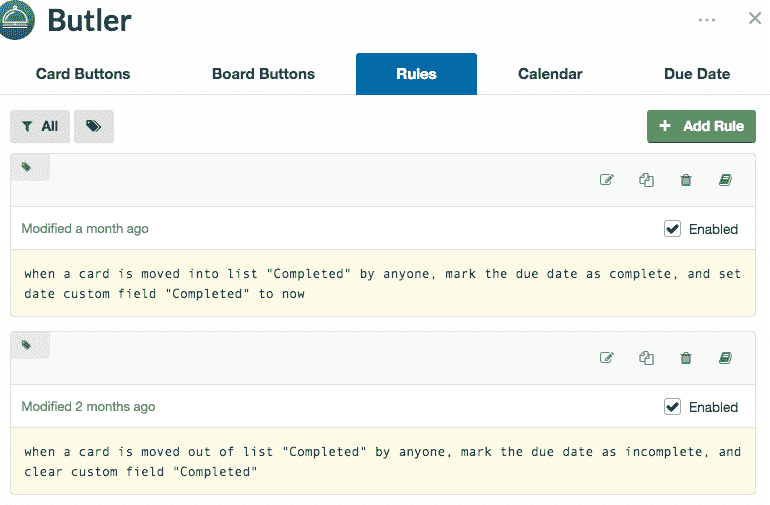

# Trello 工作流程自动化

> 原文:[https://dev . to/epicosity/trello-automations-for-workflow-11gc](https://dev.to/epicosity/trello-automations-for-workflow-11gc)

现在我们开发团队的三分之二至少部分是远程的，我们的项目状态白板有点不太有用，所以我们转向 Trello 来帮助跟踪正在发生的事情。

我们的基本设置有列表:项目/发布日期，积压/等待，每个开发人员的列表，“证明中”，并已完成。但是真正的乐趣来自于一些自动化。

[T2】](https://res.cloudinary.com/practicaldev/image/fetch/s--1TVJKViX--/c_limit%2Cf_auto%2Cfl_progressive%2Cq_auto%2Cw_880/https://cdn-images-1.medium.com/max/770/1%2Ak5NXTVfbZhj9gZ-KF7OMmA.png)

### **加电—自定义字段**

我们使用恰当命名的 power up 设置了几个定制字段。我们用得最多的是“完成日期”。我们经常被问到“嘿，你们这周做了什么？”能够按完成日期过滤有助于快速生成报告。

### **加电—管家**

如果您有能力添加多个电源 ups，我们的下一个选择是 Butler。你可以和巴特勒做很多事情。

**自动完成日期(并删除完成日期)**

如果有人将一张卡移到完成列表中，我们设置的 Butler 规则之一会自动将当前日期添加到自定义字段“完成日期”中。相反，如果该卡从列表中删除，它将删除完成日期。

 

<figcaption>管家任务添加完成日期</figcaption>

 

<figcaption>管家任务移除完成日期</figcaption>

**自动分配卡**

我们设置的第二个自动化功能会在用户被添加到列表中时，自动将用户分配到卡片。如果您设置了通知，当卡片分配给用户时，他们会收到提醒。

 

<figcaption>管家任务分配卡</figcaption>

我们刚刚开始了解 Butler 能为我们的 Trello 工作流做些什么，并期待发现更多有用的自动化功能。

* * *