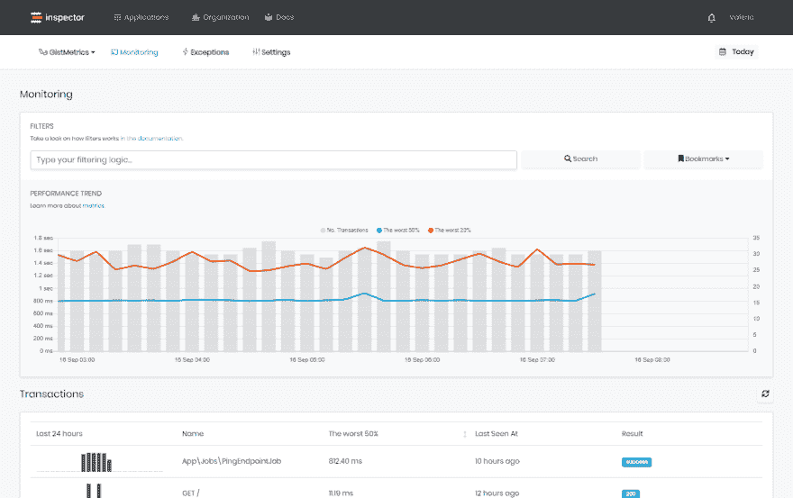
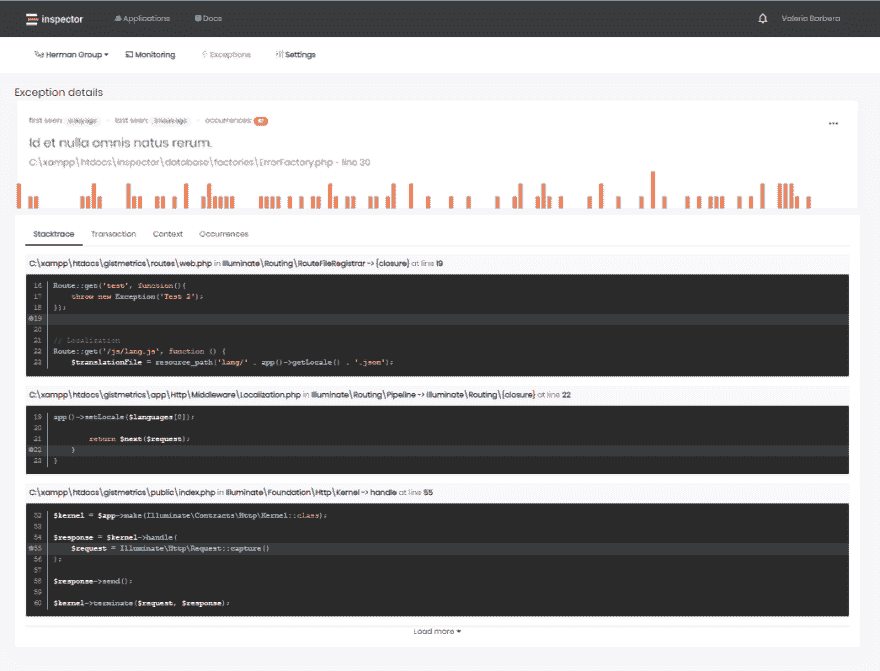

# Laravel 后台作业和命令使用检查器进行监控

> 原文：<https://dev.to/inspector/laravel-background-jobs-commands-monitoring-with-inspector-2mmo>

在这篇文章中，我将向你展示如何打开你的应用程序的黑暗面:“后台作业和预定 Artisan 命令执行”。

Laravel 为排队作业和预定的 cron 任务提供了一个很好的架构。我自己经常使用它们。它们允许我们在经典的 HTTP 请求周期之外，在后台异步执行一些代码。

开发人员通常会担心它们，因为它们的执行与直接的用户交互无关。它们可能会出错几天，除非我们手动检查它们的结果(通常在日志中),否则无法知道。

如果在 HTTP 请求过程中出现问题，就会出现红色气泡或消息，通知用户问题的存在。通过自动化测试，或者自己使用应用程序，在产品中发布软件之前发现相关的错误是非常容易的。

如果一个排队的任务或者一个预定的工匠命令失败了，他会安静的完成，没有人会注意到。

下面这条推文引起了我的注意:

[](https://res.cloudinary.com/practicaldev/image/fetch/s--XBekFoBq--/c_limit%2Cf_auto%2Cfl_progressive%2Cq_auto%2Cw_880/https://miro.medium.com/max/794/1%2AA_aGsKJKY5I9y5KzJOsCdg.png)

我理解这种担忧，并且每天都尽力避免不可预测的错误或瓶颈。

我们制作软件；自动化是我们的基因，但这是一个陷阱。我们总是专注于如何自动化客户的工作，而忘记了我们可以用自己的工作做同样的事情(甚至更好)。

Inspector 是一个 composer 包，用于在 Laravel 应用程序中添加实时监控，它非常容易安装和使用，只需两分钟即可上手。

让我告诉你它是如何工作的。

# 安装检查员

运行下面的命令来安装最新的软件包版本:

```
composer require inspector-apm/inspector-laravel 
```

Enter fullscreen mode Exit fullscreen mode

## 配置 API 键

通过注册检查员[https://app.inspector.dev/register](https://app.inspector.dev/register)并创建一个新的应用程序来获得一个新的 API 密钥，只需要几秒钟。

您将直接在应用程序屏幕中看到安装说明:

[](https://res.cloudinary.com/practicaldev/image/fetch/s--vej0pZXh--/c_limit%2Cf_auto%2Cfl_progressive%2Cq_auto%2Cw_880/https://miro.medium.com/max/1696/1%2AU7b5eckR5d3QnnS8DvY_iA.png)

将 API 密钥放入您的环境文件:

```
INSPECTOR_API_KEY=9a304b04b8XXXXXXXXXXXX1f 
```

Enter fullscreen mode Exit fullscreen mode

## 测试一切正常

执行我们的测试命令，检查您的应用程序是否正确地向检查员发送数据:

```
php artisan inspector:test 
```

Enter fullscreen mode Exit fullscreen mode

前往([https://app . inspector . dev/home)【https://app . inspector . dev/home】](https://app.inspector.dev/home)%5Bhttps://app.inspector.dev/home%5D)浏览您的演示数据。

* * *

默认情况下，检查器将监控所有后台任务:

*   排队作业
*   计划的 Artisan 命令
*   未处理的异常

您还可以在应用程序由于传入的 HTTP 请求而执行时对其进行监控。你可以在官方文档中读到更多关于 HTTP 监控的内容: [HTTP 请求监控](https://app.inspector.dev/docs/3.x/getting-started/installation#requests)

您将立即在项目的仪表板中看到交易流:

[](https://res.cloudinary.com/practicaldev/image/fetch/s--DaayIu_7--/c_limit%2Cf_auto%2Cfl_progressive%2Cq_auto%2Cw_880/https://www.inspector.dev/wp-content/uploads/2019/09/dashboard.png)

对于每个事务，您可以实时监控您的应用程序正在执行什么:

[](https://res.cloudinary.com/practicaldev/image/fetch/s--YCZgxdxZ--/c_limit%2Cf_auto%2Cfl_progressive%2Cq_auto%2Cw_880/https://www.inspector.dev/wp-content/uploads/2019/07/new-timeline.png)

# 添加自定义线段

多亏了 Inspector，您可以将任何想要的东西放入您的时间线中，并获得关于您的工作或 Artisan 命令中代码块执行情况的实时反馈。

假设在您的代码中运行一个外部 http 请求，这个请求默认情况下不在时间轴中。使用检查员门面:

```
$segment = \Inspector::startSegment('http');

$guzzleClient->get('https://www.example.com');

$segment->end(); 
```

Enter fullscreen mode Exit fullscreen mode

这将在时间线中产生一个新段，现在您可以实时了解代码正在执行的内容及其性能:

[](https://res.cloudinary.com/practicaldev/image/fetch/s--xRvtwFJy--/c_limit%2Cf_auto%2Cfl_progressive%2Cq_auto%2Cw_880/https://www.inspector.dev/wp-content/uploads/2019/09/modified-timeline.png)

# 异常预警

默认情况下，Laravel 应用程序中触发的每一个未处理的异常都会被自动报告，以确保您实时收到不可预测错误的警告。

我希望我对代码所做的每一个改变都是完美的。但现实是，情况并非总是如此。一些错误在更新后立即出现，而另一些错误则意外出现。

然而，Inspector 可以自动检测未知问题，尤其是在后台任务中，这种情况更难调查，所以我不再需要连续手动检查我的应用程序的状态，或者直接等待用户的报告。

Inspector 允许你手动报告一个异常，如果你想知道的话:

```
try {
    $segment = Inspector::startSegment('http');
    $guzzleClient->get('https://www.example.com');

} catch (GuzzleException $exception) {
    Inspector::reportException($exception);
} finally {
    $segment->end();
} 
```

Enter fullscreen mode Exit fullscreen mode

如果您的代码出现问题，您将在收件箱中收到实时警告，并且该异常将在所有后续事件中受到监控:

[](https://res.cloudinary.com/practicaldev/image/fetch/s--dHp_NYnS--/c_limit%2Cf_auto%2Cfl_progressive%2Cq_auto%2Cw_880/https://www.inspector.dev/wp-content/uploads/2019/08/error-details.png)

# 结论

当涉及到后台作业或预定命令时，要真正了解正在发生的事情可能需要几个小时，根据我的经验，甚至几天。检查员可以在效率和生产力方面发挥巨大作用。

通过将 bug 发现委托给自动监控工具，可以让您在用户意识到之前，用一半的时间解决 90%的问题。

## 新来的督察？

创建一个专门为软件开发人员设计的监控环境，避免许多开发人员讨厌处理的任何服务器或基础设施配置。

多亏了 Inspector，你再也不需要在服务器级别安装东西，或者在你的云基础设施中进行复杂的配置。

Inspector 使用一个轻量级软件库，您可以像安装任何其他依赖项一样将其安装在您的应用程序中。如果是 Laravel，您可以使用我们的官方 [Laravel 套装](https://inspector.dev/laravel/)。开发人员并不总是乐于在服务器级别安装和配置软件，因为这些安装超出了软件开发生命周期，甚至由外部团队管理。

更多详情请访问我们的网站:[https://inspector.dev/laravel/](https://inspector.dev/laravel/)