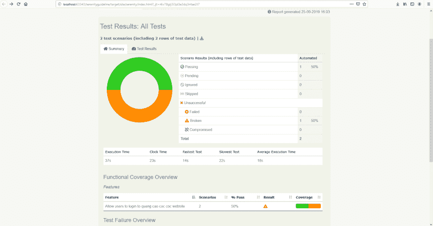
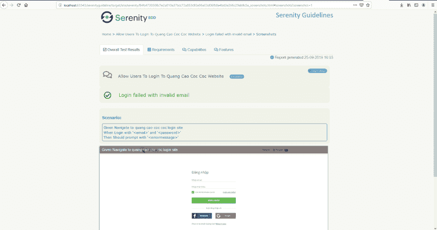

# Serenity 自动化框架——第 2/4 部分——使用 Cucumber 进行 UI 自动化测试

> 原文:[https://dev . to/cuongld 2/serenity-automation-framework-part-2-4-automation-test-with-ui-using-cucumber-3n7b](https://dev.to/cuongld2/serenity-automation-framework-part-2-4-automation-test-with-ui-using-cucumber-3n7b)

嗨，伙计们，我又回来了。

请查看[这篇](https://dev.to/cuongld2/serenity-automation-framework-part-1-4-automation-test-with-api-2mb5)上一篇关于宁静号的帖子。

在其核心，宁静是关于 BDD 的。Serenity 的哲学是让测试像一个实时文档。在这篇博文中，我将和大家分享如何在 Serenity 中用黄瓜和剧本模式实现 UI 测试。

别忘了，如何创建这样漂亮而详细的报告:

[T2】](https://res.cloudinary.com/practicaldev/image/fetch/s---3NssKTB--/c_limit%2Cf_auto%2Cfl_progressive%2Cq_auto%2Cw_880/https://thepracticaldev.s3.amazonaws.com/i/ijd62adcotyj5zt47eur.png)

为什么是黄瓜

Cucumber 是计算机程序员使用的支持行为驱动开发(BDD)的软件工具。Cucumber BDD 方法的核心是它的称为 Gherkin 的普通语言解析器。它允许用客户能够理解的逻辑语言来描述预期的软件行为。

通过使用 cucumber，我们将测试的意图与它将如何实现分开。

像 BA 或 PO 这样的非技术人员可以很容易地从
这样的特征文件中理解我们正在测试的内容

```
 Feature: Allow users to login to quang cao coc coc website

  @Login
  Scenario Outline: Login successfully with email and password
    Given Navigate to quang cao coc coc login site
    When Login with '<email>' and '<password>'
    Then Should navigate to home page site
    Examples:
      |email|password|
      |xxxxxxxxxx|xxxxxxxxxx|

  @Login
  Scenario Outline: Login failed with invalid email
    Given Navigate to quang cao coc coc login site
    When Login with '<email>' and '<password>'
    Then Should prompt with '<errormessage>'
    Examples:
      |email|password|errormessage|
      |a|FernandoTorres12345#|abc@example.com| 
```

<svg width="20px" height="20px" viewBox="0 0 24 24" class="highlight-action crayons-icon highlight-action--fullscreen-on"><title>Enter fullscreen mode</title></svg> <svg width="20px" height="20px" viewBox="0 0 24 24" class="highlight-action crayons-icon highlight-action--fullscreen-off"><title>Exit fullscreen mode</title></svg>

二。履行

我们将使用 Serenity 黄瓜进行机具测试所需的设置。

1.POM 文件

我们的项目需要用到宁静号黄瓜。
所以一定要添加依赖关系:

```
 <!-- https://mvnrepository.com/artifact/net.serenity-bdd/serenity-cucumber -->
        <dependency>
            <groupId>net.serenity-bdd</groupId>
            <artifactId>serenity-cucumber</artifactId>
            <version>1.9.45</version>
        </dependency> 
```

<svg width="20px" height="20px" viewBox="0 0 24 24" class="highlight-action crayons-icon highlight-action--fullscreen-on"><title>Enter fullscreen mode</title></svg> <svg width="20px" height="20px" viewBox="0 0 24 24" class="highlight-action crayons-icon highlight-action--fullscreen-off"><title>Exit fullscreen mode</title></svg>

我们还需要添加一些插件来用 maven
构建 serenity report

```
 <plugins>
            <plugin>
                <groupId>org.apache.maven.plugins</groupId>
                <artifactId>maven-compiler-plugin</artifactId>
                <configuration>
                    <source>8</source>
                    <target>8</target>
                </configuration>
            </plugin>
            <plugin>
                <groupId>org.apache.maven.plugins</groupId>
                <artifactId>maven-compiler-plugin</artifactId>
                <version>3.8.0</version>
            </plugin>
            <plugin>
                <groupId>org.apache.maven.plugins</groupId>
                <artifactId>maven-surefire-plugin</artifactId>
                <version>2.22.0</version>
                <configuration>
                    <testFailureIgnore>true</testFailureIgnore>
                </configuration>
            </plugin>
            <plugin>
                <artifactId>maven-failsafe-plugin</artifactId>
                <version>2.18</version>
                <configuration>
                    <includes>
                        <include>**/features/**/When*.java</include>
                    </includes>
                    <systemProperties>
                        <webdriver.driver>${webdriver.driver}</webdriver.driver>
                    </systemProperties>
                </configuration>
            </plugin>
            <plugin>
                <groupId>net.serenity-bdd.maven.plugins</groupId>
                <artifactId>serenity-maven-plugin</artifactId>
                <version>${serenity.maven.version}</version>
                <executions>
                    <execution>
                        <id>serenity-reports</id>
                        <phase>post-integration-test</phase>
                        <goals>
                            <goal>aggregate</goal>
                        </goals>
                    </execution>
                </executions>
            </plugin>
        </plugins> 
```

<svg width="20px" height="20px" viewBox="0 0 24 24" class="highlight-action crayons-icon highlight-action--fullscreen-on"><title>Enter fullscreen mode</title></svg> <svg width="20px" height="20px" viewBox="0 0 24 24" class="highlight-action crayons-icon highlight-action--fullscreen-off"><title>Exit fullscreen mode</title></svg>

2.Serenity 配置文件

为了设置 serenity 的默认配置，我们可以使用 serenity.conf 文件或 serenity.properties

在本例中，我将向您展示 serenity.conf:

```
 webdriver {
  base.url = "https://cp.qc.coccoc.com/sign-in?lang=vi-VN"
  driver = chrome
}

headless.mode=false
serenity {
  project.name = "Serenity Guidelines"
  tag.failures = "true"
  linked.tags = "issue"
  restart.browser.for.each = scenario
  take.screenshots = AFTER_EACH_STEP
  console.headings = minimal
  browser.maximized = true
}

jira {
  url = "https://jira.tcbs.com.vn"
  project = Auto
  username = username
  password = password
}

drivers {
  windows {
    webdriver.chrome.driver = src/main/resources/webdriver/windows/chromedriver.exe
  }
  mac {
    webdriver.chrome.driver = src/main/resources/chromedriver
  }
  linux {
    webdriver.chrome.driver = src/main/resources/webdriver/linux/chromedriver
  }
} 
```

<svg width="20px" height="20px" viewBox="0 0 24 24" class="highlight-action crayons-icon highlight-action--fullscreen-on"><title>Enter fullscreen mode</title></svg> <svg width="20px" height="20px" viewBox="0 0 24 24" class="highlight-action crayons-icon highlight-action--fullscreen-off"><title>Exit fullscreen mode</title></svg>

我们为每个环境定义了一些常见的东西，比如在哪里存储驱动程序:

```
drivers {
  windows {
    webdriver.chrome.driver = src/main/resources/webdriver/windows/chromedriver.exe
  }
  mac {
    webdriver.chrome.driver = src/main/resources/chromedriver
  }
  linux {
    webdriver.chrome.driver = src/main/resources/webdriver/linux/chromedriver
  }
} 
```

<svg width="20px" height="20px" viewBox="0 0 24 24" class="highlight-action crayons-icon highlight-action--fullscreen-on"><title>Enter fullscreen mode</title></svg> <svg width="20px" height="20px" viewBox="0 0 24 24" class="highlight-action crayons-icon highlight-action--fullscreen-off"><title>Exit fullscreen mode</title></svg>

或者每一步后截图:

```
 serenity {
  take.screenshots = AFTER_EACH_STEP
} 
```

<svg width="20px" height="20px" viewBox="0 0 24 24" class="highlight-action crayons-icon highlight-action--fullscreen-on"><title>Enter fullscreen mode</title></svg> <svg width="20px" height="20px" viewBox="0 0 24 24" class="highlight-action crayons-icon highlight-action--fullscreen-off"><title>Exit fullscreen mode</title></svg>

3.页面对象

一个有经验的自动化测试人员能够以抽象的方式实现测试，以便更好地理解和维护。

为了在 UI 中实现测试的最佳实践，我们应该总是为我们正在交互的 web 页面定义页面对象类。

在这种情况下，网页有很多功能和元素，我们应该根据它所覆盖的特性将页面对象分成多个，以便更好地维护。

例如 qcCocCoc 网站的登录页面:

```
 @DefaultUrl("https://cp.qc.coccoc.com/sign-in?lang=vi-VN")
public class LoginPage extends PageObject {

    @FindBy(name = "email")
    private WebElementFacade emailField;

    @FindBy(name = "password")
    private WebElementFacade passwordField;

    @FindBy(css = "button[data-track_event-action='Login']")
    private WebElementFacade btnLogin;

    @FindBy(xpath = "//form[@method='post'][not(@name)]//div[@class='form-errors clearfix']")
    private WebElementFacade errorMessageElement;

    public void login(String email, String password) {
        waitFor(emailField);
        emailField.sendKeys(email);
        passwordField.sendKeys(password);
        btnLogin.click();
    }

    public String getMessageError(){
        waitFor(errorMessageElement);
        return errorMessageElement.getTextContent();
    }

} 
```

<svg width="20px" height="20px" viewBox="0 0 24 24" class="highlight-action crayons-icon highlight-action--fullscreen-on"><title>Enter fullscreen mode</title></svg> <svg width="20px" height="20px" viewBox="0 0 24 24" class="highlight-action crayons-icon highlight-action--fullscreen-off"><title>Exit fullscreen mode</title></svg>

这里我们定义了如何找到 web 元素，以及我们需要在页面中使用什么方法。

通常，我们应该摆脱 Thread.sleep，并找到更流畅的等待，就像示例中的

```
 public void login(String email, String password) {
        waitFor(emailField);
        emailField.sendKeys(email);
        passwordField.sendKeys(password);
        btnLogin.click();
    } 
```

<svg width="20px" height="20px" viewBox="0 0 24 24" class="highlight-action crayons-icon highlight-action--fullscreen-on"><title>Enter fullscreen mode</title></svg> <svg width="20px" height="20px" viewBox="0 0 24 24" class="highlight-action crayons-icon highlight-action--fullscreen-off"><title>Exit fullscreen mode</title></svg>

在上面的代码中，我们将等待 emailField 出现，然后运行下一个脚本。
如果该字段没有出现，将会发生超时错误。

4.按照 Cucumber:
实现测试首先需要声明特性文件。
特性文件应该位于测试/资源/特性文件夹:

```
 @Login
  Scenario Outline: Login successfully with email and password
    Given Navigate to quang cao coc coc login site
    When Login with '<email>' and '<password>'
    Then Should navigate to home page site
    Examples:
      |email|password|
      |xxxxxxxxxx|xxxxxxxxxx| 
```

<svg width="20px" height="20px" viewBox="0 0 24 24" class="highlight-action crayons-icon highlight-action--fullscreen-on"><title>Enter fullscreen mode</title></svg> <svg width="20px" height="20px" viewBox="0 0 24 24" class="highlight-action crayons-icon highlight-action--fullscreen-off"><title>Exit fullscreen mode</title></svg>

IntelliJ 为我们提供了为每一步自动创建函数的方法
你可以点击每一步并按“Alt + Enter ”,然后按照指南进行操作

我一般把黄瓜测试放在 test/ui/cucumber/QC _ coccococ 中，在 step 包中定义测试:

```
 public class LoginPage extends BaseTest {

    @Steps
    private pages.qcCocCoc.LoginPage loginPage_pageobject;

    @cucumber.api.java.en.Given("^Navigate to quang cao coc coc login site$")
    public void navigateToQuangCaoCocCocLoginSite() {

        loginPage_pageobject.open();

    }

    @When("^Login with '(.*)' and '(.*)'$")
    public void loginWithEmailAndPassword(String email, String password) {

        loginPage_pageobject.login(email,password);

    }

    @Then("^Should navigate to home page site$")
    public void shouldNavigateToHomePageSite() {
        WebDriverWait wait = new WebDriverWait(getDriver(),2);
        wait.until(ExpectedConditions.urlContains("welcome"));
        softAssertImpl.assertAll();

    }

    @Then("^Should prompt with '(.*)'$")
    public void shouldPromptWithErrormessage(String errorMessage) {

        softAssertImpl.assertThat("Verify message error",loginPage_pageobject.getMessageError().contains(errorMessage),true);
        softAssertImpl.assertAll();

    }
} 
```

<svg width="20px" height="20px" viewBox="0 0 24 24" class="highlight-action crayons-icon highlight-action--fullscreen-on"><title>Enter fullscreen mode</title></svg> <svg width="20px" height="20px" viewBox="0 0 24 24" class="highlight-action crayons-icon highlight-action--fullscreen-off"><title>Exit fullscreen mode</title></svg>

这里，我们扩展了 BaseTest，以便使用断言
我们放入特征文件中的电子邮件和密码的值可以通过使用 regex 来获得，如带有'(。*)'和'(。* )'$ ")并为函数定义输入值(字符串 email，字符串 password)

```
 @RunWith(CucumberWithSerenity.class)
@CucumberOptions(features = "src/test/resources/features/qcCocCoc/", tags = { "@Login" }, glue = { "ui.cucumber.qc_coccoc.step" })
public class AcceptanceTest {
} 
```

<svg width="20px" height="20px" viewBox="0 0 24 24" class="highlight-action crayons-icon highlight-action--fullscreen-on"><title>Enter fullscreen mode</title></svg> <svg width="20px" height="20px" viewBox="0 0 24 24" class="highlight-action crayons-icon highlight-action--fullscreen-off"><title>Exit fullscreen mode</title></svg>

我们应该创建 AcceptanceTest 类，以便更灵活地用标签运行测试。
我们需要指定特性文件“src/test/resources/features/qccoccc/”的路径，以及步骤文件“ui . cucumber . QC _ coccococ . step”的路径

5.如何运行测试

*   您可以通过右键单击场景并选择“在 IDE 中运行”,从特性文件中运行测试

*   或者您可以从命令行运行:

mvn 干净验证-Dtest = path _ to _ the _ acceptance test

6.宁静号报告

要创建漂亮的 Serenity 报告，只需运行以下命令行

mvn clean verify-Dtest = path _ to _ the _ acceptance test serenity:aggregate

默认情况下，测试报告将为 index.html，位于 target/site/serenity/index . html 中

摘要报告将如下所示:

[T2】](https://res.cloudinary.com/practicaldev/image/fetch/s--YZgq3kHA--/c_limit%2Cf_auto%2Cfl_progressive%2Cq_auto%2Cw_880/https://thepracticaldev.s3.amazonaws.com/i/zqf694axapezebrhcfm6.PNG)

在测试结果选项卡的每个步骤后进行屏幕截图:

[T2】](https://res.cloudinary.com/practicaldev/image/fetch/s--pJAW3-g5--/c_limit%2Cf_auto%2Cfl_progressive%2Cq_auto%2Cw_880/https://thepracticaldev.s3.amazonaws.com/i/ga7v14qjt2jiyy5mivgt.PNG)

像往常一样，你总是可以从 github 查看源代码: [serenity-guideline](https://github.com/cuongld2/serenityguideline)

耶。今天到此为止。如果你喜欢这篇博文，请留下你的心意或评论。

过几天我会写另一篇关于 UI 测试的剧本模式的文章。
保重~~

注意:如果你觉得这个博客对你有帮助，想表达你的感激之情，请随时访问:

[T2】](https://www.buymeacoffee.com/dOaeSPv)

这将有助于我贡献更多有价值的内容。