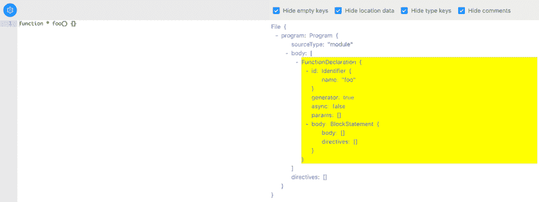
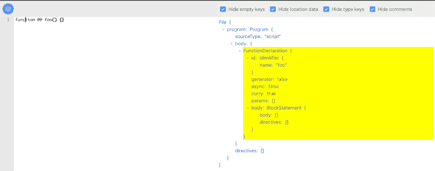
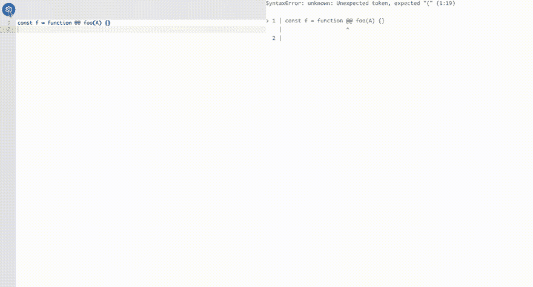

# 用 Babel 创建定制的 JavaScript 语法

> 原文：<https://dev.to/tanhauhau/creating-custom-javascript-syntax-with-babel-3ncj>

继我上一篇关于[编写定制巴别塔转换](https://lihautan.com/step-by-step-guide-for-writing-a-babel-transformation)的文章之后，今天我将向你展示如何用巴别塔创建一个定制的 JavaScript 语法。

## 概述

让我在本文结尾向您展示我们将实现的目标:

```
// '@@' makes the function `foo` curried
function @@ foo(a, b, c) {
  return a + b + c;
}
console.log(foo(1, 2)(3)); // 6 
```

<svg width="20px" height="20px" viewBox="0 0 24 24" class="highlight-action crayons-icon highlight-action--fullscreen-on"><title>Enter fullscreen mode</title></svg> <svg width="20px" height="20px" viewBox="0 0 24 24" class="highlight-action crayons-icon highlight-action--fullscreen-off"><title>Exit fullscreen mode</title></svg>

我们将创建一个[库里函数](https://en.wikipedia.org/wiki/Currying)语法`@@`。语法类似于[生成器函数](https://developer.mozilla.org/en-US/docs/Web/JavaScript/Reference/Statements/function*)，除了在`function`关键字和函数名之间放置`@@`而不是`*`，例如`function @@ name(arg1, arg2)`。

在本例中，您可以使用函数`foo`对[进行局部应用](https://scotch.io/tutorials/javascript-functional-programming-explained-partial-application-and-currying)。调用参数数量少于所需参数的`foo`将返回一个包含剩余参数的新函数:

```
foo(1, 2, 3); // 6

const bar = foo(1, 2); // (n) => 1 + 2 + n
bar(3); // 6 
```

<svg width="20px" height="20px" viewBox="0 0 24 24" class="highlight-action crayons-icon highlight-action--fullscreen-on"><title>Enter fullscreen mode</title></svg> <svg width="20px" height="20px" viewBox="0 0 24 24" class="highlight-action crayons-icon highlight-action--fullscreen-off"><title>Exit fullscreen mode</title></svg>

> 我选择`@@`的原因是变量名中不能有`@`，所以`function@@foo(){}`仍然是一个有效的语法。“操作符”`@`用于[装饰函数](https://medium.com/google-developers/exploring-es7-decorators-76ecb65fb841)，但我想使用全新的东西，因此`@@`。

为了实现这一目标，我们将:

*   分叉巴别塔解析器
*   创建一个自定义的巴别塔转换插件

听起来不可能😨？

别担心，我会指导你每一步。希望在这篇文章结束时，你会成为同龄人中的通天塔大师。🤠

## 分叉通天塔

前往 [babel 的 Github repo](https://github.com/babel/babel) ，点击页面左上角的“Fork”按钮。

[](https://res.cloudinary.com/practicaldev/image/fetch/s--lGY5NJeK--/c_limit%2Cf_auto%2Cfl_progressive%2Cq_auto%2Cw_880/https://lihautan.com/static/cd47851ef23ac57b691450409164108b/7a439/forking.png)

如果这是你第一次分叉一个流行的开源项目，那么恭喜你！🎉

将你的分叉通天塔克隆到你的本地工作区，然后[设置它](https://github.com/tanhauhau/babel/blob/master/CONTRIBUTING.md#setup) :

```
$ git clone https://github.com/tanhauhau/babel.git

# set up
$ cd babel
$ make bootstrap
$ make build 
```

<svg width="20px" height="20px" viewBox="0 0 24 24" class="highlight-action crayons-icon highlight-action--fullscreen-on"><title>Enter fullscreen mode</title></svg> <svg width="20px" height="20px" viewBox="0 0 24 24" class="highlight-action crayons-icon highlight-action--fullscreen-off"><title>Exit fullscreen mode</title></svg>

同时，让我简单地向您介绍一下巴别塔知识库是如何组织的。

Babel 使用 monorepo 结构，所有的包，例如:`@babel/core`、`@babel/parser`、`@babel/plugin-transform-react-jsx`等都在`packages/`文件夹:

```
- doc
- packages
  - babel-core
  - babel-parser
  - babel-plugin-transform-react-jsx
  - ...
- Gulpfile.js
- Makefile
- ... 
```

<svg width="20px" height="20px" viewBox="0 0 24 24" class="highlight-action crayons-icon highlight-action--fullscreen-on"><title>Enter fullscreen mode</title></svg> <svg width="20px" height="20px" viewBox="0 0 24 24" class="highlight-action crayons-icon highlight-action--fullscreen-off"><title>Exit fullscreen mode</title></svg>

> <small>**琐事:** Babel 使用 [Makefile](https://opensource.com/article/18/8/what-how-makefile) 来自动化任务。对于构建任务，比如`make build`，它会使用[大口](https://gulpjs.com)作为任务运行器。</small>

### AST 解析代码速成班

在我们继续之前，如果你对解析器和抽象语法树(AST)不熟悉，我强烈推荐你去看看 [Vaidehi Joshi](https://twitter.com/vaidehijoshi) 的[用 AST 提升你的解析游戏。](https://medium.com/basecs/leveling-up-ones-parsing-game-with-asts-d7a6fc2400ff)

总结一下，这是 babel 解析您的代码时发生的情况:

*   你的代码作为一个`string`是一个很长的字符列表:`f, u, n, c, t, i, o, n, , @, @, f, ...`
*   第一步叫做**记号化**，巴别塔扫描每个角色并创建*记号*，就像`function, @@, foo, (, a, ...`
*   然后，令牌通过一个解析器进行语法分析，在这里，babel 根据 JavaScript 语言规范创建一个 AST。

如果你想更深入地了解一般的编译器，罗伯特·奈斯特伦的《T2》是一个很好的选择。

> 不要被**编译器**这个词吓到，它只不过是解析你的代码并从中生成 XXX。XXX 可能是机器码，这是我们大多数人心目中的编译器；XXX 可以兼容旧浏览器的 JavaScript，Babel 就是这种情况。

## 我们定制的巴别塔解析器

我们将要处理的文件夹是`packages/babel-parser/` :

```
- src/
  - tokenizer/
  - parser/
  - plugins/
    - jsx/
    - typescript/
    - flow/
    - ...
- test/ 
```

<svg width="20px" height="20px" viewBox="0 0 24 24" class="highlight-action crayons-icon highlight-action--fullscreen-on"><title>Enter fullscreen mode</title></svg> <svg width="20px" height="20px" viewBox="0 0 24 24" class="highlight-action crayons-icon highlight-action--fullscreen-off"><title>Exit fullscreen mode</title></svg>

我们已经讨论了*标记化*和*解析*，现在很清楚在哪里可以找到每个进程的代码。`plugins/`文件夹包含扩展基本解析器和添加自定义语法的插件，如`jsx`和`flow`。

我们来做一个[测试驱动开发(TDD)](https://en.wikipedia.org/wiki/Test-driven_development) 。我发现定义测试用例然后慢慢地用我们的方式“修复”它更容易。在不熟悉的代码库中尤其如此，TDD 允许您“容易地”指出需要更改的代码位置。

```
// filename: packages/babel-parser/test/curry-function.js

import { parse } from '../lib';

function getParser(code) {
  return () => parse(code, { sourceType: 'module' });
}

describe('curry function syntax', function() {
  it('should parse', function() {
    expect(getParser(`function @@ foo() {}`)()).toMatchSnapshot();
  });
}); 
```

<svg width="20px" height="20px" viewBox="0 0 24 24" class="highlight-action crayons-icon highlight-action--fullscreen-on"><title>Enter fullscreen mode</title></svg> <svg width="20px" height="20px" viewBox="0 0 24 24" class="highlight-action crayons-icon highlight-action--fullscreen-off"><title>Exit fullscreen mode</title></svg>

您可以运行`TEST_ONLY=babel-parser TEST_GREP="curry function" make test-only`来运行`babel-parser`的测试，并查看您的失败案例:

```
SyntaxError: Unexpected token (1:9)

at Parser.raise (packages/babel-parser/src/parser/location.js:39:63)
at Parser.raise [as unexpected] (packages/babel-parser/src/parser/util.js:133:16)
at Parser.unexpected [as parseIdentifierName] (packages/babel-parser/src/parser/expression.js:2090:18)
at Parser.parseIdentifierName [as parseIdentifier] (packages/babel-parser/src/parser/expression.js:2052:23)
at Parser.parseIdentifier (packages/babel-parser/src/parser/statement.js:1096:52) 
```

<svg width="20px" height="20px" viewBox="0 0 24 24" class="highlight-action crayons-icon highlight-action--fullscreen-on"><title>Enter fullscreen mode</title></svg> <svg width="20px" height="20px" viewBox="0 0 24 24" class="highlight-action crayons-icon highlight-action--fullscreen-off"><title>Exit fullscreen mode</title></svg>

> <small>如果你发现扫描所有的测试用例需要时间，你可以直接调用`jest`来运行测试:</small>
> 
> ```
> BABEL_ENV=test node_modules/.bin/jest -u packages/babel-parser/test/curry-function.js 
> ```

我们的解析器在不应该出现的地方发现了 2 个看似无辜的`@`标记。

我怎么知道？让我们启动手表模式，`make watch`，戴上我们的侦探帽🕵️‍，开始挖掘吧！

追踪栈迹，把我们带到了 [`packages/babel-parser/src/parser/expression.js`](https://github.com/tanhauhau/babel/blob/feat/curry-function/packages/babel-parser/src/parser/expression.js#L2092) 它抛出`this.unexpected()`的地方。

让我们补充一些`console.log` :

```
// filename: packages/babel-parser/src/parser/expression.js
parseIdentifierName(pos: number, liberal?: boolean): string {
  if (this.match(tt.name)) {
    // ...
  } else {
    console.log(this.state.type); // current token
    console.log(this.lookahead().type); // next token
    throw this.unexpected();
  }
} 
```

<svg width="20px" height="20px" viewBox="0 0 24 24" class="highlight-action crayons-icon highlight-action--fullscreen-on"><title>Enter fullscreen mode</title></svg> <svg width="20px" height="20px" viewBox="0 0 24 24" class="highlight-action crayons-icon highlight-action--fullscreen-off"><title>Exit fullscreen mode</title></svg>

如你所见，两个令牌都是`@`令牌:

```
TokenType {
  label: '@',
  // ...
} 
```

<svg width="20px" height="20px" viewBox="0 0 24 24" class="highlight-action crayons-icon highlight-action--fullscreen-on"><title>Enter fullscreen mode</title></svg> <svg width="20px" height="20px" viewBox="0 0 24 24" class="highlight-action crayons-icon highlight-action--fullscreen-off"><title>Exit fullscreen mode</title></svg>

我怎么知道`this.state.type`和`this.lookahead().type`会给我当前和下一个令牌？

嗯，我稍后会解释它们。

在继续之前，让我们回顾一下到目前为止我们所做的工作:

*   我们已经为`babel-parser`编写了一个测试用例
*   我们运行`make test-only`来运行测试用例
*   我们已经通过`make watch`启动了手表模式
*   我们已经了解了解析器的状态，并控制当前的令牌类型，`this.state.type`

我们接下来要做的是:

如果有两个连续的`@`，它不应该是单独的记号，它应该是一个`@@`记号，我们刚刚为 curry 函数定义的新记号

### 新令牌:' @@ '

我们先来看一个令牌类型是在哪里定义的:[packages/babel-parser/src/tokenizer/types . js](https://github.com/tanhauhau/babel/blob/feat/curry-function/packages/babel-parser/src/tokenizer/types.js#L86)。

这里您可以看到一个令牌列表，所以让我们也添加新的令牌定义:

```
// filename: packages/babel-parser/src/tokenizer/types.js

export const types: { [name: string]: TokenType } = {
  // ...
  at: new TokenType('@'),
  // highlight-next-line
  atat: new TokenType('@@'),
}; 
```

<svg width="20px" height="20px" viewBox="0 0 24 24" class="highlight-action crayons-icon highlight-action--fullscreen-on"><title>Enter fullscreen mode</title></svg> <svg width="20px" height="20px" viewBox="0 0 24 24" class="highlight-action crayons-icon highlight-action--fullscreen-off"><title>Exit fullscreen mode</title></svg>

接下来，让我们看看在*令牌化*过程中令牌是在哪里创建的。在`babel-parser/src/tokenizer`中快速搜索`tt.at`,我们会看到[包/巴别解析器/src/tokenizer/index.js](https://github.com/tanhauhau/babel/blob/da0af5fd99a9b747370a2240df3abf2940b9649c/packages/babel-parser/src/tokenizer/index.js#L790)

> <small>嗯，令牌类型在整个 babel-parser 中作为`tt`导入。</small>

如果有另一个`@`接替当前的`@` :
，让我们创建令牌`tt.atat`而不是`tt.at`

```
// filename: packages/babel-parser/src/tokenizer/index.js

getTokenFromCode(code: number): void {
  switch (code) {
    // ...
    case charCodes.atSign:
      // highlight-start
      // if the next character is a `@`
      if (this.input.charCodeAt(this.state.pos + 1) === charCodes.atSign) {
        // create `tt.atat` instead
        this.finishOp(tt.atat, 2);
      } else {
        this.finishOp(tt.at, 1);
      }
      return;
      // highlight-end
    // ...
  }
} 
```

<svg width="20px" height="20px" viewBox="0 0 24 24" class="highlight-action crayons-icon highlight-action--fullscreen-on"><title>Enter fullscreen mode</title></svg> <svg width="20px" height="20px" viewBox="0 0 24 24" class="highlight-action crayons-icon highlight-action--fullscreen-off"><title>Exit fullscreen mode</title></svg>

如果您再次运行测试，您将看到当前令牌和下一个令牌已经改变:

```
// current token
TokenType {
  label: '@@',
  // ...
}

// next token
TokenType {
  label: 'name',
  // ...
} 
```

<svg width="20px" height="20px" viewBox="0 0 24 24" class="highlight-action crayons-icon highlight-action--fullscreen-on"><title>Enter fullscreen mode</title></svg> <svg width="20px" height="20px" viewBox="0 0 24 24" class="highlight-action crayons-icon highlight-action--fullscreen-off"><title>Exit fullscreen mode</title></svg>

耶！看起来不错，让我们继续。🏃‍

### 新的解析器

在我们继续之前，让我们检查一下[生成器函数在 AST](https://lihautan.com/babel-ast-explorer/#?eyJiYWJlbFNldHRpbmdzIjp7InZlcnNpb24iOiI3LjYuMCJ9LCJ0cmVlU2V0dGluZ3MiOnsiaGlkZUVtcHR5Ijp0cnVlLCJoaWRlTG9jYXRpb24iOnRydWUsImhpZGVUeXBlIjp0cnVlfSwiY29kZSI6ImZ1bmN0aW9uICogZm9vKCkge30ifQ==) 中是如何表示的:

[](https://res.cloudinary.com/practicaldev/image/fetch/s--19H-Gd64--/c_limit%2Cf_auto%2Cfl_progressive%2Cq_auto%2Cw_880/https://lihautan.com/static/e9bdfdb9e282f45dd98dc10595532005/7a439/generator-function.png)

如您所见，生成器函数由一个`FunctionDeclaration`的`generator: true`属性表示。

类似地，如果它是一个 curry 函数，我们也可以添加一个`FunctionDeclaration`的`curry: true`属性:

[](https://res.cloudinary.com/practicaldev/image/fetch/s--mcvoEBO7--/c_limit%2Cf_auto%2Cfl_progressive%2Cq_auto%2Cw_880/https://lihautan.com/static/36268014310215f5bf3a152a93983052/bb144/curry-function.png)

我们现在有一个计划，让我们实施它。

在 *"FunctionDeclaration"* 上快速搜索会将我们带到[packages/babel-parser/src/parser/statement . js](https://github.com/tanhauhau/babel/blob/da0af5fd99a9b747370a2240df3abf2940b9649c/packages/babel-parser/src/parser/statement.js#L1030)中一个名为`parseFunction`的函数，在这里我们找到一行设置了`generator`属性的代码，让我们再添加一行:

```
// filename: packages/babel-parser/src/parser/statement.js

export default class StatementParser extends ExpressionParser {
  // ...
  parseFunction<T: N.NormalFunction>(
    node: T,
    statement?: number = FUNC_NO_FLAGS,
    isAsync?: boolean = false
  ): T {
    // ...
    node.generator = this.eat(tt.star);
    // highlight-next-line
    node.curry = this.eat(tt.atat);
  }
} 
```

<svg width="20px" height="20px" viewBox="0 0 24 24" class="highlight-action crayons-icon highlight-action--fullscreen-on"><title>Enter fullscreen mode</title></svg> <svg width="20px" height="20px" viewBox="0 0 24 24" class="highlight-action crayons-icon highlight-action--fullscreen-off"><title>Exit fullscreen mode</title></svg>

如果你再次运行测试，你会惊奇地发现它竟然通过了！

```
 PASS  packages/babel-parser/test/curry-function.js
  curry function syntax
    ✓ should parse (12ms) 
```

<svg width="20px" height="20px" viewBox="0 0 24 24" class="highlight-action crayons-icon highlight-action--fullscreen-on"><title>Enter fullscreen mode</title></svg> <svg width="20px" height="20px" viewBox="0 0 24 24" class="highlight-action crayons-icon highlight-action--fullscreen-off"><title>Exit fullscreen mode</title></svg>

就这样？我们是如何奇迹般地修复它的？

我将简要地解释解析是如何工作的，在这个过程中，希望您能理解这一行代码的变化。

### 解析如何工作

有了来自*标记器*的标记列表，解析器一个接一个地使用标记并构建 AST。解析器使用语言语法规范来决定如何使用标记，接下来应该使用哪个标记。

语法规范看起来像这样:

```
...
ExponentiationExpression -> UnaryExpression
                            UpdateExpression ** ExponentiationExpression
MultiplicativeExpression -> ExponentiationExpression
                            MultiplicativeExpression ("*" or "/" or "%") ExponentiationExpression
AdditiveExpression       -> MultiplicativeExpression
                            AdditiveExpression + MultiplicativeExpression
                            AdditiveExpression - MultiplicativeExpression
... 
```

<svg width="20px" height="20px" viewBox="0 0 24 24" class="highlight-action crayons-icon highlight-action--fullscreen-on"><title>Enter fullscreen mode</title></svg> <svg width="20px" height="20px" viewBox="0 0 24 24" class="highlight-action crayons-icon highlight-action--fullscreen-off"><title>Exit fullscreen mode</title></svg>

它解释了每个表达式/语句的优先级。例如，`AdditiveExpression`由以下两者之一组成:

*   一个`MultiplicativeExpression`，或者
*   一个`AdditiveExpression`后跟`+`操作符标记，后跟`MultiplicativeExpression`，或者
*   一个`AdditiveExpression`，后面跟着`-`，后面跟着`MultiplicativeExpression`。

所以如果你有一个表达式`1 + 2 * 3`，它会像:

```
(AdditiveExpression "+" 1 (MultiplicativeExpression "*" 2 3)) 
```

<svg width="20px" height="20px" viewBox="0 0 24 24" class="highlight-action crayons-icon highlight-action--fullscreen-on"><title>Enter fullscreen mode</title></svg> <svg width="20px" height="20px" viewBox="0 0 24 24" class="highlight-action crayons-icon highlight-action--fullscreen-off"><title>Exit fullscreen mode</title></svg>

而不是

```
(MultiplicativeExpression "*" (AdditiveExpression "+" 1 2) 3) 
```

<svg width="20px" height="20px" viewBox="0 0 24 24" class="highlight-action crayons-icon highlight-action--fullscreen-on"><title>Enter fullscreen mode</title></svg> <svg width="20px" height="20px" viewBox="0 0 24 24" class="highlight-action crayons-icon highlight-action--fullscreen-off"><title>Exit fullscreen mode</title></svg>

有了这些规则，我们将它们翻译成解析器代码:

```
class Parser {
  // ...
  parseAdditiveExpression() {
    const left = this.parseMultiplicativeExpression();
    // if the current token is `+` or `-`
    if (this.match(tt.plus) || this.match(tt.minus)) {
      const operator = this.state.type;
      // move on to the next token
      this.nextToken();
      const right = this.parseMultiplicativeExpression();

      // create the node
      this.finishNode(
        {
          operator,
          left,
          right,
        },
        'BinaryExpression'
      );
    } else {
      // return as MultiplicativeExpression
      return left;
    }
  }
} 
```

<svg width="20px" height="20px" viewBox="0 0 24 24" class="highlight-action crayons-icon highlight-action--fullscreen-on"><title>Enter fullscreen mode</title></svg> <svg width="20px" height="20px" viewBox="0 0 24 24" class="highlight-action crayons-icon highlight-action--fullscreen-off"><title>Exit fullscreen mode</title></svg>

这是一段虚构的代码，过分简化了巴别塔所拥有的东西，但我希望你能理解它的要点。

正如您在这里看到的，解析器本质上是递归的，它从最低优先级到最高优先级的表达式/语句。例如:`parseAdditiveExpression`调用`parseMultiplicativeExpression`，T1 又调用`parseExponentiationExpression`，T1 又调用...。这个递归过程被称为[递归下降解析](https://craftinginterpreters.com/parsing-expressions.html#recursive-descent-parsing)。

#### 这.吃，这.配，这.下

如果你已经注意到，在我上面的例子中，我使用了一些效用函数，如`this.eat`、`this.match`、`this.next`等。这些是 babel parser 的内部函数，但是它们在解析器中也非常普遍:

*   **`this.match`** 返回一个`boolean`表示当前令牌是否符合条件
*   **`this.next`** 向前移动令牌列表，指向下一个令牌
*   **`this.eat`** 返回`this.match`返回的内容，如果`this.match`返回`true`，将执行`this.next`
    *   `this.eat`通常用于可选操作符，如生成器函数中的`*`、语句末尾的`;`和类型脚本类型中的`?`。
*   **`this.lookahead`** 获得下一个令牌而不前进到当前节点做出决定

如果您再看一下我们刚刚更改的解析器代码，现在更容易理解了。

```
// filename: packages/babel-parser/src/parser/statement.js

export default class StatementParser extends ExpressionParser {
  parseStatementContent(/* ...*/) {
    // ...
    // NOTE: we call match to check the current token
    if (this.match(tt._function)) {
      this.next();
      // NOTE: function statement has a higher precendence than a generic statement
      this.parseFunction();
    }
  }
  // ...
  parseFunction(/* ... */) {
    // NOTE: we call eat to check whether the optional token exists
    node.generator = this.eat(tt.star);
    // highlight-next-line
    node.curry = this.eat(tt.atat);
    node.id = this.parseFunctionId();
  }
} 
```

<svg width="20px" height="20px" viewBox="0 0 24 24" class="highlight-action crayons-icon highlight-action--fullscreen-on"><title>Enter fullscreen mode</title></svg> <svg width="20px" height="20px" viewBox="0 0 24 24" class="highlight-action crayons-icon highlight-action--fullscreen-off"><title>Exit fullscreen mode</title></svg>

我知道我没有很好地解释解析器是如何工作的。以下是我从中学到的一些资源，我强烈推荐它们:

*   [制作口译员](https://craftinginterpreters.com/introduction.html)作者[罗伯特·尼斯特罗姆](https://twitter.com/munificentbob?lang=en)
*   佐治亚理工学院提供的免费 Udacity 课程:“编译器:理论与实践”

* * *

**附注**:您可能会好奇我是如何在 Babel AST Explorer 中可视化自定义语法的，我在那里向您展示了 AST 中新的“curry”属性。

这是因为我在 Babel AST Explorer 中添加了一个新功能，您可以上传您的自定义解析器！

如果您转到`packages/babel-parser/lib`，您会找到您的解析器的编译版本和源地图。打开 Babel AST Explorer 的抽屉，您会看到一个上传自定义解析器的按钮。拖动`packages/babel-parser/lib/index.js`,您将看到通过自定义解析器生成的 AST！

[](https://res.cloudinary.com/practicaldev/image/fetch/s--VrJG0R-H--/c_limit%2Cf_auto%2Cfl_progressive%2Cq_66%2Cw_880/https://lihautan.com/custom-parser-9655bf2b7ba72e0c61e31a63a29e3f22.gif)

* * *

## 我们的巴别塔插件

自定义的巴别塔解析器完成后，让我们继续编写我们的巴别塔插件。

但是在此之前，你可能会对我们如何使用自定义的 babel 解析器有一些疑问，特别是对于我们现在正在使用的构建栈？

别担心。一个巴别塔插件可以提供一个定制的解析器，这在巴别塔网站
上[有记载](https://babeljs.io/docs/en/babel-parser#will-the-babel-parser-support-a-plugin-system)

```
// filename: babel-plugin-transformation-curry-function.js
import customParser from './custom-parser';

export default function ourBabelPlugin() {
  return {
    parserOverride(code, opts) {
      return customParser.parse(code, opts);
    },
  };
} 
```

<svg width="20px" height="20px" viewBox="0 0 24 24" class="highlight-action crayons-icon highlight-action--fullscreen-on"><title>Enter fullscreen mode</title></svg> <svg width="20px" height="20px" viewBox="0 0 24 24" class="highlight-action crayons-icon highlight-action--fullscreen-off"><title>Exit fullscreen mode</title></svg>

自从我们推出了巴别塔解析器，所有现有的巴别塔解析器选项或内置插件仍然可以完美工作。

有了这个疑问，让我们看看如何使我们的 curry 函数可流通？*(不完全确定有没有这个词)*

* * *

在我们开始之前，如果你急切地想把我们的插件添加到你的构建系统中，你会注意到 curry 函数被编译成了一个普通的函数。

这是因为解析+转换之后，babel 会使用 [@babel/generator](https://babeljs.io/docs/en/babel-generator) 从转换后的 AST 生成代码。因为`@babel/generator`不知道我们添加的新的`curry`属性，所以它将被省略。

> 如果有一天 curry 函数成为了新的 JavaScript 语法，你可能会想做一个 pull 请求在这里多加一行[！](https://github.com/tanhauhau/babel/blob/da0af5fd99a9b747370a2240df3abf2940b9649c/packages/babel-generator/src/generators/methods.js#L82)

* * *

好，为了使我们的函数可处理，我们可以用一个`currying`辅助高阶函数:
来包装它

```
function currying(fn) {
  const numParamsRequired = fn.length;
  function curryFactory(params) {
    return function (...args) {
      const newParams = params.concat(args);
      if (newParams.length >= numParamsRequired) {
        return fn(...newParams);
      }
      return curryFactory(newParams);
    }
  }
  return curryFactory([]);
} 
```

<svg width="20px" height="20px" viewBox="0 0 24 24" class="highlight-action crayons-icon highlight-action--fullscreen-on"><title>Enter fullscreen mode</title></svg> <svg width="20px" height="20px" viewBox="0 0 24 24" class="highlight-action crayons-icon highlight-action--fullscreen-off"><title>Exit fullscreen mode</title></svg>

> 如果你想学习如何写一个 curry 函数，你可以阅读由 [Shirsh Zibbu](https://twitter.com/zhirzh) 撰写的 JS 中的这篇[curry](https://hackernoon.com/currying-in-js-d9ddc64f162e)

所以当我们变换我们的 curry 函数时，我们可以把它变换成如下:

```
// from
function @@ foo(a, b, c) {
  return a + b + c;
}

// to
const foo = currying(function foo(a, b, c) {
  return a + b + c;
}) 
```

<svg width="20px" height="20px" viewBox="0 0 24 24" class="highlight-action crayons-icon highlight-action--fullscreen-on"><title>Enter fullscreen mode</title></svg> <svg width="20px" height="20px" viewBox="0 0 24 24" class="highlight-action crayons-icon highlight-action--fullscreen-off"><title>Exit fullscreen mode</title></svg>

> 我们先忽略 JavaScript 中的[函数提升](https://scotch.io/tutorials/understanding-hoisting-in-javascript)，在定义之前可以调用`foo`。

如果你读过我的关于巴别塔转换的分步指南，那么编写这个转换应该是可以管理的:

```
// filename: babel-plugin-transformation-curry-function.js
export default function ourBabelPlugin() {
  return {
    // ...
    // highlight-start
    visitor: {
      FunctionDeclaration(path) {
        if (path.get('curry').node) {
          // const foo = curry(function () { ... });
          path.node.curry = false;
          path.replaceWith(
            t.variableDeclaration('const', [
              t.variableDeclarator(
                t.identifier(path.get('id.name').node),
                t.callExpression(t.identifier('currying'), [
                  t.toExpression(path.node),
                ])
              ),
            ])
          );
        }
      },
    },
    // highlight-end
  };
} 
```

<svg width="20px" height="20px" viewBox="0 0 24 24" class="highlight-action crayons-icon highlight-action--fullscreen-on"><title>Enter fullscreen mode</title></svg> <svg width="20px" height="20px" viewBox="0 0 24 24" class="highlight-action crayons-icon highlight-action--fullscreen-off"><title>Exit fullscreen mode</title></svg>

问题是我们如何提供`currying`函数？

有两种方法:

### 1。假设`currying`已经在全局范围内声明。

基本上，你的工作已经完成了。

如果`currying`没有定义，那么在执行编译好的代码时，运行时会喊出*“currying is not defined”*，就像[“regenerator runtime is not defined”](https://www.google.com/search?q=regeneratorRuntime+is+not+defined)一样。

因此，你可能必须教育用户安装`currying` polyfills，以便使用你的`babel-plugin-transformation-curry-function`。

### 2。使用`@babel/helpers`

你可以给`@babel/helpers`添加一个新的助手，当然你不可能把它合并到正式的`@babel/helpers`中，所以你必须想办法让`@babel/core`解析为你的`@babel/helpers` :

```
// filename: package.json
{
  "resolutions": {
    "@babel/helpers": "7.6.0--your-custom-forked-version",
  }
} 
```

<svg width="20px" height="20px" viewBox="0 0 24 24" class="highlight-action crayons-icon highlight-action--fullscreen-on"><title>Enter fullscreen mode</title></svg> <svg width="20px" height="20px" viewBox="0 0 24 24" class="highlight-action crayons-icon highlight-action--fullscreen-off"><title>Exit fullscreen mode</title></svg>

***免责声明:**我没有亲自尝试过，但我相信它会工作。如果你在尝试这个的时候遇到了问题， [DM 我](https://twitter.com/lihautan)，我很乐意与你讨论。*

在`@babel/helpers`中添加一个新的助手函数非常容易。

转到[packages/babel-helpers/src/helpers . js](https://github.com/tanhauhau/babel/blob/feat/curry-function/packages/babel-helpers/src/helpers.js)并添加一个新条目:

```
helpers.currying = helper("7.6.0")`
  export default function currying(fn) {
    const numParamsRequired = fn.length;
    function curryFactory(params) {
      return function (...args) {
        const newParams = params.concat(args);
        if (newParams.length >= numParamsRequired) {
          return fn(...newParams);
        }
        return curryFactory(newParams);
      }
    }
    return curryFactory([]);
  }
`; 
```

<svg width="20px" height="20px" viewBox="0 0 24 24" class="highlight-action crayons-icon highlight-action--fullscreen-on"><title>Enter fullscreen mode</title></svg> <svg width="20px" height="20px" viewBox="0 0 24 24" class="highlight-action crayons-icon highlight-action--fullscreen-off"><title>Exit fullscreen mode</title></svg>

助手标签函数指定所需的`@babel/core`版本。这里的诀窍是将`currying`函数`export default`。

要使用助手，只需调用`this.addHelper()` :

```
// ...
path.replaceWith(
  t.variableDeclaration('const', [
    t.variableDeclarator(
      t.identifier(path.get('id.name').node),
      t.callExpression(this.addHelper("currying"), [
        t.toExpression(path.node),
      ])
    ),
  ])
); 
```

<svg width="20px" height="20px" viewBox="0 0 24 24" class="highlight-action crayons-icon highlight-action--fullscreen-on"><title>Enter fullscreen mode</title></svg> <svg width="20px" height="20px" viewBox="0 0 24 24" class="highlight-action crayons-icon highlight-action--fullscreen-off"><title>Exit fullscreen mode</title></svg>

如果需要的话,`this.addHelper`将在文件的顶部注入助手，并向注入的函数返回一个`Identifier`。

## 关闭注释

我们已经看到了如何修改巴别塔解析器函数，编写我们自己的巴别塔转换插件*(之所以简短，主要是因为我在之前的文章*中已经详细介绍了[，简要介绍了`@babel/generator`，以及我们如何通过`@babel/helpers`添加助手函数。](https://lihautan.com/step-by-step-guide-for-writing-a-babel-transformation)

一路上，我们上了一堂关于解析器如何工作的速成课，我会在底部提供[进一步阅读](#further-reading)的链接。

我们上面经历的步骤类似于定义新的 JavaScript 规范时的部分 [TC39 提案](https://github.com/tc39/proposals) [过程](https://tc39.es/process-document/)。当提出一个新的规范时，提案的支持者通常会编写多份文件或撰写概念验证演示。正如您所看到的，派生一个解析器或编写 polyfills 并不是这个过程中最难的部分，而是定义问题空间、计划和思考用例以及收集来自社区的意见和建议。为此，我要感谢提案倡导者，感谢他们努力推动 JavaScript 语言向前发展。

最后，如果你想完整地看到我们到目前为止所做的代码，你可以从 Github 查看。

* * *

## 编者按

我已经在巴别塔库上工作了一段时间，但是我以前从未给巴别塔解析器添加过新的语法。我的大部分贡献只是修复 bug 和规范遵从特性。

然而，创建一种新语法的想法已经在我的脑海中出现了一段时间。所以我抓住机会写了一篇博客来尝试一下。看到它像预期的那样工作是一种令人兴奋的体验。

有能力操纵你正在写的语言的语法是令人振奋的。它使我们有可能编写更少的代码或更简单的代码，并将复杂性转移到编译时。正如`async-await`如何解决回调地狱和承诺链地狱。

如果这篇文章启发了你一些伟大的想法，并且你希望与某人讨论它，你总是非常欢迎通过 [Twitter](https://twitter.com/lihautan) 与我联系。

## 进一步阅读

关于编译器:

*   [制作口译员](https://craftinginterpreters.com/introduction.html)作者[罗伯特·尼斯特罗姆](https://twitter.com/munificentbob?lang=en)
*   佐治亚理工学院提供的免费 Udacity 课程:“编译器:理论与实践”
*   [通过](https://medium.com/basecs/leveling-up-ones-parsing-game-with-asts-d7a6fc2400ff) [Vaidehi Joshi](https://twitter.com/vaidehijoshi) 的 ASTs 提升自己的解析游戏

杂项:

*   [理解 JavaScript 中的吊装](https://scotch.io/tutorials/understanding-hoisting-in-javascript)作者[马比斯·瓦基奥](https://twitter.com/emabishi)
*   [被](https://hackernoon.com/currying-in-js-d9ddc64f162e) [Shirsh Zibbu](https://twitter.com/zhirzh) 在 JS 里谄媚
*   [TC39 提案](https://github.com/tc39/proposals)
*   [TC39 工艺文件](https://tc39.es/process-document/)

* * *

如果你喜欢这篇文章，并希望阅读更多类似的文章，请在 Twitter 上关注我