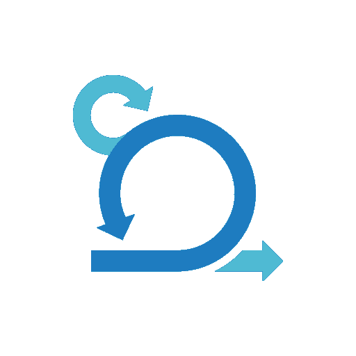

# Scrum 清单

> 原文:[https://dev.to/jmir17/the-scrum-checklist-24j9](https://dev.to/jmir17/the-scrum-checklist-24j9)

# Scrum 清单

Scrum:是一个使用增量迭代管理复杂适应性问题的敏捷框架。

[T2】](https://res.cloudinary.com/practicaldev/image/fetch/s--E1CkF9o1--/c_limit%2Cf_auto%2Cfl_progressive%2Cq_auto%2Cw_880/https://thepracticaldev.s3.amazonaws.com/i/ssr57rvag7ona3z9d68h.png)

这个清单是基于 Scrum 指南的，它检查角色、事件、工件和规则是否正确，是否正常工作。只要我们人类倾向于忘记事情是如何工作的，并且拒绝遵循困难的规则，我决定在一个列表中写下 scrum 框架的关键点。该列表存放在一个公共的 github 库中，因为接受贡献是非常受欢迎的。

## 列表:

#### Scrum 理论

*   [ ]每个人都知道 Scrum 是一个渐进的迭代过程。
*   [ ]这个过程必须对 scrum 用户可见和透明，这样每个人都有一个共同的理解。
*   [ ] Scrum 用户检查 Scrum 工件来发现不希望的差异。
*   [ ]在结果不可接受之前，对工艺或材料进行调整。

#### Scrum 值

Scrum 团队成员认同这些价值观:

*   [ ]承诺，实现团队目标。
*   [ ]勇气，做正确的事情，解决棘手的问题。
*   [ ]专注于冲刺目标。
*   [ ]开放性，关于执行工作的挑战。
*   [ ]尊重对方是有能力有主见的人。

#### Scrum 团队

*   [ ] Scrum 团队是自组织的，选择如何最好地完成他们的工作。
*   [ ] Scrum 团队是跨职能的，拥有完成工作所需的所有能力。

    ##### 产品负责人

    *   [ ]通过开发团队的工作最大化产品的价值。
    *   [ ]产品所有者的决策是可见的。
    *   [ ]产品所有者的决策受到整个组织的尊重。
    *   [ ]只有产品所有者管理产品积压，并且:
        *   [ ]清楚地表达了产品待办事项。
        *   [ ]确保产品积压对所有人都可见、透明和清晰。
        *   [ ]确保开发团队了解产品待办事项。
        *   [ ]订购产品积压项目，以最好地实现业务目标。
        *   [ ]优化开发团队工作的价值。
        *   [ ]向 scrum 团队展示下一步的工作。

    ##### 开发团队

    *   [ ]增量和迭代地工作。
    *   [ ]团队结构合理，能够自我组织他们自己的工作。
    *   [ ]没有人告诉(甚至 scrum master)如何发布功能。
    *   [ ]除了产品负责人之外，没有人会告诉实现哪些需求。
    *   [ ]团队是跨职能的，能够交付任何产品增量。
    *   [ ]开发团队成员没有头衔，不管他们做什么。
    *   [ ]没有子团队，例如:测试、架构、设计，...
    *   [ ]认可属于整个团队。
    *   [ ]团队规模在 3 到 9 人之间。

    ##### Scrum 大师

    *   [ ]促进和支持 scrum 过程。
    *   [ ]增强了 scrum 工件的透明度。
    *   [ ]帮助每个人理解 Scrum 理论、实践、规则和价值观。
    *   [ ]是 scrum 团队的仆人领导。
    *   [ ]有助于改变与 scrum 团队的互动以及团队内部的互动，从而最大化所创造的价值。

        帮助产品所有者:

        *   [ ]确保每个人都理解目标、范围和领域。
        *   [ ]找到有效维护产品积压的技术。
        *   [ ]创建清晰简洁的产品待办事项。
        *   [ ]安排产品积压以实现价值最大化
        *   [ ]理解并实践敏捷性。
        *   [ ]根据要求或需要促进 scrum 活动。

        帮助开发团队:

        *   [ ]自组织中的蔻驰。
        *   [ ]跨职能部门的蔻驰。
        *   [ ]创造高价值产品。
        *   [ ]删除进度阻止程序。
        *   [ ]在其他没有完全采用或理解 scrum 的组织环境中的蔻驰。
        *   [ ]根据要求或需要促进 scrum 活动。

        帮助组织:

        *   [ ]领导和指导 scrum 的采用。
        *   [ ]规划组织内的 scrum 实现。
        *   [ ]与其他 scrum 大师合作，提高 scrum 效率。

#### Scrum 事件

*   [ ]所有活动都有时间限制。
*   [ ]冲刺开始时时间必须固定，不能缩短或加长。
*   [ ]事件是透明的，可以被检查，可以被调整。

    ##### 冲刺

    *   【】时长 2 到 4 周。
    *   [ ]具有一致的持续时间。
    *   [ ]新的冲刺在前一次结束后立即开始。
    *   [ ]冲刺目标总是设定好的。
    *   [ ]质量目标不会随着时间的推移而降低。
    *   [ ]只有产品负责人有权取消 sprint，而且只有在 sprint 目标过时时。

    ##### 冲刺规划

    *   [ ]最长持续时间为 8 小时，相当于 1 个月的冲刺。
    *   [ ]由整个 scrum 团队创建。
    *   [ ]产品负责人必须设定一个冲刺目标。
    *   [ ]为 sprint backlog 选择的产品 Backlog 项目的数量完全取决于开发团队。
    *   [ ]第一天计划的工作在会议结束时分解。

    ##### Scrum 每日

    *   [ ]持续时间为 15 分钟。
    *   [ ]每天都举行。
    *   [ ]计划接下来 24 小时的工作。
    *   [ ]回答 3 个问题，不是关于项目或工作，而是关于冲刺目标。
    *   [ ]详细的讨论、调整和重新规划不在本次会议范围内。
    *   scrum master 确保会议的进行。
    *   [ ]开发团队主持会议。

    ##### 冲刺回顾

    *   [ ]对于 1 个月的冲刺或同等情况，它最多持续 4 小时。
    *   [ ]产品负责人审查哪些已经“完成”,哪些还没有“完成”。
    *   [ ]讨论哪些进展顺利，出现了哪些问题以及如何解决。
    *   scrum 团队回顾下一步该做什么，计划，产品，时间表，预算，...
    *   [ ]对产品积压进行评审。

    ##### 冲刺回顾

    *   [ ]它在 1 个月的冲刺中最多可持续 3 小时或同等时间。
    *   [ ]它发生在冲刺评审之后和冲刺规划之前。
    *   [ ]会议积极而富有成效。
    *   [ ]检查人员、关系、流程和工具。
    *   [ ]制定一个计划来改进 scrum 团队的工作方式。
    *   [ ]如果需要，质量标准和“完成”的定义将在此会议中进行调整。
    *   [ ]输出应该是改进计划。

#### Scrum 工件

*   [ ]最大限度地提高关键信息的透明度。

##### 产品积压

*   [ ]产品所有者对其内容、可用性和订购负责。
*   [ ]产品积压从未完成。它随着产品的发展而发展。
*   [ ]产品待办事项有描述、顺序、估计和价值。
*   [ ]产品积压优化(添加细节、评估和订购)迭代进行。
*   [ ]顶部的项目必须清晰，并符合就绪的定义。

##### 冲刺积压

*   [ ]使所有工作可见，以实现 sprint 目标。
*   [ ]必须在之前的 sprint 回顾中确定至少一个改进计划。
*   [ ]只有开发团队管理 sprint backlog。
*   [ ]它必须代表已完成和剩余工作的实时情况。
*   [ ]所有项目必须符合“完成”的定义，才能被视为完成。

这里列出的项目没有一个是基于我的经验或直觉，我想创建这个列表是因为很长一段时间我没有像它应该的那样应用 scrum，我大部分时间都在使用“常识”。如果你也是这种情况，我向你推荐这篇文章:[我们尝试了棒球，但没有成功](https://ronjeffries.com/xprog/articles/jatbaseball/)