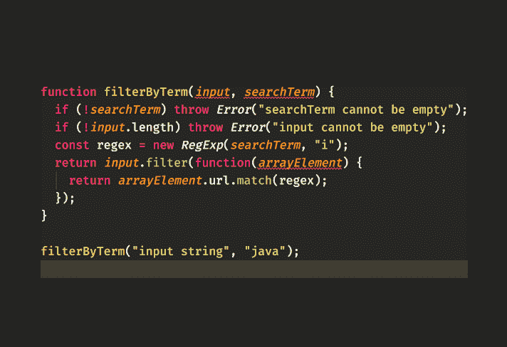

# 面向初学者的 TypeScript 教程:缺失的指南-第 1 部分

> 原文：<https://dev.to/valentinogagliardi/typescript-tutorial-for-beginners-the-missing-guide-part-1-52hj>

**刚刚越过 dev.to 上的 5k follower！谢谢大家！多么神奇的社区啊！谁也在推特上？下面连线= > [我在这里](https://twitter.com/gagliardi_vale)** 。

什么是 TypeScript，为什么您可能想使用它？通过这篇面向初学者的 TypeScript 教程了解更多信息，并开始向您的 JavaScript 代码添加类型！

*原载于[valentinog.com/blog](https://www.valentinog.com/blog/typescript/)T3】*

## 本集:

*   什么是 TypeScript，它为什么存在？
*   使用 TypeScript 的第一步
*   潜入类型脚本类型

## 初学者打字教程:这本指南是给谁的

下面的指南是为有兴趣了解更多关于 TypeScript 的 JavaScript 开发人员准备的 **TypeScript 教程。这意味着**对“普通”JavaScript 的适当了解是受欢迎的**，尽管在我们进行的过程中我会给你一些基本的提示。**

如果你想在本教程之前或之后更新你的 JavaScript 技能，看看我的“JavaScript 小书”，可以在 Github 上免费获得[，也可以作为](https://github.com/valentinogagliardi/Little-JavaScript-Book) [PDF/ePub/Mobi](https://www.valentinog.com/little-javascript) 获得。

TypeScript 和“初学者”这两个词属于同一个教程吗？在写这个指南之前我并不确定，但是每天我都看到很多初学者对打字感兴趣。如果您决定这样做，请注意在早期与 JavaScript 一起学习 TypeScript 会很困难。但从长远来看会有回报的。继续前进！如果这是你的情况，欢迎你继续阅读。

在开始之前，确保在您的系统上安装了一个最新版本的 [Node.js](https://nodejs.org/) 。

现在享受阅读吧！

## TypeScript 初学者教程:什么是 TypeScript？

来自官方网站的定义说:“JavaScript 的一个类型化超集”，但它假设你知道什么是“超集”，什么是“类型化”。为了简单起见，你可以把 **TypeScript 看作 JavaScript** 的“顶层”。

**TypeScript 是一个层**，因为你可以在你的编辑器中编写 TypeScript 代码。编译之后，所有的类型脚本都消失了，只剩下简单明了的 JavaScript。

如果编译步骤的想法让你困惑，请记住 JavaScript 已经被编译然后解释了。有一个 [JavaScript 引擎](https://www.valentinog.com/blog/engines/)读取并执行你的代码。

但是 **JavaScript 引擎不能读取类型脚本代码，所以任何类型脚本文件都应该经过“预翻译”过程，称为编译**。只有在第一步编译之后，您才剩下纯 JavaScript 代码，可以在浏览器中运行。稍后你会看到**打字稿编译**是如何完成的。

现在让我们记住 **TypeScript 是一种特殊的 JavaScript** ,但是它在浏览器中运行之前需要一个“翻译器”。

## 新手打字教程:为什么要打字？

起初你不会明白为什么 TypeScript 有意义，毕竟它在成为 JavaScript 代码之前就被剥离了。你会问“打字稿有什么意义”。这是个好问题，我的朋友。

实际上，一旦它**在你的代码**中发现严重而愚蠢的错误，你就会看到它的好处。更重要的是**你的代码库将变得结构良好，几乎是自文档化的**。你还会欣赏编辑器中**改进的自动完成功能**，但这只是一个不错的副作用。

无论如何，Twitter 或“orange 网站”上不时会冒出一个新帖子，说 TypeScript 没用(TypeScript 税)或太笨拙。例如:

> 布兰登布鲁姆[@布兰登布鲁姆](https://dev.to/brandonbloom)我现在差不多全职做打字稿一年了。我是 TS triva 团队中的关键人物之一。然而，我仍然习惯性地花费一整天去解决琐碎的谜题。2019 年 9 月 17 日 20:52 分[](https://twitter.com/intent/tweet?in_reply_to=1174063566053208065)[](https://twitter.com/intent/retweet?tweet_id=1174063566053208065)[](https://twitter.com/intent/like?tweet_id=1174063566053208065)

和几乎所有的东西一样，街垒的两边都有游击队员。对于 TypeScript 有反对者和支持者，但重要的是 **TypeScript 是一个可靠的工具，把它放在你的工具带中不会有什么坏处**。

我在这里的目标是展示这个工具，并帮助您形成自己对 TypeScript 的想法。

## 新手打字教程:设置打字

设置？为什么这样 TypeScript 不就是一种语言吗？算是吧。 **TypeScript 还有一个二进制文件，它将** TypeScript 代码编译成 JavaScript 代码。记住，浏览器不理解 TypeScript。让我们安装二进制文件。在一个新文件夹中创建一个新的节点项目:

```
mkdir typescript-tutorial && cd $_
npm init -y 
```

<svg width="20px" height="20px" viewBox="0 0 24 24" class="highlight-action crayons-icon highlight-action--fullscreen-on"><title>Enter fullscreen mode</title></svg> <svg width="20px" height="20px" viewBox="0 0 24 24" class="highlight-action crayons-icon highlight-action--fullscreen-off"><title>Exit fullscreen mode</title></svg>

然后用:
安装 TypeScript

```
npm i typescript --save-dev 
```

<svg width="20px" height="20px" viewBox="0 0 24 24" class="highlight-action crayons-icon highlight-action--fullscreen-on"><title>Enter fullscreen mode</title></svg> <svg width="20px" height="20px" viewBox="0 0 24 24" class="highlight-action crayons-icon highlight-action--fullscreen-off"><title>Exit fullscreen mode</title></svg>

接下来配置一个节点脚本，这样我们就可以轻松地运行 TypeScript 编译器:

```
 "scripts":  {  "tsc":  "tsc"  }, 
```

<svg width="20px" height="20px" viewBox="0 0 24 24" class="highlight-action crayons-icon highlight-action--fullscreen-on"><title>Enter fullscreen mode</title></svg> <svg width="20px" height="20px" viewBox="0 0 24 24" class="highlight-action crayons-icon highlight-action--fullscreen-off"><title>Exit fullscreen mode</title></svg>

tsc 代表 TypeScript 编译器，每当编译器运行时，它都会在项目文件夹中查找名为 **tsconfig.json** 的文件。让**用
为 TypeScript** 生成一个配置文件

```
npm run tsc -- --init 
```

<svg width="20px" height="20px" viewBox="0 0 24 24" class="highlight-action crayons-icon highlight-action--fullscreen-on"><title>Enter fullscreen mode</title></svg> <svg width="20px" height="20px" viewBox="0 0 24 24" class="highlight-action crayons-icon highlight-action--fullscreen-off"><title>Exit fullscreen mode</title></svg>

如果一切顺利，您将得到“消息 TS6071:成功创建了一个 tsconfig.json 文件。”您将在项目文件夹中看到新文件。现在，保持冷静。 **tsconfig.json** 是一个吓人的配置文件。你不需要知道它的每一个要点。在下一节中，您将看到与入门相关的内容。

## 初学者的 TypeScript 教程:配置 TypeScript 编译器

在接触文件之前，初始化 git repo 并提交原始的 **tsconfig.json** 是一个好主意。我们将只保留一些配置选项，删除所有其他选项。稍后，您可能希望将您的版本与原始版本进行比较。首先，打开 **tsconfig.json** ，用以下内容替换所有原始内容:

```
{  "compilerOptions":  {  "target":  "es5",  "strict":  true  }  } 
```

<svg width="20px" height="20px" viewBox="0 0 24 24" class="highlight-action crayons-icon highlight-action--fullscreen-on"><title>Enter fullscreen mode</title></svg> <svg width="20px" height="20px" viewBox="0 0 24 24" class="highlight-action crayons-icon highlight-action--fullscreen-off"><title>Exit fullscreen mode</title></svg>

保存并关闭文件。首先，你可能想知道 **tsconfig.json** 是干什么用的。此配置文件由 TypeScript 编译器和任何支持 TypeScript 的代码编辑器读取。

TypeScript 编译成“普通的”JavaScript。关键的**目标**决定了想要的 JavaScript 版本， [ES5(或最新版本)](https://github.com/valentinogagliardi/Little-JavaScript-Book/blob/v1.0.0/manuscript/chapter1.md#ecmascript-es5-es6-and-other-technical-terms)。

根据 **tsconfig.json** 的“严格”程度，如果你不把**适当的类型注释**添加到你的代码中，编译器和编辑器将会遵从。

将 **strict** 设置为 true **时，TypeScript 会对您的代码执行最高级别的类型检查**，从而在其他代码中启用:

*   **noImplicitAny** true:当变量没有已定义的类型时，TypeScript 会报错
*   **alwaysStrict** true: strict 模式是 JavaScript 的一种安全机制，可以防止意外的全局变量、[默认“this”绑定](https://github.com/valentinogagliardi/Little-JavaScript-Book/blob/v1.0.0/manuscript/chapter6.md#rule-number-1-falling-back-to-the-global-this-aka-default-binding)等等。当“alwaysStrict”设置为 true 时，TypeScript 会在每个 JavaScript 文件的顶部发出“use strict”。

有更多的配置选项可用。随着时间的推移，你会学到更多，现在上面的两个选项是你开始时需要知道的一切。但是**顺便问一下**什么是“任何”？

## 几个关于“类型”的词

到目前为止，您应该已经对 TypeScript 的功能有所了解了。一切都围绕着**类型**展开。这些不是经典的 [JavaScript“类型”，比如字符串、对象、布尔](https://github.com/valentinogagliardi/Little-JavaScript-Book/blob/v1.0.0/manuscript/chapter2.md#strings-numbers-variables-and-all-in-between)等等。 **TypeScript 自己添加更多的类型**，就像 **any** (以及更多)。

“any”尤其是一种“松散”的打字稿类型。意思是:这个变量可能是任何类型:字符串，布尔，对象，真的，我不在乎。这实际上就像根本没有类型检查一样。通过将 **strict** 设置为 true，您可以对 TypeScript 说“在我的代码中不允许有歧义”。

出于这个原因，我建议对 TypeScript 保持最高级别的严格性，即使一开始修复所有错误可能会更难。现在我们几乎可以看到 TypeScript 的运行了！

## 新手打字教程:打字练习

一切都从一个合法的(显然是)JavaScript 函数开始: **filterByTerm** 。在您的项目文件夹中创建一个名为 **filterByTerm.js** 的新文件，并将以下代码复制到其中:

```
function filterByTerm(input, searchTerm) {
  if (!searchTerm) throw Error("searchTerm cannot be empty");
  if (!input.length) throw Error("inputArr cannot be empty");
  const regex = new RegExp(searchTerm, "i");
  return input.filter(function(arrayElement) {
    return arrayElement.url.match(regex);
  });
}

filterByTerm("input string", "java"); 
```

<svg width="20px" height="20px" viewBox="0 0 24 24" class="highlight-action crayons-icon highlight-action--fullscreen-on"><title>Enter fullscreen mode</title></svg> <svg width="20px" height="20px" viewBox="0 0 24 24" class="highlight-action crayons-icon highlight-action--fullscreen-off"><title>Exit fullscreen mode</title></svg>

如果你现在不明白其中的逻辑，也不用担心。看一下函数的**参数，以及几行之后它们是如何被使用的。只要看看代码，你就应该已经发现问题了(不，这不是 Java)。**

我想知道是否有一种方法可以在我的 IDE 中检查这个函数，而不用运行代码或者用 Jest 测试它。这可能吗？TypeScript 在这一点上很棒，事实上它是 JavaScript 中静态检查的最好工具之一，也就是说，在运行之前**“测试”你的代码的正确性。**

因此，进入类型脚本世界，将文件扩展名从 **filterByTerm.js** 改为 **filterByTerm.ts** 。通过这种改变，您将发现代码中的一系列错误:

[](https://res.cloudinary.com/practicaldev/image/fetch/s--T5in5dBs--/c_limit%2Cf_auto%2Cfl_progressive%2Cq_auto%2Cw_880/https://thepracticaldev.s3.amazonaws.com/i/v88sfh5x8ai0qk3a9u4t.png)

你能看到函数参数下面的红色标记吗？从现在开始，我将以文本形式向您显示错误，但是请记住，每当您在 TypeScript 中出错时，ide 和文本编辑器都会显示这些红线。

确认我们做错了运行:

```
npm run tsc 
```

<svg width="20px" height="20px" viewBox="0 0 24 24" class="highlight-action crayons-icon highlight-action--fullscreen-on"><title>Enter fullscreen mode</title></svg> <svg width="20px" height="20px" viewBox="0 0 24 24" class="highlight-action crayons-icon highlight-action--fullscreen-off"><title>Exit fullscreen mode</title></svg>

并且看一下错误:

```
filterByTerm.ts:1:23 - error TS7006: Parameter 'input' implicitly has an 'any' type.

filterByTerm.ts:1:30 - error TS7006: Parameter 'searchTerm' implicitly has an 'any' type.

filterByTerm.ts:5:32 - error TS7006: Parameter 'arrayElement' implicitly has an 'any' type. 
```

<svg width="20px" height="20px" viewBox="0 0 24 24" class="highlight-action crayons-icon highlight-action--fullscreen-on"><title>Enter fullscreen mode</title></svg> <svg width="20px" height="20px" viewBox="0 0 24 24" class="highlight-action crayons-icon highlight-action--fullscreen-off"><title>Exit fullscreen mode</title></svg>

答对了。TypeScript 告诉您，函数参数具有“any”类型，如果您还记得，它可以是 TypeScript 中的任何类型。我们需要将**适当的类型注释**添加到我们的类型脚本代码中。

但是等等，到底什么是类型？

## JavaScript 有哪些类型，有什么问题？

JavaScript 有多种类型，如果你以前使用过这种语言，你就会知道有**字符串、布尔值、数字、对象**等等。今天**JavaScript 有七种类型**:

*   线
*   数字
*   布尔代数学体系的
*   空
*   不明确的
*   目标
*   符号(ECMAScript 2015 的一部分)

列表中所有东西都是“原语”，除了 Object 是一个类型。每种 JavaScript 类型都有一个相应的表示，可以在我们的代码中使用，比如字符串和数字:

```
var name = "Hello John";
var age = 33; 
```

<svg width="20px" height="20px" viewBox="0 0 24 24" class="highlight-action crayons-icon highlight-action--fullscreen-on"><title>Enter fullscreen mode</title></svg> <svg width="20px" height="20px" viewBox="0 0 24 24" class="highlight-action crayons-icon highlight-action--fullscreen-off"><title>Exit fullscreen mode</title></svg>

JavaScript 的“问题”是变量可以随时改变它的类型。例如，一个布尔值可以在以后变成字符串(将下面的代码保存在一个名为 **types.js** 的文件中):

```
var aBoolean = false;
console.log(typeof aBoolean); // "boolean"

aBoolean = "Tom";
console.log(typeof aBoolean); // "string" 
```

<svg width="20px" height="20px" viewBox="0 0 24 24" class="highlight-action crayons-icon highlight-action--fullscreen-on"><title>Enter fullscreen mode</title></svg> <svg width="20px" height="20px" viewBox="0 0 24 24" class="highlight-action crayons-icon highlight-action--fullscreen-off"><title>Exit fullscreen mode</title></svg>

这种转换可能是有意的，开发人员可能真的想将“Tom”赋给 aBoolean，但这种错误很有可能是偶然发生的。

现在，从技术上讲【JavaScript 本身没有任何问题，因为它的“类型动态性”是有意的。JavaScript 是作为一种简单的 web 脚本语言诞生的，而不是一种成熟的企业语言。

然而，JavaScript 宽松的特性会给你的代码带来严重的问题，破坏它的可维护性。TypeScript 旨在通过在 JavaScript 中添加**强类型来解决这些问题。事实上，如果你将 **types.js** 的扩展名改为 **types.ts** ，你会在 IDE 中看到 TypeScript 抱怨。**

**types.ts** 的编译会产生:

```
types.ts:4:1 - error TS2322: Type '"Tom"' is not assignable to type 'boolean'. 
```

<svg width="20px" height="20px" viewBox="0 0 24 24" class="highlight-action crayons-icon highlight-action--fullscreen-on"><title>Enter fullscreen mode</title></svg> <svg width="20px" height="20px" viewBox="0 0 24 24" class="highlight-action crayons-icon highlight-action--fullscreen-off"><title>Exit fullscreen mode</title></svg>

有了这些知识，让我们更深入地研究 TypeScript 类型。

* * *

敬请关注第二部分！