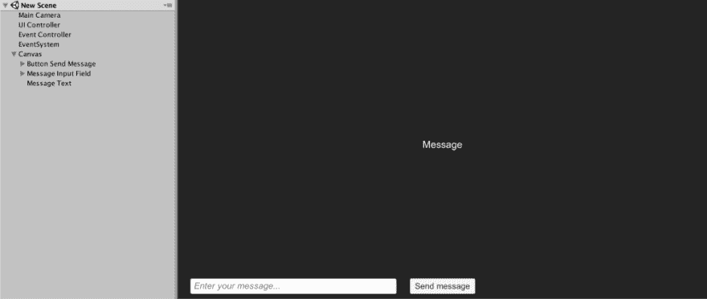
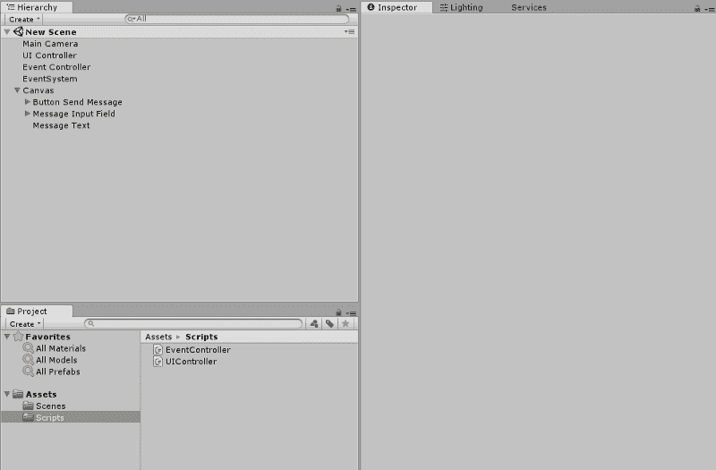

# Unity 中代理和事件的效用

> 原文:[https://dev . to/timrodz/the-utility-of-delegates-and-events-in-unity-48 k1](https://dev.to/timrodz/the-utility-of-delegates-and-events-in-unity-48k1)

*最初发表于[timrodz.com](http://www.timrodz.com/blog/the-utility-of-delegates-and-events-in-unity/)。*

**更新** : [@damagefilter](https://twitter.com/damagefilter/) 写了一个更高级的关于 Unity 事件的教程。去看看[这里](http://www.indiedb.com/members/damagefilter/blogs/event-and-unity)😄。

你好。我的名字是胡安·罗德里格斯。我是一名巴拿马数据&游戏开发者和程序员，住在新西兰。这篇博文是为 [notGDC](http://www.notgdc.fun/) 写的，因为我想向社区贡献我的一些知识。它针对的是那些希望从 Unity 中获得最大收益的程序员，不管他们的技能水平如何。初始阶段将是相当基础的，因为我希望每个人都理解这个教程，所以请随意跳过你希望的部分！(或者直接抓取[源代码](https://github.com/timrodz/unity-callback_examples))。我用的工具是 Unity [2017.3.1p2](https://unity3d.com/unity/qa/patch-releases/2017.3.1p2) 和 [Visual Studio 代码](https://code.visualstudio.com/)。

# [](#what)📩什么

在游戏中，我们经常会遇到这样的情况，我们希望通知对象正在发生的事件，而不必将它们联系在一起。让我们考虑以下情况。您的 UI 系统具有:

*   用于编写消息的输入字段。
*   发送消息的按钮。
*   显示已发送消息的字段。

当用户点击'*发送消息*'按钮时，你想通知 UI 控制器一个新的消息已经被发送。此后，您将用新邮件替换当前邮件。最后，输入字段将被清除。

这是游戏的 GIF 图片:

[T2】](https://res.cloudinary.com/practicaldev/image/fetch/s---TySc8k5--/c_limit%2Cf_auto%2Cfl_progressive%2Cq_66%2Cw_880/https://raw.githubusercontent.com/Mad-Hyrax/blog/gh-pages/assets/img/posts/notgdc_intro.gif)

# [](#how)📤怎么

为了实现期望的功能，我们将通过实现**委托**来处理解决方案。委托允许我们将方法视为变量，它们就像邮件列表一样工作。订户将收到电子邮件，并可以随时选择退出。**注意**:你可以订阅任意多的方法。**事件**非常相似。主要的区别是他们在**委托**实例上增加了一层抽象和保护。这种保护防止委托的客户端重置委托及其调用列表，并且只允许在调用列表中添加或删除目标([源](https://stackoverflow.com/questions/29155/what-are-the-differences-between-delegates-and-events))。

在编程方面，我们将有两个脚本:一个事件控制器和一个 UI 控制器。事件控制器将作为我们的邮件列表，它将有一个事件: **OnMessageUpdateRequest** 。因为我们想用当前的消息替换输入字段的消息，所以这个方法会发出新的消息更新请求。

UI 控制器将有一个订阅了 **OnMessageUpdateRequest** 事件的 **UpdateMessage** 方法，它将作为一个*监听器*工作。此外，为了向您介绍 UnityEvents，我们将使用我们的按钮和它的功能，但我们将在稍后讨论。本质上:委托、事件和 UnityEvents 非常相似。

# [](#implementation)📨履行

在 Unity 中，创建一个新场景，并向其中添加以下对象:

*   两个空的游戏对象。分别将其重命名为' *UI 控制器*和'*事件控制器*。
*   右键单击层次视图:
    *   选择 **UI** → **按钮**。
    *   选择 **UI** → **输入** **字段**。
    *   选择 **UI** → **文本**。

> **注意**:新的 UI 对象会自动添加一个**画布**和一个**事件系统**，如果你的场景中还没有它们的话。为什么？因为**画布**显示 UI 元素，而 **EventSystem** 处理来自非按键输入的交互——它们是任何 UI 系统工作所必需的。

您的场景应该类似于下图:

[T2】](https://res.cloudinary.com/practicaldev/image/fetch/s--kJgXS1NG--/c_limit%2Cf_auto%2Cfl_progressive%2Cq_auto%2Cw_880/https://cdn-images-1.medium.com/max/1000/0%2A_T31weY-0J-2ovBf.png)

# [](#applying-our-solution)应用我们的解决方案

完成场景设置后，就该创建以下 C#脚本了:

*   **UIController.cs**
*   **EventController.cs**

这些脚本与我们之前创建的空游戏对象同名。它们将作为组件附加到它们上面。

## [](#uicontrollercs)UIController.cs

一旦创建了这个类，它应该类似于下面的代码片段:

```
using System.Collections;
using System.Collections.Generic;
using UnityEngine;

public class UIController : MonoBehaviour
{
    // Use this for initialization
    void Start() {}

    // Update is called once per frame
    void Update() {}
} 
```

<svg width="20px" height="20px" viewBox="0 0 24 24" class="highlight-action crayons-icon highlight-action--fullscreen-on"><title>Enter fullscreen mode</title></svg> <svg width="20px" height="20px" viewBox="0 0 24 24" class="highlight-action crayons-icon highlight-action--fullscreen-off"><title>Exit fullscreen mode</title></svg>

因为我们使用 UI，所以我们需要包含 *UnityEngine。UI* 库，以便访问 UI 元素的功能。在行 **3** 和 **5** 之间，添加以下代码片段:

```
using UnityEngine.UI; 
```

<svg width="20px" height="20px" viewBox="0 0 24 24" class="highlight-action crayons-icon highlight-action--fullscreen-on"><title>Enter fullscreen mode</title></svg> <svg width="20px" height="20px" viewBox="0 0 24 24" class="highlight-action crayons-icon highlight-action--fullscreen-off"><title>Exit fullscreen mode</title></svg>

完成之后，移除 **Update** 方法——我们不再需要它。现在我们已经导入了 UI 库，我们将继续在场景中创建对 UI 对象的引用。在 UIController 类中，在 **Start** 方法之前添加以下声明:

```
public Button ButtonSendMessage;
public InputField InputField;
public Text MessageDisplay; 
```

<svg width="20px" height="20px" viewBox="0 0 24 24" class="highlight-action crayons-icon highlight-action--fullscreen-on"><title>Enter fullscreen mode</title></svg> <svg width="20px" height="20px" viewBox="0 0 24 24" class="highlight-action crayons-icon highlight-action--fullscreen-off"><title>Exit fullscreen mode</title></svg>

现在，我们需要创建两个方法: **SendMessageUpdateRequest** 和 **UpdateMessage** 。在 UIController.cs 中，添加以下代码行:

```
void SendMessageUpdateRequest() {}

void UpdateMessage(string _message) {} 
```

<svg width="20px" height="20px" viewBox="0 0 24 24" class="highlight-action crayons-icon highlight-action--fullscreen-on"><title>Enter fullscreen mode</title></svg> <svg width="20px" height="20px" viewBox="0 0 24 24" class="highlight-action crayons-icon highlight-action--fullscreen-off"><title>Exit fullscreen mode</title></svg>

如果您正确地遵循了这些步骤，那么您的类现在应该是这样的: [Gist url](https://gist.github.com/timrodz/db92598bed64de07ff71a1e772df79a2) 。

去 Unity 督察那里。点击 **UI 控制器**游戏对象，然后点击“添加组件”，从这里你将添加*UI 控制器*脚本。或者，你也可以将脚本拖放到游戏对象中。添加后，UI 控制器组件将有三个可见的变量。之后，继续将匹配的组件拖放到**画布**对象中。

> **注意**:UI 控制器 **GameObject** 持有**组件**比如 Transform。UIController 脚本可以作为**组件**附加到任何**游戏对象**上。在这种情况下，我们将其附加到 UI 控制器游戏对象。

[T2】](https://res.cloudinary.com/practicaldev/image/fetch/s--m2Ws-_U9--/c_limit%2Cf_auto%2Cfl_progressive%2Cq_66%2Cw_880/https://cdn-images-1.medium.com/max/800/1%2ANvRgBceLTzj7ZQ39gkHFCA.gif)

在继续之前，我们需要讨论一下 **UnityEvents** 以及我们如何在本教程中使用它们。如果您单击画布内的按钮，您将看到以下组件:

[T2】](https://res.cloudinary.com/practicaldev/image/fetch/s--X7AwboYV--/c_limit%2Cf_auto%2Cfl_progressive%2Cq_auto%2Cw_880/https://cdn-images-1.medium.com/max/800/1%2AKp3DWqTH84BeIZrMrBx9eA.png)

在组件视图的底部，您会看到一个带有空列表和一个 **+** / **-** 符号的 **On Click ()** 字段。这是一个 **UnityEvent** :它们允许你在当前场景中添加对象的方法！因此，无论您在这里添加什么方法，当按钮收到点击时都会被调用( **onClick** )。

如果您分配的方法与组件(在本例中是我们的按钮)不在同一个层次结构中，那么它的引用可能会丢失。这可能会产生许多不希望的情况，您必须一次又一次地重新分配方法。为了解决这个问题，我们将通过代码向按钮的 **onClick** 事件添加一个监听器。在**启动**方法的内部，添加下面一行:

```
ButtonSendMessage.onClick.AddListener(SendMessageUpdateRequest); 
```

<svg width="20px" height="20px" viewBox="0 0 24 24" class="highlight-action crayons-icon highlight-action--fullscreen-on"><title>Enter fullscreen mode</title></svg> <svg width="20px" height="20px" viewBox="0 0 24 24" class="highlight-action crayons-icon highlight-action--fullscreen-off"><title>Exit fullscreen mode</title></svg>

**AddListener** 方法允许我们将任何类的函数订阅到所需的事件；在这种情况下，它是 **onClick** 。所采用的参数是类型 *UnityAction* ，它本质上是根据 Unity 被认为是方法的任何东西。现在，每次您单击'*发送消息*按钮，无论内容如何，都会调用 **SendMessageUpdateRequest** 方法。

> **注意**:**AddListener**方法只接受不带参数的 UnityEvents，除非你通过 Lambda 表达式添加它们。

## [](#eventcontrollercs)事件控制器. cs

在继续之前，我们需要声明我们的委托并实现它的功能。
在 EventController.cs 中添加以下声明(在**启动**方法之前):

```
public delegate void OnMessageUpdateRequestDelegate(string _message); 
```

<svg width="20px" height="20px" viewBox="0 0 24 24" class="highlight-action crayons-icon highlight-action--fullscreen-on"><title>Enter fullscreen mode</title></svg> <svg width="20px" height="20px" viewBox="0 0 24 24" class="highlight-action crayons-icon highlight-action--fullscreen-off"><title>Exit fullscreen mode</title></svg>

在这里，我们声明我们的委托**OnMessageUpdateRequestDelegate**。在声明的这一部分，您指定它将拥有的参数(没有参数也是有效的)。在我们的例子中，我们添加了一个字符串*消息。*

```
public static OnMessageUpdateRequestDelegate OnMessageUpdateRequest; 
```

<svg width="20px" height="20px" viewBox="0 0 24 24" class="highlight-action crayons-icon highlight-action--fullscreen-on"><title>Enter fullscreen mode</title></svg> <svg width="20px" height="20px" viewBox="0 0 24 24" class="highlight-action crayons-icon highlight-action--fullscreen-off"><title>Exit fullscreen mode</title></svg>

我们将 **OnMessageUpdateRequest** 声明为*OnMessageUpdateRequestDelegate*。这是因为委托是被视为变量的方法。此外，它是静态的，因为我们希望能够从其他类访问它，而不必保存对 EventController 的引用(这完全是可选的，并且它将与您的实现/编码实践有很大的不同)。

现在，将**开始**的方法替换为以下一种:

```
public static void Event_OnMessageUpdateRequest(string _message)
{
    Debug.LogFormat("-- EventController // Received a request to update message: {0}", _message);

    OnMessageUpdateRequest(_message);
} 
```

<svg width="20px" height="20px" viewBox="0 0 24 24" class="highlight-action crayons-icon highlight-action--fullscreen-on"><title>Enter fullscreen mode</title></svg> <svg width="20px" height="20px" viewBox="0 0 24 24" class="highlight-action crayons-icon highlight-action--fullscreen-off"><title>Exit fullscreen mode</title></svg>

**Final EventController . cs**
如果你按照步骤正确，你的 event controller 类应该是这样的: [Gist url](https://gist.github.com/timrodz/21e7339f8dab8d3a0ac532b8012f274f) 。

## [](#back-to-uicontrollercs)回 UIController.cs

现在我们的 EventController 代码已经准备好了，是时候继续使用我们的实现了。我们现在想为 EventController 的 **OnMessageUpdateRequest** 委托订阅我们的 **UpdateMessage** 方法。在 Start 方法中，添加这行代码:

`EventController.OnMessageUpdateRequest += UpdateMessage;`

> **注意**:我们没有使用 AddListener，因为代理/事件可以通过 **+=** / **-=** 操作符简单地添加/删除监听器。同样，委托可以等于(=)一个方法，而事件不能，它们需要使用 **+=** / **-=** 赋值操作符。

在我们的 SendMessageUpdateRequest 方法中，我们将消息存储在一个临时字符串中。我们这样做是因为我们将调用 EventController 的**Event _ OnMessageUpdateRequest**方法:

```
void SendMessageUpdateRequest()
{
    // Store the input field's text into a string
    string message = InputField.text;

    EventController.Event_OnMessageUpdateRequest(message);
} 
```

<svg width="20px" height="20px" viewBox="0 0 24 24" class="highlight-action crayons-icon highlight-action--fullscreen-on"><title>Enter fullscreen mode</title></svg> <svg width="20px" height="20px" viewBox="0 0 24 24" class="highlight-action crayons-icon highlight-action--fullscreen-off"><title>Exit fullscreen mode</title></svg>

如果您调用 EventController.cs，**Event _ OnMessageUpdateRequest**方法的内容调用 OnMessageUpdateRequest 委托。因为 **SendMessageUpdateRequest** 调用了事件，而 **UpdateMessage** 订阅了事件，所以也会被调用。

## [](#%F0%9F%97%B3-method-call-order)🗳法调用顺序

1.  按钮'*发送消息*'**onClick***unity event*调用**SendMessageUpdateRequest**(*订户*)。
2.  **SendMessageUpdateRequest***方法*调用**事件 _OnMessageUpdateRequest** 。
3.  **Event _ OnMessageUpdateRequest***方法*调用 **OnMessageUpdateRequest** 。
4.  **on message update request***delegate*调用**update message**(*subscriber*)。

这可能会令人困惑，所以让我以一种更易读的方式重新表述它们:因为*方法***SendMessageUpdateRequest**订阅了 Button 的**onClick***UnityEvent*，所以每次 onClick 也被调用时都会被调用。数字 4 也是如此:因为*方法* **UpdateMessage** 被订阅给委托 **OnMessageUpdateRequest** ，所以每次调用 **OnMessageUpdateRequest** 时都会被调用。希望事情会有所缓解！

最后，我们遵循最后的步骤:替换消息，并清除输入字段。

```
void UpdateMessage(string _message)
{
    // Print the message
    Debug.LogFormat("-- UIController // Updating message: {0}", _message);

    // Replace our message display text with the contents of the message variable
    MessageDisplay.text = _message;

    // Reset the text of our input field
    InputField.text = "";
} 
```

<svg width="20px" height="20px" viewBox="0 0 24 24" class="highlight-action crayons-icon highlight-action--fullscreen-on"><title>Enter fullscreen mode</title></svg> <svg width="20px" height="20px" viewBox="0 0 24 24" class="highlight-action crayons-icon highlight-action--fullscreen-off"><title>Exit fullscreen mode</title></svg>

**Final UIController.cs**
如果你正确地遵循了所有的步骤，你的 UIController 类应该是这样的: [Gist url](https://gist.github.com/timrodz/10534c89b7832a50d57dad7a54222a83)

现在，按播放键，然后**交叉手指。**如果一切顺利，恭喜你！如果没有，请让我知道是什么问题，我们会解决它！

# [](#summary)💌摘要

* * *

我们已经了解了 Unity 中的代表、事件和事件。它们是有用的变量，可以帮助克服许多编程挑战。我希望你喜欢阅读这篇博文。