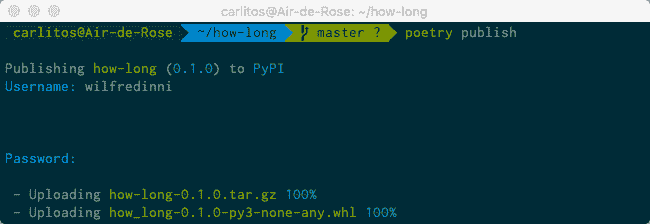
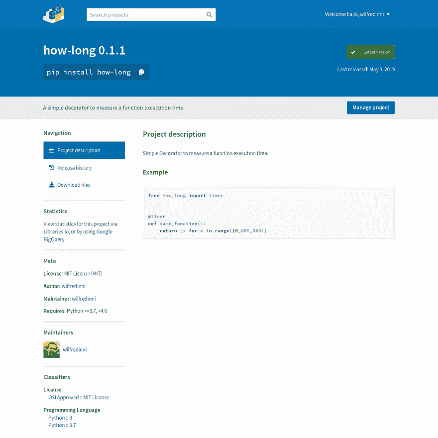

# 使用诗歌和 VSCode 的 Python 项目。第三部分

> 原文:[https://dev . to/wilfredinni/python-projects-with-poem-and-vs code-part-3-1 ojl](https://dev.to/wilfredinni/python-projects-with-poetry-and-vscode-part-3-1ojl)

在[第一部分](https://www.pythoncheatsheet.org/blog/python-projects-with-poetry-and-vscode-part-1)我们:

*   开始了一个新项目。
*   创造了一个虚拟环境。
*   托管依赖项。

在[的第二部分](https://www.pythoncheatsheet.org/blog/python-projects-with-poetry-and-vscode-part-2):

*   将我们的虚拟环境添加到 [VSCode](https://code.visualstudio.com/) 中。
*   将我们的开发依赖项与编辑器集成:
    *   *薄片 8*
    *   *黑色*
    *   *Pytest*

最后，在第三部分也是最后一部分，我们将:

*   写一个样本库。
*   用*诗歌*构建我们的项目。
*   发布在 *PyPI* 上。

## [](#poetry-commands)诗歌命令

下表列出了本系列中使用的命令及其描述。完整的列表请阅读诗歌文档。

| 命令 | 描述 |
| --- | --- |
| `poetry new [package-name]` | 开始一个新的 Python 项目。 |
| `poetry init` | 交互式创建一个 *pyproject.toml* 文件。 |
| `poetry install` | 在 *pyproject.toml* 文件中安装软件包。 |
| `poetry add [package-name]` | 将包添加到虚拟环境中。 |
| `poetry add -D [package-name]` | 向虚拟环境添加开发包。 |
| `poetry remove [package-name]` | 从虚拟环境中删除包。 |
| `poetry remove -D [package-name]` | 从虚拟环境中删除开发包。 |
| `poetry update` | 获取依赖项的最新版本 |
| `poetry shell` | 在虚拟环境中生成一个外壳。 |
| `poetry build` | 构建源和轮子档案。 |
| `poetry publish` | 将包发布到 PyPi。 |
| `poetry publish --build` | 构建并发布包。 |
| `poetry self:update` | 将诗歌更新到最新的稳定版本。 |

## [](#the-project)项目

如果你愿意，你可以从 [GitHub](https://github.com/wilfredinni/how-long) 下载源代码，但是如前所述，这将是一个非常简单的装饰器，它唯一要做的事情就是向控制台打印一个函数运行需要多长时间:

```
from how_long import timer

@timer
def test_function():
    [i for i in range(10000)]

test_function()
# Execution Time: 955 ms. 
```

<svg width="20px" height="20px" viewBox="0 0 24 24" class="highlight-action crayons-icon highlight-action--fullscreen-on"><title>Enter fullscreen mode</title></svg> <svg width="20px" height="20px" viewBox="0 0 24 24" class="highlight-action crayons-icon highlight-action--fullscreen-off"><title>Exit fullscreen mode</title></svg>

最终，项目目录看起来或多或少会像这样:

```
how-long
├── how_long
│   ├── how_long.py
│   └── __init__.py
├── how_long.egg-info
│   ├── dependency_links.txt
│   ├── PKG-INFO
│   ├── requires.txt
│   ├── SOURCES.txt
│   └── top_level.txt
├── LICENSE
├── poetry.lock
├── pyproject.toml
├── README.rst
└── tests
    ├── __init__.py
    └── test_how_long.py 
```

<svg width="20px" height="20px" viewBox="0 0 24 24" class="highlight-action crayons-icon highlight-action--fullscreen-on"><title>Enter fullscreen mode</title></svg> <svg width="20px" height="20px" viewBox="0 0 24 24" class="highlight-action crayons-icon highlight-action--fullscreen-off"><title>Exit fullscreen mode</title></svg>

在我们开始之前，用`poetry update`命令检查包更新:

[T2】](https://res.cloudinary.com/practicaldev/image/fetch/s--PxoQOrSH--/c_limit%2Cf_auto%2Cfl_progressive%2Cq_auto%2Cw_880/https://raw.githubusercontent.com/wilfredinni/pysheetComments/master/2019/May/poetry_vscode_p3/img/poetry_update.png)

好，现在在`README.rst` :
中添加项目的简短描述

```
how_long
========

Simple Decorator to measure a function execution time.

Example
_______

.. code-block:: python

    from how_long import timer

    @timer
    def some_function():
        return [x for x in range(10_000_000)] 
```

<svg width="20px" height="20px" viewBox="0 0 24 24" class="highlight-action crayons-icon highlight-action--fullscreen-on"><title>Enter fullscreen mode</title></svg> <svg width="20px" height="20px" viewBox="0 0 24 24" class="highlight-action crayons-icon highlight-action--fullscreen-off"><title>Exit fullscreen mode</title></svg>

导航至`how_long/how_long.py`:T1

```
# how_long.py from functools import wraps

import pendulum

def timer(function):
    """
    Simple Decorator to measure a function execution time.
    """

    @wraps(function)
    def function_wrapper():
        start = pendulum.now()
        function()
        ellapsed_time = pendulum.now() - start
        print(f"Execution Time: {ellapsed_time.microseconds} ms.")

    return function_wrapper 
```

<svg width="20px" height="20px" viewBox="0 0 24 24" class="highlight-action crayons-icon highlight-action--fullscreen-on"><title>Enter fullscreen mode</title></svg> <svg width="20px" height="20px" viewBox="0 0 24 24" class="highlight-action crayons-icon highlight-action--fullscreen-off"><title>Exit fullscreen mode</title></svg>

在`how_long/__init__.py` :

```
from .how_long import timer

__version__ = "0.1.1" 
```

<svg width="20px" height="20px" viewBox="0 0 24 24" class="highlight-action crayons-icon highlight-action--fullscreen-on"><title>Enter fullscreen mode</title></svg> <svg width="20px" height="20px" viewBox="0 0 24 24" class="highlight-action crayons-icon highlight-action--fullscreen-off"><title>Exit fullscreen mode</title></svg>

最后是`tests/test_how_long.py`文件:

```
from how_long import __version__
from how_long import timer

def test_version():
    assert __version__ == "0.1.1"

def test_wrap():
    @timer
    def wrapped_function():
        return

    assert wrapped_function.__name__ == "wrapped_function" 
```

<svg width="20px" height="20px" viewBox="0 0 24 24" class="highlight-action crayons-icon highlight-action--fullscreen-on"><title>Enter fullscreen mode</title></svg> <svg width="20px" height="20px" viewBox="0 0 24 24" class="highlight-action crayons-icon highlight-action--fullscreen-off"><title>Exit fullscreen mode</title></svg>

您现在可以在您的终端上使用`poetry install`在本地安装和验证您的包。如果您还没有激活您的虚拟环境，请使用 Python 交互式 shell:

```
>>> from how_long import timer
>>>
>>> @timer
... def test_function():
...     [i for i in range(10000)]
...
>>> test_function()
Execution Time: 705 ms. 
```

<svg width="20px" height="20px" viewBox="0 0 24 24" class="highlight-action crayons-icon highlight-action--fullscreen-on"><title>Enter fullscreen mode</title></svg> <svg width="20px" height="20px" viewBox="0 0 24 24" class="highlight-action crayons-icon highlight-action--fullscreen-off"><title>Exit fullscreen mode</title></svg>

运行测试，如果一切正常，继续。

## [](#building-and-publishing)建筑与出版

终于，向全世界公开这个项目的时候到了！首先，确保你在 [Pypi](https://pypi.or) 上有账户，如果没有，[注册](https://pypi.org/account/register/)一个。请记住，包名必须是唯一的，如果不确定，请使用[搜索](https://pypi.org/search/?q=)进行检查。

### [](#build)打造

`poetry build`命令构建源代码和[轮子](https://pythonwheels.com/)档案，它们将作为项目的源代码上传:

[T2】](https://res.cloudinary.com/practicaldev/image/fetch/s--2LFS9IY1--/c_limit%2Cf_auto%2Cfl_progressive%2Cq_auto%2Cw_880/https://raw.githubusercontent.com/wilfredinni/pysheetComments/master/2019/May/poetry_vscode_p3/img/poetry_build.png)

将创建 *how_long.egg-info* 目录。

### [](#publish)发布

该命令将包发布到 *Pypi* 并在上传前自动注册，如果这是第一次提交:

[T2】](https://res.cloudinary.com/practicaldev/image/fetch/s--Lkv-_TwV--/c_limit%2Cf_auto%2Cfl_progressive%2Cq_auto%2Cw_880/https://raw.githubusercontent.com/wilfredinni/pysheetComments/master/2019/May/poetry_vscode_p3/img/poetry_publish.png)

> 您还可以使用`$ poetry publish --build`构建并发布您的项目。

输入您的凭证，如果一切正常，[浏览](https://pypi.org/project/how-long/)您的项目，您将看到如下内容:

[T2】](https://res.cloudinary.com/practicaldev/image/fetch/s--YjSSQfhO--/c_limit%2Cf_auto%2Cfl_progressive%2Cq_auto%2Cw_880/https://raw.githubusercontent.com/wilfredinni/pysheetComments/master/2019/May/poetry_vscode_p3/img/pypi.png)

我们现在可以让其他人知道他们可以从任何地方的任何机器上进行操作！

## [](#conclusion)结论

我记得我第一次尝试发布一个包，那是一场噩梦。我刚刚开始学习 Python，我不得不花“几个小时”去理解`setup.py`文件是什么以及如何使用它。最后，我得到了几个不同的文件:一个`Makefile`，一个`MANIFEST.in`，一个`requirements.txt`，一个`test_requirements.txt`。这就是为什么[诗歌](https://github.com/sdispater/poetry)的创作者[塞巴斯蒂安·尤斯塔斯](https://github.com/sdispater)的话对我来说很有意义:

> Python 中的打包和依赖管理相当复杂，新手很难理解。即使对于经验丰富的开发人员来说，创建一个 Python 项目中需要的所有文件有时也很麻烦:`setup.py`、`requirements.txt`、`setup.cfg`、`MANIFEST.in`和新添加的`Pipfile`。
> 
> 所以我想要一个工具，将所有事情限制在一个配置文件中完成:依赖管理、打包和发布。
> 
> 它从其他语言中存在的工具中获得灵感，如`composer` (PHP)或`cargo` (Rust)。
> 
> 最后，Python 中没有可靠的工具来正确解析依赖关系，所以我开始使用`poetry`来为 Python 社区带来一个详尽的依赖关系解析器。

诗歌绝不是完美的，但是不像其他工具，它真的做到了承诺的事情。