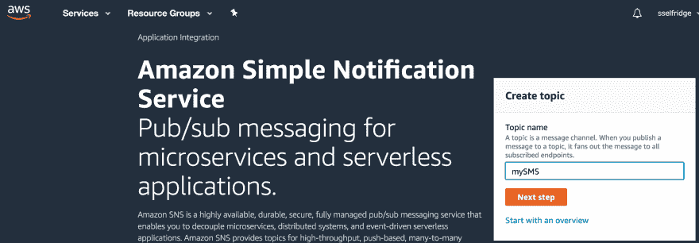
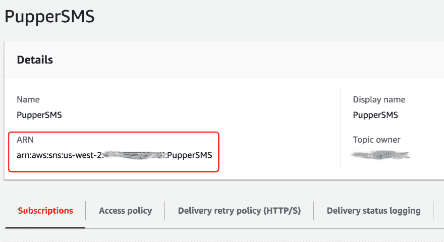
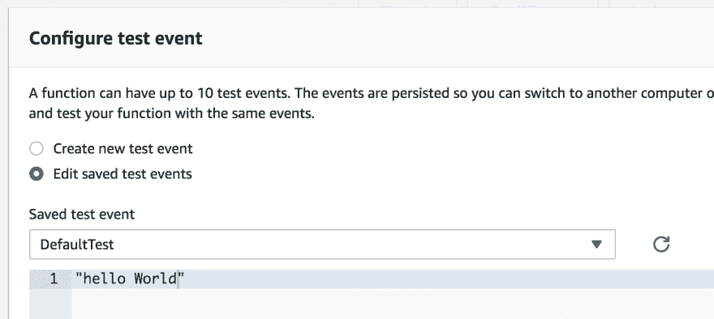
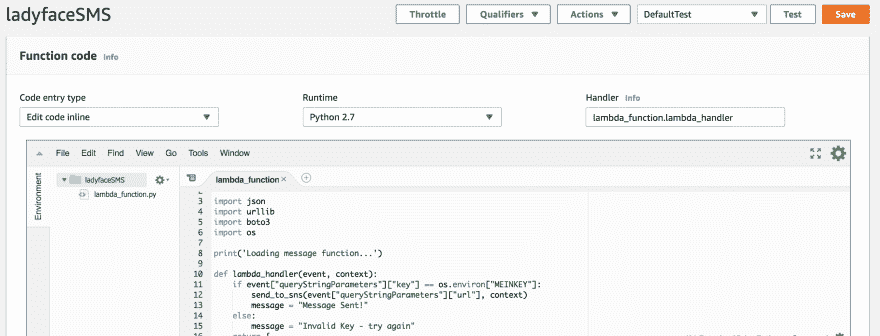
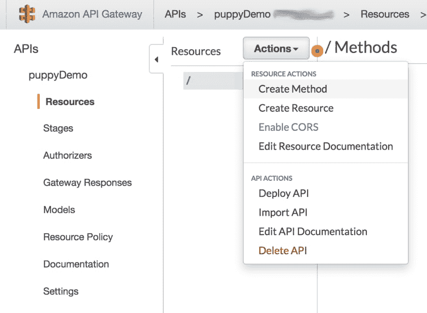
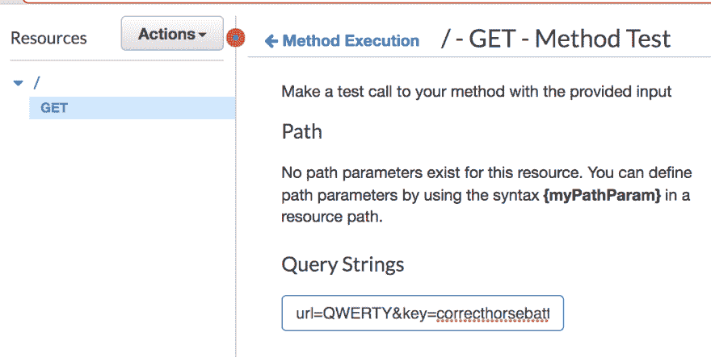

# 使用 Chrome 扩展和 AWS Lambda 发送短信:演练

> 原文:[https://dev . to/sirclesam/SMS-puppy-pics-to-lady face-with-lambda-walk through-181m](https://dev.to/sirclesam/sms-puppy-pics-to-ladyface-with-lambda-walkthrough-181m)

当我有时间的时候，我会浏览 imgur，这通常意味着看到我知道我的淑女脸会喜欢的东西的图片，通常是小狗。

有一段时间，我只是右击复制网址，然后打开安卓短信网络应用 messages.google.com，找到这位女士，粘贴和完成。然而，在特别可爱的一天之后，我发现自己连续几次这样做，而且效率不高，所以在一个慵懒的早晨，我雄心勃勃，拼凑了一些有用的东西...但并不理想。

我的第一个版本的工作方式是将 URL 发送到我的节点服务器，它运行着我的一个个人项目，带有一些特殊的查询字符串，并使用 Twilio 模块使用它来发送 SMS。虽然这样做有效，但并不理想，因为这意味着我的服务器上有这段与其主要目的无关的代码，但对于我在一个早上花了几个小时编写的东西来说，它就可以了。

我终于找到了让它按照我想要的方式工作的方法，这似乎更适合这个任务，也就是使用 AWS Lambda 函数，这就是我要在这里介绍的内容。

我将简要介绍一下大纲，然后我们将逐步完成启动和运行的各个步骤。

我们将使用 chrome 扩展来访问 AWS API 网关，该网关与使用 AWS SNS 发送 SMS 的 Lambda 函数相关联。让我们开始向后工作。

注意:你需要一个绑定信用卡的 AWS 账户，我用的所有东西都很便宜(每条短信 0.00645 英镑)，但亚马逊仍然需要向你收费。

# [](#sns)SNS

1)进入[SNS 主页](https://us-west-2.console.aws.amazon.com/sns/v3/home?region=us-west-2#/homepage)

[T2】](https://res.cloudinary.com/practicaldev/image/fetch/s--pfYbBK7O--/c_limit%2Cf_auto%2Cfl_progressive%2Cq_auto%2Cw_880/https://thepracticaldev.s3.amazonaws.com/i/12rivn49rwq7g4xtqqjn.png)

2)创建一个新主题，命名为你喜欢的任何东西。

3)给你的主题一个显示名。请注意，此信息的前 10 个字符将显示在您发送的每条短信上。所以对于我的学生来说，短信是这样的:

`PupperSMS>http://i.imgur.com/cRF0KoB.jpg`

4)为此主题创建短信订阅。

*   单击创建订阅，为刚刚创建的主题选择 ARN。
*   将您打算发送东西的电话号码放在端点中，我使用完整的+11234567890 样式
*   我建议首先使用你的号码，这样你的目标受众就不会收到你的测试信息。
*   如果您想发送给多个号码，您可以在此包含多个套餐。

5)测试一下。

你可以通过点击“发布消息”在正文中输入一些内容，然后点击底部的“发布消息”来测试它是否工作。你应该会收到一条来自一个 5 位数号码的短信，号码是你在开头输入的显示名。

6)跟踪 ARN，我们稍后会用到它。

[T2】](https://res.cloudinary.com/practicaldev/image/fetch/s--BmkrrVWe--/c_limit%2Cf_auto%2Cfl_progressive%2Cq_auto%2Cw_880/https://thepracticaldev.s3.amazonaws.com/i/g5k8hfrna1jyq2wkmvt1.png)

# λ

现在是有趣的事情。

1)进入[AWS lambda 主页](https://us-west-2.console.aws.amazon.com/lambda/home?region=us-west-2#/begin)

2)点击“创建函数”，选择“从头开始创作”，运行时为“python 2.7”

*   这需要一点时间，AWS 也为你的 lambda func 创建了一个 IAM 角色
*   注意:我在创建默认角色时出错，所以我使用了在 IAM 中创建的角色。[您可以在这里创建一个](https://console.aws.amazon.com/iam/home?#/roles)选择 lambda 用于服务，选择 AdministratorAccess 用于权限。对于我们正在做的事情来说，这可能有点过头了，但是现在还管用。

3)添加 lambda python 代码:

```
from __future__ import print_function

import json
import urllib
import boto3
import os

print('Loading message function...')

def lambda_handler(event, context):
    if event["queryStringParameters"]["key"] == os.environ["KEY"]:
        send_to_sns(event["queryStringParameters"]["url"], context)
        message = "Message Sent!"
    else:
        message = "Invalid Key - try again"
    return {
        "statusCode": 200,
        "body": json.dumps(message)
    }

def send_to_sns(smsMessage,context):
    sns = boto3.client('sns')
    sns.publish(
        TopicArn={YOUR SNS ARN HERE},
        Message=smsMessage
    )

    return ('Sent a message to an Amazon SNS topic.') 
```

在这之前，你需要从你的社交网站上抓取 ARN，并将其设置为上面的图标。像这样:
`TopicArn="arn:aws:sns:us-west-2:1234567890:mySMS",`

您可以通过将 lambda 处理程序更改为 lambda_function.send_to_sns 并将测试事件更改为一个字符串来测试这一点。一旦你点击测试，它会发送一条短信到你的手机上。

[T2】](https://res.cloudinary.com/practicaldev/image/fetch/s--zY18vypN--/c_limit%2Cf_auto%2Cfl_progressive%2Cq_auto%2Cw_880/https://thepracticaldev.s3.amazonaws.com/i/3xn479322oe9xpaf9h29.png)

将处理程序改回 lambda_function.lambda_handler，我将简单介绍一下另一个函数中发生了什么。

[T2】](https://res.cloudinary.com/practicaldev/image/fetch/s--k1jr_R7B--/c_limit%2Cf_auto%2Cfl_progressive%2Cq_auto%2Cw_880/https://thepracticaldev.s3.amazonaws.com/i/rul8w5ut0oysztsyi3he.png)

我们将使用 AWS API gateway 来激活此函数，这将为我们提供一个可以点击的 URL，并使用一个名为 Lambda Proxy 的东西，它将允许我们从 URL 中获取查询字符串，并将它们传递给事件对象中的 Lambda 函数。

这些存储在“queryStringParameters”对象中。“url”是我们感兴趣的数据，但是您会注意到还有一个“key”参数。这是为了给我们的 api 增加一点安全性，这样世界上的任何人都不能触发它，但是只有当 api 被正确的键值命中时才能触发。

这也许可以通过 AWS 安全特性来实现，但是我还没有做到这一步——如果你有更好的方法，请告诉我！

选择一个你可以用作安全密钥的东西。我用了一个 UUID 字符串，你可以在这里生成一个:[https://www.uuidgenerator.net/](https://www.uuidgenerator.net/)

在 lambda 函数的代码下面，有一个环境变量的部分——把你的键/ UUID 放在这里。它不需要很长，但它应该足够长，暴力是不可能的。你甚至可以纠正马崎订书钉的说法:[https://www.xkcd.com/936/](https://www.xkcd.com/936/)。

[T2】](https://res.cloudinary.com/practicaldev/image/fetch/s--zJJC-WCl--/c_limit%2Cf_auto%2Cfl_progressive%2Cq_auto%2Cw_880/https://thepracticaldev.s3.amazonaws.com/i/n35rqy4oh1b09jis8fcm.png)

# [](#api-gateway)API 网关

是时候向世界展示我们的 lambda 了！

1) [转到 API 网关门户](https://us-west-2.console.aws.amazon.com/apigateway/home?region=us-west-2#/welcome)

2)单击“开始”创建新的 API

3)选择新 API，给它一个名称和描述，将端点保留为区域，单击“创建 API”

4)单击“操作”->“创建方法”，从下拉列表中选择“获取”，然后单击复选标记。

[T2】](https://res.cloudinary.com/practicaldev/image/fetch/s--_zUE1u3a--/c_limit%2Cf_auto%2Cfl_progressive%2Cq_auto%2Cw_880/https://thepracticaldev.s3.amazonaws.com/i/cjbkw94aeq6ga3jxorgj.png)

5)选择集成类型:Lambda 函数

6)选中“使用 lambda 代理集成”

[T2】](https://res.cloudinary.com/practicaldev/image/fetch/s--MX8oVmJ4--/c_limit%2Cf_auto%2Cfl_progressive%2Cq_auto%2Cw_880/https://thepracticaldev.s3.amazonaws.com/i/5eh5ys499tzkp0ru7p1v.png)

7)在 lambda function 字段中，按名称选择您的 lambda 函数。

*   选择确定以允许 API 访问。

8)我们需要启用查询字符串，这样我们就可以将数据传递给我们的 api 和 lambda 函数。点击方法请求

8)通过单击带有闪电图标的测试来测试您的 API。

*   在查询字符串字段中输入 URL = canyuehearmenow & key = your key，然后点击 test
*   您应该会看到“消息已发送”，并在您的手机上收到一条短信！
*   快到了，终点冲刺！

[T2】](https://res.cloudinary.com/practicaldev/image/fetch/s--HiBl3xEw--/c_limit%2Cf_auto%2Cfl_progressive%2Cq_auto%2Cw_880/https://thepracticaldev.s3.amazonaws.com/i/f1n0iu7k4llcv5q5nggu.png)

9)部署您的 API。单击“操作”并选择部署 API

*   创建新的舞台名称
*   TADA！现在你有了一个可以触发 lambda 函数的 url。
*   还记得我们需要查询字符串吗？url=YOURURL&key=YOURKEY 位于它的末尾，以便按预期工作。

[T2】](https://res.cloudinary.com/practicaldev/image/fetch/s--YrEuoxqK--/c_limit%2Cf_auto%2Cfl_progressive%2Cq_auto%2Cw_880/https://thepracticaldev.s3.amazonaws.com/i/i6eheb1xvc7qfti3o182.png)

# [](#chrome-extention)铬延伸

这将非常简单，只有 2 个文件。然而，它确实涉及到将你的 chrome 扩展置于开发者模式，这确实有一些安全隐患，所以要小心。

1)在[https://github.com/sselfridge/send-it](https://github.com/sselfridge/send-it)下载回购

*   Zip 这里:[https://github.com/sselfridge/send-it/archive/master.zip](https://github.com/sselfridge/send-it/archive/master.zip)

2)将解压缩后的文件放在它们可以继续运行的地方，它们将从这里开始执行。

3)您只需要编辑 script.js，但是如果您想将其命名为除“send it！”之外的其他名称，您可以修改 manifest.json

4)在 script.js 中添加您的密钥和 AWS 端点

```
 const AWS_API_ENPOINT = "https://123456789.execute-api.us-west-2.amazonaws.com/PuppyStage";
  const KEY = "correcthorsebatterystaple"; 
```

5)打开 Chrome，进入“管理扩展”页面。您可以通过右键单击您拥有的任何扩展图标，然后单击那里的“管理扩展”来访问它。

6)单击右上角的“开发人员模式”开关

7)在左上方的新菜单中点击“加载解压缩”

8)选择您的文件夹

你完了！转到 chrome 中的任何图像，右键单击它，您应该会看到“发送”选项，单击它会将该 URL 发送到您的号码。

请记住，您必须在 AWS SNS 控制台中更改/添加更多订阅，具体取决于您要向哪些号码发送订阅。

# [](#further-work)进一步工作

这确实留下了一些需要改进的地方。

*   如果事情在任何一点上停止工作，就不会有反馈。
*   chrome 扩展没有图标
*   Chrome 启动时关于开发模式的警告。可以通过发布到 chrome store 来修复，我已经亲自完成了，但是 AWS API 端点是硬编码的，因为我没有添加 UI 元素来提示它。

干杯，祝小狗快乐！