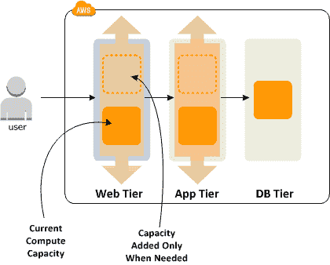
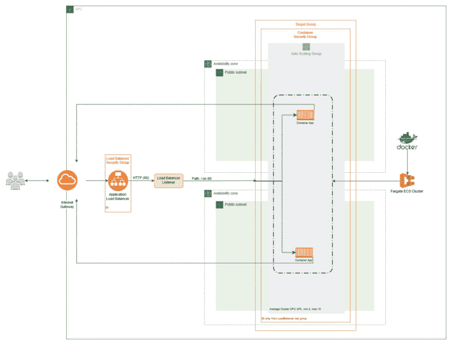

# 自动缩放 AWS 的 3 种方式

> 原文:[https://dev.to/rehanvdm/3-ways-to-autoscale-on-aws-5ff4](https://dev.to/rehanvdm/3-ways-to-autoscale-on-aws-5ff4)

在本文中，我们将探讨三种不同的自动缩放应用程序的方法。我们还将尽可能利用 AWS 管理的服务。

**这是一篇为 [Afonza](https://afonza.com/) 写的文章，可以在这里[或者在我的](https://afonza.com/3-ways-to-autoscale-on-aws/)[博客](https://www.rehanvdm.com/aws/3-ways-to-autoscale-on-aws/index.html)上找到。**

扩展是指根据需求添加或删除类似的资源，这通常是手动完成的。一个**自动扩展**应用程序将监控关键性能指标，当这些指标超过特定阈值时，要么**向外扩展**(添加类似资源)，要么**在**中扩展【移除类似资源】以**满足需求**。

与缩放相比，自动缩放可以发生**几乎** **瞬间**取决于设置。通过将高可用性(HA)设置分布在多个地理位置，这有助于维护服务级别协议(SLA)。

[T2】](https://www.rehanvdm.com/contents/data/2019/09/AutoScale_Intro.png)

您可能会发现一些关于缩放的定义，包括:

*   **向外扩展**—添加类似资源以满足需求
*   **中的比例–移除类似资源以满足需求**
***   **自动缩放组**–一组正在/将要自动缩放的相似资源*   **所需容量**–这是自动缩放组中资源的数量*   **最大和最小容量**–这些定义了自动缩放可以在自动缩放组中添加或删除的资源数量的限制，以便满足需求。*   **可扩展维度**–将用于扩展自动扩展组的资源的维度，如果资源是服务，这可能是 CPU 使用率或网络输入。*   **放大和缩小冷却**—在另一次放大或缩小发生之前的时间量*   **健康检查**–健康检查是对应用程序/资源的 API 调用，以确定它是否仍能接收流量。如果不能，它将被标记为不健康并被删除。这通常与向自动扩展组中的各个资源发送流量的负载平衡器有关。*   **运行状况检查宽限期**–这为资源/应用程序提供了启动时间，只有在这段时间过后，检查才会开始**

 **需要注意的是，并非所有应用都可以使用自动缩放。应用程序的设计必须考虑到可伸缩性。它必须**无状态**来处理新资源和任何可能阻止您的高可用性设置保持其 SLA 的故障。

随着大部分术语的消失，让我们开始看我们的例子。他们按年龄和伸缩能力排序。

# 1。弹性豆茎

*cloud formation 模板可以在这里找到:[https://github . com/rehan VDM/awsautoscaling/blob/master/elastic beanstalk/cf . YAML](https://github.com/rehanvdm/awsautoscaling/blob/master/ElasticBeanstalk/cf.yaml)T3】*

Elastic Beanstalk (EB)是最早的 AWS **编排服务**之一。很容易配置和编排许多其他 AWS 服务，如 EC2、SQS、RDS、S3 SNS、自动伸缩、Cloudwatch 警报、负载平衡器等，以将您的整个应用程序整合为一个整体。在引擎盖下，提供给 **Elastic Beanstalk** **的配置编写了一个 CloudFormation** 模板来为您编排和管理所有这些服务。

弹性豆茎往往被忽视。对于任何开始使用 AWS 的人来说，它仍然是一个很好的入口点，有些人可能会认为它已经过时了，不应该使用。做复杂的设置是如此容易，而**几乎不需要底层基础设施的知识**；这对我来说不是年龄的标志，而是成熟的标志。这就是为什么 Elastic Beanstalk 在列表中排在第一位，它古老而明智，非常适合大型网站(我的观点),不应该用于任何计算密集型工作。

[T2】](https://res.cloudinary.com/practicaldev/image/fetch/s---QGQkmi2--/c_limit%2Cf_auto%2Cfl_progressive%2Cq_auto%2Cw_880/https://www.rehanvdm.com/contents/data/2019/09/AutoScale_0_ELasticBeanstalk.png)

上面的架构将 CloudFormation 模板可视化，以定义 HA Elastic Beanstalk 环境，并位于 YAML 的 85 行下的**。然后，Elastic Beanstalk 代表您创建并由**管理一个大得多的 CloudFormation 模板**，它是**大约 2500 行**，包含超过 15 个大约 1500 行长的资源。这种架构的要点可以在下面看到。**

[T2】](https://www.rehanvdm.com/contents/data/2019/09/AutoScale_1_ELasticBeanstalk.png)

这里要提到的重要一点是，您可以获得一个**经典负载平衡器**，它可以在您的子网之间进行平衡，这些子网可以是公有的，也可以是私有的，具体取决于您的外部 VPC 设置。然后，Elastic Beanstalk 创建所有的安全组、经典负载平衡器、目标组、自动伸缩组等。

它将**从 S3** 提取邮政编码，并将其部署到弹性 Beanstalk 环境中。根据您选择的编程语言，每个环境都有特定的配置选项。然后，Elastic Beanstalk 还有**脚本钩子**，可以用来设置实例和容器。可以很容易地对它们进行定制，以安装各种应用程序，并在实际的实例和上创建定制配置。同样值得注意的是 Elastic Beanstalk CLI，它有许多特性和命令，在迁移到 Elastic Beanstalk 时非常有用。

许多人可能从弹性 Beanstalk 开始，然后**后来转向纯 EC2 自动伸缩或 ECS** 。这是为了获得弹性豆茎无法提供的额外好处。其中一些包括:利用 Spot 实例优化成本、多区域部署和资源重用，例如为多个应用程序共享负载平衡器。

Elastic Beanstalk 的全部意义在于**将复杂性从您的身上抽象出来**，这样您就可以将您的应用程序放在一个 ZIP 文件中，然后用最少的设置和底层基础设施知识在多个 az 上自动伸缩它。

# 2。ECS Fargate

*cloud formation 模板可以在这里找到:*[https://github . com/rehan VDM/awsautoscaling/blob/master/Fargate/cf . YAML](https://github.com/rehanvdm/awsautoscaling/blob/master/Fargate/cf.yaml)

**弹性集装箱服务(ECS)** 是 AWS 为运行您的集装箱提供的选项之一。ECS 提供了**两种操作模式**，你可以自己管理运行 Docker 镜像的底层 EC2 实例，或者让 AWS 为你管理，后者被称为 **ECS Fargate** 。Fargate 只关心它需要为一个服务创建多少资源(CPU、内存等)和容器应用程序的数量。

> Fargate 管理底层 EC2 主机实例和容器放置。

Fargate like Elastic Beanstalk 可以在有或没有自动缩放的情况下运行，但比 Elastic Beanstalk 实现更复杂，这是因为我们需要手动定义每个资源。CloudFormation 模板指定了 14 个资源来运行一个**最小化的 Fargate 设置**，大约有 **200 行**不带注释的代码。架构图如下所示。

[T2】](https://www.rehanvdm.com/contents/data/2019/09/AutoScale_2_Fargate.png)

它类似于**许多与弹性豆茎**相同的组件。主要的**差异**在于:应用程序运行在由 ECS Fargate 编排的**容器**上，并且应用程序现在是从 **Docker 映像**创建的。Fargate 还需要一个负载均衡器来为服务分配流量，这是运行的单个 Docker 应用程序的分组，可以根据需求进行伸缩。

当你已经有了自己的应用程序，而**不想管理容器主机时，fargate**很棒**。**从成本角度来看，它也非常适合**那些不使用完整 EC2 实例主机的尖峰且未充分利用的** Docker 应用程序。当您有高吞吐量、持续的资源密集型应用程序，并且这些应用程序可以紧密地打包在一个实例上时，那么 ECS 将是更好的选择。

# 3。应用负载平衡器和 Lambda

*cloud formation 模板可以在这里找到:*[https://github . com/rehan VDM/awsautoscaling/blob/master/lambda ALB/cf . YAML](https://github.com/rehanvdm/awsautoscaling/blob/master/LambdaALB/cf.yaml)

正如以前的解决方案一样，我们坚持使用负载平衡器方法。AWS Lambda 也可以由 API Gateway 调用，这是调用 Lambda 最流行的方法。这两种调用方法**都根据配置接近实时地伸缩**λ**。AWS Lambda **的伸缩速度最快** **远**但有自己独特的一套限制。**

 **[T2】](https://www.rehanvdm.com/contents/data/2019/09/AutoScale_3_LambdaALB.png)

**注意架构图故意没有提到 VPC，这超出了本主题的范围。*

**API 网关**是最具**成本效益的，当你对 API** 的使用率很低的时候。而当 API 需要高/恒定吞吐量时，应用负载平衡器( **ALB** )胜过 API 网关**。**

API Gateway 提供了 ALB 没有的其他辅助功能，如身份验证、VTL 模板、阶段、使用计划和节流。ALB 也有自己的优势，最大的优势是连接不像 API Gateway 那样限制在 30 秒，而是 15 分钟的 Lambda 限制。

无论使用 ALB 还是 API Gateway，Lambda 计算引擎都在使用**鞭炮**(超快的**微虚拟机**)**几乎瞬间启动并扩展**。与其他解决方案相比，Lambda 绝对需要最少的设置和硬件维护。当查看定义 ALB 和 Lambda 的最小设置所需的 CloudFormation 模板时，可以看到这一点。ALB 和 Lambda CloudFormation 模板在 YAML 的 100 行下**出现，与其他两种方法所需的超过 15 个资源相比，只需要 6 个其他 AWS 资源。**

# 测试

测试和比较 3 种不同的架构有点困难，每种架构都有自己独特的参数集。用大炮做了一个简单的负载测试，也可以在 Github repo 中找到。测试只需调用*/Fibonacci . PHP*10 分钟，每秒调用 4 次。结果可以在 CloudWatch 指标中看到，根据解决方案，您可以看到针对 EB 的 EC2 实例和针对 Fargate 伸缩的任务。

对于 Elastic Beanstalk 和 Fargate 来说，结果非常接近。 **Elastic Beanstalk 比较慢**,因为它需要**创建实际的 EC2 实例**,并做一些事情来准备好实例和容器。烘焙的 ami 将在这里看到显著的改进，这是 EC2 自动缩放的推荐过程。 **Fargate** **也** **使用**相同的**鞭炮微虚拟机**作为 Lambda，所以他们拉和部署 docker 映像**比 Elastic Beanstalk 用 EC2 实例做**要快得多。

**Lambda 显然是伸缩计时的赢家**。老实说，它几乎是实时扩展的，但在冷启动时，它可以在一秒钟内(对于这个回购示例为+-500 毫秒)拉出和部署您的代码，这仍然让我感到困惑。

#### **TL；DR** 选择适合您应用的缩放方法。Lambda 永远是扩展最快的。

# 总结

下表简要总结了我们讨论的内容。

|  | 复杂性 | 展开性 | 计算引擎 | 缩放时间 |
| --- | --- | --- | --- | --- |
| 弹性豆茎 | 容易的 | 温和的 | 服务器 | +++++++++ |
| ECS Fargate | 中等–高 | 高的 | 码头工人 | +++ |
| 希腊字母的第 11 个 | 低-中等 | 高的 | 无服务器 Lambda | + |

*   如果您的遗留应用程序需要在对 AWS 知之甚少的情况下进行扩展，那么 Elastic Beanstalk 是一个很好的选择。
*   如果您的应用程序已经 docker 化，并且您还没有太多的 sidecars 来帮助 docker 编排，请使用 ECS Fargate。
*   如果你是从低流量到中等流量的零开始，AWS Lambda 将是最好的选择。不过，它还有其他一些需要记住的限制。****