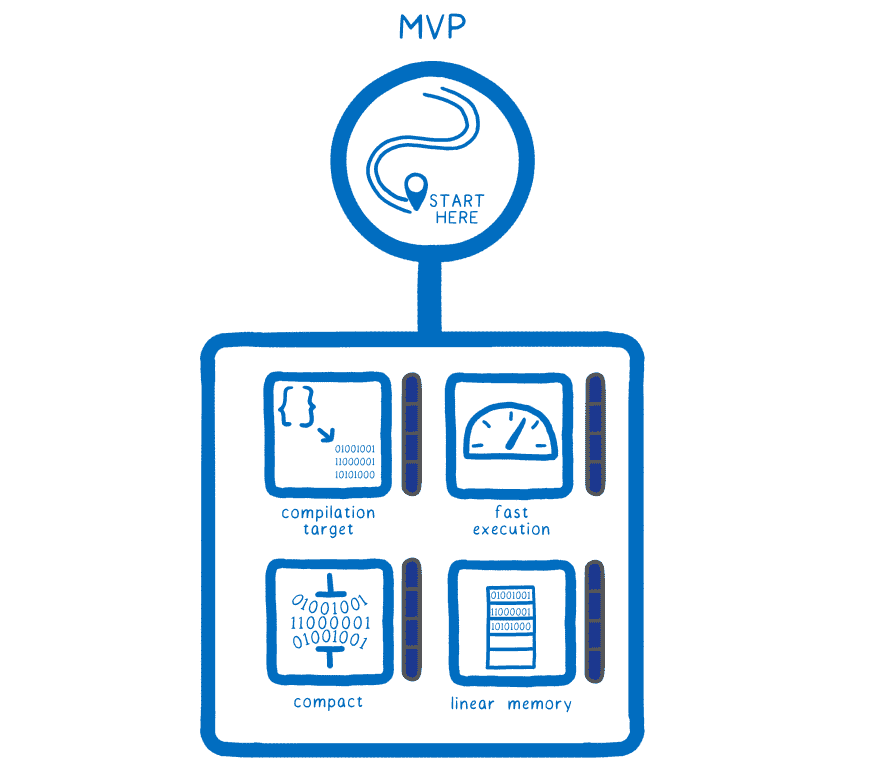

# WebAssembly 上的 Ruby

> 原文:[https://dev.to/netguru/ruby-on-webassembly-14po](https://dev.to/netguru/ruby-on-webassembly-14po)

WebAssembly，简称 WASM，是一个性能优化的解决方案，使 web 应用程序以接近本地的速度运行。这是一项尖端技术，目前的状态是 MVP(最低可行产品)，而不是 WASM 的最终版本。尽管该标准仍在不断发展，新的功能也在不断增加，但 WASM 的当前 MVP 版本保证与未来的版本兼容。这使得开发人员可以立即开始使用它，即使是对于大的项目，而不用担心未来的重大变化。这篇文章详细介绍了 WebAssembly 路线图以及未来与 Ruby 语言相关的额外特性。

**web assembly 简介**
为了简要描述 WASM 是如何工作的，我们需要了解一下 WASM 模块的概念——在 WASM 是可分发、可加载和可执行的代码单元。

*WASM 模块以二进制格式交付给浏览器，并由虚拟机(VM)执行，该虚拟机与 JavaScript VM 一起工作，共享资源(例如内存)并在同一线程中执行。*

换句话说，开发人员可以用高级语言编写代码，并事先编译成 WASM ( *)。wasm* 文件名后缀)，这将允许它在浏览器中以接近本地的速度运行。

 
*(图片:[hacks.mozilla.org](https://hacks.mozilla.org/2018/10/webassemblys-post-mvp-future/))*

在 MPV 中，WebAssembly 开发了当今大多数现代网络浏览器(谷歌 Chrome、微软 Edge、苹果 Safari 和 Mozilla Firefox)中可用的核心功能。WASM 模块、WASM 二进制格式、WASM 文本格式的引入已被证明能够为包括移动和物联网在内的广泛平台上的应用带来高性能。在浏览器上运行的 WASM 应用程序将能够满足用户对流畅交互、快速执行、快速加载和内存管理安全性的期望。

WebAssembly 和 Ruby 的进展如何
多年来，JavaScript 一直是 web 开发的主流语言。Ruby 开发者可以通过像 [Opal](https://opalrb.com/) 这样的源代码到源代码编译器将他们的 Ruby 代码转换成普通的 JavaScript。自从 WebAssembly 开发以来，开发人员现在有了另一个选择编译目标的选项。

在其发展的这个阶段，虽然 WASM 对 Ruby 只有初步的支持，但它完全支持 C/C++、Rust、Go 等语言的编译器在 WASM 运行。因此，这些静态类型的语言只需一个编译步骤就可以简单直接地编译成 WASM。这个过程很简单:只需在编译器工具链中定位 WebAssembly。

然而，对于像 Ruby 这样的动态类型语言，有一些基本的问题阻碍了编译到 WASM 的过程。虽然这些问题可以通过一些方法解决，但是在 Ruby 得到完全支持之前，还有很多基本步骤需要完成。

*   WASM 模块目前不能直接访问 DOM。有经验的开发人员试图开发许多库，允许编译代码到 WASM，并让开发人员操作 DOM，例如[https://github.com/mbasso/asm-dom](https://github.com/mbasso/asm-dom)，这在 WASM 社区非常活跃。然而，与 C、C++、C#、Rust 和 Go 等其他语言不同，Ruby 没有围绕 WebAssembly 的活跃社区。Ruby 开发人员需要编写一个 WASM 模块，其中包含大量用于操作 DOM 的粘合代码。

*   Ruby 使用垃圾收集器进行内存管理，而 WASM 没有垃圾收集器。事实上，它还没有任何内存管理工具。即使是不使用 GC 的静态类型语言也需要某种机制来管理内存分配，例如 Rust 语言的[https://github.com/rustwasm/wee_alloc](https://github.com/rustwasm/wee_alloc)。因此，Ruby 需要 WASM 对垃圾收集的支持，这是 WASM 后 MVP 时代即将出现的特性。

*   Ruby 需要一个直接的运行时支持，这在 WASM 基础设施中还没有准备好。目前，Ruby 开发人员需要创建他们自己的运行时，将所需的运行时与他们的代码一起发布，并实现 JIT (just-in-time)编译，以便快速执行。如今，创建自己的运行时是可能的，但这需要一些努力，而且这种努力必须在不同的应用程序中重复。开发人员必须将独立的运行时与他们的应用程序捆绑在一起，这对于许多用例来说是一个障碍。

出于以上所有原因，在目前的开发状态下，Ruby 还不能自动、干净、高效地编译成 WASM。

**结论**
毫无疑问，今天的 WebAssembly 是 MVP 完整，但不是功能完整。在后 MVP 中，有更多的附加功能预计将被实现并仍处于进展状态，这将从根本上改变我们可以使用 WebAssembly 做什么。这些特性包括垃圾收集、多线程、零成本异常和固定宽度 SIMD(单指令多数据)等。在这些特性中，有些可以快速开发，而有些则需要更多的时间才能达到预期的效果。在谷歌、微软和 Mozilla 的共同努力下，在一个活跃的社区中，新的想法和建议被公开提出并加入到跟踪问题中，WASM 有望成为一个更成熟的产品和高性能 web 开发的未来。更多[见此处](https://github.com/WebAssembly/design)。

希望这篇文章已经为您提供了一个有用的简要见解，让您了解与 Ruby 语言相关的 WebAssembly 的当前状态以及 WebAssembly 的未来发展方向。Ruby 传统上有一个全面的工具生态系统，依赖于类 Unix 环境、编译器工具链和标准库。所以我相信，当 WASM 达到成熟状态时，它将在未来无缝地融入 Ruby 的生态系统。

**阅读更多**
[https://webassembly.org](https://webassembly.org)
[https://blog.scottlogic.com/2018/07/20/wasm-future.html](https://blog.scottlogic.com/2018/07/20/wasm-future.html)
[https://github.com/WebAssembly/design](https://github.com/WebAssembly/design)
[https://github.com/appcypher/awesome-wasm-langs](https://github.com/appcypher/awesome-wasm-langs)
[https://github.com/opal/opal](https://github.com/opal/opal)
[https://github.com/wasmerio/ruby-ext-wasm](https://github.com/wasmerio/ruby-ext-wasm)(Ruby 库用于执行 WASM 二进制)
[https://github.com/wasmerio/wasmer](https://github.com/wasmerio/wasmer)(独立 JIT WASM 运行时)
[https://github.com/blacktm/ruby-wasm](https://github.com/blacktm/ruby-wasm)(Ruby 库用于编译 Ruby 脚本到。wasm 文件)
[http://blacktm.com/blog/ruby-on-webassembly](http://blacktm.com/blog/ruby-on-webassembly)
[https://hacks . Mozilla . org/2018/10/web assemblys-post-MVP-future/](https://hacks.mozilla.org/2018/10/webassemblys-post-mvp-future/)

弗朗西斯科·卡塞罗在 [Unsplash](https://unsplash.com/s/photos/rails) 上拍摄的照片