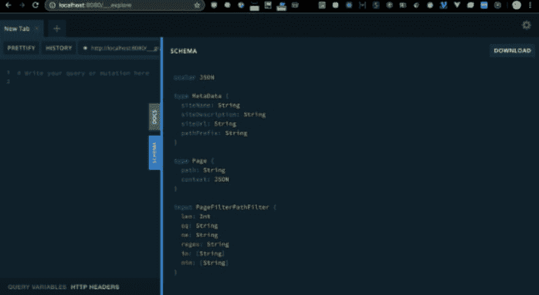
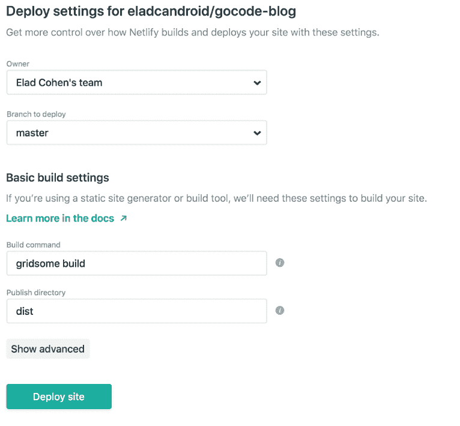

# 如何建立自己的博客？

> 原文:[https://dev.to/eladc/how-to-build-my-own-blog-3ebn](https://dev.to/eladc/how-to-build-my-own-blog-3ebn)

曾几何时，要创建一个个人博客，你需要一个像 WordPress 这样的笨重系统，包括用户管理、大量你不知道如何阅读的目录和文件。如今，有了 Angular、React 和 Vue.js 等框架，一切都变得简单而容易..

如果你想知道——“他为什么要愚弄我们？”那么事实是你说得很对...😎在框架中，你不能简单地写博客而不必每次都接触代码并“弄脏你的手”
在这里，“静态站点生成器”帮了我们的忙，比如**盖茨比**和 **GridSome** 。

我刚刚提到的两个工具，用于 React 的 Gatsby 和用于 Vue.js 的 GridSome，给我们的是一个最小的代码外壳，仅仅用于显示你想要连接的静态内容。

内容可以从 Markdown 甚至 WordPress 文件中提取...此外，您将收到一个服务器端呈现，它将根据您的内容为您构建 HTML 文件。所以来吧，让我们开始吧...

# [](#gridsome)网格体

当然，我假设您已经在最新版本上安装了 Node.js。如果没有-站在角落里或只是在我看到之前快速安装！👻

要创建一个新项目，请在 Terminal / CMD / iTerm / Terminus 或另一个奇怪的名称处键入以下命令:

```
npx gridsome create my-gridsome-site 
```

npx 从何而来？！好了，放松！我来解释！npx 是一个全局运行包的命令，不需要像以前一样安装它们(npm i -g 包)，然后我们进入新诞生的库并运行一个开发服务器:

```
cd my-gridsome-site
npm run develop 
```

假设您的端口没有被占用，服务器将默认运行在 localhost: 8080。

# [](#create-pages)创建页面

任何。您在页面目录下创建的 vue 文件将自动添加为博客的路径。这里的想法是尽可能简化路由问题。当然，如果你想做一些更复杂的事情，你需要在这里的文档中挖掘一些:[https://gridsome.org/docs/pages](https://gridsome.org/docs/pages)

# [](#architecture)建筑

[T2】](https://res.cloudinary.com/practicaldev/image/fetch/s--Locylm-n--/c_limit%2Cf_auto%2Cfl_progressive%2Cq_auto%2Cw_880/https://thepracticaldev.s3.amazonaws.com/i/t8ldbfqi1ytvfe9wcofq.png)

我将作为你的导游讲话...

从图片的左侧，你可以看到我们的信息来源——无论是 WordPress 这样的 CMS 还是其他叫做 Headless CMS 的系统，它们更关注使用 API 传递信息，而不是网站本身的可见性。

Markdown，JSON，CSV 甚至 Mongo 的 direct APIs 等系统都能找到。

GraphQL 被选为将所有信息系统链接到您的页面的查询语言，它将描述所传输信息的结构..例如:对于包含所有帖子的主页，我们可以编写以下代码:

```
<page-query>
query Post ($path: String!) {
  post: post (path: $path) {
    title
    path
    date (format: "D/MM/YYYY")
    timeToRead
    tags {
      id
      title
      path
    }
    description
    content
    image (width: 860, blur: 10)
  }
}
</page-query> 
```

请注意，这是 vue 文件中的一个特殊块，它定义了 GraphQL 查询以使用通过 GraphQL 查询传输的信息。
整个 index.vue 页面看起来会像这样:

```
<template>
  <Layout :show-logo="false">
    <!-- Author intro -->
    <Author :show-title="true" />

    <!-- List posts -->
    <div class="posts">
      <PostCard v-for="edge in $page.posts.edges" :key="edge.node.id" :post="edge.node"/>
    </div> 
  </Layout> </template> 
<page-query>
{
  posts: allPost(filter: { published: { eq: true }}) {
    edges {
      node {
        id
        title
        path
        tags {
          id
          title
          path
        }
        date (format: "D/MM/YYYY")
        timeToRead
        description
        image (width: 770, height: 380, blur: 10)
        ...on Post {
            id
            title
            path
        }
      }
    }
  }
}
</page-query> 
<script>
import Author from '~/components/Author.vue'
import PostCard from '~/components/PostCard.vue'

export default {
  components: {
    Author,
    PostCard
  },
  metaInfo: {
    title: 'GoCode Blog'
  }
}
</script> 
```

查询的结果将输入一个名为 *$page* 的特殊变量，我们可以在模板或脚本部分中使用它。

使用 GraphQL 的另一个解释可以在这里找到:

[GridSome 查询数据](https://gridsome.org/docs/querying-data/#how-to-query-with-graphql)

运行这个来查看项目中配置的所有 GraphQL 查询，甚至执行它们:

```
npm run explore 
```

你会看到一个可爱的操场，看起来像这样:

[T2】](https://res.cloudinary.com/practicaldev/image/fetch/s--2yU1ymf7--/c_limit%2Cf_auto%2Cfl_progressive%2Cq_auto%2Cw_880/https://thepracticaldev.s3.amazonaws.com/i/9f7wyshqj7gy3qy9hidf.png)

对于那些不熟悉 GraphQL 的人来说，这是一种来自脸书的很棒的查询语言，它以类似于 JSON 对象的方式编写，允许我们定义多字段和嵌套检索，在一篇文章中，你可以准确地描述我们想要从服务器得到什么。但是这个短语太笼统了，所以你应该开始钻研这个问题...

# [](#markdown-and-other-vegetables)降价出售其他蔬菜

要开始编译像 Markdown file support 这样的插件，请配置 gridsome.config.js 文件，如下所示:[https://gridsome.org/docs/plugins](https://gridsome.org/docs/plugins)或者只需通过在 create 命令中添加启动器名称来创建一个带有启动器的项目。

例如:

```
npx gridsome create my-website https://github.com/gridsome/gridsome-starter-markdown-blog.git 
```

或者

```
npx gridsome create my-website https://github.com/gridsome/gridsome-starter-blog.git 
```

# [](#deploy-on-netlify)部署在[网上](https://www.netlify.com/)

如果我们回到上面看到的架构——当我们运行 build 时，我们将为每个路由获得渲染的 html 页面，以便不损害我们站点的 SEO(不像标准 SPA 包含一个带有内部路径路由的页面)。

```
gridsome build 
```

上面的命令将为您构建一个简化的捆绑版本，它将位于 *dist* 目录中。
你可以把它上传到任何静态服务器，比如 Github Pages 或者 Netlify。为了检查一切是否正常，您可以在文件上运行 Live Server:

```
npx live-server ./dist 
```

现在是部署阶段:Netlify 是目前向静态网站提交内容最方便的工具之一，它有一个非常棒的免费程序。看看这有多简单:

在上传到 Netlify 之前，我们将为项目添加 Git 支持，并将文件推送到 GitHub。

好了，回到 Netlify——注册网站并登录到您的仪表板。点击“来自 GIT 的新站点”，连接到 Github / Bitbucket / GitLab，选择合适的存储库。

还有两个小设置:

在构建命令下，输入:

```
gridsome build 
```

发布目录:

```
dist 
```

你一定已经理解了其中的逻辑。
以下是截图:

[T2】](https://res.cloudinary.com/practicaldev/image/fetch/s--mxUHAW71--/c_limit%2Cf_auto%2Cfl_progressive%2Cq_auto%2Cw_880/https://thepracticaldev.s3.amazonaws.com/i/o0rp6dkfkexhl6ols7im.png)

什么？这个？！完全？我保证！！🤗

如果我们想改变什么会怎么样呢？保存、提交、推送和删除将为您检测并重建它！

你可以在你的网站上看到这个神奇的产品。

已经结束了？是的。告诉我你的感受..

# [](#but-what-about-gatsby)但是盖茨比呢？

Gatsby.js 和 GridSome 真的很像...这怎么可能呢？因为 GridSome 只是为了 Vue.js 才是盖茨比的精彩翻版。

但是如果你喜欢反应，也可以试着和他一起玩...

# [](#can-i-look-at-the-code)我能看看代码吗？

当然可以！享受这个 [GitHub 库](https://github.com/eladcandroid/gocode-blog)并拥有一段美好的博客时光！