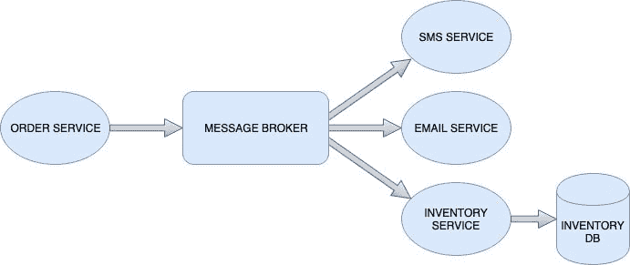

# 使用消息队列的异步处理

> 原文：<https://dev.to/jainsahab/asynchronous-processing-with-message-queues-189b>

听说过*火了又忘了*处理？如果没有，一个简短的场景可以帮助我们理解这一点，即*调用者*在调用后立即返回，而*被调用者*的实际执行是并行执行的。简而言之，*调用者*在发起*被调用者*的执行后，对于要完成的任务不会被阻塞。让我们看一个现实生活中的例子来更好地理解它。

```
class RequestController {
  @PostMapping("/order")
  fun placeOrder(): Response {
    OrderService().placeOrder()
    MailService().sendMail()
    return Response.SUCCESS
  }  
} 
```

```
class MailService {
  fun sendMail() {
    Thread {
      // mail sending logic
    }.start()
  }
} 
```

在上面的 *kotlin* 片段中，我们可以看到 RequestController 在收到请求后做了两件事:

1.  使用`OrderService`发出实际订单。
2.  使用`MailService`发送邮件通知。

如果我们再次关注`MailService`代码，它会在新的`Thread`中发送一封邮件。通过使用一个新的`Thread` , `MailService`确保它的调用者不会被阻止完成呼叫。由于发送邮件可能是一个繁重的 IO 操作(建立与 SMTP 服务器的连接，这很容易出现网络错误)，因此`Client`不应该等待服务器发送邮件，这可以通过`Asynchronous`的方式执行。

显然，如果下了订单，但邮件发送逻辑由于任何错误而失败。`Client`仍然会收到一个表示订单状态的**成功**响应。由于邮件通知是通知用户订单的一种方式，它的失败不应该成为用户主要旅程中的障碍。

这是一种**通知**到`MailService`启动它的执行，这是通过调用`MailService`的函数来实现的。在需要进行耗时处理的情况下，需要这种通信，例如处理大量数据，但呼叫者不寻求立即的结果。

现在我们都知道什么是异步过程，以及如何在应用程序流程中有效地利用它们，但是*多流程呢？比如微服务！！*

在微服务架构中，每个服务都被设计成一个自给自足、独立的软件。在这样的架构中，单一用例通常由对多个服务的多个 HTTP 调用组成。HTTP 调用是微服务相互通信的同步方式，因为请求者期望立即得到响应。类似地，我们也希望我们的服务以异步方式工作。但是等等，我们不能调用作为不同进程的一部分运行的函数(可能在不同的机器上)。这就是[消息队列](https://en.wikipedia.org/wiki/Message_queue)来拯救我们的地方。

#### 消息队列

消息队列为多个应用程序进程提供了一种异步通信方式。将消息传递给其他流程的流程称为*生产者*，接收消息的系统称为*消费者*。*生产者*将消息放入消息队列，不需要立即响应，继续自己的处理。

我们的最后一个`Email`例子是理解这个异步消息传递系统的完美候选。

[](https://res.cloudinary.com/practicaldev/image/fetch/s--rHE2y2IS--/c_limit%2Cf_auto%2Cfl_progressive%2Cq_auto%2Cw_880/https://thepracticaldev.s3.amazonaws.com/i/2lgq2gcwy39d4pcw8m2s.jpg)

当 order service 收到来自客户端的订单请求时，它会通过在 message broker 上发布消息来通知 email service，而不会等待它完成并继续进行自己的处理(如果有)。

##### 脱钩

这种通信方式将*生产者*和*消费者*分离开来，也就是说，他们彼此不了解，通过消息代理进行通信。这种体系结构中的组件相互之间没有关系，并且更容易维护、扩展和调试。

[](https://res.cloudinary.com/practicaldev/image/fetch/s--p51YRIc2--/c_limit%2Cf_auto%2Cfl_progressive%2Cq_auto%2Cw_880/https://thepracticaldev.s3.amazonaws.com/i/zntza4umk2bmaxru6t5f.jpg)

我们刚刚添加了两个对监听`order placed`消息感兴趣的组件。`SMS service`现在可以在下订单时发送消息，同样的方式`Inventory service`可以开始包装和交付货物。我们可以看到，将该系统扩展到收听同一类消息的多个消费者是多么容易，而**不会打扰**生产者，因为`Message broker`是消费者关心的唯一部分。这些分离的组件可以随着不同的语言、不同的框架或不同的团队而不同地发展。

##### 可靠性

*生产者*和*消费者*不需要同时与消息中断器交互。*生产者*和*消费者*是完全隔离的，不需要遵循彼此的状态。生产者可以将消息放入队列，然后继续处理。*独立工作的消费者*将在能够处理消息时从队列中提取消息。如果*消费者*还没有准备好或者不可用于处理，那么当*消费者*健康并且可用于处理消息时，这些消息将被存储和交付。

您不能错过这些消息的场景可能是消息队列的一个很好的用例。例: [GDPR 合规](https://gdpr.eu/)。假设在微服务架构中，我们的应用程序将用户数据保存在多个数据库中。当来自所提供的用户界面的用户触发[删除我的数据](https://gdpr-info.eu/art-17-gdpr/)动作时，该动作必须被传播到多个服务以从多个数据库中删除数据。如果其中一个服务不健康，无法接收任何 HTTP 操作，它将不会被触发，数据仍然无法删除，这使得整个系统 GDPR *不符合*。😵

在这种情况下，可靠的消息传递是有益的。在初始触发时，*删除所有数据*可以发布到所有队列。在适当的时候，当消费者健康并准备好处理消息时，它们将被交付给消费者并由消费者处理。

#### 结论

我们看到了异步处理如何通过减少终端用户的等待时间来帮助构建交互式系统。除此之外，我们还看到了消息队列如何引入解耦，从而产生结构良好、可扩展、可维护且易于调试的系统。
最后但同样重要的是，*可靠性*确保*不会留下任何信息。:)*