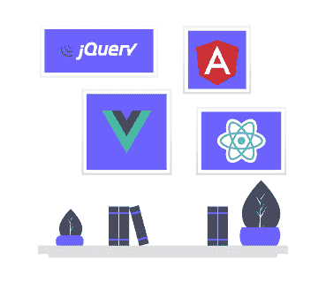
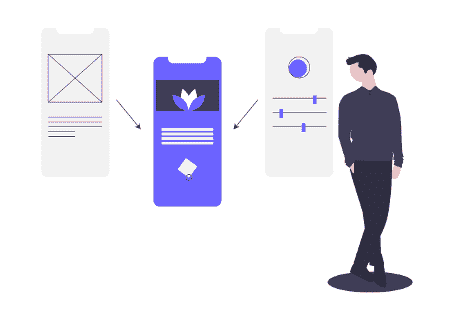

# 今天你能用 JavaScript 做什么

> 原文:[https://dev . to/n _ mehl horn/what-you-can-do-with-JavaScript-today-3bjd](https://dev.to/n_mehlhorn/what-you-can-do-with-javascript-today-3bjd)

*最初发布于 [nils-mehlhorn.de](https://nils-mehlhorn.de/posts/what-you-can-do-with-javascript-today) -在 Twitter 上关注我[了解更多内容](https://twitter.com/n_mehlhorn)*

自从 1995 年问世以来，这种著名的脚本语言已经走过了漫长的道路。虽然它可能不是每个人的最爱，但它似乎每天都有更多的粉丝，甚至在 stack overflow 上排名为最受欢迎的语言。最初的目的是通过构建 HTML 和 CSS 在网站上提供交互性，现在，你可以使用 JavaScript 做几乎任何你可以想象自己用计算机做的事情——尽管这可能是一个不同的问题，这是否总是一个好主意。让我们来看看 JavaScript 今天非常适合的真实世界的用例。

## 网页开发

惊喜，惊喜:你可以用 JavaScript 建立网站。近年来，用 [React](https://reactjs.org/) 、 [Angular](https://angular.io/) 或 [Vue.js](https://vuejs.org/) 构建的单页面应用程序在某种程度上成为了一种规范——逐渐取代了可能使用 [jQuery](https://jquery.com/) 作为交互组件的服务器端渲染网站。

[T2】](https://res.cloudinary.com/practicaldev/image/fetch/s--69cOoB3E--/c_limit%2Cf_auto%2Cfl_progressive%2Cq_auto%2Cw_880/https://thepracticaldev.s3.amazonaws.com/i/xjsh3htazbkcb6wlgi7t.png)

web 开发环境经常因其快速变化而受到批评，而框架的生命周期很短。虽然可能有一些多事之秋，但从数字上看，这实际上是没有根据的。React 于 2013 年发布，现在比以往任何时候都更有活力。Angular 也是如此，它在 2010 年发布的前身 [AngularJS](https://angularjs.org/) 的基础上刚刚成立 3 年。Vue.js 也是 5 年多前的 2014 年发布的。如果您不喜欢使用单一应用程序框架带来的负担，您可能会将它们留在身后。随着 [web 组件](https://developer.mozilla.org/en-US/docs/Web/Web_Components)的引入，现代 JavaScript 和高级构建工具你可以构建你的应用——更少的框架——看看 [Polymer 项目](https://www.polymer-project.org/)。

您不仅可以用 JavaScript 构建成熟的 web 应用程序，还可以很好地使用它来生成静态站点。你可以利用实用的解决方案，比如 [Eleventy](https://www.11ty.io/) 或者将框架带回游戏中。有了 [Gatsby](https://www.gatsbyjs.org/) 和 [Next.js](https://nextjs.org/) 以及 [VuePress](https://vuepress.vuejs.org/) 和 [Nuxt.js](https://nuxtjs.org/) 你可以分别获得使用 React 或 Vue.js 的好处，同时生成轻量级的静态页面——就像这个博客是用 Gatsby 制作的[。](https://github.com/nilsmehlhorn/blog)

## 桌面应用程序

桌面应用经常使用 JavaScript 框架 [Electron](https://electronjs.org/) 构建。它的工作原理是将你的应用程序与 Chromium 浏览器和 Node.js JavaScript 服务器打包在一起，从而提供丰富的用户体验——就像它为流行的代码编辑器 [Visual Studio 代码](https://code.visualstudio.com/)提供动力一样。遗憾的是，这种方法将导致最小的包大小约为 [100MB](https://github.com/electron/electron/issues/2003) 。如果这对你的口味来说太重了，你可以尝试像 [Vuido](https://vuido.mimec.org/) 或 [Proton Native](https://proton-native.js.org/) 这样的解决方案——但你可能不必如此！网络变得越来越强大，形成了一个进步网络应用的新时代。它们可以从用户的桌面或主屏幕启动，并获得与本机应用程序相似的感觉。通过现代 web APIs，你可以[发送推送通知](https://developer.mozilla.org/en-US/docs/Web/API/Push_API)，[连接蓝牙设备](https://developer.mozilla.org/en-US/docs/Web/API/Web_Bluetooth_API)或[创建离线体验](https://developer.mozilla.org/en-US/docs/Web/API/Service_Worker_API)。

## 手机 App 开发

渐进式网络应用程序可能还不足以满足您的需求。然而，你仍然可以用 JavaScript 构建你的本地应用。像 [NativeScript](https://www.nativescript.org/) 和 [React Native](https://facebook.github.io/react-native/) 这样的框架将允许你用 JavaScript 编写应用程序代码，同时提供原生用户体验，允许你使用该平台提供的一切。他们通过在 iOS 或 Android 手机的 JavaScript 引擎中运行您的代码，并提供到本机接口的桥梁来实现这一点。

[T2】](https://res.cloudinary.com/practicaldev/image/fetch/s--9DPi4O11--/c_limit%2Cf_auto%2Cfl_progressive%2Cq_auto%2Cw_880/https://thepracticaldev.s3.amazonaws.com/i/3m3ybxsgjqd96yu2hpiw.png)

与此同时，你可以使用 React Native 或者通过将 NativeScript 与 Angular 或 Vue.js 相结合来重新利用你的框架知识(对 React 的支持也在路上)。额外收获:这两种解决方案都可以让你在移动和网络之间共享代码，这样就有可能从一个 JavaScript 代码库交付到一系列平台上。

就我个人而言，我真的很喜欢向人们展示 native script Playground,因为它令人印象深刻地说明了使用 JavaScript 支持的原生应用程序是多么容易。

## 服务器和 API

大多数应用程序都需要某种后端——你也可以用 JavaScript 来构建它！使用 [Node.js](https://nodejs.org/en/) ,您将获得一个用于构建服务器的快速且可伸缩的 JavaScript 运行时。长期以来, [Express](http://expressjs.com/) 一直是服务器端 web 应用程序或 API 的首选框架。虽然它可能仍然是最受欢迎的，但其他人正在迎头赶上。 [Koa](https://koajs.com/) 表现为一个更小更有表现力的继任者，而 [hapi](https://hapi.dev/) 则表现出对安全性的强烈关注。其他如 [Nest.js](https://nestjs.com/) 可以放在上面来创建可靠的架构。

无论你是想设置 REST 还是 GraphQL APIs，打开一个 web 套接字还是只是呈现一些 HTML——你都可以用 JavaScript 和 Node.js 来完成。这样你就可以为你的下一个生产力应用程序、实时协作工具、聊天室或流媒体服务奠定基础。

## 游戏开发

由于它的起源，这种语言已经非常面向用户界面。所以你只需要用 JavaScript，HTML 和 CSS 就可以制作简单的浏览器游戏。当事情变得更复杂时，你可能会决定[使用 HTML 画布进行 2D 渲染](https://developer.mozilla.org/en-US/docs/Games/Tutorials/2D_Breakout_game_pure_JavaScript)。也有一些指定的游戏开发框架让你的生活更轻松，如 [Phaser](http://phaser.io/) 或 [PixiJS](https://www.pixijs.com/) 。然而，如果你正在开发一个图形密集型工具，你可能会喜欢[Konva](https://konvajs.org/)——这是我们目前在 [SceneLab](https://scenelab.io/) 使用的。

[T2】](https://res.cloudinary.com/practicaldev/image/fetch/s--qHVRHfyl--/c_limit%2Cf_auto%2Cfl_progressive%2Cq_auto%2Cw_880/https://thepracticaldev.s3.amazonaws.com/i/wv13z3gcu5phjiw4v3ak.png)

想做 3D 游戏？你很幸运！浏览器有自己的 3D 图形界面，叫做 [WebGL](https://developer.mozilla.org/en-US/docs/Web/API/WebGL_API) 。尽管自己使用它可能会有些力不从心。相反，使用框架可能会更有成效。 [Babylon.js](https://www.babylonjs.com/) 和 [Three.js](https://threejs.org/) 是在网络上做任何 3D 相关事情的家喻户晓的名字。如果你喜欢更专注于游戏的东西，你可能会喜欢 [PlayCanvas](https://playcanvas.com) ，它也带有一个基于浏览器的编辑器。否则你也可以使用已经建立的游戏引擎如 [Cocos2d.x](https://cocos2d-x.org/cocos2dx) 与 JavaScript 绑定来开发跨平台游戏。

但是等等，还有更多:WebXR 标准(以前的 WebVR)通过允许你访问虚拟和增强现实设备，将基于 JavaScript 的游戏带到了一个新的水平。这意味着您可以使用 JavaScript 创建身临其境的 VR/AR 体验！你可以使用一个提到的 3D 框架或者看看[的 A 型框架](https://aframe.io/)。

## 机器学习

没错，你不需要为了进入机器学习而学习 Python——JavaScript 就行！使用 [TensorFlow.js](https://www.tensorflow.org/js) 您可以开发用于图像分类、音频识别或预测分析的机器学习模型。最好的事情是:你可以在 Node.js 上或者直接在浏览器中这样做！机器学习是一个非常 GPU 密集型的任务，然而，它可以通过 WebGL 在浏览器中运行硬件加速。这样，您可以创建一个完全在客户端运行的推荐系统，而不需要昂贵的服务器，同时减少隐私问题。

[T2】](https://res.cloudinary.com/practicaldev/image/fetch/s---QOad4yw--/c_limit%2Cf_auto%2Cfl_progressive%2Cq_auto%2Cw_880/https://thepracticaldev.s3.amazonaws.com/i/gwfvh09brr71e9znxvf9.png)

如果你不太喜欢 TensorFlow，你可能会喜欢用于训练神经网络的 [brain.js](https://github.com/BrainJS/brain.js) 或带有大量不同机器学习算法的 [ml.js](https://github.com/mljs/ml) 。两者都允许你在浏览器中训练和运行你的算法。

## 物联网

经济实惠的硬件越来越多，让你更容易进入微控制器的世界。虽然您通常需要学习 C 或 C++等语言来构建智能系统，但您也可以坚持使用 JavaScript！

Johnny-Five 平台为各种 Arduino 板提供了一个易于使用的 API。如果你对机器人更感兴趣，你可以看看 [Cylon.js](https://cylonjs.com/) 。两者都是通过把你的 JavaScript 翻译成设备能够理解的东西来工作的。这不可避免地限制了您在没有另一台运行 Node.js 的机器的情况下部署控制器。

[T2】](https://res.cloudinary.com/practicaldev/image/fetch/s--DQETkbLR--/c_limit%2Cf_auto%2Cfl_progressive%2Cq_auto%2Cw_880/https://thepracticaldev.s3.amazonaws.com/i/j4m3j078rpqft5ymn19m.png)

这对于为微控制器指定的 JavaScript 运行时来说是不必要的——它只需要 64KB 的 RAM。但是要注意，根据您的使用情况，您可能仍然需要使用不同的工具进入杂草中。最终，物联网可能是 JavaScript 的一个实验性应用领域——尽管它经常被用于使用 [MQTT](https://github.com/mqttjs/MQTT.js) 的相应后端服务。

## 包装完毕

正如我们所看到的，在构建一个巨大的社区和可靠的项目时，您可以用 JavaScript 涵盖各种各样的用例。这是一件很棒的事情，因为它让你能够使用一种你可能已经知道的语言，以多种不同的方式发挥创造力。

有没有我没有提到的有趣的用例？留下评论让我知道！