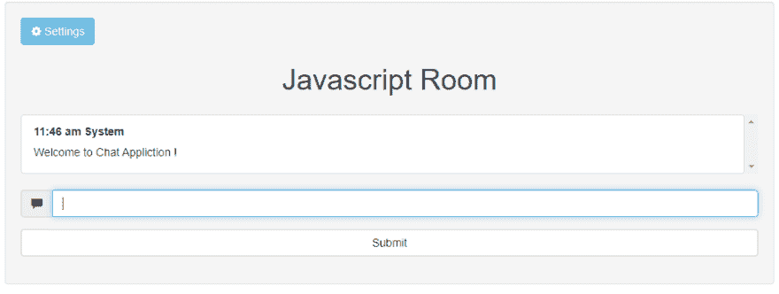

# 用 JavaScript 构建一个聊天应用程序

> 原文:[https://dev . to/bhupendra 1011/build-a-chat-application-in-JavaScript-194 p](https://dev.to/bhupendra1011/build-a-chat-application-in-javascript-194p)

#### [](#why-build-a-chat-app)为什么要建聊天 App

学习的一个简单方法是尝试解决一个问题。在我的例子中，我想构建一个[Node JS]应用程序([https://nodejs.org/en/](https://nodejs.org/en/))并将其部署在云上(类似于我后来开发的 [Heroku](https://www.heroku.com/) 🔎出)。

[T2】](https://i.giphy.com/media/26n7bfS3Awhpe9CrC/giphy.gif)

> 问题来了>>我的大多数朋友在不同的机构工作，为了在桌面上相互交流，我们尝试了类似 hangout 的应用程序...但在大多数组织中，大多数应用程序都被屏蔽了。那时(2014 年 8 月)还没有推出 WhatsApp Web，所以我决定通过学习 Node JS 和 socket.io 来解决这个问题。

* * *

#### [](#getting-started)入门

[T2】](https://res.cloudinary.com/practicaldev/image/fetch/s--s92EAgkg--/c_limit%2Cf_auto%2Cfl_progressive%2Cq_auto%2Cw_880/https://thepracticaldev.s3.amazonaws.com/i/5m73fbr0iph8rhnod7xr.PNG)

*   安装 NodeJS 并使用下面的 package.json 启动一个新的节点项目

```
 {
  "name": "Chat-App",
  "version": "1.0.0",
  "description": "",
  "main": "index.js",
  "scripts": {
    "test": "echo \"Error: no test specified\" && exit 1"
  },
  "author": "",
  "license": "ISC",
  "dependencies": {
    "express": "^4.13.3",
    "moment": "^2.12.0",
    "socket.io": "^1.3.7"
  }
} 
```

<svg width="20px" height="20px" viewBox="0 0 24 24" class="highlight-action crayons-icon highlight-action--fullscreen-on"><title>Enter fullscreen mode</title></svg> <svg width="20px" height="20px" viewBox="0 0 24 24" class="highlight-action crayons-icon highlight-action--fullscreen-off"><title>Exit fullscreen mode</title></svg>

设置[节点](https://github.com/bhupendra1011/Chat-App/blob/master/server.js) JS 文件来设置应用

```
var PORT = process.env.PORT || 3000;
var express = require("express");
var app = express(); // express app which is used boilerplate for HTTP
var http = require("http").Server(app);
// expose the folder via express thought
app.use(express.static(__dirname + '/public'));
http.listen(PORT, function() {
  console.log("server started");
}); 
```

<svg width="20px" height="20px" viewBox="0 0 24 24" class="highlight-action crayons-icon highlight-action--fullscreen-on"><title>Enter fullscreen mode</title></svg> <svg width="20px" height="20px" viewBox="0 0 24 24" class="highlight-action crayons-icon highlight-action--fullscreen-off"><title>Exit fullscreen mode</title></svg>

为用户界面设置客户端公共文件夹

*   添加[index.html](https://github.com/bhupendra1011/Chat-App/blob/master/public/index.html)启动登陆页面
*   从聊天窗口登录后，添加[chat.html](https://github.com/bhupendra1011/Chat-App/blob/master/public/chat.html)打开聊天界面
*   添加 [app.js](https://github.com/bhupendra1011/Chat-App/blob/master/public/js/app.js) 以显示从节点服务器接收的消息(使用 Socket.io)。

#### [](#socket-communication)套接字通信

*   显示欢迎信息

当用户加入一个聊天室时，系统会欢迎他登录系统。

```
 socket.emit("message", {
    text: "Welcome to Chat Appliction !",
    timestamp: moment().valueOf(),
    name: "System"
  }); 
```

<svg width="20px" height="20px" viewBox="0 0 24 24" class="highlight-action crayons-icon highlight-action--fullscreen-on"><title>Enter fullscreen mode</title></svg> <svg width="20px" height="20px" viewBox="0 0 24 24" class="highlight-action crayons-icon highlight-action--fullscreen-off"><title>Exit fullscreen mode</title></svg>

*server.js*

此外，如果其他人已经加入房间，客户端必须发出一个事件

```
 socket.on("connect", function() {
   console.log("Connected to Socket I/O Server!");
   console.log(name + " wants to join " + room);
   // to join a specific room
   socket.emit('joinRoom', {
     name: name,
     room: room
   });
 }); 
```

<svg width="20px" height="20px" viewBox="0 0 24 24" class="highlight-action crayons-icon highlight-action--fullscreen-on"><title>Enter fullscreen mode</title></svg> <svg width="20px" height="20px" viewBox="0 0 24 24" class="highlight-action crayons-icon highlight-action--fullscreen-off"><title>Exit fullscreen mode</title></svg>

*app.js*

现在，服务器将此消息广播给加入该房间的所有用户

```
 socket.on('joinRoom', function(req) {
    clientInfo[socket.id] = req;
    socket.join(req.room);
    //broadcast new user joined room
    socket.broadcast.to(req.room).emit("message", {
      name: "System",
      text: req.name + ' has joined',
      timestamp: moment().valueOf()
    });

  }); 
```

<svg width="20px" height="20px" viewBox="0 0 24 24" class="highlight-action crayons-icon highlight-action--fullscreen-on"><title>Enter fullscreen mode</title></svg> <svg width="20px" height="20px" viewBox="0 0 24 24" class="highlight-action crayons-icon highlight-action--fullscreen-off"><title>Exit fullscreen mode</title></svg>

*server.js*

*   当用户键入时显示通知

当用户在消息字段中输入时，客户端发出该事件:

```
 $('#messagebox').keyup(function() {
   console.log('happening');
   typing = true;
   $("#icon-type").removeClass();
   //console.log("typing typing ....");
   //socket.emit('typing', 'typing...');
   socket.emit('typing', {
     text: name + " is typing ..."
   });
   clearTimeout(timeout);
   timeout = setTimeout(timeoutFunction, 1000);
 }); 
```

<svg width="20px" height="20px" viewBox="0 0 24 24" class="highlight-action crayons-icon highlight-action--fullscreen-on"><title>Enter fullscreen mode</title></svg> <svg width="20px" height="20px" viewBox="0 0 24 24" class="highlight-action crayons-icon highlight-action--fullscreen-off"><title>Exit fullscreen mode</title></svg>

*app.js*

然后，服务器广播该通知:

```
 socket.on('typing', function(message) { // broadcast this message to all users in that room
    socket.broadcast.to(clientInfo[socket.id].room).emit("typing", message);
  }); 
```

<svg width="20px" height="20px" viewBox="0 0 24 24" class="highlight-action crayons-icon highlight-action--fullscreen-on"><title>Enter fullscreen mode</title></svg> <svg width="20px" height="20px" viewBox="0 0 24 24" class="highlight-action crayons-icon highlight-action--fullscreen-off"><title>Exit fullscreen mode</title></svg>

*server.js*

*   当用户在提交消息表单时发送消息，然后在对输入进行净化之后，消息被发送到服务器

```
 var $form = $("#messageForm");
 var $message1 = $form.find('input[name=message]');
 $form.on("submit", function(event) {
   event.preventDefault();
   var msg = $message1.val();
   //prevent js injection attack
   msg = msg.replace(/</g, "&lt;").replace(/>/g, "&gt;").trim();
   if (msg === "") return -1; //empty messages cannot be sent

   socket.emit("message", {
     text: msg,
     name: name
   });
   // show user messageForm
   var $messages = $(".messages");
   var $message = $('<li class = "list-group-item"></li>');

   var momentTimestamp = moment().format("h:mm a");
   // $(".messages").append($('<p>').text(message.text));
   $message.append("<strong>" + momentTimestamp + "  " + name + "</strong>");
   //$message.append("<p>" + $message1.val()+ "</p>");
   $message.append($("<p>", {
     class: "mymessages",
     text: $message1.val()
   }));
   $messages.append($message);
   $message1.val('');
   // manage autoscroll
   var obj = $("ul.messages.list-group");
   var offset = obj.offset();
   var scrollLength = obj[0].scrollHeight;
   //  offset.top += 20;
   $("ul.messages.list-group").animate({
     scrollTop: scrollLength - offset.top
   });

 }); 
```

<svg width="20px" height="20px" viewBox="0 0 24 24" class="highlight-action crayons-icon highlight-action--fullscreen-on"><title>Enter fullscreen mode</title></svg> <svg width="20px" height="20px" viewBox="0 0 24 24" class="highlight-action crayons-icon highlight-action--fullscreen-off"><title>Exit fullscreen mode</title></svg>

*app.js*

服务器监听上述客户端事件，然后在检查输入消息是否不是预定义的命令{ @ current users gives list of users in current chat room }之后，广播接收到的消息。

```
 socket.on("message", function(message) {
    console.log("Message Received : " + message.text);
    // to show all current users
    if (message.text === "@currentUsers") {
      sendCurrentUsers(socket);
    } else {
      //broadcast to all users except for sender
      message.timestamp = moment().valueOf();
      //socket.broadcast.emit("message",message);
      // now message should be only sent to users who are in same room
      socket.broadcast.to(clientInfo[socket.id].room).emit("message", message);
      //socket.emit.to(clientInfo[socket.id].room).emit("message", message);
    } 
```

<svg width="20px" height="20px" viewBox="0 0 24 24" class="highlight-action crayons-icon highlight-action--fullscreen-on"><title>Enter fullscreen mode</title></svg> <svg width="20px" height="20px" viewBox="0 0 24 24" class="highlight-action crayons-icon highlight-action--fullscreen-off"><title>Exit fullscreen mode</title></svg>

*server.js*

*   检查消息是否由用户发出

在客户端，当收到消息时，检查用户是否打开了聊天窗口。如果聊天窗口是打开的，那么这意味着，消息被看到，然后发出一个事件

```
// notify, only when the user has not open chat view
   if (document[hidden]) {
     notifyMe(message);
     // also notify server that user has not seen messgae
     var umsg = {
       text: name + " has not seen message",
       read: false
     };
     socket.emit("userSeen", umsg);
   } else {
     // notify  server that user has seen message
     var umsg = {
       text: name + " has seen message",
       read: true,
       user: name
     };
     socket.emit("userSeen", umsg);
   }
 }); 
```

<svg width="20px" height="20px" viewBox="0 0 24 24" class="highlight-action crayons-icon highlight-action--fullscreen-on"><title>Enter fullscreen mode</title></svg> <svg width="20px" height="20px" viewBox="0 0 24 24" class="highlight-action crayons-icon highlight-action--fullscreen-off"><title>Exit fullscreen mode</title></svg>

*app.js*

```
function notifyMe(msg) {
   // Let's check if the browser supports notifications
   if (!("Notification" in window)) {
     alert("This browser does not support desktop notification,try Chromium!");
   }

   // Let's check whether notification permissions have already been granted
   else if (Notification.permission === "granted") {
     // If it's okay let's create a notification
     //  var notification = new Notification(msg);
     var notification = new Notification('Chat App', {
       body: msg.name + ": " + msg.text,
       icon:img/apple-icon.png' // optional
     });
     notification.onclick = function(event) {
       event.preventDefault();
       this.close();
       // assume user would see message so broadcast userSeen event
       var umsg = {
         text: name + " has seen message",
         read: true,
         user: name
       };
       socket.emit("userSeen", umsg);
       //window.open('http://www.mozilla.org', '_blank');
     };
   }
   // Otherwise, we need to ask the user for permission
   else if (Notification.permission !== 'denied') {
     Notification.requestPermission(function(permission) {
       // If the user accepts, let's create a notification
       if (permission === "granted") {
         var notification = new Notification('Chat App', {
           body: msg.name + ": " + msg.text,
           icon:img/apple-icon.png' // optional
         });
         notification.onclick = function(event) {
           event.preventDefault();
           this.close();
           var umsg = {
             text: name + " has seen message",
             read: true,
             user: name
           };
           socket.emit("userSeen", umsg);
           // assume user would see message so broadcast userSeen event

         };
       }
     });
   }

   // At last, if the user has denied notifications, and you
   // want to be respectful there is no need to bother them any more.
 } 
```

<svg width="20px" height="20px" viewBox="0 0 24 24" class="highlight-action crayons-icon highlight-action--fullscreen-on"><title>Enter fullscreen mode</title></svg> <svg width="20px" height="20px" viewBox="0 0 24 24" class="highlight-action crayons-icon highlight-action--fullscreen-off"><title>Exit fullscreen mode</title></svg>

*app.js*

当用户看到消息
时，需要通知服务器端

```
 // to check if user seen Message
  socket.on("userSeen", function(msg) {
    socket.broadcast.to(clientInfo[socket.id].room).emit("userSeen", msg);
    //socket.emit("message", msg);

  }); 
```

<svg width="20px" height="20px" viewBox="0 0 24 24" class="highlight-action crayons-icon highlight-action--fullscreen-on"><title>Enter fullscreen mode</title></svg> <svg width="20px" height="20px" viewBox="0 0 24 24" class="highlight-action crayons-icon highlight-action--fullscreen-off"><title>Exit fullscreen mode</title></svg>

server.js

*   部署到云

现在需要将代码部署到云中，这可以通过 [Heroku](https://devcenter.heroku.com/articles/git) 轻松完成。Heroku 一次可以免费部署五个应用程序。

* * *

### [](#conclusion)结论

当我把这个分享给我的朋友时，我真的很兴奋，我们可以通过一个网络应用程序聊天，这个应用程序不会因为任何组织政策而被阻止。这是一个历时 4 年的项目，当我开始了解*dev .*时，我决定在这里学习。

为了改进这个聊天应用程序，可以添加以下功能:

*   使用 OAuth2 实现身份验证
*   添加更改用户名的选项，添加个人资料图片。
*   添加 DB 来保存聊天消息。
*   任何其他功能...

源代码:[https://github.com/bhupendra1011/Chat-App](https://github.com/bhupendra1011/Chat-App)
演示:[https://bhupendra1011.herokuapp.com/](https://bhupendra1011.herokuapp.com/)

* * *