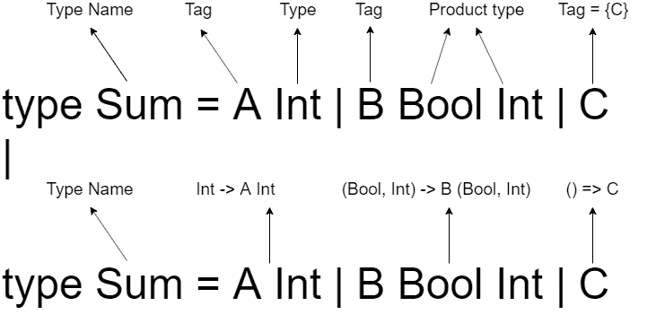

# 代数结构解释-第 1 部分-基本定义

> 原文：<https://dev.to/macsikora/algebraic-structures-explained-part-1-base-definitions-2576>

# 简介

本文是系列**代数结构讲解**的开篇。在这个系列中，我将尝试涵盖基于数学的有用的编程抽象，特别是在[抽象代数](https://en.wikipedia.org/wiki/Abstract_algebra)中。本系列面向前端开发人员，因为我将主要展示基于前端语言的示例，但这并不意味着具有不同背景的人不能从内容中受益。

### 期望

我不是数学家，我是一名开发人员，这就是为什么这个系列更多地关注那些结构的用法，而不是严格的数学理论。为了连接这两个世界，我会尽我所能，以最友好的方式提出这个话题。

本系列中使用的术语将不会是严格的或数学的，对构造的描述也可能不太深入和准确，我将以我自己的方式解释它们😉，如果您在该系列的任何文章中看到错误，请不要犹豫，留下评论。

主题将以代码示例呈现。我将使用许多编程语言，大多数是 TypeScript 和 Elm，但也为其他语言做准备，选择真的取决于主题和我的心情😀是的，真的。但是如果你不知道我写例子的语言，不要害怕，代码应该是直接的。每个片段都将被语言名称标记。未标记的代码部分将是伪代码。

### 代码标准

我将提供专注于当前主题的代码示例。我有时会跳过一些构造，如 ts 变量声明(const，let，var)或模块导入，有时我也会将一些代码部分作为`...`留下，以表明它对于给定的主题不太重要。

* * *

# 基础定义-什么是集合

首先，我说的 set 不是像 JS 中的 [set 数据结构那样的任何具体实现，而是 set 作为更抽象的数学概念——](https://developer.mozilla.org/en-US/docs/Web/JavaScript/Reference/Global_Objects/Set)[set](https://en.wikipedia.org/wiki/Set_(mathematics))。

集合只是具有一些共同特征的对象的集合，或者只是被列为集合成员`S = {a,b,c}, Nat = {1,2,3...}`。我们可以将共同特征理解为一个函数，对于作为输入的给定对象，该函数将返回该对象是否是集合的成员。`isInSet: (a: Anything) -> Yes | No`

好，那么这个特征会是什么呢？它可以是任何可以被证实的东西，并得到简单的是/否答案。为了简单起见，我们可以假设集合可以由任何种类的元素创建，集合甚至可以从无到有地创建，并且这个集合是空集`∅`，或者用更软件的术语来说- `void`。

> **给读者的练习**——void 是空集，那 null 呢？

## 基础定义-什么是类型

这和编程有什么关系？相当多。我们可以认为类型是一个集合。考虑到类型理论，类型是类型，而不是集合。但是为了简单起见，我们可以假设这些项是相等的。看看这个关于类型作为集合的伟大解释- [Elm -类型作为集合](https://guide.elm-lang.org/appendix/types_as_sets.html)。因此，例如 TypeScript 中的主要类型，如 number、bool、string、object，是一些具有共同特征的可能值的集合，这同样适用于其他编程语言，甚至是动态类型语言，但这些类型是隐式的。为了举例说明，我将从 TypeScript 中取出`number`类型。

```
[TS] isNumber = (a): a is number => typeof a === 'number' 
```

Enter fullscreen mode Exit fullscreen mode

功能`isNumber`是数字设定**特性功能**。这个函数的类型定义是`[TS](a:unknown): a is number => boolean`。它接受来自类型`unknown`的参数值，如果给定的值是类型`number`，换句话说，如果一个元素是集合`number`的成员，它就返回一个答案。看看`a is number`部分，`a`是数字类型/集合的成员，这是非常明确的信息。

> **注意**TypeScript 中的未知类型实际上是代码库中所有可用类型的联合。所以所有类型都是未知类型的子类型。

## 组成类型也是集合

不仅主要类型是集合。但是代码中的每个新类型也会形成一个集合。自定义类型可以是其他类型的组合，换句话说，它是由集合上的一些操作创建的。有两种常见的类型组合——乘积和求和，它们被广泛称为**代数数据类型**。产品通过`and`操作创建新类型，通过`or`操作求和。

### 产品类型

[](https://res.cloudinary.com/practicaldev/image/fetch/s--Wh22xYVv--/c_limit%2Cf_auto%2Cfl_progressive%2Cq_auto%2Cw_880/https://thepracticaldev.s3.amazonaws.com/i/wmph7w8k5b4c0hqlahqg.png) 
产品类型是从其他类型创建的类型，为了创建产品的实例，需要所有子类型的实例。积或笛卡儿积是集合论的术语，是通过将两个或多个集合放入元组来将它们连接成一个集合的结果。集合 A、B 和 C 的乘积是一个三元组。

产品类型最简单的例子是一对(二元组)。Pair 只是两个值`(a:A, b:B)`，一个来自 A 型，一个来自 B 型(B 可以等于 A)。要创建这样一对，这两个值都是必需的。同样，可能值的数量是这两个子类型 A 和 b 的大小的乘积。集合的大小，集合元素的个数有更恰当的名称——[基数](https://en.wikipedia.org/wiki/Cardinality)T4】

```
[TS]
// tuple
type Triangle = [number, number, number] // Product Int*Int*Int
// record - labeled tuple
type User = { name: string, age: number } // Product String*Int 
```

Enter fullscreen mode Exit fullscreen mode

令人惊讶的是，Elm 中存在几乎相同的产品语法。

```
[Elm]
-- tuple
type alias Triangle = (Int, Int, Int) -- Product Int*Int*Int
-- record - labeled tuple
type alias User = { name : String, age : Int } -- Product String*Int 
```

Enter fullscreen mode Exit fullscreen mode

为了创建三角形集合的成员，需要提供来自 Int 集合的 3 个值形式的输入。可能性的数量等于 Int <sup>3</sup> 。

> **注意**每个产品类型都可以被认为是与元组类型同构的[。任何记录/映射都只是一个带有附加标签的元组，我们可以创建这样的- `(name, lastname) -> {name:name, lastname:lastname}`，我们可以定义反向操作- `{name:name, lastname:lastname} -> (name, lastname)`。](https://www.britannica.com/science/isomorphism-mathematics)

### 求和类型

[](https://res.cloudinary.com/practicaldev/image/fetch/s--tZc3Evj_--/c_limit%2Cf_auto%2Cfl_progressive%2Cq_auto%2Cw_880/https://thepracticaldev.s3.amazonaws.com/i/8b4hcy3kh5fgfiht1wlb.png) 
Sum 类型是以这样一种方式从其他类型创建的类型，即为了创建 Sum 的实例，只需要来自子类型的一个实例。

求和类型最简单的例子是布尔类型。如果某个东西是布尔型的，它可以是 or `true`或`false`，但不能两者都是。对这个结构的典型理解是一个集合，其中列出了可能的元素，所以这进入了我们的集合定义，在这里我们定义了集合中的内容- `BoolSet = {True, False}`。但是，如果只有一种类型有两个可能的值，我们怎么能把这个结构命名为 sum 类型呢？

这是一个非常有趣的问题。只有当我们将`True`和`False`视为单值集——内部有一个元素的[单态集](https://en.wikipedia.org/wiki/Singleton_(mathematics))时，Sum 类型在这里才成立，这是完全正确的推理。

```
[Elm]
type Boolean = True | False 
```

Enter fullscreen mode Exit fullscreen mode

同样，可能值的数量是所有子集中基数的总和。至于 Boolean `True`和`False`表示各有一个元素的集合，那么 Boolean 类型正好包含两个值。

sum 类型最重要的特性是值只能属于一种类型。不可能将两种具有任何共享元素的类型相加。总和类型在每个子类型上强制标记。为了创建一个具有 String 或 Int 类型表示的类型，我们需要创建这些类型的标记版本。

```
[Elm]
-------- type definition
type StrOrInt = Str String | In Int
-------- usage
x = Str 12 
-- x has a type StrOrInt and is represented as tagged String type 
```

Enter fullscreen mode Exit fullscreen mode

#### 求和型实现明细

[](https://res.cloudinary.com/practicaldev/image/fetch/s--NQdBr_lP--/c_limit%2Cf_auto%2Cfl_progressive%2Cq_auto%2Cw_880/https://thepracticaldev.s3.amazonaws.com/i/p999td9xuk5xmxlr7zij.png)

考虑上面的图表。关于总和类型的 Elm 定义有两种解释。第一种是基于类型/集合，其中和是不相交集合的并集，其中偶数元素 **C** 也被认为是具有一个元素的集合。第二个展示了值构造函数方面的定义。换句话说，在声明的右边，我们有一些函数为我们提供类型为 **Sum** 的值。即使 **C** 在这里被呈现为不带参数的函数，这种函数也有一个名字——**const**。并且因为它是 **const** ，这里的值被急切地求值，对于其他构造函数，它们仍然是函数(懒惰的)并且需要一个参数来创建类型 **Sum** 的值。

> **注意** Sum 类型有许多名称，它也是不相交的并集、区别并集、标记并集或变体
> 
> **注**范畴论中的和式被命名为——[余积](https://en.wikipedia.org/wiki/Coproduct)。
> 
> **注意**可能有交集的联合类型在 TypeScript 中是可能的- [联合](https://www.typescriptlang.org/docs/handbook/advanced-types.html#union-types) -它不是一个 sum 类型，因为我们无法区分哪个联合类型的值来自- `string | number | string ≡(equal) string | number`

## 构成总和与乘积

总和与乘积与其他类型没有任何不同。这就是为什么进一步的组合是可能的。我们可以创建包括其他乘积和总和的乘积，以及包含其他乘积和总和的总和。

```
[ELM]
type ResultStatus = Pending | Ok | Error
-- product created from sum type Boolean and sum type ResultStatus
type alias UserProduct = { active: Boolean, age: Int, status: ResultStatus }    

-- sum created from product types tagged by Regular and Visitor tags
type UserSum
  = Regular String Int
  | Visitor String Int 
```

Enter fullscreen mode Exit fullscreen mode

在上面的代码片段中，最后两个变体- `Regular`和`Visitor`可能会令人困惑。这些变量代表真正的产品类型，因为需要从类型 String 和类型 Int 提供值，以便实现值构造函数。所以它同构于标记元组——`Regular String Int ≈(isomorphic) Regular (String, Int)`。我们知道，元组是产品类型的最基本的表示

关于代数数据类型的更多细节可以在这个非常好的解释中找到- [什么是代数数据类型？由吉洪·杰尔维斯](https://qr.ae/TWy0Is)。

> **注**第三种常见的代数数据类型是指数型。正如大多数现代语言中的函数可以作为值传递一样，值需要有类型，而函数的这些类型正是指数类型。有一个函数类型`A -> B`，类型可以表示为 B <sup>A</sup> ，所以类型表示类型 B 在给定 A 上的值
> 
> 注意我把菲利普·瓦德勒关于和与积的精彩演讲留给你们。他描述得比我好得多。【T2[https://www.youtube.com/embed/gui_SE8rJUM](https://www.youtube.com/embed/gui_SE8rJUM)

# 基本定义——什么是代数结构

好了，现在我们知道什么是集合，我们知道我们在编程中使用集合，我们称这些集合为类型。类型可以相互混合，这些组合是乘积或和，或乘积和，或和的乘积😄。

我们有一个集合，但是要有代数结构，我们还需要一样东西。而且这个东西是在片场操作的。换句话说**代数结构**是一个集合+与这个集合一起工作的操作。就这么简单。

> 记住操作需要关闭，这意味着参数和返回类型需要相同`T -> T -> T`。不封闭的集合+运算形成了数学结构，但不是代数结构。

例如 int 集合有元素相加的运算，然后 int 集合有相加运算——二元函数`int + int -> int`，创建一个代数结构，在这个例子中是**半群**。这个操作也存在中性元素，它是 *0* ，因为添加任何东西都不会改变值`a + 0 = a and 0 + a = a`，利用这两个属性——中性元素和添加操作，我们创建了另一个代数结构—**幺半群**。

# 系列中的下一个是什么

在本系列的下一篇文章中，我将介绍在编程中有用的特定代数结构。首先上桌的是**岩浆**。

[前往下一个岩浆](https://dev.to/macsikora/algebraic-structures-explained-part-2-magma-4ogn)

如果你对下一篇文章的通知感兴趣，请在 [dev.to](https://dev.to/macsikora) 和 [twitter](https://twitter.com/macsikora) 上关注我。