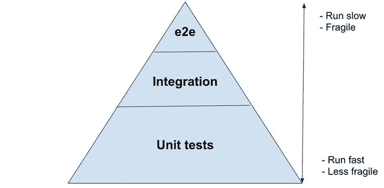
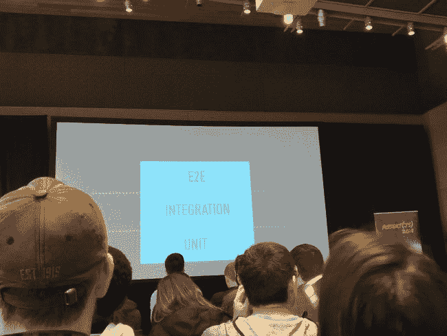

# 测试 React 应用

> 原文：<https://dev.to/reactgraphqlacademy/testing-react-applications-3bo>

目录:

*   测试方法，[转到规范章节](https://www.reactgraphql.academy/react/testing-react-applications#testing_approaches)
*   集中讨论，单元测试与集成测试，[转到规范部分](https://www.reactgraphql.academy/react/testing-react-applications#focusing_the_discussion_unit_test_vs_integration_test)
*   原则，[转到规范部分](https://www.reactgraphql.academy/react/testing-react-applications#principles)
*   比较和对比，[转到规范部分](https://www.reactgraphql.academy/react/testing-react-applications#compare_and_contrast)

在本文中，您将了解测试 React 组件的最佳方法。坏消息是我不会直接告诉你什么是最好的方法。好消息是，到本文结束时，您应该能够自己做出明智的决定，对于您的代码来说，什么是最“优雅”的方法。

## 测试方法

我们编写的最常见的测试类型是端到端(又名 e2e)、集成测试和单元测试。e2e 从一端到另一端执行用户交互。例如，用户登录交互需要从真实的浏览器(一端)到数据库(另一端)。e2e 将测试两端之间的任何代码。

单元测试测试一个代码单元。本文的重点是 React 中的测试，出于本文的目的，我将把一个单元称为 React 组件。所以在这个上下文中，unit 意味着一个将要被使用的 UI。讨论什么是代码的“单元”本身就是一篇文章。别担心，我们已经拿到那篇文章了。集成测试是测试介于其他两者之间的任何东西的测试。

基于这三种测试类型的一些变化，有不同的方法来测试 React 应用程序。让我们来看看其中的一些变化:

### 测试金字塔

这种方法告诉我们，我们应该主要编写单元测试，其次是较少的集成测试，甚至更少的 e2e 测试。

有两个主要原因，我们不应该根据这种方法编写太多的 e2e 测试。首先，e2e 很慢，因为它测试很多东西，并且它需要运行其他软件，如浏览器、数据库等来完成测试。其次，e2e 测试是脆弱的，因为如果它一次测试的许多部分中的任何一个失败了，那么整个 e2e 测试就会失败。

在金字塔 e2e 面的对面是单元测试。单元测试运行速度很快，因为它们不需要很多资源来运行。单元测试不那么脆弱，因为它们独立地测试代码的一小部分。如果一个单元测试失败了，它应该是单独失败的，不会影响其他单元测试。

Mike Cohn 在他 2009 年首次出版的《敏捷成功》一书中创造了术语“测试金字塔”。如今许多公司都采用这种方法。然而，在软件行业，10 年内会发生很多事情，例如，e2e 工具从那时起已经有了很大的改进。所以，被很多人用了很多年，不代表我们不应该质疑它。

### 伦方

另一种方法是亚伦·阿布拉莫夫在 2018 年初推出的亚伦广场。如果我们遵循这种方法，那么我们应该编写相同数量的 e2e 测试、集成测试和单元测试。

### 肯特·c·多兹奖杯

另一种方法是 2018 年初推出的 Kent C. Dodds Trophy。在这种方法中，我们应该编写比单元测试和 e2e 测试更多的集成测试，然后是静态类型检查(TypeScript、Flow、eslint 等)。

## 聚焦讨论，单元测试 vs 集成测试

在本文中，我们将重点讨论 React 中的集成测试和单元测试。E2E 测试和静态类型与我们选择用来构建 UI 的库或框架无关。例如，我们可以使用 Cypress 和 TypeScript with Angular 或 Vue。

如果你想知道我为什么在这个长的介绍中解释 e2e，那是因为我想激发你的批判性思维，质疑你对测试的一些信念。向你展示来自三位不同专家的三种不同的既定方法为提问奠定了良好的基础。

因此，我们最后的问题可能是，**我们应该写更多的单元测试而不是集成测试吗？还是反过来？也许五五开？**

有一次，我有幸接受了 Kyle Simpson 的培训，并和他一起结对编程。我问他:“凯尔，你写单元测试多还是集成测试多？”。他回答了类似的话:“显然，我写了更多的集成测试”。🤔...当我问他为什么时，他回答说...用户从不使用单位。这些单元总是与其他单元组合在一起，以实现用户将使用的一些更强大的功能。因此，测试这些部分如何协同工作比单独测试更有价值。”

当谈到测试时，甚至在受人尊敬的开发人员中也有不同的意见。那么，我们该怎么办呢？

## 原则

似乎我们不能就正确的测试方法达成一致。不同的专家有不同的看法。我也有自己的看法，不告诉你。相反，我会告诉你我用来比较它们的标准和原则是什么。

### 有标准

首先，让我们定义一个标准。对我来说，好的测试是这样的:

*   我可以在不改变测试的情况下重构代码。这让我更开心。
*   它给了我很高的信心，让我相信我编写的代码能够按预期工作。

这是我的标准。我鼓励你有自己的孩子。最有可能的是，作为一名开发人员，你不会花费 100%的时间来编写测试(我希望，两者都不是，相反)，但是编写好的测试很大程度上受到被测试代码质量的影响。因此，拥有关于什么是好的测试的标准将会在日常的代码相关决策中指导我们。

### 测试与“如何”相对的“是什么”

测试**代码做什么**意味着我们编写的测试其他代码的代码不知道被测试代码的实现细节。如果我们测试“什么”,那么我们可以重构测试主题，而不改变与之相关的测试。

测试被测试的代码如何工作意味着当我重构被测试的代码时，我可能需要改变测试。换句话说，测试知道测试主题的实现细节。

根据我的标准，测试“什么”更好。“什么”和“如何”也被称为[黑盒测试和白盒测试](https://www.reactgraphql.academy/react/unit-testing-fundamentals-explained-using-javascript/#white_box_testing_vs_black_box_testing)，黑盒是“什么”，白盒是“如何”。

### 适应变化

我们知道[编写软件是复杂的](https://www.reactgraphql.academy/blog/the-number-one-reason-that-will-make-you-want-to-test-your-code/#writing_software_is_complex)，所以很可能明天我们将需要修改我们今天编写的代码。让我们拥抱变化。

我们很多人在构建软件时遵循的一个原则是构建可以重复使用的独立小单元，比如乐高积木(哎呀，我用了一个陈词滥调🤭).问题是，取决于我们如何将这些单元连接在一起，在我们方便的时候很难在测试中解开它们。

“在我们方便的时候在我们的测试中解开它们”——是的，我建议我们应该考虑让代码适应测试，😱。你可能认为这是根本错误的。理论上，我同意。在实践中，如果这种调整显著地改进了我的重构，并且几乎没有时间成本地增加了我的信心，那么我倾向于不同意我们不应该这样做。但是！我知道你可能有不同的标准，如果对你有用的话，这是很好的。

#### 依赖注入

依赖注入(也称为更广泛的控制反转技术)是一种技术，通过这种技术，一堆代码(功能)被提供给一个依赖于它的单元，所提供的功能可以在运行之前或运行时被任何其他功能替换。

这方面的一个例子是 React 组件，它在组件挂载时从 API 获取一些数据。当应用程序在用户的浏览器上运行时，我们希望组件连接到 API。例如，如果在我们的测试环境中，测试无法访问 API，或者可以访问，但速度非常慢，那么在运行测试时，我们会希望将连接到 API 的代码替换为其他一些直接返回响应的代码，而不涉及任何网络请求。

澄清一下，我并不提倡依赖注入(DI)。基于我遵循的第一个原则，测试“什么”而不是“如何”，DI persé不是一件好事。原因是，每当我注入一个依赖项时，就意味着我对功能是如何实现的有所了解。从纯黑盒的角度来看，我甚至不应该知道我测试的代码有依赖关系。

DI 可以最小化一个问题，但是问题还是会存在。只要我们的应用程序有副作用(问题)，我还没有见过一个没有副作用的应用程序，我们必须设法解决这个问题。

围绕 DI 设计我们的整个应用程序，就像 Angular 做的一些框架一样，可能会鼓励实现，以我的经验来看，这会使重构和测试变得乏味，这违背了它的目的。然而，我认为 DI 是一个明智使用的好工具。

## 比较和对比

说够了，让我们比较一下这个视频中的一些代码:

[相关视频。](https://www.youtube.com/watch?v=xjP3Ll1UhEw&start=605)