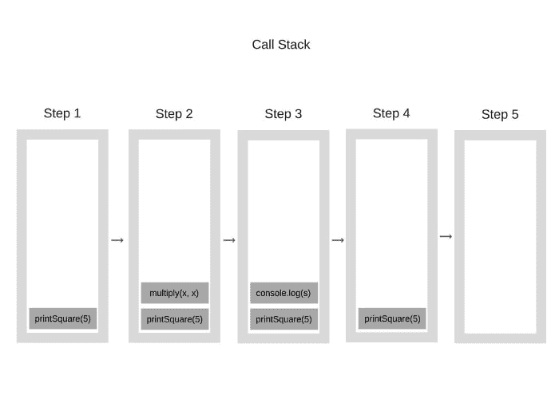

# Node.js 在第二层布下-了解 JavaScript

> [https://dev . to/_ static oid/node-js-down-dos-panos-2-understanding JavaScript-3np 7](https://dev.to/_staticvoid/node-js-por-baixo-dos-panos-2-entendendo-javascript-3np7)

在我们的前一篇文章中，我们讨论了一些关于 C ++的事情，什么是 Node.js，什么是 JavaScript，它们的故事，它们是怎么产生的，现在是什么样子。我们还讨论了如何在 Node.js 中实际实现文件系统函数，以及 Node.js 如何真正分为组件。

现在，让我们来看一下这个系列的第二篇文章。在本文中，我们将探讨 JavaScript 的一些方面。

## 布下 JavaScript

让我们把事情弄清楚。我们可以看到实际 C ++代码的外观，它运行在我们写在 Node.js 上的所有废话下面，JavaScript 是 Node.js 中的最高组件，我们先问一下我们的代码是如何运行的，JavaScript 是如何工作的？

大多数人知道一些现成的句子并重复:

*   JavaScript é de 单线程
*   O Chrome 美国 o V8 como JavaScript 引擎
*   JavaScript 美国 filas de 回调
*   是否存在事件循环

但他们是否深入探讨了这些问题？

*   单线程的意义何在？
*   什么是 JS 引擎？什么是 V8？
*   这些回调队列如何工作？只有一个队列吗？
*   什么是事件循环？它是如何工作的？谁控制？是联署材料的一部分吗？

如果您能够回答两个以上的问题，请考虑高于平均值，因为大多数 JavaScript 开发人员都不知道该语言背后有什么-我...。但别担心，我们是来帮忙的，所以让我们来深入了解 JavaScript 的概念，以及它实际上是如何工作的，最重要的是，为什么其他人会这么说它。

### 引擎 JavaScript

目前，最流行的 JavaScript 引擎是 V8(继 Git 之后人类编写的最好的软件之一)。这仅仅是因为最常用的浏览器是 Chrome，或者是铬(Chrome 是 chrome 的开源导航引擎)是如何工作、勇敢等等-我...。但他不是唯一一个。我们有微软为 Edge 浏览器编写的 Chakra，Netscape 编写的 spider monkey--现在由 Firefox 运行--以及 Rhino、kj、Nashorn 等许多其他程序。

但是，由于 V8 是在 Chrome 和 Node.js 中使用的，所以我们将保持原样。首先，让我们大致了解一下 JavaScript 引擎的外观:

[](https://res.cloudinary.com/practicaldev/image/fetch/s--M1-XdaOR--/c_limit%2Cf_auto%2Cfl_progressive%2Cq_auto%2Cw_880/https://github.com/khaosdoctor/my-notes/raw/master/node/assets/v8-simplified.png)

该机制主要由两个组成部分组成:

*   O **内存堆**:所有内存分配发生的地方
*   A **呼叫堆叠(或呼叫堆叠)**:我们的代码放在哪里帧并堆叠起来执行

> 我们稍后将有一篇关于 V8 的文章

### O 运行时 JavaScript

开发人员使用的大多数 API 都是由引擎本身提供的，正如我们在编写代码‘t0’时在前面各章中所看到的那样。但是，有些并非由引擎提供，如`setTimeout`，任何形式的 DOM 操作，如`document`甚至 AJAX(对象`XMLHttpRequest`。这些 API 是从哪里来的？让我们把我们以前的形象带回我们生活的严酷现实:

[](https://res.cloudinary.com/practicaldev/image/fetch/s--eVmWSWwq--/c_limit%2Cf_auto%2Cfl_progressive%2Cq_auto%2Cw_880/https://github.com/khaosdoctor/my-notes/raw/master/node/assets/v8-real.png)

引擎只是 JavaScript 功能的一小部分-我...。JavaScript(JavaScript)-我...。有浏览器提供的 API，我们称之为**—或者**【外部 API】**—这些 API(如`DOM`、`AJAX`和`setTimeout`)由浏览器开发人员提供—在本例中为 Chrome，则而且他们是大多数人讨厌(而且仍然讨厌)JavaScript 的主要原因。当我们看今天的 JavaScript 时，我们看到一个充满 NPM 包等东西的领域，但主要是到处都是同质的。很好-我...。不是一直都是这样。**

 **当时，在 ES6 和 Node.js 甚至作为一个想法存在之前，对于如何在浏览器端实现这些 API 没有达成共识，因此每个供应商是否都有自己的实现-我...。也就是说，我们必须不断地检查和编写只能在特定浏览器上运行的代码片段(还记得 IE 吗？)，某个特定的浏览器可以实现“T0”与其他浏览器稍有不同，或者在某些实现中可以调用“T1”功能；最坏的情况下，蜜蜂根本不存在。这种情况正在逐渐改变，因此，幸运的是，现在我们已经就哪些 API 应该存在以及如何实施这些 API 达成了一些共识和协议，至少是最常用和最基本的 API。

此外，我们还有事件循环和回调队列。我们稍后再谈。

### 调用堆栈

大多数人都听过 JS 是单线程的语言，然后大家都不知道为什么就接受它为宇宙的终极真理。cingle 线程化意味着我们一次只能执行一个调用堆栈，也就是说，一次只能执行一个操作。

[](https://res.cloudinary.com/practicaldev/image/fetch/s--nTa40azM--/c_limit%2Cf_auto%2Cfl_progressive%2Cq_auto%2Cw_880/https://github.com/khaosdoctor/my-notes/raw/master/node/assets/call-stack.jpg)

> call stack 不是 Javascript 的一部分，而是引擎的一部分，在我们的情况下是 V8。但我要把它放在这里，这样我们就可以了解事情应该如何在一个流程中运作

#### 关于桩

[栈](https://en.wikipedia.org/wiki/Stack_%20(abstract_data_type))是用作元素集合的抽象数据类型。「堆叠」这个名称是从堆叠在彼此上方的一组方块中类推而来的，虽然从堆叠顶端取出一个方块很容易，但取出较低的方块可能需要先取出堆叠中的其他几个项目。

堆栈有两种主要方法:

*   **推**:向集合中添加另一个元素
*   **pop** :删除尚未从堆栈中删除的最近添加的元素，**返回**其值

堆栈的一个重要方面是元素的发送顺序实际上很重要。在堆栈中，元素退出的顺序称为**LIFO**，是**l**astIn**f**IRST**或** ut，的缩写

> 此外，我们还可以有另一种叫做`peek`的方法，该方法读取最近添加的项目(栈顶)，而不将其删除。

我们需要知道的关于电池的一切如下:

*   它们是一种数据结构，堆栈中的每个项都有一个值(在本例中是语句或调用)
*   新项目(呼叫)将添加到堆栈的“”顶部
*   移除的项目也从堆栈的“”顶部退出

#### 栈和 JavaScript

基本上，在 JS 中，堆栈记录了我们当前在程序中执行的位置。如果我们进入一个函数，调用它，我们把这个调用放在堆栈的顶部。从函数返回后，我们删除堆栈顶部。其中每一个呼叫都称为**栈帧**。

首先，让我们做一个简单的程序，它不同于我们以前的程序:

```
function multiply (x, y) {
    return x * y
}

function printSquare (x) {
    const s = multiply(x, x)
    console.log(s)
}

printSquare(5) 
```

Enter fullscreen mode Exit fullscreen mode

> 等我们解释完之后再来看看我们的例子`readFile`

引擎执行代码时，调用栈首先为空。在每个步骤之后，它将填充以下内容:

[](https://res.cloudinary.com/practicaldev/image/fetch/s--9mCdpDuB--/c_limit%2Cf_auto%2Cfl_progressive%2Cq_auto%2Cw_880/https://github.com/khaosdoctor/my-notes/raw/master/node/assets/simple-callstack.png)

让我们开始吧：

*   步骤 0(未显示)是空栈，表示程序开始
*   在第一步中，我们添加了第一个函数调用。对`printSquare(5)`的调用，因为其他所有行都只是声明。
*   在第二步中，我们进入了`printSquare`的功能定义
    *   看我们怎么称呼`const s = multiply(x, x)`，那么我们就把`multiply(x, x)`加到堆叠的顶部吧
    *   后来我们进入了`multiply`，没有函数调用，什么也没有添加到堆栈中。我们只是在`x * y`给出了一个 eval，然后返回。
    *   返回意味着函数已完成运行，我们可以将其从堆栈中删除
*   在步骤 3 中，我们不再有堆栈帧引用“`multiply(x, x)`”。所以现在让我们紧接着我们运行的最后一行，就是`console.log`行。

    *   `console.log`是函数调用，我们将添加到栈顶
    *   `console.log(s)`运行后，我们可以将其从堆栈中删除
*   在步骤 4 中，我们现在只有一个堆栈帧:`printSquare(5)`，这是我们添加的第一个

    *   因为这是第一个函数调用，并且它之后没有其它代码，所以该函数已完成。我们从堆栈中取出 stackframe
*   步骤 5 与步骤 0 相同，一个空栈

堆栈与抛出异常时堆栈跟踪的显示方式完全相同。堆栈跟踪基本上是出现异常时调用堆栈的打印状态:

```
function foo () {
    throw new Error('Exception');
}

function bar () {
    foo()
}

function start () {
    bar()
}

start() 
```

Enter fullscreen mode Exit fullscreen mode

必须印出类似:
的东西

```
Uncaught Error: Exception foo.js:2
    at foo (foo.js:2)
    at bar (foo.js:6)
    at start (foo.js:10)
    at foo.js:13 
```

Enter fullscreen mode Exit fullscreen mode

`at`只是我们堆栈的状态。

#### 堆栈溢出

不，这个错误没有得到网站的名称，对不起让你失望了。实际上，该站点被命名为早期调度中最常见的错误之一:堆栈溢出或堆栈溢出。

当我们达到调用堆栈的最大大小时，会出现堆栈溢出错误。堆栈是数据结构，这意味着它们分配到内存中，内存不是无限的；因此，这种情况很容易发生，特别是在未处理的递归函数中，如:

```
function f () {
  return f()
}

f() 
```

Enter fullscreen mode Exit fullscreen mode

每次调用“`f`”时，我们都会将“`f`”堆栈到堆栈中，但正如我们看到的，在堆栈中的某个项目到达其执行结束之前，即代码到达没有调用任何函数的位置时，我们永远无法将其从堆栈中删除。因此，我们的堆栈将具有溢出空间限制，因为我们没有终止条件:

[](https://res.cloudinary.com/practicaldev/image/fetch/s--_tydwAZx--/c_limit%2Cf_auto%2Cfl_progressive%2Cq_auto%2Cw_880/https://github.com/khaosdoctor/my-notes/raw/master/node/assets/stack-overflow.png)

幸运的是，引擎正在监视我们，并意识到函数将永不停止调用，从而导致堆栈溢出，这是一个相当严重的错误，因为它会阻止整个应用程序。如果不中断，可能会阻止或损坏整个呼叫堆栈。

### 单线程

在单线程环境中运行可能非常轻松，因为在多线程环境中运行要比在多线程环境中运行简单得多，在多线程环境中，我们必须关注推理条件和死锁。在这个世界上，这些东西并不存在，毕竟我们一次只做一件事。

但是，单线程也可能非常有限。因为我们只有一个呼叫栈，如果这个栈被一些耗时太长的代码阻塞了怎么办？

这就是我们将在下一篇文章中发现的-我...。

不要忘了在我的博客上跟进我的内容，如果[订阅时事通讯](https://blog.lsantos.dev/signup?utm_source=devto&utm_medium=article&utm_campaign=node_under_the_hood)接收每周新闻！**