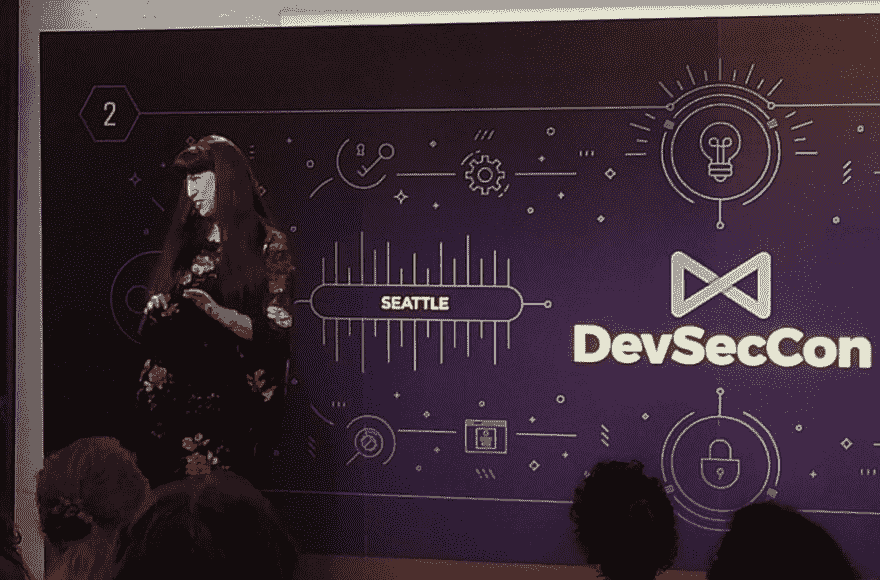

# 像老板一样向左推——第 8 部分:测试

> 原文:[https://dev . to/azure/pushing-left-like-a-boss-part-8-testing-54kd](https://dev.to/azure/pushing-left-like-a-boss-part-8-testing-54kd)

### 这个系列，还有我的博客，都动了！[来看看](https://wehackpurple.com/g8tg)！

* * *

[T2】](https://res.cloudinary.com/practicaldev/image/fetch/s--IZ3lf2UL--/c_limit%2Cf_auto%2Cfl_progressive%2Cq_auto%2Cw_880/https://thepracticaldev.s3.amazonaws.com/i/uabwvxzt7yb31wwh52y2.png)

我认为测试应该贯穿整个开发生命周期，而不仅仅是在测试阶段。我们希望尽快得到反馈，以确保我们生产出客户真正想要的高质量产品。下面我将列出一些安全测试的策略。
给开发者提供安全扫描软件(比如 OWASP Zap)，教他们使用，要求他们修复它发现的一切，然后再发给 QA。

将自动化安全测试添加到您的管道中，特别是:

*   基础架构的虚拟设备扫描(缺少补丁/配置错误-这是针对容器或虚拟机的，但是您使用不同的工具来扫描它们)
*   已知漏洞的第三方组件和库
*   动态应用程序安全测试(DAST) -只做被动扫描，这样你就不会使管道太慢

[T2】](https://res.cloudinary.com/practicaldev/image/fetch/s--j5oVPhfu--/c_limit%2Cf_auto%2Cfl_progressive%2Cq_auto%2Cw_880/https://thepracticaldev.s3.amazonaws.com/i/9polg0dvag5vwzlbgcbz.jpg)

在测试阶段，我建议做一个适当的漏洞/安全评估(VA)或 PenTest(如果你需要管理层的关注)，但要足够早，如果你发现一些东西，你可以在它发布之前修复它。

### [在我的新博客上阅读其余内容！](https://wehackpurple.com/xuro)！