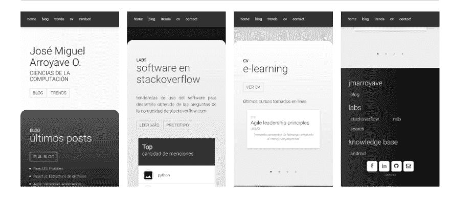
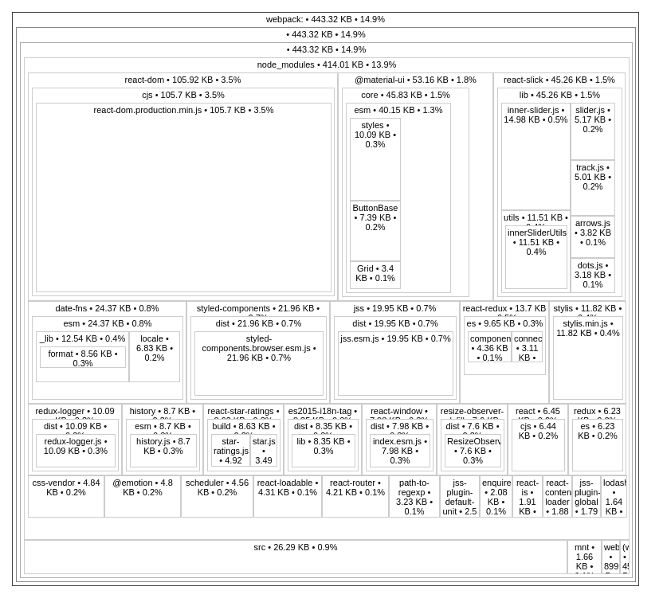

# 捆绑大小:洞察

> 原文:[https://dev.to/jmarroyave/bundle-size-insight-42g5](https://dev.to/jmarroyave/bundle-size-insight-42g5)

不知道是否有足够的文章来优化*捆绑*的大小，在我见过的几乎每一个人身上，我都找到了别的东西来补充我的过程，这就是为什么我想从我得出的结论开始。

*捆绑*是一组*资产*根据从源代码(imports)中推导出的依赖关系分析分组，用于解决项目依赖关系整合问题。由于*资产*在类型和功能上都有不同的范围，其中有些明确包含在代码中，有些隐含有助于开发过程(webpack、react、dev mode)，因此复杂性显然与捆绑的大小成正比。

最终产品不仅包括内容，还包括交互体验，当用户选择单击链接并等待反馈时，交互体验开始。虽然捆绑包简化了依赖关系的复杂性，但需要证明一些假设，以改善用户体验，例如所有代码必须同时存在(拆分)，或者必须按顺序加载(并行)，最后，源必须美观且易于理解(minify)。

总之，我的结论是，为了减少捆绑，必须在以下四个方面采取行动:

*   消除:多余或利用不足
*   提取:资产和支持并行化
*   拆分:仅对所需代码进行分组
*   优化:按资产类型列出的每项资产

# [](#problema)问题

我做了一个简单的 SPA 来介绍项目，并托管在 github 上，我需要在页面上添加动态组件，所以使用 reactjs 通过“门户”实现它。问题是这么简单的事情太重了:

```
app.js 586.6KB  
  2.js 377.3KB  
  3.js  45.7KB  
--------------  
     1,009.6KB

polyfill.js  93.1KB 
```

[T2】](https://res.cloudinary.com/practicaldev/image/fetch/s--psmGXez0--/c_limit%2Cf_auto%2Cfl_progressive%2Cq_auto%2Cw_880/https://miro.medium.com/max/1798/0%2ApJL6BzvIgSKvqdtM.png)

这是该页的照片，除了 HTML、CSS 和图像之外，还需要将近 1MB 的代码。我的假设是捆绑的代码不是，所以我花了一点时间调查并减少了每一个参与方(虽然在本文中将重点讨论 javascript 代码)

最后的结果，在修订捆绑后是:

```
app.js 481.9KB  
--------------  
       481.9KB

polyfill.js  92.9KB 
```

也就是相当于原来大小的 **48%** ，虽然假设是正确的，但只是问题的一部分。

# [](#an%C3%A1lisis-y-herramientas)分析与工具

首先，我需要查看捆绑包的组成

## [](#webpack)WEBPACK

使用依赖关系和资产图生成一个“”文件，该文件非常大，而且 json 中包含大量信息，但不易于管理

web pack-profile-JSON > stats . JSON

## [](#webpackbundleanalyzer)[网络包-捆绑包-分析器](https://www.npmjs.com/package/webpack-bundle-analyzer)

分析 webpack 生成的依赖关系图表，该图表适合显示集合，但不太适合详细信息

# package

npm 安装 web pack-bundle-analyzer-g # analyze，生成报告

web pack-bundle-analyzer stats . JSON

[T2】](https://res.cloudinary.com/practicaldev/image/fetch/s--smnjZl1f--/c_limit%2Cf_auto%2Cfl_progressive%2Cq_auto%2Cw_880/https://miro.medium.com/max/1742/0%2AftcIMlbtIdSU03i3.png)

## [](#sourcemapexplorer)[来源-地图-资源管理器](https://www.npmjs.com/package/source-map-explorer)

很像以前的，不那么漂亮，但细节更好

source-map-explorer script.js

[T2】](https://res.cloudinary.com/practicaldev/image/fetch/s--W-UX2ofP--/c_limit%2Cf_auto%2Cfl_progressive%2Cq_auto%2Cw_880/https://miro.medium.com/max/1664/0%2ArTHZpAvZbmXDGKdG.png)

它提供了软件包组成、包括的资产和软件包的完整列表，是 webpack 生成的 stats.json 的视图

[T2】](https://res.cloudinary.com/practicaldev/image/fetch/s--F9dDnBzQ--/c_limit%2Cf_auto%2Cfl_progressive%2Cq_auto%2Cw_880/https://miro.medium.com/max/1664/0%2Aos9jcfRGEtCBn8ZH.png)

# [](#soluci%C3%B3n)解决方案

已经有了作文信息

[T2】](https://res.cloudinary.com/practicaldev/image/fetch/s--vSvGlIg9--/c_limit%2Cf_auto%2Cfl_progressive%2Cq_auto%2Cw_880/https://miro.medium.com/max/1742/0%2A2DrzfSIeip4hD4tG.png)

## [](#1-reactdomdevelopmentjs)1。反应-DOM。开发. JS

在 webpack.config.js
中切换到生产模式

```
mode: 'production' 
```

```
all - 2.82MB   
app - 2.58MB   
polyfill - 248.1KB 
```

## [](#2-momentjs-gt-datefns)2。瞬间。>日期-FNS

moment.js 的库虽然相当完整，但它非常大，而且包含的所有位置都很大。改为 [date-fns](https://date-fns.org/) 。

```
all - 2.32MB   
app - 2.08MB   
polyfill - 248.1KB 
```

## 3。清除未使用的代码

我对一些部件做了死码检查，它留下了未使用的进口

```
all - 2.27MB   
app - 2.02MB   
polyfill - 248.1KB 
```

## [](#4-helmet-gt-documenttitle)4。盔- >公文。标题

他只戴头盔把标题放在页上，这换成了 document . title =∞t0]

```
all - 2.22MB   
app - 1.98MB   
polyfill - 248.1KB 
```

## [](#5-axios-gt-fetch)5。AXIOS - >获取

它使用公理来处理通信，但它需要的功能可以被 fetch 复盖。

```
all - 2.03MB   
app - 1.79MB   
polyfill - 248.1KB 
```

## [](#6-lint-fixes)6。LINT 修复

```
all - 2.03MB   
app - 1.79MB   
polyfill - 248.1KB 
```

## [](#7-eliminar-javascripttimeago)7。ELIMINAR JAVASCRIPT-时间-以前

我正在建立一个框架，我曾经使用过这个功能，可以用 date-fns
代替

```
all - 1.62MB   
app - 1.38MB   
polyfill - 248.1KB 
```

## [](#8-materialui)8。材料-用户界面

反应器成本高，只需更新版本，希望图书馆后面的 devs 也在这方面发挥作用

## [](#9-react-gt-preact)9。反应- >预先行动

将 react 更改为 preact？这听起来不错，尽管我在迁移过程中遇到了一些错误。

```
all - 1.51MB   
app - 1.27MB   
polyfill - 248.1KB 
```

## 10。移除热载入器和开发相依性

## 11。提取资产:CSS，源，图像

webpack 微型 css 提取插件

```
all - 1.43MB   
app - 1.19MB   
polyfill - 248.1KB 
```

## [](#12-dynamic-loading)12。动力载荷

```
const { FixedSizeList } from 'react-window'; 

const { FixedSizeList } = Loadable({  
   loader: () => import('react-window'),  
       loading: Loading,  
}); 

const FixedSizeList = Loadable({  
   loader: () => import('react-window/FixedSizeList'),  
       loading: Loading,  
}); 
```

## [](#13-targeting)13。把…作为目标

```
devtool: false,  
target: "web",   
externals: {  
 React: 'react'  
} 
```

## [](#14-minimizar)14。迷你扎尔

戏弄者

[T2】](https://res.cloudinary.com/practicaldev/image/fetch/s--TfcWSQfT--/c_limit%2Cf_auto%2Cfl_progressive%2Cq_auto%2Cw_880/https://miro.medium.com/max/1742/0%2ARGTAm__1lOQCL6sY.png)

综上所述，我将上述 14 点分类如下

## [](#eliminar)ELIMINAR

发展支助

*   react-dom.development.js
*   拆卸热装载机

重构

*   moment.js
*   头盔
*   阿克斯
*   JavaScript-时间-以前
*   材料-用户界面
*   反应

修订程式码

*   没有利用 código a
*   林挺

## [](#extraer)提取

css 图像字体

## [](#dividir)除数

动力载荷

*   反应窗口
*   优化块

## 优化

目标 y 最小化

到目前为止，我知道这份清单可能更广泛。我想知道他们建议考虑的其他几点。

# 参考文献

*   [https://lemon code . net/lemon code-blog/2018/5/7/web pack-poni endo-a-dieta-tus-bundles-ii](https://lemoncode.net/lemoncode-blog/2018/5/7/webpack-poniendo-a-dieta-tus-bundles-ii)
*   [https://dev . to/sheddy _ nathan/possible-ways-to-reduce-your-web pack-bundle-size-js-secrets-550](https://dev.to/sheddy_nathan/possible-ways-to-reduce-your-webpack-bundle-size-js-secrets-550)
*   [https://medium . com/@ poshakajay/heres-how-I-reduced-my-bundle-size-90-2e 14 c8 a11 c 11](https://dev.to/@poshakajay/heres-how-i-reduced-my-bundle-size-by-90-2e14c8a11c11)
*   [https://material-ui.com/guides/minimizing-bundle-size/](https://material-ui.com/guides/minimizing-bundle-size/)
*   [https://goen ning . net/2018/11/26/how-we-reduced-initial-jscss-size/](https://goenning.net/2018/11/26/how-we-reduced-initial-jscss-size/)
*   [https://www . intercom . com/blog/reducing-intercom-messenger-bundle-size/](https://www.intercom.com/blog/reducing-intercom-messenger-bundle-size/)