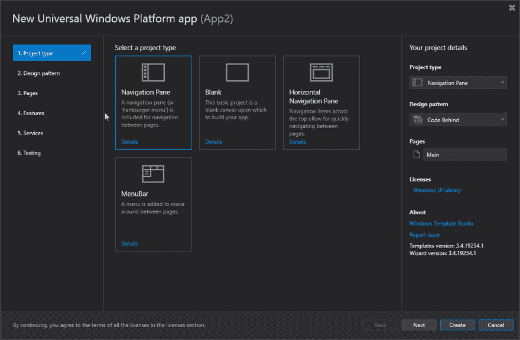
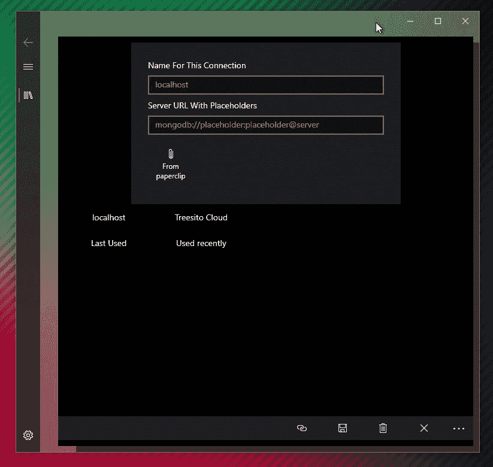
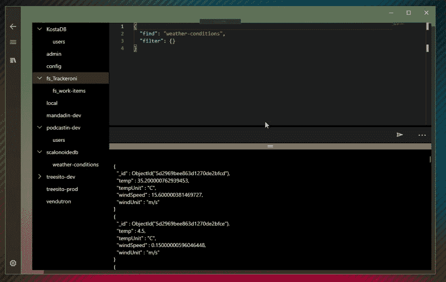
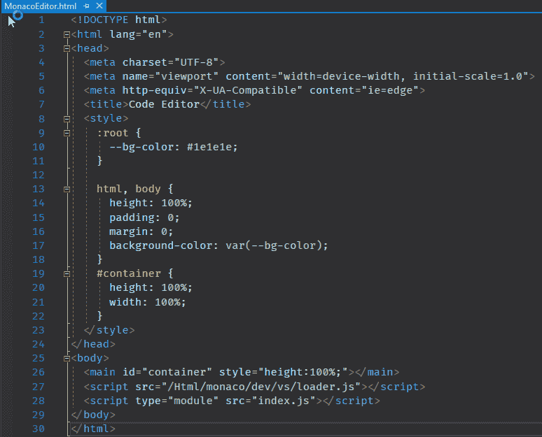
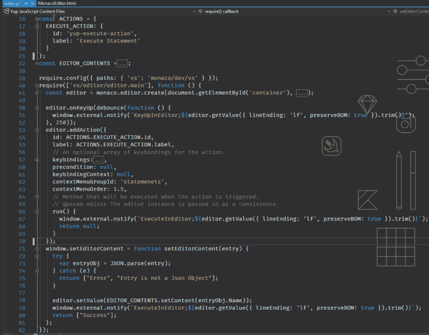
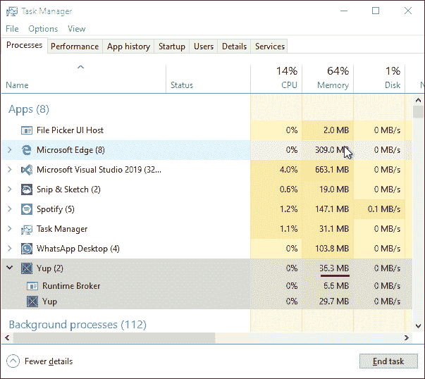
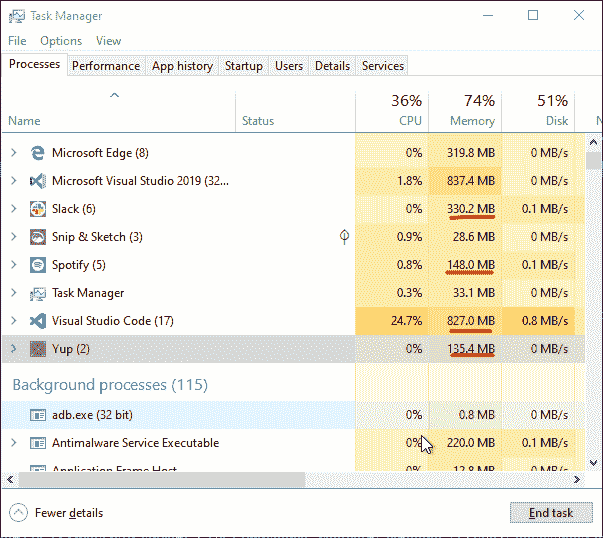

# 是的，UWP 的 MongoDB 概念验证

> 原文：<https://dev.to/tunaxor/yup-a-mongodb-poc-for-uwp-5ek6>

是的，我已经很久没有写东西了，但是今天我想分享我为 Windows Store 构建 MongoDB 数据库管理器概念验证的经验

## 从哪里开始？

一旦你有了带有通用视窗平台(UWP)开发包的 visual studio 2019，事情就简单多了，但是默认模板是...如果你(像我一样)不精通。net land 中，你会以糟糕的方式做一些好事，比如对视图文件后面的代码进行 rest 调用，以及其中大量的业务逻辑...然而，现在一个好的开始方式是使用 Windows 模板工作室项目

##  [微软](https://github.com/microsoft) / [ TemplateStudio](https://github.com/microsoft/TemplateStudio)

### Template Studio 使用基于向导的体验来加速新 WinUI 3、WPF 和 UWP 应用的创建。

<article class="markdown-body entry-content container-lg" itemprop="text">

# 模板工作室

Template Studio 是一套 Visual Studio 2022 扩展，使用基于向导的体验来加速新 WinUI 3、WPF 和 UWP 应用的创建。

*   【WinUI 模板工作室(C#)
*   WinUI 模板工作室(C++)(未来)
*   [WPF 模板工作室](https://marketplace.visualstudio.com/items?itemName=TemplateStudio.TemplateStudioForWPF)
*   [UWP 模板工作室](https://marketplace.visualstudio.com/items?itemName=TemplateStudio.TemplateStudioForUWP)

使用这些扩展创建的项目包含格式良好、可读性强的代码，并结合了最新的开发特性，同时实现了成熟的模式和领先的实践。生成的代码包括指向文档和 TODO 注释的链接，这些链接为将生成的项目转化为生产应用程序提供了有用的见解和指导。

首先，安装适当的扩展，然后在 Visual Studio 中创建新项目时选择相应的 Template Studio 项目模板。命名您的项目，然后单击 Create 启动 Template Studio 向导。

VS New Project Dialog

[](https://github.com/microsoft/TemplateStudio./docs/resources/getting-started/VS-NewProject-WinUI.png)

Template Studio for WinUI (C#)

[](https://github.com/microsoft/TemplateStudio./docs/resources/getting-started/Wizard-ProjectTypes-WinUI.png)

Template Studio for WPF

[](https://github.com/microsoft/TemplateStudio./docs/resources/getting-started/Wizard-ProjectTypes-WPF.png)

Template Studio for UWP

[](https://github.com/microsoft/TemplateStudio./docs/resources/getting-started/Wizard-ProjectTypes-UWP.png)

## 构建状态

| 海峡群岛 | 夜间的 |
| :-: | :-: |
| WinUI |

…</article>

[View on GitHub](https://github.com/microsoft/TemplateStudio)

它提供了一些默认值和选项，与社区中的一些编码标准相一致。

您可以很快地使用它，因此您可以忘记为导航窗格或菜单栏实现自己的样板文件。你也可以选择不同的模式来管理你的视图的逻辑代码背后(没有一个库，只是简单的你)，MVVM 光，MVVM 基本，卡利伯恩微和棱镜。

我选择了 Caliburn Micro，因为我是 Aurelia 的用户，所以我发现它在某些方面对我来说很熟悉。

[](https://res.cloudinary.com/practicaldev/image/fetch/s--RbY_RFw_--/c_limit%2Cf_auto%2Cfl_progressive%2Cq_auto%2Cw_880/https://thepracticaldev.s3.amazonaws.com/i/g4z8i6ulpf90ho0s5ats.png)

你可以为你的项目选择一组预建的页面(如果你已经设计/绘制了一些视图，那就太好了)

[](https://res.cloudinary.com/practicaldev/image/fetch/s--DzLS4lES--/c_limit%2Cf_auto%2Cfl_progressive%2Cq_auto%2Cw_880/https://thepracticaldev.s3.amazonaws.com/i/d4gyvzhndk54tgsy3j4w.png)

如果你需要多个网络视图、图表、数据网格等，你可以添加任意多个。这些给你带来了使页面工作所需的大部分代码，大多数时候你会在这里或那里绑定一些东西，但它们会为你减少一些代码工作。

然后，您可以添加一些 UWP 特定的功能，如从共享、共享到您的应用程序、深度链接(如果您为您的应用程序提供了协议)。您还可以添加 Http 服务，一个 Web API 项目(如果您打算在。net)最后，当然，以 MSTest、XUnit 或 NUnit 以及 WinApp Driver(有点像 Selenium，但用于 UWP 应用程序)的形式进行测试。

## 接下来是什么？

下面只是简单的编码，当你使用 template studio 的时候，你不会感觉到太多的损失，基本上只是按照你选择的模式，添加你特定的数据/逻辑代码就可以了。

在我们的例子中，我们将以一种相当直接的方式做事，我们只有两个视图，即我们的主页，您可以在这里添加/修改/删除数据库连接

### 主页面

[](https://res.cloudinary.com/practicaldev/image/fetch/s--jEXyCRm_--/c_limit%2Cf_auto%2Cfl_progressive%2Cq_auto%2Cw_880/https://thepracticaldev.s3.amazonaws.com/i/c75635d7490hecnkqzva.png)

我决定使用 WinRT API 的本地设置来存储这些连接

```
namespace Yup.Services 
{
  public class PreviousConnectionService
  {
    public Task SaveConnection(string keyName, PreviousConnection value)
    {
      return ApplicationData
               .Current
               .LocalSettings
               .SaveAsync($"previous:mongodb:{keyName}", value);
    }

    public void RemoveConnection(PreviousConnection toRemove)
    {
      ApplicationData
        .Current
        .LocalSettings
        .RemoveKeyValue($"previous:mongodb:{toRemove.KeyName}");
      return;
    }

    public Task<PreviousConnection[]> GetPreviousConnectionsAsync()
    {
      var connections = ApplicationData
          .Current
          .LocalSettings
          .Values
          .Where(kv => kv.Key.Contains("previous:mongodb:"))
          .Select(kv => 
            Json.ToObjectAsync<PreviousConnection>(kv.Value as string));
      return Task.WhenAll(connections);
    }

    // ... and other methods which are not relevant for this post
  }
} 
```

<svg width="20px" height="20px" viewBox="0 0 24 24" class="highlight-action crayons-icon highlight-action--fullscreen-on"><title>Enter fullscreen mode</title></svg> <svg width="20px" height="20px" viewBox="0 0 24 24" class="highlight-action crayons-icon highlight-action--fullscreen-off"><title>Exit fullscreen mode</title></svg>

对于我们的从剪贴板复制按钮，代码也非常简单

```
<Page 
  xmlns:cal="using:Caliburn.Micro"> <!-- and other namespaces -->
<StackPanel
  Padding="24"
  MaxWidth="450"
  Background="{ThemeResource SystemControlAcrylicElementBrush}"
  Visibility="{x:Bind ViewModel.ShowAddForm, Converter={StaticResource BoolToVisibilityConverter }, Mode=OneWay}">
 <!-- text blocks and labels -->
  <AppBarButton
    Margin="8"
    x:Uid="MainPage_FromPaperclip"
    Icon="Attach"
    cal:Message.Attach="[Event Click] = [Action OnPaperClip()]" />
</StackPanel>
<!-- and more stuff... -->
</Page> 
```

<svg width="20px" height="20px" viewBox="0 0 24 24" class="highlight-action crayons-icon highlight-action--fullscreen-on"><title>Enter fullscreen mode</title></svg> <svg width="20px" height="20px" viewBox="0 0 24 24" class="highlight-action crayons-icon highlight-action--fullscreen-off"><title>Exit fullscreen mode</title></svg>

```
namespace Yup.ViewModels
{
  public class MainViewModel
  {
    // ... bunch of stuff

    public async void OnPaperClip()
    {
      var package = Clipboard.GetContent();

      try
      {
        var content = await package.GetTextAsync();
        SelectedItem = new PreviousConnection() 
                        { IsActive = false, 
                          KeyName = SelectedItem.KeyName, 
                          MongoUrl = content 
                        };
      }
      catch (Exception e)
      {
        Debug.WriteLine(e.Message);
      }
    }
    // more stuff
  }
} 
```

<svg width="20px" height="20px" viewBox="0 0 24 24" class="highlight-action crayons-icon highlight-action--fullscreen-on"><title>Enter fullscreen mode</title></svg> <svg width="20px" height="20px" viewBox="0 0 24 24" class="highlight-action crayons-icon highlight-action--fullscreen-off"><title>Exit fullscreen mode</title></svg>

由于数据绑定在 UWP 上的工作方式，我们需要分配一个新的 SelectedItem 实例，而不仅仅是修改实际的实例，这样我们 100%保证我们的 UI 会自我更新。

一旦我们选择了一个连接并点击了 connect，我们将使用我们的 mongo 服务来连接所提供的 url

```
public async void OnConnect()
{
  _mongoservice.SetUrl(SelectedItem.MongoUrl);
  await _prevConnService.SetActiveConnectionAsync(SelectedItem);
  _navigation.NavigateToViewModel<DatabasesViewModel>();
  IsLoading = true;
} 
```

<svg width="20px" height="20px" viewBox="0 0 24 24" class="highlight-action crayons-icon highlight-action--fullscreen-on"><title>Enter fullscreen mode</title></svg> <svg width="20px" height="20px" viewBox="0 0 24 24" class="highlight-action crayons-icon highlight-action--fullscreen-off"><title>Exit fullscreen mode</title></svg>

被注册为一个单例服务，所以整个应用程序只有一个它的实例。

之后，我们导航到第二个视图，DatabasesView 视图。

### 数据库视图

这里我们有一个简单的布局。一个由 4 个区域组成的网格，我们将在左侧放置一个树形视图，分两行列出数据库及其集合。接下来，我们在右边的一行显示了我们稍后将使用的文本编辑器，第二行显示了我们将要执行的查询结果的列表视图。

[](https://res.cloudinary.com/practicaldev/image/fetch/s--teQi0e67--/c_limit%2Cf_auto%2Cfl_progressive%2Cq_auto%2Cw_880/https://thepracticaldev.s3.amazonaws.com/i/41v08vjperltpys71v1z.png)

现在请原谅我，因为从现在开始事情会变得很奇怪。如果你有这样的想法

> 那是摩纳哥的编辑吗？

或者

> 看起来像 vscode

是的，你不需要眼镜(或者..也许你知道？)你是对的，为此我使用了 Monaco 编辑器，以便能够获得开箱即用的良好编辑体验(这也是一个概念证明)我们使用了一个 WebView 和一个本地 HTML 文件，以及一个简单的 Javascript 文件和一些事件通信

让我们看看 HTML/MonacoEditor.html 内部...

[](https://res.cloudinary.com/practicaldev/image/fetch/s--Qdq9Tz7f--/c_limit%2Cf_auto%2Cfl_progressive%2Cq_auto%2Cw_880/https://thepracticaldev.s3.amazonaws.com/i/zaw7dfc5zz3vokkkukg9.png)

如你所见，这是一个简单的文件，javascript 文件也很短

[](https://res.cloudinary.com/practicaldev/image/fetch/s--4xqQI4vr--/c_limit%2Cf_auto%2Cfl_progressive%2Cq_auto%2Cw_880/https://thepracticaldev.s3.amazonaws.com/i/leqbwvl5zs46pze61v9i.png)

此`C# <-> Webview`的要点如下

*   创建编辑器实例
*   注册命令(如 Ctrl + Enter)
*   使用`window.external.notify`向 C#代码发送信息
*   要通知 monaco 编辑更改内容(切换数据库),请使用`InvokeAsyncScript`

在这一点上，我在从 ViewModel 管理 WebView 的事件时遇到了一些问题，使用了 Caliburn Micro 的默认事件连接，因此在这种特定情况下，我决定使用后面的代码来处理一些事件连接/操作

```
<muxc:TreeView
  x:Name="DatabaseTree"
  Grid.RowSpan="2"
  Grid.Column="0"
  SelectionMode="Single"
  ItemsSource="{x:Bind ViewModel.Databases}"
  cm:Message.Attach="[Event ItemInvoked] = [Action OnItemInvoked($eventArgs)]">
  <!-- item template for the treeview and it's children -->
</muxc:TreeView>
<!-- a little bit more ahead... -->
<WebView
  x:Name="EditorWebView"
  Grid.Row="0"
  Margin="0, 0, 0, 5"
  MinHeight="220"
  MinWidth="120"
  cm:Message.Attach="
    [Event NavigationStarting] = [Action OnNavigationStarting()];
    [Event NavigationCompleted] = [Action OnWebViewLoaded($eventArgs)];
    [Event ScriptNotify] = [Action OnScriptNotify($eventArgs)]" /> 
```

<svg width="20px" height="20px" viewBox="0 0 24 24" class="highlight-action crayons-icon highlight-action--fullscreen-on"><title>Enter fullscreen mode</title></svg> <svg width="20px" height="20px" viewBox="0 0 24 24" class="highlight-action crayons-icon highlight-action--fullscreen-off"><title>Exit fullscreen mode</title></svg>

```
namespace Yup.Views
{
  public sealed partial class DatabasesPage : Page
  {
    public DatabasesPage()
    {
      InitializeComponent();
      Loaded += DatabasesPage_Loaded;
      // ... more things
    }
    // ... more things
    private void DatabasesPage_Loaded(object sender, RoutedEventArgs e)
    {
      ViewModel.OnEntrySelected += ViewModel_OnEntrySelected;
      EditorWebView.Source = new Uri("ms-appx-web:///Html/MonacoEditor.html");
    }

    private async void ViewModel_OnEntrySelected(object sender, DatabaseEntry e)
    {
      var contents = JsonConvert.SerializeObject(e);
      var response = await EditorWebView.InvokeScriptAsync(
        "setEditorContent", 
        new string[] { contents }
      );
      if (response.Length > 0)
      {
        Debug.WriteLine($"{response[0]} - {response[1]}");
      }
      ViewModel.IsLoadingEditor = false;
    }
  }
} 
```

<svg width="20px" height="20px" viewBox="0 0 24 24" class="highlight-action crayons-icon highlight-action--fullscreen-on"><title>Enter fullscreen mode</title></svg> <svg width="20px" height="20px" viewBox="0 0 24 24" class="highlight-action crayons-icon highlight-action--fullscreen-off"><title>Exit fullscreen mode</title></svg>

一般来说，你不希望这样做，如主页 xaml 代码所示，你可以简单地将你的事件(如点击)直接连接到你的视图模型，在这种情况下使用 caliburn micro，但我很确定事情与 Prism 和 MVVM 轻/基本类似。

从现在开始，代码也相当简单(尽管有些重复)并且简单明了

```
namespace Yup.ViewModels
{
  public class DatabasesViewModel : Screen
  {
    // ... a lot of declarations
    protected override async void OnViewReady(object view)
    {
      base.OnViewReady(view);
      IsLoadingDatabases = true;
      var databases = await _mongoservice.GetDatabases();
      Databases.Clear();
      foreach (var database in databases)
      {
        Databases.Add(new DatabaseEntry() {/* entry values */}); ;
      }
      IsLoadingDatabases = false;
    }
    // ... methods and other stuff ...

    public async void OnScriptNotify(NotifyEventArgs args)
    { /* We'll see more details ahead */ }

    public async Task OnExecuteStatement()
    { /* We'll see more details ahead */ }

  }
} 
```

<svg width="20px" height="20px" viewBox="0 0 24 24" class="highlight-action crayons-icon highlight-action--fullscreen-on"><title>Enter fullscreen mode</title></svg> <svg width="20px" height="20px" viewBox="0 0 24 24" class="highlight-action crayons-icon highlight-action--fullscreen-off"><title>Exit fullscreen mode</title></svg>

一旦我们到达这个位置，我们就使用像 OnViewReady 这样的 viewmodel 生命周期事件来加载数据库，此时没有集合，我们将在选择数据库时获取集合。

因此...继续我们上面的 WebView 代码来进行`HTML -> C#`和`C# -> HTML`通信，我们将看到两种方法

*   `OnScriptNotify`当我们在编辑器中进行编辑并按下 Ctrl + Enter 时，我们通知 webview 发生了一些事情，我们选择了它，因为我们知道我们使用了格式为`comand;value`的字符串，在这种情况下，我们只使用“ExecuteInEditor”命令，但如果我们要执行其他命令，如...新建选项卡(CTRL + T)，或快速保存快捷方式(CTRL + S)等。我们可以用这个地方来管理/处理命令

```
var execution = args.Value.Split(';');
var command = execution[0];
var commandValue = execution[1];
QueryStatement = commandValue;
switch (command)
{
  case "ExecuteInEditor":
  await OnExecuteStatement();
  break;
} 
```

<svg width="20px" height="20px" viewBox="0 0 24 24" class="highlight-action crayons-icon highlight-action--fullscreen-on"><title>Enter fullscreen mode</title></svg> <svg width="20px" height="20px" viewBox="0 0 24 24" class="highlight-action crayons-icon highlight-action--fullscreen-off"><title>Exit fullscreen mode</title></svg>

*   `OnExecuteStatement`

```
IsLoadingResults = true;
QueryError = "";
HeaderResults.Clear();
QueryResults.Clear();
try
{
  var (cursor, ok) = await _mongoservice
                       .ExecuteRawAsync(SelectedDb, QueryStatement);
  cursor
    .Value
    .AsBsonDocument
    .TryGetValue("firstBatch", out BsonValue firstBatch);
  var rows = firstBatch.AsBsonArray;
  foreach (var row in rows)
  {
    var result = row
                  .AsBsonDocument
                  .ToJson(
                    new JsonWriterSettings
                     { Indent = true, IndentChars = "  " });
    QueryResults.Add(result);
  }

}
catch (Exception e)
{
  QueryError = e.Message;
  Debug.WriteLine($"{e.Message}");
}
IsLoadingResults = false; 
```

<svg width="20px" height="20px" viewBox="0 0 24 24" class="highlight-action crayons-icon highlight-action--fullscreen-on"><title>Enter fullscreen mode</title></svg> <svg width="20px" height="20px" viewBox="0 0 24 24" class="highlight-action crayons-icon highlight-action--fullscreen-off"><title>Exit fullscreen mode</title></svg>

对我来说，一个棘手的问题是如何呈现数据，例如，我们对将要显示的数据一无所知，没有标题，没有值，没有数据类型。我想在带有标题、列、行和任何嵌套 json 的数据网格中显示结果，以字符串形式显示，但即使使用 Windows Community Toolkit 的数据网格，我也无法找到解决方案，所以我最终只是将每个结果转换为一个字符串，并显示所述结果的列表视图。

您可能注意到的另一件事是，我们没有为 mongodb 使用我们常用的查询语言/命令，例如:`db.collection.find()`，而是使用了一个[数据库命令](https://docs.mongodb.com/manual/reference/command/)

这就是你看到上面那条`await _mongoservice.ExecuteRawAsync(SelectedDb, QueryStatement);`线的原因。

关于我们的观点...这就是我们查询数据库并在其上执行 CRUD 命令所需的全部内容...是吗？

### 跃上服务

是的，我们需要别的东西，那就是 MongoDB 服务。

当你使用自己的数据时，使用 mongodb 的 C#驱动程序是非常好的，因为你可以创建模型，然后使用这些类型进行 CRUD 操作，这很好，也许只是我缺乏经验，但是使用 BsonValues/BsonElements 很奇怪，感觉就像在一个坑里潜水。

但是做简单的事情并不复杂

```
namespace Yup.Core.Services
{
  public class MongoService
  {
    private MongoClient _mongoclient;
    public string CurrentUrl { get; private set; }

    public void SetUrl(string url)
    {
      _mongoclient = new MongoClient(url);
      CurrentUrl = url;
    }

    public async Task<IEnumerable<string>> GetCollectionsFrom(string dbName)
    {
      var database = _mongoclient.GetDatabase(dbName);
      var cursor = await database.ListCollectionNamesAsync();
      return cursor.ToEnumerable();
    }

    public async Task<IEnumerable<string>> GetDatabases()
    {
      var cursor = await _mongoclient.ListDatabaseNamesAsync();
      return cursor.ToEnumerable();
    }

    public async Task<(BsonElement, BsonElement)> ExecuteRawAsync(string dbName, string command)
    {
      var db = _mongoclient.GetDatabase(dbName);
      var result = await db.RunCommandAsync<BsonDocument>(command);
      result.TryGetElement("cursor", out BsonElement cursor);
      result.TryGetElement("ok", out BsonElement ok);
      return (cursor, ok);
    }
  }
} 
```

<svg width="20px" height="20px" viewBox="0 0 24 24" class="highlight-action crayons-icon highlight-action--fullscreen-on"><title>Enter fullscreen mode</title></svg> <svg width="20px" height="20px" viewBox="0 0 24 24" class="highlight-action crayons-icon highlight-action--fullscreen-off"><title>Exit fullscreen mode</title></svg>

在这种情况下，`ExecuteRawAsync`方法从命令的响应中提取出`cursor`和`ok`。驱动程序本身非常灵活，所以如果需要的话，你应该能够做非常复杂的事情。

## 加贺

所以，是啊，还不算太糟，是吧？

我想对于普通的 js 开发人员(像我一样)来说，这可能感觉太臃肿了，一个相当简单的东西有很多代码，但我认为这是值得的，如果你考虑到其他事情，商店是一种分发你的应用程序的方式，它可以在像 Windows S 这样的沙盒环境中工作，你的用户会感谢你使用他们的机器资源

[](https://res.cloudinary.com/practicaldev/image/fetch/s--Rt9NciLp--/c_limit%2Cf_auto%2Cfl_progressive%2Cq_auto%2Cw_880/https://thepracticaldev.s3.amazonaws.com/i/5nhsgq5h2cvu0g64ekk6.png) 
这是空闲时的最低内存使用率

[](https://res.cloudinary.com/practicaldev/image/fetch/s--17Ni6DSC--/c_limit%2Cf_auto%2Cfl_progressive%2Cq_auto%2Cw_880/https://thepracticaldev.s3.amazonaws.com/i/j430dify5hd622877aa4.png) 
这时我们加载了 monaco 编辑器，处于空闲状态，但请记住，我们添加 Monaco 编辑器是为了美观，并没有实现文本编辑器，也许有一个很好的文本编辑库，或者如果你想非常便宜，你可以使用一个简单的文本框，资源使用情况如下...40-50mb 最大 ram 使用量？

加上这篇文章中其他未开发的好东西，如 Toast 通知、用户活动集成(如点击您的任务视图并返回到您昨天进行的查询，但忘记保存)、从/到您的应用程序的共享、深度链接

你可以在这个回购上找到源代码

##  [安吉尔穆诺兹](https://github.com/AngelMunoz) / [没错](https://github.com/AngelMunoz/Yup)

### UWP MongoDB 数据库管理器的概念证明

<article class="markdown-body entry-content container-lg" itemprop="text">

# 是的

向一个附带项目问好，这是一个概念证明，可以为 UWP 的开发人员提供良好的工具

Yup 是一个 mongodb 数据库管理器的概念证明，其中最基本的内容是存储多个连接 [](https://github.com/AngelMunoz/Yup./databases.png)

并做简单的查询 [](https://github.com/AngelMunoz/Yup./query.png)

这也利用了 Monaco 编辑器，当您选择了一个集合时，您实际上发送了一个 [MongoDB 数据库命令](https://docs.mongodb.com/manual/reference/command/)，其中当然包括 [CRUD 命令操作](https://docs.mongodb.com/manual/reference/command/#query-and-write-operation-commands)。

目前它只支持 find 查询(还没有真正测试过写操作，但是理论上你应该能够发送任何有效的 MongoDB 命令，尽管显示响应不是我一直在做的事情)。

这使用了 [WinUI](https://github.com/Microsoft/microsoft-ui-xaml) 以及 [Windows 社区工具包](https://github.com/windows-toolkit/WindowsCommunityToolkit)

# 思想

*   使用 WinRT API 很好，我非常喜欢。
*   是 UWP！这意味着您可以从几乎任何地方管理数据库…

</article>

[View on GitHub](https://github.com/AngelMunoz/Yup)

## 关闭思绪

这是一次有益的经历，我回答了自己以下的问题

> windows 商店里能有好的开发工具吗？

是啊！可能有，只是开发商目前正在寻找其他地方。

事实上，这个应用程序启发了我

液体错误:内部

这是一个 rest 客户端，类似于 Postman，但纯粹是 UWP，当然不会占用 Postman 在您机器上的资源。

也许人们觉得 UWP 太难/太复杂了，虽然你可能需要写比你通常的 javascript 更多的代码，但我认为最终这并不重要，权衡对我来说似乎很好。

如果你喜欢，请留下你的评论和反馈，如果你不喜欢，也告诉我！:)