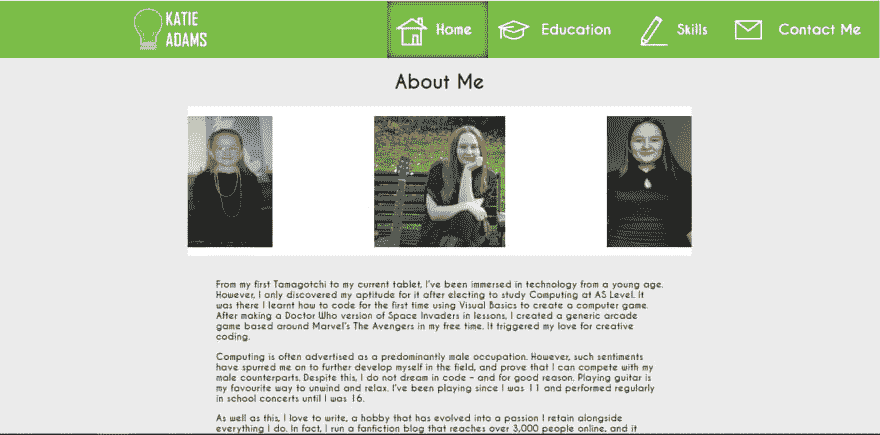

# 停滞(网络)发展-第 1 部分

> 原文：<https://dev.to/katieadamsdev/arrested-web-development-38g5>

阳光、海边和沙滩:这就是我今年过生日的方式。几个月的积蓄把我带到了马略卡岛，在那里我第一次品尝了鱿鱼，并品尝了大量我的新宠:普罗塞克桑格利亚汽酒(食谱如下)。这是绝对的幸福。

然而，当我写这篇文章时，我正坐在西米德兰兹郡中心的一个潮湿的小城市里。委婉地说，是换个环境。在从曼彻斯特机场返回的火车上，我构思了这个新系列的想法。那些在推特上关注我的人应该已经知道这意味着什么

> 凯蒂亚当斯[@ katieadamsdev](https://dev.to/katieadamsdev)想着开始一个新的系列文章关于 [Dev.to](https://t.co/nNpLkKjyPI) :'被捕(Web)开发'。它将着眼于有问题的应用程序/网站设计的现实生活实例，并讨论在未来避免它所需的代码。
> 
> 对此有什么想法？或者例子分享一下？2019 年 8 月 31 日下午 14:20[](https://twitter.com/intent/tweet?in_reply_to=1167804280553844736)[](https://twitter.com/intent/retweet?tweet_id=1167804280553844736)[](https://twitter.com/intent/like?tweet_id=1167804280553844736)

我对于这个系列的意图仅仅是善良和建设性的。这不会成为贬低其他开发者或他们工作的平台。更确切地说，我希望它是一种指向真实世界的代码示例的方式，并说:“我喜欢这样做，但我会以不同的方式来做——下面是如何做的。”

考虑到这一点，这个系列合乎逻辑的第一候选人是:我自己。

开始这个过程的最公平的方式是证明我完全打算能够得到我将“抛出”的东西，并享受我最可笑的网站。

所以，请坐好，放松，为一些老式的、令人讨厌的网页设计做准备。承蒙您的厚爱。

# 被捕网页开发:第 1 部分

## 我的第一个网站

场景很简单:创建一个关于你自己的网站。我的第一个作品集，如果你愿意的话。我在现实世界中最广泛使用 HTML 的时候是在修改我的 Tumblr 博客的主题。

结果是这样的:
[](https://res.cloudinary.com/practicaldev/image/fetch/s--1lhHqbUx--/c_limit%2Cf_auto%2Cfl_progressive%2Cq_auto%2Cw_880/https://thepracticaldev.s3.amazonaws.com/i/kien4oxv8je56j4ysjm0.PNG)

现在，我有很多方法可以把这个网站撕成碎片(在接下来的几年里我也是这样做的)。然而，正如我所承诺的，我将保持友好和建设性，即使是对以前的我，我必须对她在没有一点技术知识的情况下拼凑出这样一个东西给予一些信任。

我要说的第一件事是，在幕后有很多事情在进行，我对此感到高兴。

所有图像都有`alt`标签，带有可访问的、有帮助的图像描述。

``

标签不仅可以保持网站的可访问性，还可以提高 SEO(搜索引擎优化)。

为了方便起见，这张照片是在一次小学集会上拍摄的，我在其中扮演了气象学家的角色。我母亲接受挑战，给我穿上这样的衣服。当时，我相信这对聚集在一起的家长和教职员工来说一定是可爱的。然而，现在当我这样做的时候，我已经“过时了”，“不再需要参加学校的集会”。

回到正题！我的所有图像都会根据查看图像的设备的屏幕大小来调整大小。我也有不同质量的多个版本的图片，以适应不同的屏幕。后者是通过使用`picture`标签和结合`srcset`属性的`source`标签实现的。

```
<picture>
<source srcset = "images/2004.jpg" media="(min-width: 990px)">
<source srcset = "images/2004-crop.jpg" media="(min-width: 768px)">

</picture> 
```

<svg width="20px" height="20px" viewBox="0 0 24 24" class="highlight-action crayons-icon highlight-action--fullscreen-on"><title>Enter fullscreen mode</title></svg> <svg width="20px" height="20px" viewBox="0 0 24 24" class="highlight-action crayons-icon highlight-action--fullscreen-off"><title>Exit fullscreen mode</title></svg>

每张图片都被压缩过。这缩短了网页在手机和其他小型设备上的加载时间。

#### 你知道吗？

如果在 10-20 秒内没有加载[，一般用户会离开你的网站。比这更可怕的是，第一个 *3 秒*似乎对](https://www.websitemagazine.com/blog/5-reasons-visitors-leave-your-website) [40%的用户](https://www.websitemagazine.com/blog/5-reasons-visitors-leave-your-website)来说至关重要，如果网站处理再久，他们就会离开。

网站上的图标也都是 SVG(是的，包括那个可怕的灯泡标志)。除此之外，从顶部导航栏中选择的选项使用阴影框清晰地突出显示。也许这并不是最吸引人的突出方式，但是毫无疑问，用户是在主页上。

作为一个中间点，我没有在我的站点中包括 Modernizr(正如简报所建议的)。如果说实话，那是因为我不明白它是如何工作的，没有时间去学习。然而，我收到的反馈表明，我已经用 Javascript 实现了类似的效果。

在我的 HTML 文档中，我插入了一个`p`标签，指出 JavaScript 被关闭了。我的第一行 JavaScript 从 DOM 中移除了这个标签。学习新工具/特性时要考虑的事情:你可能比自己想象的更了解它。

现在谈谈不太令人愉快的事情。呼男孩，我从哪里开始？

这个配色方案需要做很多工作。理论上，它工作得很好——例如，深绿色背景上的白色文字清晰易读——但是任何优秀的设计师都会同意，平衡可访问性和吸引力的细微差别并没有被无情地实现。

如果我要更新网站并创建更美观的东西，最简单的方法就是在 CSS 文件中声明变量。变量将存储你给它们的任何值；在这种情况下，这将是我们的配色方案的十六进制代码，使任何未来的修改容易在整个网站实施。

在这样一个简单的项目中，变量可以在 CSS 文件的顶部声明，这样就可以逐级修改。

```
:root {
  --mainColour: #76BC46;
  --accentColour: #C14868;
}

.nav {
  background-color: var(--mainColour);
} 
```

<svg width="20px" height="20px" viewBox="0 0 24 24" class="highlight-action crayons-icon highlight-action--fullscreen-on"><title>Enter fullscreen mode</title></svg> <svg width="20px" height="20px" viewBox="0 0 24 24" class="highlight-action crayons-icon highlight-action--fullscreen-off"><title>Exit fullscreen mode</title></svg>

但是，如果您使用其他框架，一定要找到项目的最佳方法。例如，像萨斯和 SCSS 这样的 CSS 预处理程序可能值得一看。我最近在一个 VueJS 项目中利用了 SCSS；它包括创建一个 variables.scss 文件并在其中声明全局值，比如字体系列值和我的配色方案的十六进制代码。当我不可避免地想在以后更新这些时，我只是在一个地方改变代码！

建议:保持变量名的一致性，以保持代码的整洁。没有交换从骆驼大小写到连字符的名称中途通过一个项目！你以后会感谢自己的。

网页顶部的导航栏也是粘性的，这意味着当用户向下滚动时，它仍然在页面的顶部。关于如何最好地实现这一效果，有很多争论。我决定在我的导航栏上使用`position:fixed`，把我的页面内容分割成一个`div`，并把它放到我的导航栏下面，改变`margin-top`的值。

这并不是达到这种效果的最差方法，但是有一种方法可以减少代码量。

```
#navBar
{
  position: sticky;
} 
```

<svg width="20px" height="20px" viewBox="0 0 24 24" class="highlight-action crayons-icon highlight-action--fullscreen-on"><title>Enter fullscreen mode</title></svg> <svg width="20px" height="20px" viewBox="0 0 24 24" class="highlight-action crayons-icon highlight-action--fullscreen-off"><title>Exit fullscreen mode</title></svg>

现在，使用`position:sticky` CSS 非常容易，因为我没有。然而，它目前并没有像[那样得到广泛的支持](https://caniuse.com/#search=position%20sticky)。至少，没有`position:fixed`多。我将允许比我聪明得多的人在这里讨论最佳实践。

对于这篇文章，我可以深入研究的还有很多，通过与开发人员本人交谈，编写过程变得容易多了(尽管它确实让我对库产生了一些奇怪的看法)。未来的文章将被整理成小块的知识。

如果你能对我给出的建议提出替代建议，或者希望对这个个人烘焙会议有所贡献，请给我留下一些反馈！这只会让我变得更好。

最后，正如我所承诺的:

### 普罗塞克桑格利亚汽酒的配料

*   普罗塞科起泡酒
*   橙汁
*   芬达
*   鲜果
*   冰

不要问我比例。我仍然没有弄明白它们，恐怕我永远也不会明白了。