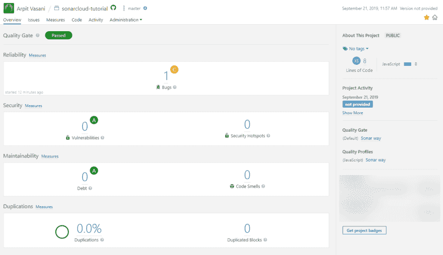

# 我们能自动化代码审查吗？是的，我们可以

> 原文:[https://dev . to/arpitvasani/can-we-automate-code-review-yes-we-can-3kaf](https://dev.to/arpitvasani/can-we-automate-code-review-yes-we-can-3kaf)

## [](#index)索引

*   什么是代码审查？
*   为什么我想让它自动化？
*   我如何实现自动化？
*   [结论](#conclusion)

# [](#what-is-codereview)什么是代码评审？

在您提交一个拉请求之后，高级开发团队中会有人在将您的代码合并到开发或主分支之前审查(或者测试)您的代码。

代码审查帮助我们在它到达主代码库或发布到生产站点之前识别错误。这可能是编程方面的，也可能是业务逻辑方面的。对于与编程相关的错误，有一些工具可以用来执行最佳实践，而对于另一方面，我们需要一个了解系统流程的人。最后一个(目前)无法自动化。

# [](#why-would-you-want-to-automate-it)为什么要实现自动化？

[T2】](https://res.cloudinary.com/practicaldev/image/fetch/s--LqqNiVIH--/c_limit%2Cf_auto%2Cfl_progressive%2Cq_auto%2Cw_880/https://thepracticaldev.s3.amazonaws.com/i/ksairxo42i0sypptu40z.jpg)

有很多理由让你的任务自动化。比如跟着。

*   更多的自由工作时间😉
*   这会给你时间去关注更重要的问题
*   比人类更高的精确度
*   这是一个可靠的系统，可以防止错误代码进入生产环境
*   ...还有更多

我们并没有完全消除代码审查过程中的人工干预。事实上，技术将在高级开发人员(或代码审查人员)的审查过程中发挥帮助作用。

# [](#how-can-you-automate-it)怎么能自动化呢？

在本教程中，我们将使用[sonar cube](https://www.sonarqube.org/)。Sonarcube 是一个代码质量检查器，可以在内部托管，它还有一个内置的 web 界面来显示错误和代码嗅探。Sonarqube 是一个本地版本，您可以下载并安装在局域网上的机器上。除此之外，sonarqube 还有一个免费的开源社区版。耶！！

Sonarcloud 是相同服务的云版本，对公众回购是免费的，所以我们将使用它。

出于演示的目的，我将使用这个回购[https://github.com/vasani-arpit/sonarcloud-tutorial](https://github.com/vasani-arpit/sonarcloud-tutorial)，其中有一些故意的错误。

### [](#steps)步骤

1.  前往 [sonarcloud](https://sonarcloud.io/about) 并登录 Github
2.  认证完成后，点击顶部的➕并选择分析新项目
3.  接下来，使用“在 GitHub 上选择一个组织”按钮导入 GitHub repo
4.  点击“绑定到现有 SonarCloud 组织”,然后点击“绑定组织”按钮
5.  从列表中选择/检查您要分析的回购，然后单击设置
6.  现在回到你的 repo，在根目录下添加一个文件，如下所示，保存为**. sonar cloud . properties**

    ```
    # Path to sources
    sonar.sources=. 
    ```

7.  推进你的承诺。声纳云会自动拾取你的代码并开始分析报告。

8.  一旦分析完成，您应该看到类似下面的内容
    [](https://res.cloudinary.com/practicaldev/image/fetch/s--6v4K96J1--/c_limit%2Cf_auto%2Cfl_progressive%2Cq_auto%2Cw_880/https://thepracticaldev.s3.amazonaws.com/i/qgfqns8qrj2pl461fq7s.png) 这是一个公共项目。你可以在 https://sonarcloud.io/dashboard?的[上看到它 id = vasani-arpit _ sonar cloud-tutorial](https://sonarcloud.io/dashboard?id=vasani-arpit_sonarcloud-tutorial)也一样。

它说有一个错误，让我们看看是什么。

[T2】](https://res.cloudinary.com/practicaldev/image/fetch/s--TCR8rniz--/c_limit%2Cf_auto%2Cfl_progressive%2Cq_auto%2Cw_880/https://thepracticaldev.s3.amazonaws.com/i/76rmlh8t9f7fh09hq9yv.png)

如你所见,`if`和`else`代码块是相同的，所以 sonar 建议我删除这个条件，因为没有必要保留它。它还告诉我们解决这个 bug 需要多长时间。因此，下次当你有一个现有的项目要重构时，就通过 sonarcloud 传递它，并告诉 reactor 所需的确切工作，这样你的项目经理就不会每天都问你更新了。😜

现在，这是我的 IDE/编译器不会捕捉到的，因为它只检查语法。

# [](#conclusion)结论

通过部分自动化代码审查任务，您可以获得人眼可能会忽略的更好的结果。如果你喜欢结对编程，那么 sonar cube/sonar cloud 可以成为你的结对审查员。😀

严肃地说，如果你所在的领域/组织不能把你的代码放在云上，那么你可以在你的本地机器上设置 sonarqube(而不是 sonarcloud ),自动化你的 PR 评估。