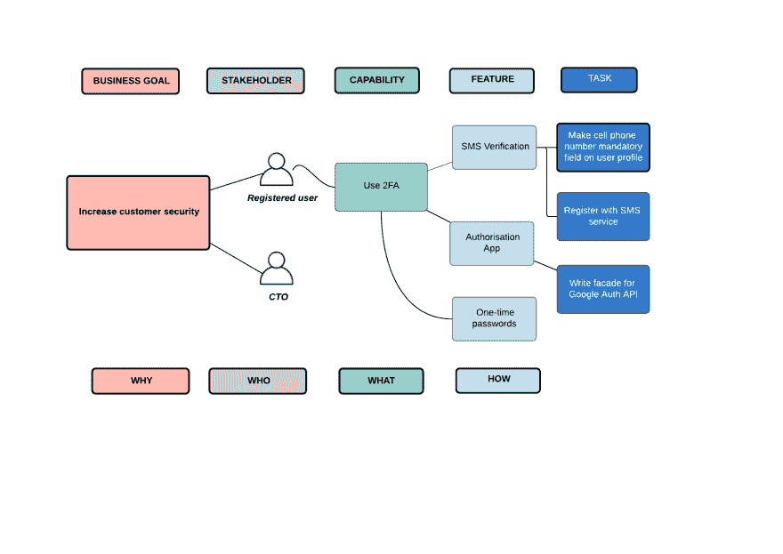
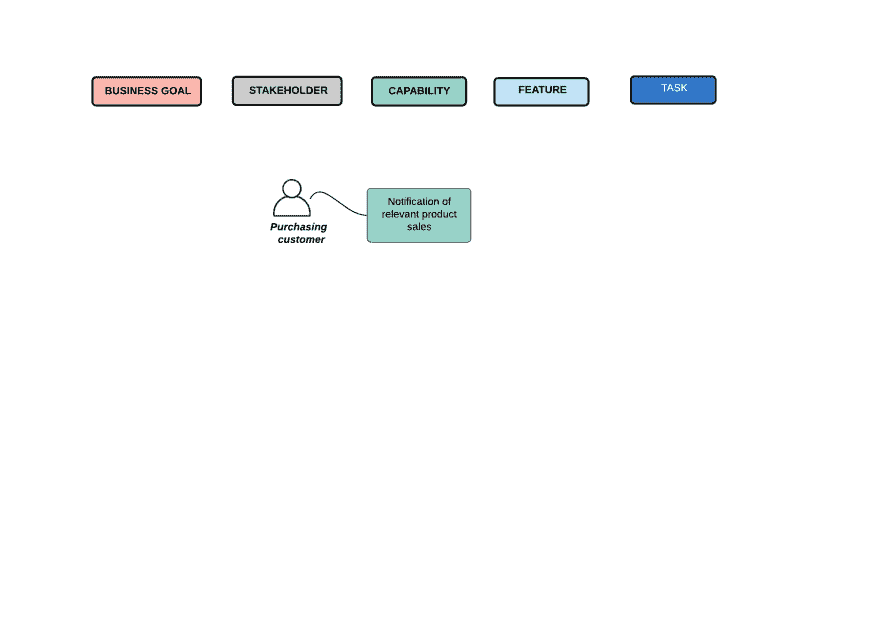
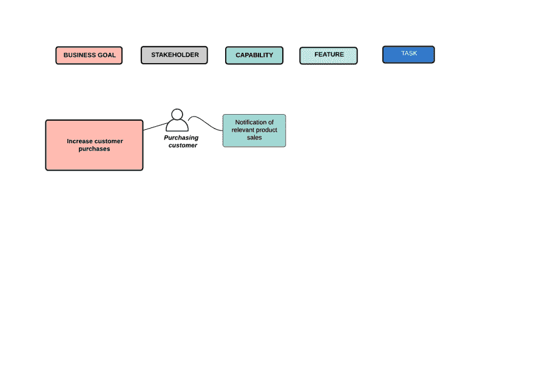
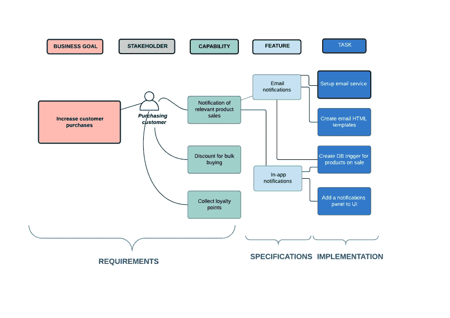

# 那么，你知道如何为你的客户建立一个软件系统吗？(第 3 部分——冲击图的建模要求)

> 原文：<https://dev.to/redfred7/so-do-you-know-how-to-build-a-software-system-for-your-client-part-3-modelling-requirements-with-impact-maps-h19>

在本系列的前一篇文章中，我们探索了需求领域实体，也就是说，如果我们想要正确有效地捕获和管理我们的需求，我们需要知道的事情。这些实体是:

*   利益攸关方和行为者
*   商业目标
*   能力
*   特征

在本文中，我们将了解这些实体是如何关联的，以及我们如何以可视化和直观的方式对它们建模。

## 影响映射

早在 2012 年，Gojko Adjiz 定义了影响图的概念，这是一种他从基于 UX 的效果图方法演变而来的技术，旨在改善团队和组织中的沟通、协作和互动。影响图使我们能够探索和分析开始构建系统时遇到的主要问题的答案:

*   我们为什么要这么做？
*   谁会从中受益？
*   我们需要做什么？
*   我们要怎么做？

这些问题的答案帮助我们发现需求和规范模型中涉及的实体

*   业务目标(为什么)
*   利益攸关方(世卫组织)
*   能力(什么)
*   功能(如何)

我们还可以发现和定义任务，也就是为了构建我们的系统我们需要做的工作单元。

 *示例冲击图*

那么，我们如何根据客户的愿望和需求(即他们的原始需求)创建一个定义明确的影响图呢？请继续阅读，寻找答案。

## D3 法

作为系统构建者，我们有来自许多方向的需求:客户代表、项目经理、产品所有者、业务分析师和其他开发人员，他们都想从我们的系统中得到一些东西。这些需求以多种形式出现:正式陈述、对话陈述、用户故事、流程图和其他图表以及许多其他形式。我们的工作是分析这些需求，并在影响图中对相关实体建模。让我们看看如何完成这项任务:

假设我们的客户告诉我们，他们希望他们的系统在用户之前购买的某种产品上市时通知用户。他们可能在正式声明中表达了这一点(“系统将通知以前购买过笔记本电脑的用户……”)，作为一个用户故事(“作为一个笔记本电脑的老顾客，我希望得到通知……”)或简单地通过电话进行口头交流。为了对此进行分析和建模，我们将使用一个简单的方法，我称之为 D3:分解-推导-发现。

### 分解

分解是对需求的分解，以确定它代表了多少和什么类型的实体(业务目标、能力、特性或任务)。一个很好的启发式方法是查看主句的动词，即“系统应该通知..”，“我想得到通知……”等。

通过从这个角度检查我们的样本需求，很明显只涉及到一个实体，而且它与通知有关。有可能在主句中有不止一个动词，在这种情况下，我们将处理两个实体，但幸运的是，在我们的例子中不是这种情况。

下一步是决定它是哪种类型的实体。显然，整个“通知”不是一个业务目标或简单的任务，所以它要么是一个特性，要么是一种能力。能力是一种高级的、粗粒度的能力，参与者可以利用它来实现他们的目标。它回答了“系统能为演员做什么？”一个特性是系统提供给它的参与者的一个中低级的、细粒度的功能。它回答了“演员如何实现这种能力？”

假设我们所知道的需求是在特定条件下通知用户的抽象愿望，那么假设我们正在处理一个系统功能是合理的。让我们给它一个合适的名称，并将其添加到我们的模型中:

 *定义一个能力*

### 推导

派生是我们的原始实体所依赖的或者依赖于我们的实体的其他需求实体的创建。到目前为止，我们已经为我们的系统确定了一个通知功能。由于实现业务目标的每种能力都必须存在，我们必须问自己，在我们的情况下，业务目标是什么。最好不要在这一点上做假设，而是与我们的客户交谈，以了解他们通过提供这一功能想要实现什么。请记住，我们能够并且必须根据这里描述的[标准来验证业务目标。比方说，在我们的案例中，我们的客户希望使用这种能力来吸引他们的客户购买更多的东西，从而增加客户的收入。这是一个完全有效的目标，所以让我们将它添加到我们的模型中。](https://dev.to/redfred7/so-do-you-know-how-to-build-a-software-system-for-your-client-part-2-439n)

 *明确目标*

现在让我们看看影响图的右侧。我们还没有为我们的能力定义任何特性。让我们现在就这样做吧。我们只需要回答这个问题“我们如何通知用户产品的销售情况？”，或者“我们如何交付通知功能？”两个可能的答案是:1)电子邮件通知和 2)应用内通知。像往常一样，我们需要和我们的客户确认这些特性是他们可以接受的。假设它们是，让我们继续将它们添加到我们的影响图中。

 *定义特征*

最后，让我们深入了解它的本质，并为我们的每个特性创建一些任务。任务是为了实现一个特性而需要完成的工作。大多数情况下，他们会涉及编码，但也可能是关于编写文档，建立 CI/CD 管道或其他任何需要完成的事情，以使我们的功能启动并运行。

 *定义任务*

推导阶段到此结束。我们从一个单一的需求开始，现在我们有了一个完整的影响图。但是我们还没完。

### 发现

发现阶段通常是最容易被忽视的阶段，它是关于发现我们的系统可能需要的新功能。业务目标是一个很好的起点。我们的系统还能提供其他功能来帮助实现这一目标吗？在我们的例子中，我们的客户希望吸引用户购买更多，所以我们提供了“销售通知”功能。另一个对此有帮助的功能可能是“批量购买折扣”功能。这是我们可以(也应该)与客户讨论的事情。毕竟，我们不仅仅是代码猴子，我们是希望帮助客户实现目标的系统构建者。

 *发掘其他能力*

自然地，一旦我们添加了新的系统功能，我们应该回到派生阶段，并确保我们为我们的新功能创建了一些特性和任务。

### 后记

现在你知道了，我们从客户的原始需求开始，使用结构化的方法为我们的需求和规范创建一个定义良好的模型。在我们开始编码之前，我们还需要经历一个步骤，这就是详细描述我们的特性。我们将通过编写一些可执行的规范来做到这一点。在下一篇文章中会有更多内容:)