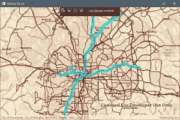
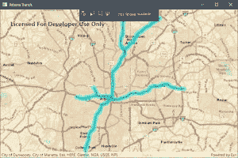

# 使用。NET 来查询 ArGIS 地图特征

> 原文：<https://dev.to/bradwellsb/use-net-to-query-argis-map-features-113p>

[来源](https://wellsb.com/csharp/learn/use-dotnet-to-query-arcgis-features/)

的 ArcGIS Runtime SDK。NET 有一组强大的功能，包括使用 C#从地图中查询、选择和过滤要素的能力。本教程将教您如何使用 SQL 查询来过滤 GIS 制图解决方案显示的数据。

## 从成套中选择数据

在本节中，您将了解如何选择和高亮显示要素服务数据的子集。本教程将基于[您在上一个教程中创建的](https://wellsb.com/csharp/advanced/wpf-dotnet-arcgis-runtime-sdk/)WPF 应用程序。

在 MapViewModel.cs 中，类初始化器方法将简单地调用一个方法`InitializeMap()`。

```
public MapViewModel()
{
    InitializeMap();
} 
```

`InitializeMap()`方法将填充地图并设置初始视点。从您在上一个教程中使用的相同代码开始。

```
private async void InitializeMap()
{
    Map newMap = new Map(Basemap.CreateStreets());
    FeatureLayer featureLayer = new FeatureLayer(new Uri("https://arcgis.atlantaregional.com/arcgis/rest/services/OpenData/FeatureServer/146"));

    await featureLayer.LoadAsync();

    newMap.OperationalLayers.Add(featureLayer);
    newMap.InitialViewpoint = new Viewpoint(featureLayer.FullExtent);

    Map = newMap;
} 
```

上述代码将加载整个数据集，并在地图上显示其所有要素。假设您想要选择由亚特兰大快速交通管理局(MARTA)运营的地铁路线。回想一下，应用程序的 **MapView** 被绑定到 **MapViewModel** 的**地图**属性。当 **Map** 属性被更新时，程序的 UI 被刷新，Map 被填充。当您在已添加到地图的要素图层上执行查询时，**地图**属性会更新。

为了查询特性表，您将把 SQL 查询定义为一个`QueryParameters`对象的一部分。

```
QueryParameters queryParams = new QueryParameters
{
    WhereClause = "agency_id = 'MARTA' and rte_type = 'subway, metro'"
}; 
```

接下来，执行查询并等待结果。将匹配查询的特征列表保存为`FeatureQueryResult`类型。

```
FeatureQueryResult queryResult = await featureLayer.FeatureTable.QueryFeaturesAsync(queryParams); 
```

现在，与查询字符串匹配的所有要素都保存为变量。您可以使用这些结果对所选要素执行功能。例如，您可以突出显示与查询字符串匹配的每个特征:

```
private async void InitializeMap()
{
    Map newMap = new Map(Basemap.CreateStreets());
    FeatureLayer featureLayer = new FeatureLayer(new Uri("https://arcgis.atlantaregional.com/arcgis/rest/services/OpenData/FeatureServer/146"));

    await featureLayer.LoadAsync();

    newMap.OperationalLayers.Add(featureLayer);
    newMap.InitialViewpoint = new Viewpoint(featureLayer.FullExtent);

    QueryParameters queryParams = new QueryParameters
    {
        WhereClause = "agency_id = 'MARTA' and rte_type = 'subway, metro'"
    };

    FeatureQueryResult queryResult = await featureLayer.FeatureTable.QueryFeaturesAsync(queryParams);
    foreach (Feature feature in queryResult)
    {
        featureLayer.SelectFeature(feature);
    }

    Map = newMap;
} 
```

[](https://wellsb.com/csharp/wp-content/uploads/sites/2/2019/09/arcgis-query-select-min.jpg)

## 过滤并显示数据子集

假设您只想显示那些与给定查询匹配的要素。在这种情况下，应将要素服务作为要素表加载。这将允许您编辑该表，只保留那些感兴趣的结果。最后，将修改后的表作为要素图层加载，并将其添加到地图中。

对于本例，创建一个私有字段来保存要素表和要素图层的值。这将更容易将它们传递给 C#类中的各种方法。

```
private ServiceFeatureTable _featureTable;
private FeatureLayer _featureLayer; 
```

接下来，构造`InitializeMap()`方法。它看起来与上一个示例相似，只是您将作为之前创建的私有`ServiceFeatureTable`来加载要素服务，而不是直接作为`FeatureLayer`来加载。

```
private async void InitializeMap()
{
    Map newMap = new Map(BasemapType.Streets, 33.78506, -84.37366, 11);

    _featureTable = new ServiceFeatureTable(new Uri("https://arcgis.atlantaregional.com/arcgis/rest/services/OpenData/FeatureServer/146"))
    {
        FeatureRequestMode = FeatureRequestMode.ManualCache
    };

    _featureTable.Loaded += OnTableLoaded;
    _featureLayer = new FeatureLayer(_featureTable);

    newMap.OperationalLayers.Add(_featureLayer);

    Map = newMap;
} 
```

第 22 行创建了一个带有给定底图的地图，并将初始视点设置为亚特兰大地区。接下来，将 [Atlanta transit routes 要素服务](https://arcgis.atlantaregional.com/arcgis/rest/services/OpenData/FeatureServer/146)作为要素表进行加载，并将`ServiceFeatureTable.FeatureRequestMode`属性设置为`ManualCache`。这可确保地图不会被服务中的要素自动填充。相反，只能通过调用`PopulateFromServiceAsync()`方法来手动填充地图。

第 29 行，你引用了一个方法，`OnTableLoaded()`，这个方法将被调用以响应被引发的`ServiceFeatureTable`的`Loaded`事件。关于初级读本，请参见[事件驱动编程教程](https://wellsb.com/csharp/advanced/csharp-event-handler-example/)。

`OnTableLoaded()`方法将成为您的过滤方法。该方法应该查询该表并更新它，以便只显示与查询条件匹配的结果。

```
private async void OnTableLoaded(object sender, EventArgs e)
{
    QueryParameters queryParams = new QueryParameters
    {
        WhereClause = "agency_id = 'MARTA' and rte_type = 'subway, metro'"
    };

    string[] outputFields = { "*" };

    try
    {
        FeatureQueryResult queryResult = await _featureTable.PopulateFromServiceAsync(queryParams, true, outputFields);
    }
    catch (Exception ex)
    {
        MessageBox.Show(ex.ToString(), "Error");
    }
} 
```

与上面的例子类似，您已经开始定义 SQL 查询参数来搜索 MARTA 运营的地铁。从服务填充时使用`outputFields`变量来定义加载哪些字段。在本例中，将加载所有字段。这对于显示一个标注或弹出窗口以向用户显示数据(如地铁线路号等)非常有用。您还可以将返回的字段限制为您的应用程序将使用的字段。

最后，第 46-53 行包含一个 try-catch 块，它根据查询参数和您希望返回的字段执行对`PopulateFromServiceAsync()`方法的调用。例如，在 sql 字符串格式不正确的情况下，try-catch 提供基本的[错误处理](https://wellsb.com/csharp/beginners/csharp-read-text-file/)。

`PopulateFromServiceAsync()`的第二个参数是一个 bool 参数，它指示在填充表之前是否应该清除缓存。当该值设置为 **true** 时，如本例所示，该表将被清除并替换为查询结果。如果它被设置为**假**，结果将被追加到表格中。

[](https://wellsb.com/csharp/wp-content/uploads/sites/2/2019/09/arcgis-query-filter-select-min.jpg)

## 底线

在本教程中，您学习了从 ArcGIS 要素服务中查询和选择要素的技术。您还学习了如何过滤要素表以显示仅包含与特定查询字符串匹配的结果的地图。这些技术构成了更高级的 GIS 应用程序的基础。如果有任何问题，欢迎在评论中提问！

[来源](https://wellsb.com/csharp/learn/use-dotnet-to-query-arcgis-features/)