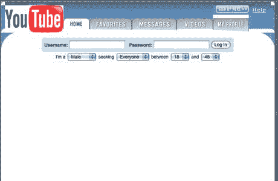

# 我在初创公司学到的经验

> 原文：<https://dev.to/stereobooster/lessons-i-learned-at-a-startup-18kf>

## 一夜之间航向变化

创业公司在寻找自己的商业模式。创业可以从一个想法开始，但随着另一个想法变得成熟，例如，youtube 最初是一个约会网站

图片来源: [@spencernoon](https://twitter.com/spencernoon/status/1016713164610732035?s=20) 。“事实核查”:[我没有得到证实的事实，这更多的是一个传说](https://mashable.com/2011/02/19/youtube-facts/)。

亚马逊最初是一家书店，现在它是最大的在线零售商和最大的云提供商之一。

这意味着你可以从一个想法开始，以一个不同的想法结束。对于开发人员来说，这意味着他们已经做了三个多月的工作可能会在一天之内被丢弃。

不要执着于代码。或者想办法让它开源。

## 小团队

创业公司是一个小团队。这意味着每个人都会很忙，可能会转换角色。

准备好帮助你的队友完成一些编程以外的任务，例如，产品决策。

## 争分夺秒

初创公司经常与时间斗争——以确保你没有耗尽资金，或者确保别人不会先提出你的想法。

很难猜测什么可行，什么不可行，所以[原型制作](https://www.youtube.com/watch?v=d5_h1VuwD6g)是你最好的朋友。抛出一些足够快速的概念验证来测试你的假设，让它快速失败(或持续)。给同事看，给潜在客户看，给投资者看，问问他们怎么看。