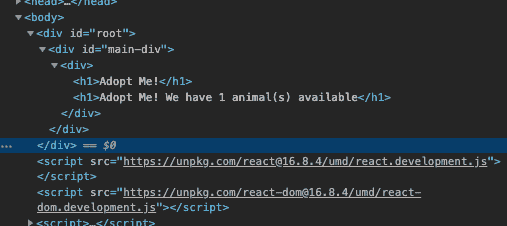

# 一个更基础的 React 应用教程

> 原文：<https://dev.to/stephencweiss/an-even-more-basic-react-app-tutorial-417f>

最近，我构建了一个基本的 React 应用程序。回想起来，我可以通过移除*任何*包装管理器、捆扎机或其他工具，使*变得更加基本。*

注意:这个练习改编自 Brian Holt 的 Frontend Masters 课程(这也是我借鉴造型的地方)。他也在 Github 上发布了所有的课程笔记。 <sup>2</sup>

开始时，我们只需要一个`index.html`和一个`style.css`。

我的项目是这样的(`src`目录仅用于组织):

```
.
└── src
    ├── index.html
    └── style.css 
```

想在一个文件中看到整个 React 应用程序吗？

```
<!DOCTYPE html>
<html lang="“en”">
  <head>
    <meta charset="UTF-8" />
    <meta name="“viewport”" content="width=device-width, initial-scale=1.0" />
    <meta http-equiv="X-UA-Compatible" content="ie=edge" />
    <title>Adopt Me</title>
    <link rel=“stylesheet” href=“./style.css”/> // import styles
  </head>
  <body>
    <div id="root">not rendered</div>
    <script src="https://unpkg.com/react@16.8.4/umd/react.development.js"></script>
    // import react
    <script src="https://unpkg.com/react-dom@16.8.4/umd/react-dom.development.js"></script>
    // import react-dom to actually mount react
    <script>
      const App = () =>
        React.createElement(
          'div', // the element that’s rendered
          { id: `main-div` }, // the props that are passed to the rendered element
          React.createElement('h1', {}, 'Adopt Me!') // the children of our element
        ) // our current entire app
      ReactDOM.render(React.createElement(App), document.getElementById('root'))
    </script>
  </body>
</html> 
```

瞧。我们有我们的应用程序渲染！

[](///static/8ec0ca5f54a2e077822ba9861b354668/dfb8b/rendering.png)

那么，这里到底发生了什么？我们使用的是纯 React，突出了`createElement`方法。事实上，我们使用它三次:

1.  创建`App`组件
2.  创建一个`div`
3.  创建一个`h1`

`createElement`带三个参数(后两个是可选的):

1.  要呈现的组件
2.  要传递给组件的任何属性
3.  组件的任何子组件。

## 传递子组件

然而，到目前为止，我们还没有一个非常有趣的应用程序。我们如何扩展它？

让我们从一个实际收到道具的孩子开始。

```
<script>
  const Header = (props) => {
    return React.createElement("h1", {}, "Adopt Me! We have ${props} animal(s) available")
  }
  const App = () => React.createElement(
    "div",
    {id: `main-div`},
    React.createElement("div", {}, React.createElement(Header, {value: 1}))
  )
  ReactDOM.render(React.createElement(App), document.getElementById('root'))
</script> 
```

这里有趣的是看*如何*简单地重复这个模式，尽管这一次，复合组件`Header`正在接收我们在控制台中看到的道具(`value:1`)。

[](///static/2ea1b5e9c9cfb0ded964295e39720b67/0336a/header-with-props.png)

## 多个孩子

因为一个 div 可以有多个子元素，所以如果我们想要传递多个子元素，只需在一个数组中列出它们。

```
<script>
  const Subheader = (props) => React.createElement(“h1", {}, `We have ${props.value} animal(s) available`)

  const App = () => React.createElement( "div",
    { id: 'main-div' },
    React.createElement("div", {},
      [
         React.createElement("h1", {}, `Adopt Me!`),
         React.createElement(SubHeader, { value: 1 })
      ])
  )

  ReactDOM.render(React.createElement(App), document.getElementById('root')) </script> 
```

[ ](///static/a3a567aad1b048be37f4a71be01f341f/2f6b3/multiple-children.png) [ ](///static/35220a3c9f7a91b5e963d139883716a3/cdbc6/multiple-children-rendering.png)

## 从 HTML 中提取 React

然而，这并不容易管理。让我们把这些部分分开，这样我们就不用直接在 HTML 中编写 Javascript 了。

我们可以从向`src`目录添加一个`App.js`文件开始。

```
.
├── package.json
└── src
    ├── App.js
    ├── index.html
    └── style.css 
```

将 Javascript 代码(标签`<script>`中的所有内容)复制到`App.js`

更新`<script>`标签以引用`App.js`作为其源。

```
<script src="./App.js"></script> 
```

就是这样。我们现在已经呈现了一个 React 应用程序，没有`npm`，没有`webpack`，也没有在 HTML 中嵌入 Javascript。

此时，我们已经编写了一个*纯* React 应用程序。没有工具。没有 npm。没有捆绑。我们也可以这样继续下去。不过，我发现这些工具很有帮助。更多信息请参见我的另一个演练，启动并运行一个基本的 React 应用程序 <sup>1</sup> 。

# 资源

*   <sup>1</sup> [启动并运行一个基本的 React 应用| /_ 代码注释 _/](//../../2019-09-08/tutorial-basic-react-app/)
*   <sup>2</sup>T2】完整简介反应 v5