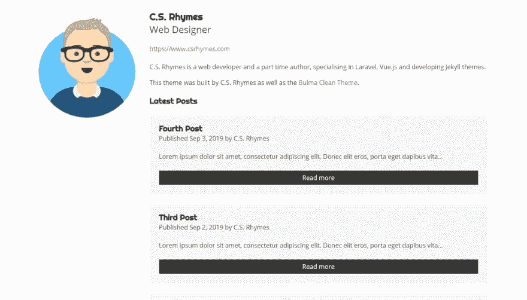

# 引入纯粹的博客主题

> 原文：<https://dev.to/chrisrhymes/introducing-mere-blog-theme-kf8>

几周前，我读了一篇关于每个人应该如何写博客的文章。写作可以帮助你展示你的知识，也可以帮助其他人学习同样的东西。我在自己的网站上写博客，它是用[布尔玛清洁主题](https://github.com/chrisrhymes/bulma-clean-theme)(一个与布尔玛一起建立的 Jekyll 网站主题)建立的，但如果你只是想创建一个博客，那就有点多了。所以我决定拿出我的记事本，开始勾画一些博客主题的想法。

我想做一个主题，让博客图片成为关注的焦点，帮助吸引读者。很多博客首页都是布局相同的帖子列表。我决定做一些有点不同的事情，改变主页布局，改变帖子的宽度，每行有不同数量的帖子。

在决定每行 2 个、1 个和 3 个帖子之前，我尝试了几种不同的布局。这种布局似乎鼓励我继续向下滚动，阅读更多内容。

我发现最困难的事情是决定使用正确的字体。我想要既现代又易读的字体，但也要有点与众不同。最后，我选定了 just 作为标题，因为它看起来很合适。然后，我将它与 Open Sans 配对作为主体字体，这是一种清晰易读的字体。

帖子页面本身非常简单，但我认为在帖子页面上有更多关于作者的信息会更好。我开始为每一页的作者做一个小的介绍，但是这很快就变得重复，并且在每一篇文章中添加都不是很有效。

我做了一些研究，并了解到在 Jekyll 网站上使用集合制作[作者页面](https://jekyllrb.com/docs/step-by-step/09-collections/)的情况。这将允许我在一个地方写作者信息，但也可以在作者的帖子中引用它，这给了我制作作者部分的灵感。

我很喜欢 dev.to 的工作方式，你可以点击帖子作者，查看他们的个人资料页面，了解更多关于作者的信息，以及查看他们的帖子列表。这是探索更多你可能感兴趣的内容的好方法。

我想我会尝试复制这个想法，所以我建立了作者页面，在那里你可以提供更多关于作者的信息，以及图片，描述和他们网站的链接，以及他们最新帖子的列表。

为了把这一切联系起来，我创建了一个作者页面，在一个地方列出了网站的作者。

我想在这里提到的最后一件事，但与主题本身没有严格的联系，就是 [Get Avataaars](https://getavataaars.com/) 网站。我是在搜索生成一些用户头像图片的方法后偶然发现的。它是免费的，使用起来也很有趣！

如果你想开始写你自己的博客，或者认识这样的人，如果你考虑使用[纯博客主题](https://github.com/chrisrhymes/mere-blog-theme)会很好。