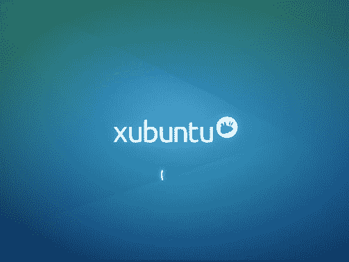

# Initramfs:放到 Shell 中

> 原文:[https://dev.to/wparad/initramfs-dropping-to-a-shell-3p6l](https://dev.to/wparad/initramfs-dropping-to-a-shell-3p6l)

像往常一样，我要去参加一个会议，我的笔记本电脑决定避免启动。当它是 Linux 时，那么它总是在你需要做某事的精确时刻。我总是找到关于成功的 XKCD 来最好地描述这个过程。

显然，我最喜欢在屏幕上看到的词是**掉到一个壳里**。通常是你自己的错误造成的，因为你想完成至少其中一项:

*   脚本存在之前的比特币挖矿
*   在您的设置中添加第二台显示器
*   移除 X.org
*   恢复新的图形驱动程序(因为它冻结了你的屏幕)
*   显卡相关的其他东西。

然而这一次不同了。

公平地说，这是引导，但我正面临着这个:

```
Gave up waiting for root device. Common problems:
 - Boot args (cat /proc/cmdline)
   - Check rootdelay= (did the system wait long enough?)
   - Check root= (did the system wait for the right device?)
 - Missing modules (cat /proc/modules; ls /dev)
ALERT! /dev/disk/by-uuid/xxxxxxxx-xxxx-xxxx-xxxx does not exist. Dropping to a shell!

BusyBox v1.21.1 (Ubuntu 1:1.21.0-1ubuntu1) built-in shell (ash)
Enter 'help' for a lost of built-in commands.
(initramfs) 
```

<svg width="20px" height="20px" viewBox="0 0 24 24" class="highlight-action crayons-icon highlight-action--fullscreen-on"><title>Enter fullscreen mode</title></svg> <svg width="20px" height="20px" viewBox="0 0 24 24" class="highlight-action crayons-icon highlight-action--fullscreen-off"><title>Exit fullscreen mode</title></svg>

像往常一样，我意识到自己周四晚上会做什么，可能下周也会做。这个世界到底是怎么回事。这是意料之中的事，当然，它在前一天工作得很好，我没有碰过任何东西。

幸运的是，我知道问题出在哪里。当我第一次得到我的 XPS 13 时。我决定尝试使用 UEFI 而不是 BIOS，最初遇到的是同一个屏幕。在这种情况下，RAID 控制器被设置为使用 RAID 模式，而不是 AHCI，这是它自己的冒险，最初解决。因此，驱动器应该已经正确加载，但它没有。

stack overflow 上不乏提到这个问题的帖子，但大部分都和我的问题无关(很明显)。在这种情况下的问题，我知道是地穴相关。因为这是一台笔记本电脑，我选择了全驱动器加密，而正是这个加密的驱动器没有安装。

在第 4 个小时，我掌握了 grub 配置和 initramfs 命令，我已经很长时间没有专门使用过这两个命令了。在这两种情况下，你都无能为力，而且两种情况都没有帮助，因为你真正需要做的是解决这两种情况，当然，这是不可能的。但是这并没有阻止我去检查那些无尽的 Grub 模块，看看是否启用了其中的一个。剧透:不是的。

8 个小时的时候，我以为我找到了圣杯，一个关于这个问题的帖子。这同样是无益的。但它确实是圣杯，只是我还不知道。其中一部分是糟糕的说明(我将在最后包括对每个人的说明。)

星期五，我被告知我应该放弃，安装一个新的操作系统。但我不相信它不会有同样的问题。

周六，我最终发现我的启动修复程序让我走上了 Grub 安装本身就是问题的道路。对于我在谷歌上搜索“重装 Grub”*的次数，引导修复*也保证是解决方案。虽然它做了很多努力来帮助我，但它不能解决我遇到的问题。然而，在这一天结束之前，我找到了其他的尝试，这改变了一切。

我无意中发现了一个有点相关的 [stack 交换帖子](https://unix.stackexchange.com/questions/107810/why-my-encrypted-lvm-volume-luks-device-wont-mount-at-boot-time)，虽然帖子本身没有指出答案，但它提到了一些有趣的事情。

```
The package cryptsetup has to be installed because it has startup scripts which provide support for automounting encrypted volumes at boot. 
```

<svg width="20px" height="20px" viewBox="0 0 24 24" class="highlight-action crayons-icon highlight-action--fullscreen-on"><title>Enter fullscreen mode</title></svg> <svg width="20px" height="20px" viewBox="0 0 24 24" class="highlight-action crayons-icon highlight-action--fullscreen-off"><title>Exit fullscreen mode</title></svg>

于是……

```
dpkg --get-selections | grep cryptsetup
> cryptsetup deinstall 
```

<svg width="20px" height="20px" viewBox="0 0 24 24" class="highlight-action crayons-icon highlight-action--fullscreen-on"><title>Enter fullscreen mode</title></svg> <svg width="20px" height="20px" viewBox="0 0 24 24" class="highlight-action crayons-icon highlight-action--fullscreen-off"><title>Exit fullscreen mode</title></svg>

耶。！

这是我首先想到的，它极大地改变了结果。现在，我没有直接进入 initramfs shell，而是盯着这个屏幕看了 30 秒钟:

[T2】](https://res.cloudinary.com/practicaldev/image/fetch/s--75F7AzRa--/c_limit%2Cf_auto%2Cfl_progressive%2Cq_auto%2Cw_880/https://cdn-images-1.medium.com/max/503/1%2A4wk6A6tuHWom16WjVAJpeA.png)

不同的错误=进步，每个伟大的软件工程师都知道。

从那时起，我意识到 update-initramfs 需要在一切工作之前进行更新，这就是它所要做的一切。算是吧。

原来我是从我的实时 usb 挂载加密分区，直接从桌面。那不是个好主意。initramfs 需要知道 my /etc/crypttab 挂载点名称的值，而实时 usb 会动态生成一个不同的值。唉，那几个小时白白浪费了。幸运的是，我知道这个问题:

```
_cryptsetup: WARNING: The initramfs image may not contain cryptsetup binaries_
_nor crypto modules. If that's on purpose, you may want to uninstall the_
_'cryptsetup-initramfs' package in order to disable the cryptsetup initramfs_ 
```

<svg width="20px" height="20px" viewBox="0 0 24 24" class="highlight-action crayons-icon highlight-action--fullscreen-on"><title>Enter fullscreen mode</title></svg> <svg width="20px" height="20px" viewBox="0 0 24 24" class="highlight-action crayons-icon highlight-action--fullscreen-off"><title>Exit fullscreen mode</title></svg>

所以我知道有些事情不对劲…

关于如何设置加密分区的文章数不胜数，但是值得一提的是我的设置:

```
# cat /etc/crypttab (cryptsetup will mount this)
nvme0n1p7\_crypt UUID=727fa348-8804-4773-ae3d-f3e176d12dac none luks

# cat /etc/fstab
/dev/mapper/nvme0n1p7\_crypt / ext4 
```

<svg width="20px" height="20px" viewBox="0 0 24 24" class="highlight-action crayons-icon highlight-action--fullscreen-on"><title>Enter fullscreen mode</title></svg> <svg width="20px" height="20px" viewBox="0 0 24 24" class="highlight-action crayons-icon highlight-action--fullscreen-off"><title>Exit fullscreen mode</title></svg>

最初的警告消息是未能找到 nvme0n1p7_crypt，因为 cryptsetup 从未运行。安装 cryptsetup 修复了第一部分，然后我需要做的就是，进入 fs 并更新。

```
# decrypt and mount the drive
cryptsetup open /dev/nvme0n1p7 nvme0n1p7\_cryptmount /dev/mapper/nvme0n1p7\_crypt /mnt
mount /dev/nvme0n1p5 /mnt/boot
mount /dev/nvme0n1p1 /mnt/boot/efi
# necessary for chroot
mount --bind /proc /mnt/proc
mount --bind /dev /mnt/dev
mount --bind /sys /mnt/sys
chroot /mnt
# actually run the fix
apt install cryptsetup
update-initramfs -u -k all # update all images
grub-install # for good measure
exit
reboot 
```

<svg width="20px" height="20px" viewBox="0 0 24 24" class="highlight-action crayons-icon highlight-action--fullscreen-on"><title>Enter fullscreen mode</title></svg> <svg width="20px" height="20px" viewBox="0 0 24 24" class="highlight-action crayons-icon highlight-action--fullscreen-off"><title>Exit fullscreen mode</title></svg>