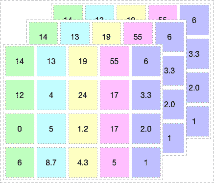
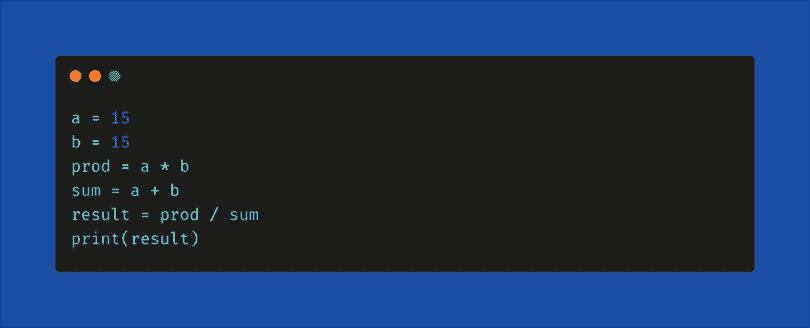

# PyTorch vs. TensorFlow:哪个框架最好？

> 原文：<https://dev.to/adamcalica/pytorch-vs-tensorflow-which-framework-is-best-5ea3>

如果你正在读这篇文章，你可能已经开始了你的深度学习之旅。如果你是这个领域的新手，简单来说，深度学习是开发类似人类的计算机的附加产品，通过其特殊的类似大脑的架构(称为人工神经网络)来解决现实世界的问题。为了帮助开发这些架构，谷歌、脸书和优步等科技巨头发布了 Python 深度学习环境的各种框架，使学习、构建和训练多样化的神经网络变得更加容易。在本文中，我们将看看两个流行的框架并对它们进行比较:PyTorch vs. TensorFlow。简而言之，比较最常用和最可靠的 Python 框架 TensorFlow 和 PyTorch。

**谷歌的 TENSORFLOW**

TensorFlow 是由谷歌的开发人员创建的开源深度学习框架，于 2015 年发布。官方研究发表在论文《TensorFlow:异构分布式系统上的大规模机器学习》中。

TensorFlow 现在被公司、创业公司和商业公司广泛用于自动化事物和开发新系统。它的声誉来自其分布式培训支持、可扩展的生产和部署选项，以及对 Android 等各种设备的支持。

**FACEBOOK 的 PYTORCH**

PyTorch 是最新的深度学习框架之一，由脸书的团队开发，并于 2017 年在 GitHub 上开源。你可以在研究论文“PyTorch 中的自动微分”中了解更多关于它的发展。

PyTorch 因其简单、易用、动态计算图和有效的内存使用而越来越受欢迎，我们将在后面详细讨论。

使用 TENSORFLOW 和 PYTORCH 我们可以构建什么？

最初，神经网络用于解决简单的分类问题，如手写数字识别或使用相机识别汽车的注册号码。但是由于最新的框架和 NVIDIA 的高计算图形处理单元(GPU ),我们可以在 terra 字节的数据上训练神经网络，并解决更复杂的问题。一些值得注意的成就包括使用在 TensorFlow 和 PyTorch 中实现的卷积神经网络在 IMAGENET 数据集上达到最先进的性能。经过训练的模型可以用于不同的应用，例如对象检测、图像语义分割等等。

尽管神经网络的架构可以在这些框架中的任何一个上实现，但结果不会相同。训练过程有许多依赖于框架的参数。例如，如果你在 PyTorch 上训练一个数据集，你可以使用运行在 CUDA(一个 C++后端)上的 GPU 来增强训练过程。在 TensorFlow 中，您可以访问 GPU，但它使用自己内置的 GPU 加速，因此训练这些模型的时间总是会因您选择的框架而异。

**顶级 TENSORFLOW 项目**

Magenta:一个开源研究项目，探索机器学习作为一种工具在创作过程中的作用。([https://magenta.tensorflow.org/](https://magenta.tensorflow.org/)

Sonnet: Sonnet 是一个构建在 TensorFlow 之上的库，用于构建复杂的神经网络。([https://sonnet.dev/](https://sonnet.dev/)

Ludwig: Ludwig 是一个训练和测试深度学习模型的工具箱，不需要编写代码。([https://uber.github.io/ludwig/](https://uber.github.io/ludwig/)

**顶级 PYTORCH 项目**

CheXNet:通过深度学习对胸部 X 射线进行放射科医生级别的肺炎检测。([https://stanfordmlgroup.github.io/projects/chexnet/](https://stanfordmlgroup.github.io/projects/chexnet/)

PYRO: Pyro 是一种用 Python 编写的通用概率编程语言(PPL)，由 PyTorch 在后端提供支持。([https://pyro.ai/](https://pyro.ai/)

地平线:应用强化学习的平台(Applied RL)([https://horizonrl.com](https://horizonrl.com)

这是一些构建在 TensorFlow 和 PyTorch 之上的框架和项目。你可以在 Github 以及 TF 和 PyTorch 的官网上找到更多。

**比较 PYTORCH 和 TENSORFLOW**

PyTorch 和 TensorFlow 的关键区别在于它们执行代码的方式。两个框架都处理基本的数据类型张量。你可以把张量想象成一个多维数组，如下图所示。

**1。机制:动态 VS 静态图形定义**
TensorFlow 是一个由两个核心构建块组成的框架:

1.  一个库，用于定义计算图形和运行时，以便在各种不同的硬件上执行这些图形。一个有很多优点的计算图(稍后会详细介绍)。

2.  计算图是将计算描述为有向图的一种抽象方式。图是由节点(顶点)和边组成的数据结构。它是由有向边成对连接的一组顶点。

在 TensorFlow 中运行代码时，计算图是静态定义的。所有与外界的通信都是通过 tf 进行的。会话对象和 tf。占位符，它们是在运行时将被外部数据替换的张量。例如，考虑下面的代码片段。

这就是在 TensorFlow 中运行代码之前，如何以静态方式生成计算图形。拥有计算图的核心优势是允许并行性或依赖性驱动调度，这使得训练更快、更有效。

在 BuiltIn.com 上查看其余更多代码示例: [PYTORCH VS. TENSORFLOW:哪个框架最适合你的深度学习项目？](https://builtin.com/data-science/pytorch-vs-tensorflow)