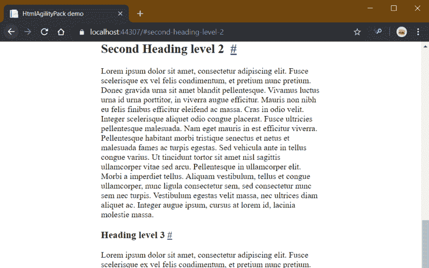

# 使用 HTML AgilityPack DOM 操作自动生成标题锚点

> 原文：<https://dev.to/swimburger/auto-generate-heading-anchors-using-html-agilitypack-dom-manipulation-19ml>

对于非常长的文档，很难与他人共享特定的片段。网站通常解决这个问题的一个方法是提供“标题锚”。我不确定“**航向锚**是否是正确的术语，但这是我见过的最具描述性的名称。标题锚是指文章为每个标题提供一个超链接，以提供深层链接。当您浏览到该链接时，它会直接滚动到标题。标题锚通常是通过在标题旁边添加井号“#”作为超链接来实现的。这里有一个来自 css-tricks.com 的很好的例子:

[](https://res.cloudinary.com/practicaldev/image/fetch/s--xYPbbtyl--/c_limit%2Cf_auto%2Cfl_progressive%2Cq_auto%2Cw_880/https://swimburger.net/media/m3goy4qt/csstricksheadinganchor.png)

手动为每个标题添加锚点将是一个痛苦的解决方案。因此，让我们学习如何通过使用 **HTML AgilityPack 生成标题锚来实现这一点。NET 库**。

## 使用 HTML AgilityPack 生成标题锚点

HTML AgilityPack (HAP) 是一个. NET 库，用于解析、查询和操作 HTML。这里有一些你可以用 HAP 做的操作。

要生成标题锚点，我们需要:

1.  解析我们的 HTML，不管 HTML 来自哪里(数据库，CMS 等等。)
2.  使用 XPath 选择我们的标题
3.  使用 DOM 操作添加“#”锚点
4.  输出操作后的 HTML

为了跟进，您可以使用包含所有示例代码的 GitHub 库。资源库中有更多相关的代码，但是最重要的部分是下面的函数:

```
public string AddHeadingAnchorsToHtml(string html)
{
    var doc = new HtmlDocument();
    doc.LoadHtml(html);
    // select all possible headings in the document
    var headings = doc.DocumentNode.SelectNodes("//h1 | //h2 | //h3 | //h4 | //h5 | //h6");
    if (headings != null)
    {
        foreach (var heading in headings)
        {
            var headingText = heading.InnerText;
            // if heading has id, use it
            string headingId = heading.Attributes["id"]?.Value;
            if (headingId == null)
            {
                // if heading does not have an id, generate a safe id by creating a slug based on the heading text
                // slug is a URL/SEO friendly part of a URL, this is a good option for generating anchor fragments
                // Source: http://predicatet.blogspot.com/2009/04/improved-c-slug-generator-or-how-to.html
                // assumption: Prase should only contain standard a-z characters or numbers
                headingId = ToSlug(headingText);
                // for the fragment to work (jump to the relevant content), the heading id and fragment needs to match
                heading.Attributes.Append("id", headingId);
            }

            // use a non-breaking space to make sure the heading text and the #-sign don't appear on a separate line
            heading.InnerHtml += "&nbsp;";
            // create the heading anchor which points to the heading
            var headingAnchor = HtmlNode.CreateNode($"<a href=\"#{headingId}\" aria-label=\"Anchor for heading: {headingText}\">#</a>");
            // append the anchor behind the heading text content
            heading.AppendChild(headingAnchor);
        }
    }

    return doc.DocumentNode.InnerHtml;
} 
```

<svg width="20px" height="20px" viewBox="0 0 24 24" class="highlight-action crayons-icon highlight-action--fullscreen-on"><title>Enter fullscreen mode</title></svg> <svg width="20px" height="20px" viewBox="0 0 24 24" class="highlight-action crayons-icon highlight-action--fullscreen-off"><title>Exit fullscreen mode</title></svg>

总之，上面的代码执行以下操作:

1.  使用`HtmlDocument.LoadHtml`函数解析 HTML
2.  通过向`DocumentNode.SelectNodes`函数传递一个 XPath 查询来选择所有标题
3.  迭代每个标题，并
    1.  通过在标题中添加文本，为每个标题生成一个 ID。 [ToSlug 方法就是基于这篇文章](http://predicatet.blogspot.com/2009/04/improved-c-slug-generator-or-how-to.html)。如果标题已经有一个 ID，我们可以重用它。
    2.  创建一个 HTML 锚，并将从 to heading-id 生成的片段 URL 设置为`href`-属性
    3.  将锚点附加到标题上，以便“#”锚点显示在标题文本的旁边
4.  返回被操作的 HTML

如果您使用这个示例，您会看到 HTML 来自于存储在服务器上的 HTML 文件，结果 HTML 直接返回到浏览器。结果看起来像这样:

[](https://res.cloudinary.com/practicaldev/image/fetch/s--rnrQLOxt--/c_limit%2Cf_auto%2Cfl_progressive%2Cq_auto%2Cw_880/https://swimburger.net/media/tkibfnd4/html-agility-pack-heading-anchors-demo.png)

**重要提示**:解析、查询和操作 DOM 是一项密集的任务。使用 HTML AgilityPack 时请记住这一点，并在必要时应用缓存。

## 总结

使用 HTML AgilityPack 库，我们解析、查询和操作 HTML 来生成标题锚，以获得更丰富的 URL 共享体验。

**奖励**:使用`Scroll-behavior` CSS 属性我们可以在支持的浏览器上启用平滑滚动动画[。](https://caniuse.com/#feat=css-scroll-behavior)