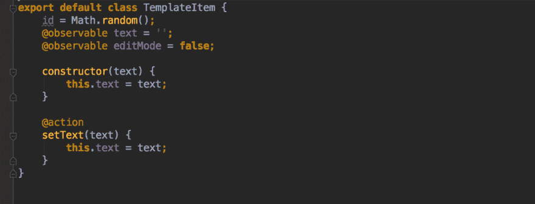
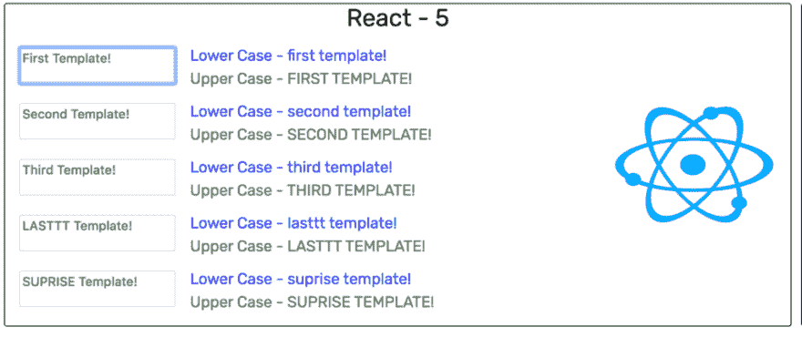
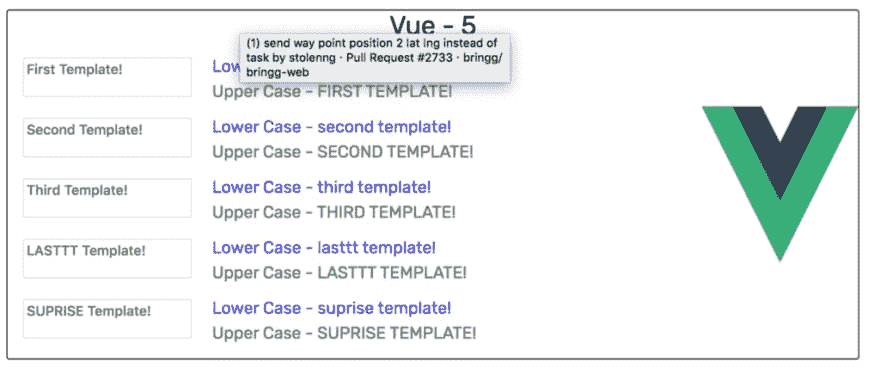
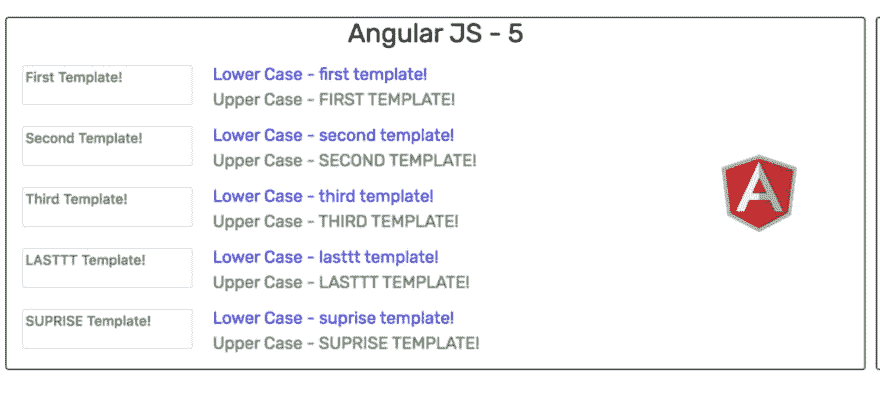

# 在您的 Web 应用中分离数据和用户界面

> 原文:[https://dev . to/stolenng/separation-of-data-and-ui-in-your-web-app-p9j](https://dev.to/stolenng/separation-of-data-and-ui-in-your-web-app-p9j)

大家好，我叫 Georgy，是[**【Bringg】**](http://bringg.com/)的全栈开发人员，这是我写的第一篇文章。😅

因此，今天我想重点介绍构建 web 应用程序时数据和 UI 分离的概念，它如何帮助您构建更干净、更易于维护和更棒的 web 应用程序，以及一个小例子，说明我如何能够以相同的一致性呈现 4 个不同的 UI/框架库。😄

通常，在任何 web 应用程序中，都有两个主要部分:

*   数据
*   用户界面

因此，你去选择一个框架/UI 库，如 React、Angular、Vue 等，然后你继续决定使用什么状态管理器或如何管理你的数据，也许没有状态管理器。

你开始写你的第一个特性，让我们以一个用户列表为例，你有一个选择用户的复选框，然后你需要决定在哪里保存你当前选择的用户。

> 您是否将它们保持在 react 组件状态？还是放在你的 redux 店里？还是把它们放在你的角度服务或控制器里？
> 
> 被选中的用户与你的数据有关系吗？或者仅仅是纯粹的观点指示器？

好的，所以我要和你分享你的思维模式，或者说你在编写特性的时候应该有的想法，通过上面的例子来帮助你更清楚的区分。

用户是我们应用程序中的数据，我们可以添加用户，修改用户数据，删除用户，我们可以从用户那里获取信息，比如谁在线，我们总共有多少用户等等。

当我们显示一个用户列表时，我们只是以一种对用户更可见的方式来表示我们的数据，就像一个列表让他看到。我们允许他选择用户和取消选择用户，这是视图的当前状态，在页面上选择的用户，这与数据没有任何关系，应该分开。

通过这种分离，我们将 javascript 应用程序开发为普通的 javascript 应用程序，然后选择我们想要的方式来表示我们的数据。这可以为我们提供最大的灵活性，就像使用我们想要的任何 UI 库一样，我想用 react 表示的这组组件和我想用 web 组件表示的其他几个组件，现在通过这种分离，我可以轻松地做到这一点。

> 我举了一个例子来展示这个很酷的概念:

我选择 [MobX](https://github.com/mobxjs/mobx) 来管理我在应用程序中的状态，并帮助我跨不同的框架/UI 库进行渲染。它有一个很酷的反应系统，可以让你自动响应你想要的事件。

我这里的模型是**模板，**非常简单，它只有一个名字和设置器(MobX 动作)，我保存了项目中所有模板的列表，我为它保存了一个模板列表，这是我所有的**数据。**

[T2】](https://res.cloudinary.com/practicaldev/image/fetch/s--Oaf32LBd--/c_limit%2Cf_auto%2Cfl_progressive%2Cq_auto%2Cw_880/https://cdn-images-1.medium.com/max/1024/1%2AsUeiUDg6QXbe08GrEyZNfg.png)

[T2】](https://res.cloudinary.com/practicaldev/image/fetch/s--dLviECGb--/c_limit%2Cf_auto%2Cfl_progressive%2Cq_auto%2Cw_880/https://cdn-images-1.medium.com/max/1024/1%2AKlb2cKUIoGzbYmjxOFwcuA.png)

我已经将我的应用程序作为 javascript 应用程序运行，我可以添加模板并更新它的文本，但我仍然没有这样的 UI，所以让我们在这里添加 React 作为我们的第一个 UI。

对于 react 我使用了 [**mobx-react**](https://github.com/mobxjs/mobx-react) ，这是一个连接到 mobx 的库，使用它的能力在 react 中进行渲染。

[T2】](https://res.cloudinary.com/practicaldev/image/fetch/s--ra91wm4u--/c_limit%2Cf_auto%2Cfl_progressive%2Cq_auto%2Cw_880/https://cdn-images-1.medium.com/max/1024/1%2A_jHARXfsu4DPvfK6G55lFg.png)

然后我选择了另一个库，Vue JS 和我保持几乎相同的 Html，和 CSS 类，我只是用 Vue 渲染，

我使用 MobX 自动运行([https://mobx.js.org/refguide/autorun.html](https://mobx.js.org/refguide/autorun.html))和每一个新的模板添加，或删除我重新渲染视图。

[T2】](https://res.cloudinary.com/practicaldev/image/fetch/s--eYdDPefi--/c_limit%2Cf_auto%2Cfl_progressive%2Cq_auto%2Cw_880/https://cdn-images-1.medium.com/max/1024/1%2Ak5ArS-smHdbb6rJlc2WMKQ.png)

现在，我们有了另一个 UI，它代表不同的库，但具有相同的存储，而无需更改应用程序中的一行数据管理。

[T2】](https://res.cloudinary.com/practicaldev/image/fetch/s--7YQAnVVo--/c_limit%2Cf_auto%2Cfl_progressive%2Cq_auto%2Cw_880/https://cdn-images-1.medium.com/max/1024/1%2AtGpOEofa1jIjxrwDQxqjLg.png)

现在我们在屏幕上有了更多的空间，所以我们需要选择更多的 2 个库，所以这次让我们选择 AngularJS。

AngularJS 的渲染有点烦人，因为它的 ng-model 会干扰模型，所以我必须将模板的文本保存在一个对象中，并在新模板上应用重新渲染。

[T2】](https://res.cloudinary.com/practicaldev/image/fetch/s--XvZz53tS--/c_limit%2Cf_auto%2Cfl_progressive%2Cq_auto%2Cw_880/https://cdn-images-1.medium.com/max/1024/1%2ArMgQ3As1LMKkb7GWLmn9Lg.png)

[T2】](https://res.cloudinary.com/practicaldev/image/fetch/s--6nSD_wpS--/c_limit%2Cf_auto%2Cfl_progressive%2Cq_auto%2Cw_880/https://cdn-images-1.medium.com/max/1024/1%2AZ2M5mSR8Vc4TRQKCzkySDw.png)

因此，对于我们的最后一个库，我选择了 [Preact](https://preactjs.com) ，这与 react 非常相似，在这里，我再次使用 autorun 来更新我的 UI。

[T2】](https://res.cloudinary.com/practicaldev/image/fetch/s--dtdNZqP0--/c_limit%2Cf_auto%2Cfl_progressive%2Cq_auto%2Cw_880/https://cdn-images-1.medium.com/max/1024/1%2AlqV2noA23HzDulsXr4OKLQ.png)

在这里，我还必须在每次更改时更新模板本身(类似于 mobx-react 所做的)。

[T2】](https://res.cloudinary.com/practicaldev/image/fetch/s--HGEdaFqq--/c_limit%2Cf_auto%2Cfl_progressive%2Cq_auto%2Cw_880/https://cdn-images-1.medium.com/max/1024/1%2AgzHJHBLK-ImmilyTK2FXIA.png)

就是这样，现在我们有 4 个不同的 UI/框架库，在同一个屏幕上显示完全相同的数据。

[T2】](https://res.cloudinary.com/practicaldev/image/fetch/s--fKYNtnWk--/c_limit%2Cf_auto%2Cfl_progressive%2Cq_auto%2Cw_880/https://cdn-images-1.medium.com/max/1024/1%2A_Dccz9ks746qQAs4P20vYQ.png)

我真的很喜欢这种分离，它使代码更加整洁，因为它只需要管理 UI 状态，甚至只需要表示数据而不需要任何游戏，它有助于代码更易于维护和扩展。

希望你喜欢这个概念，如果任何人有任何问题或只是想讨论，或给我任何改进的意见，都非常欢迎在 stolenng@gmail.com 的[脸书](https://www.facebook.com/gglezer)或通过邮件[与我交谈。](mailto:stolenng@gmail.com)

以下是知识库和网站的链接:

[stolenng/mobx-交叉数据-示例](https://github.com/stolenng/mobx-cross-data-example)

[http://mobx-cross-data.georgy-glezer.com/](http://mobx-cross-data.georgy-glezer.com/)