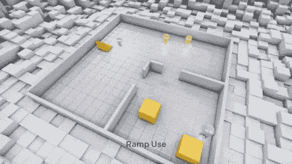
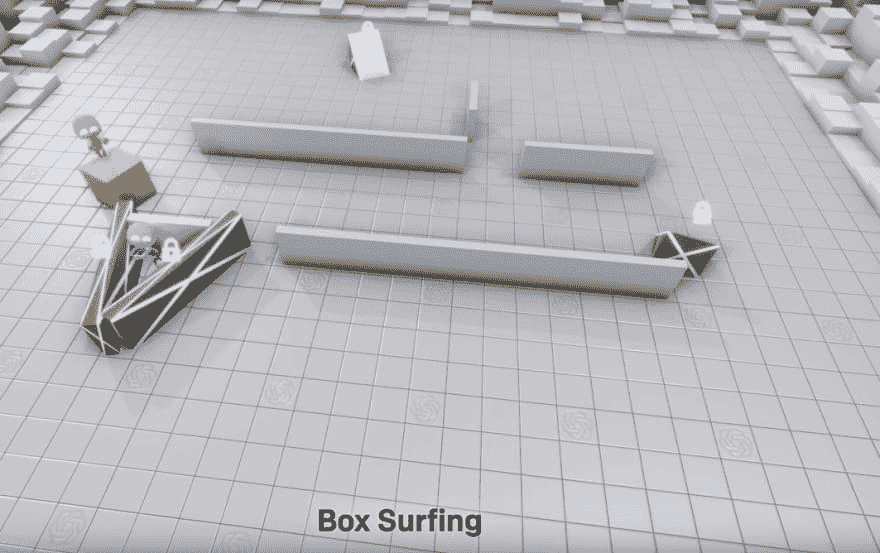

# OpenAI 的捉迷藏发现，系统视角

> 原文:[https://dev . to/aagnone 3/open ai-s-hide-and-seek-findings-the-systems-perspective-2197](https://dev.to/aagnone3/openai-s-hide-and-seek-findings-the-systems-perspective-2197)

### *是的，特工们作弊了，但这对系统意味着什么？*

OpenAI 发布了一个关于多智能体捉迷藏模拟中获得的一些结果的[神奇作品](https://openai.com/blog/emergent-tool-use/)，在该模拟中，多个隐藏者和多个寻找者玩这种流行的儿童游戏。

[T2】](https://res.cloudinary.com/practicaldev/image/fetch/s---H2qAoix--/c_limit%2Cf_auto%2Cfl_progressive%2Cq_66%2Cw_880/https://anthonyagnone.com/img/openai-hide-and-seek.gif)

该模拟有一些有趣的方面，如工具(盒子、斜坡、墙壁)，代理可以使用这些工具来帮助他们实现有效隐藏/寻找的目标。然而，更值得注意的结果是环境的扩展模拟导致了*涌现行为*；也就是说，根本没有计划或意想不到的行为。

例如，一些预期的行为是隐藏者将最终学会用墙和/或盒子建造一个围栏，以隐藏坡道不让搜索者看到。这样，坡道就不能从上面越过墙壁进入已建成的围墙。
现在，环境设计师没有预料到的(紧急行为)是，搜索者将会知道他们可以使用斜坡到达一个盒子的顶部，然后使用一个奔跑的动作来基本上“冲浪”盒子到他们喜欢的任何地方！

[T2】](https://res.cloudinary.com/practicaldev/image/fetch/s--VzjhP5R8--/c_limit%2Cf_auto%2Cfl_progressive%2Cq_auto%2Cw_880/https://anthonyagnone.com/img/openai-box-surfing.png)

使用这种方法，搜索者找到了一种从上方接近隐藏建筑的方法，这不是系统设计者的意图！

> 探索者欺骗了系统。

现在，你认为隐藏者对这种行为的反应是什么？你们中的一些人可能会认为，既然搜索者已经在某种程度上了解了系统的不确定行为，那么隐藏者可能会做出一些荒谬的反应，因为系统现在处于混乱状态。

但是仔细想想。系统没有处于任何未知状态。

虽然它可能处于设计者没有明确打算创造的状态，但代理人继续以他们认为对他们期望的结果最佳的方式运作。

因此，隐藏者学会了瘫痪搜索者的冲浪能力！

[T2】](https://res.cloudinary.com/practicaldev/image/fetch/s--JfbTwwXw--/c_limit%2Cf_auto%2Cfl_progressive%2Cq_auto%2Cw_880/https://anthonyagnone.com/img/openai-surf-defense.png)

他们通过使用预先分配的初始时间来做到这一点，在该时间内，搜索者被冻结*以锁定所有的箱子和斜坡*。
然后，他们利用剩下的任何时间，用活动墙搭建一个快速围栏，然后把墙锁上。
通过这种方式，搜索者现在又一次无法进入围栏内部(至少，人们是这么认为的)...).
干得好，伙计们。

我认为这很吸引人，但与 OpenAI 的大多数分析所关注的水平不同。
他们确实提到了代理发现了如何进入系统的方法:

> "[...]代理构建[...]战略和反战略，其中一些我们不知道我们的环境支持"

然而，他们随后只深入到代理人了解的场景的细节，而完全忽略了环境设计缺陷本身。我觉得后者才是更有趣的现象！我想把分析颠倒过来——现在让我们保持代理设计不变，改变环境的状态结构和奖励系统。
分析不同的激励/反应系统*如何诱导*不同的代理策略。
强化学习领域进展惊人，尤其是在最近几年。短短几十年间，我们已经从跳棋解算者变成了围棋冠军——我们的*智能体建模*越来越棒了。
现在，我们的*多智能体环境建模怎么样？*

# 多代理环境设计

OpenAI 当然也想过。根据他们的最后一段，

> 构建环境并不容易，通常情况下，代理会找到一种方法，以一种意想不到的方式利用您构建的环境或物理引擎。

由 [@BonsaiAI](https://medium.com/@BonsaiAI) 在 Medium 上写的一篇关于奖励函数设计的[文章提到“你得到你所激励的，而不一定是你想要的。”
这很好地总结了为某个特定结果设计奖励体系时固有的困境。
你当然知道你的激励系统将如何使整个系统达到期望的状态，但你是否考虑过你的系统中可能存在一些“裂缝”的所有细微之处？显然，这说起来容易做起来难。这种“意图与结果”的分歧在我们的日常生活中随处可见，无论是专业还是非专业:](https://medium.com/@BonsaiAI/deep-reinforcement-learning-models-tips-tricks-for-writing-reward-functions-a84fe525e8e0)

*   软件工程师打算将文档化的规范转化为功能软件，忠实地再现文档化的变更。
*   公司高管打算根据员工为公司整体提供的价值，给予他们适当的报酬。
*   运动队经理打算运用比赛计划和球员阵容来战胜每一个连续的对手。
*   等等...

> 对于所有这些情况，一个坚定而简洁的事实是，系统的行为*完全符合设计的*;没有*意料之外的*后果，只有*意料之外的*后果。

为了让这个想法更清楚，让我们把补偿场景看得更远一点。
假设有接近公司中层的员工对他们的薪酬不满意，并对薪酬结构的整体设计提出质疑
(假设整个组织都知道该结构)。
这些员工可能会说“这个系统坏了”或“这里发生的事情是*错了*”。
然而，在这种情况下(假设设计者富有同情心且公正),不能说的是“这个系统没有做它被设计的事情”

当然是啦！它正在做它被指示做的事情！如果它应该做一些与现在不同的事情，那么它就应该这样改变。
现在，我们可能已经*打算*让系统做一件事，但这可能是也可能不是最终的设计。
然而，不管意图如何，正在发生的是被选中的系统的*完美再现。*

# 新边疆

我很高兴看到更多的理论围绕环境激励系统的有效设计而发展，尤其是在多主体场景中。像这样的理论应用在我们的日常生活中比比皆是，甚至是我们试图回答的关于彼此生活的最重要的问题。
以下是一些例子:

*   我们治理自己和他人的最佳方式是什么？ [1](#fn1)
*   组织我们如何定义和相互交换价值的最佳方式是什么？
*   为了共同的最终产品或创作，相互协作的最佳方式是什么？

只需举一两个例子就能让你对此有足够的动力。这很好...因为这个领域的研究在某些方面才刚刚起步。例如，我想象有太多的历史出版物对政府、经济体系和管理层级等事物进行系统层面的分析。
然而，所有这些优势将很快与多代理 RL 的最新进展结合起来。
这些理论家族之间的重要相似性和差异有可能导致人类系统和计算机代理系统等主题的知识和应用的爆炸。

# 结论

无论代理人是人类还是数字，系统总是被游戏化的。

对于防止/检测/打击利用激励系统的有效方法，您有什么想法？

你所知道的一些有趣的“永恒的”学术著作是什么，它们分析了人类/智能体系统？

多智能体 RL 中的奖励设计也是如此吗？

您在这里还看到了哪些我没有提到的应用？

* * *

1.  我期待着有一天，候选人提出的政策可以通过模拟来评估，让电视辩论的马戏变得毫无用处 [↩](#fnref1)