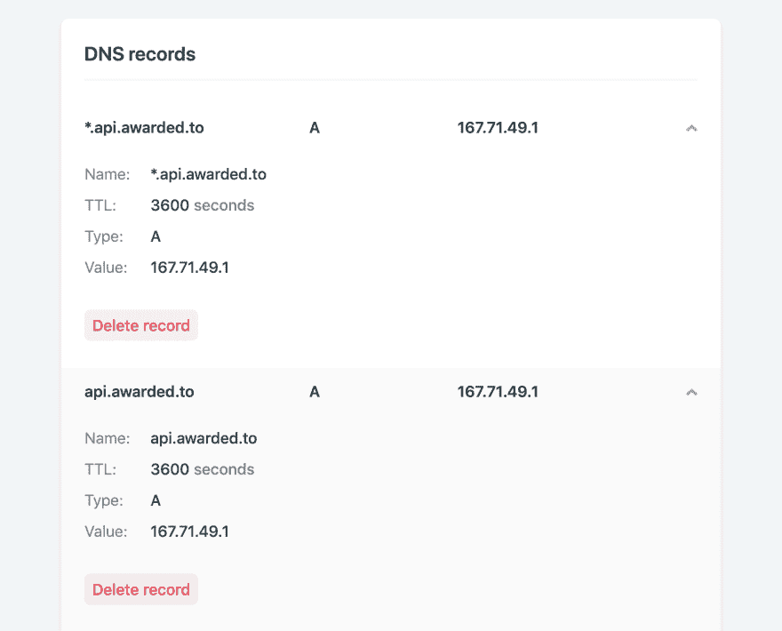

# 如何使用 Dokku 部署后端应用

> 原文:[https://dev . to/danroc/how-to-deploy-back end-apps-to-do kku-4 EIG](https://dev.to/danroc/how-to-deploy-backend-apps-to-dokku-4eig)

我最近用 Dokku 把我所有的应用程序从 Heroku 转移到了 DigitalOcean droplet。这种集中化的东西又为我省了一大笔钱。下面是我为每个新应用程序提供的一个启动和运行方法。

澄清一下，我是个业余爱好者。我开发应用程序是为了好玩，我边做边学。我的建议可能有缺陷，但对我有用，也可能对你有帮助:)

## [](#what-do-i-build)我造什么？

我的项目都是在基于 Vue 的前端上构建的(使用 Vue-CLI、Nuxt、Vuepress 或 Gridsome)。当我需要一个数据库时，我用 Postgraphile 设置一个 Postgres 实例，它在后端给了我一个 GraphQL 端点。就在最近，我开始探索 Strapi 作为一个有吸引力的 CMS，它也使用 Postgres 作为数据库，并通过 GraphQL 端点向我的前端交付数据。

## [](#where-do-i-host)我在哪里托管？

对于我所有的前端需求，Netlify 已经足够了。它是免费的，易于使用，具有优秀的界面和可用性。它非常适合 Vue 供电的项目。

不幸的是，Netlify 不适用于我的依赖 Postgres 的后端项目。我尝试了许多服务，但最终选择了数字海洋上的 Dokku 作为我所有后端需求的最佳解决方案。

## [](#what-else-have-i-tried)我还试过什么？

一旦开始在后台使用 Postgres，有两种选择:自托管或托管数据库服务。

很长一段时间，我认为我必须避免自托管(和自维护)Postgres 数据库。碎片？复制？备份和恢复？升级？这一切曾经让我不寒而栗。

所以我在开发初期的大部分时间里都在尝试托管数据库服务。

### [](#heroku)Heroku

是的，Heroku 有一个慷慨的免费等级和一个免费的 Postgres 插件。

然而，当你意识到你会比你想象的更快地跨越一些限制时，免费是有代价的。当你决定解决所有问题并升级你的服务时，你已经付出了比免费更多的钱。

### [](#aws-rds)AWS RDS

然后我转移到 AWS RDS，在一个容器中创建了一个 Postgres 实例。

我想我可以以最低的成本托管我所有的数据库，因为它们提供了非常慷慨的免费层。然而，一旦免费层结束，我每月为我的小副业项目的数据库需求支付近 50 美元。这需要改变。

## [](#why-dokku-on-digital-ocean)为什么要上数字海洋 Dokku？

过了一会儿买单，我才意识到我是(插入比喻)。当然，托管数据库解决方案也有优势。然而，对于我的副业项目的规模来说，我需要的很少。毕竟，如果出现问题，我的应用程序离线，我可以从备份中恢复它们，让它们再次运行。

因此，我的要求很简单:

*   计划的数据库备份
*   简单的 git 部署
*   低价

这就是 Dokku 发挥作用的地方。它就像 Heroku，但是没有漂亮的用户界面。你必须把它放在你的 droplet 上，而且都是基于命令行的。

然而，它提供了一切:您可以轻松地创建应用程序，添加域，设置变量，添加 Postgres 数据库，设置定时备份，并通过 git 进行部署。

这一切都在一个小小的数字海洋水滴里，每月花费我 5 美元。

## [](#whats-my-process)我的流程是什么？

每次我启动一个新的应用程序，我都会遵循一系列步骤，这使得整个过程非常简单。该配方假设:

*   您已经有一个安装了 Dokku 的 DO droplet。如果没有，[遵循本教程](https://github.com/dokku/dokku/blob/master/docs/getting-started/install/digitalocean.md)
*   您已经确保了 droplet 的安全性，移除了 root 登录并创建了一个可以通过 SSH 登录的新用户。如果没有，[遵循本教程](https://www.digitalocean.com/community/tutorials/initial-server-setup-with-ubuntu-16-04)
*   您通过 SSH 登录了您的 droplet

### [](#create-the-app)创建 app

您可以通过键入`dokku`后跟命令和其他选项来使用 Dokku。键入`dokku help`查看所有命令的列表:

```
~ dokku help Usage: dokku [--quiet|--trace|--rm-container|--rm|--force] COMMAND <app> [command-specific-options]

Primary help options, type “dokku COMMAND:help” for more details, or dokku help --all to see all commands.

Commands:

    apps                     Manage Dokku apps
    buildpacks               Manages buildpack settings for an app
    certs                    Manage Dokku apps SSL (TLS) certs
    checks                   Manage zero-downtime settings
    config                   Manages global and app-specific config vars
    docker-options           Pass options to Docker the various stages of an app
    domains                  Manage vhost domains used by the Dokku proxy
    enter                    Connect to a specific app container
    events                   Show the last events (-t follows)
    git                      Manages the git integration for an app
    help Print the list of commands
    logs                     Output app logs
    network                  Manages network settings for an app
    nginx                    Interact with Dokku’s Nginx proxy
    proxy                    Manage the proxy used by dokku on a per app 
```

如您所见，您还可以键入`dokku COMMAND:help`来获得关于特定命令的更多帮助。因为我们想创建一个应用程序，让我们来看看如何使用`apps`命令:

```
~ dokku apps:help
Usage: dokku apps[:COMMAND]
Manage Dokku apps

Example:
$ dokku apps:list
=====> My Apps
example
example2

Additional commands:
    apps                              [DEPRECATED] Alias for apps:list
    apps:clone <old-app> <new-app>    Clones an app
    apps:create <app>                 Create a new app
    apps:destroy <app>                Permanently destroy an app
    apps:exists <app>                 Checks if an app exists
    apps:list                         List your apps
    apps:lock <app>                   Locks an app for deployment
    apps:locked <app>                 Checks if an app is locked for deployment
    apps:rename <old-app> <new-app>   Rename an app
    apps:report [<app>] [<flag>]      Display report about an app
    apps:unlock <app>                 Unlocks an app for deployment 
```

很容易想出下一步该做什么，对吧？

```
~ dokku apps:create appname
-----> Creating appname... done 
```

当然，你可以使用任何你想要的名字。这与在 Heroku 中创建新应用程序是一样的。它还为您提供了一个远程 git 存储库，您可以将它添加到您的本地应用程序:

```
git remote add dokku dokku@<droplet-ip>:appname 
```

在添加之前，在上面的命令中添加 droplet IP。我假设您已经使用 git 部署了应用程序，所以我就不详细介绍了。如果没有，请查看本教程。

### [](#add-a-domain)添加一个域

我总是喜欢把我的后台放在我的应用程序的子域上。例如，如果我的应用程序位于[award . to](https://awarded.to)，我希望它的 API 端点位于*API . award . to*。

你不需要这样做(你总是可以使用 droplet 的 IP 地址访问你的应用程序)，但它使一切变得干净友好。当您在同一个 droplet 中有多个应用程序时，这也很有帮助。此外，这样做很简单:

首先，您需要修改您的域的 DNS 设置。你需要添加一个以你的子域命名的记录，并指向 droplet 的 IP 地址。在 Netlify 上，它看起来像这样:

[T2】](https://res.cloudinary.com/practicaldev/image/fetch/s--4GwPFnY1--/c_limit%2Cf_auto%2Cfl_progressive%2Cq_auto%2Cw_880/https://thepracticaldev.s3.amazonaws.com/i/4vwpl4zf4b99791mi86z.png)

对您的注册商的说明可能会有所不同。只要在它的文档中搜索“添加 DNS 子域”,你应该能很快找到答案。

现在回到 Dokku，你将添加子域到你的应用程序。为此，请键入:

```
~ dokku domains:add appname domain 
```

该域应该没有`http`协议(只是 *api.awarded.to* 而不是*[https://API . awarded . to](https://api.awarded.to)*)。

为了保证安全，您还应该在您的端点上执行`https`。本文将带您完成访问后端端点时确保加密的必要步骤:[毫不费力地将 HTTPS 添加到 Dokku，让我们加密](https://medium.com/@pimterry/effortlessly-add-https-to-dokku-with-lets-encrypt-900696366890)

### [](#add-postgres)添加 Postgres

就像在 Heroku 中一样，在应用程序中添加 Postgres 服务非常简单。首先，创建一个新的数据库:

```
~ dokku postgres:create dbname

# Then link it to your app
~ dokku postgres:link appname dbname 
```

就是这样。它用您的数据库地址创建了一个名为 DATABASE_URL 的环境变量。如果您的应用程序被配置为通过这个环境变量访问数据库，您就可以开始了。否则，您可以根据需要基于该值设置其他变量。

您还应该在数据库上设置自动备份。我通常设置一个 cron 作业，每天创建一个数据库转储，并上传到 AWS S3 桶。

为此，您首先需要一个 S3 bucket 和一个具有适当权限的 IAM 用户。使用以下策略在 S3 上创建一个时段，并在 AWS IAM 上创建一个用户:

```
{  "Version":  "2012-10-17",  "Statement":  [  {  "Action":  [  "s3:ListAllMyBuckets",  "s3:GetBucketLocation"  ],  "Effect":  "Allow",  "Resource":  [  "arn:aws:s3:::*"  ]  },  {  "Effect":  "Allow",  "Action":  "s3:*",  "Resource":  [  "arn:aws:s3:::lutasanticapital/*",  "arn:aws:s3:::lutasanticapital"  ]  }  ]  } 
```

复制其凭证(访问密钥 ID 和秘密访问密钥)，您将使用这些凭证在 Dokku:
上配置备份

```
# setup s3 backup authentication
dokku postgres:backup-auth dbname AWS_ACCESS_KEY_ID AWS_SECRET_ACCESS_KEY

# backup the `appname` service to the `BUCKET_NAME` bucket on AWS
dokku postgres:backup appname BUCKET_NAME

# schedule a backup
# CRON_SCHEDULE is a crontab expression, eg. "0 3 * * *" for each day at 3am
dokku postgres:backup-schedule appname CRON_SCHEDULE BUCKET_NAME 
```

## [](#deploy-and-enjoy)部署享受

差不多就是这样。如果你的应用程序不太复杂，它应该在第一次 git 推送到 dokku remote 之后就可以工作了:

```
~ git push dokku master 
```

留意日志，查看应用程序是否正确部署，并纠正可能出现的任何错误。

你的应用程序应该在你选择的域上运行，只需等待你的前端连接！

## [](#help-me-to-improve-it)帮我完善一下

如果你有任何问题让我知道。

正如我之前写的，我是一个业余爱好者。请，如果你看到错误或改进的机会，让我知道！我总是乐于学习如何让事情变得更好。