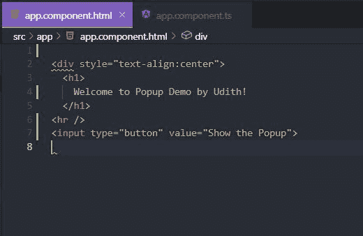
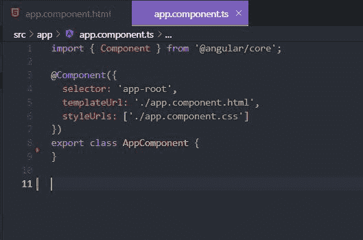
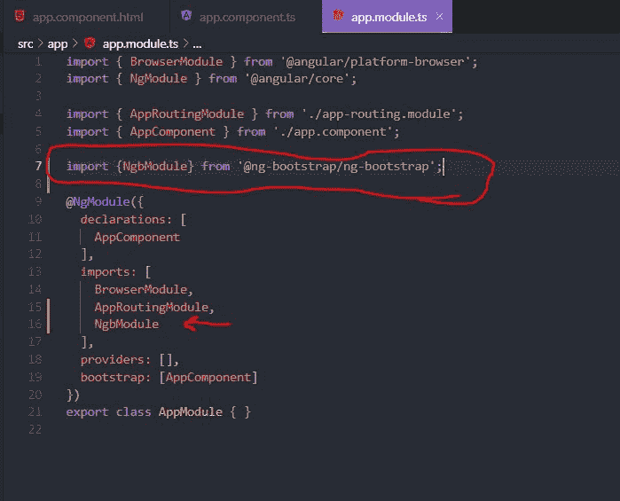
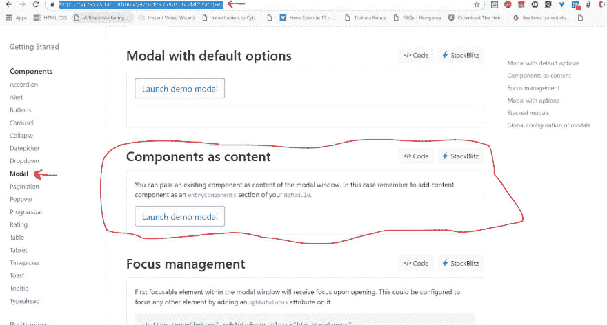
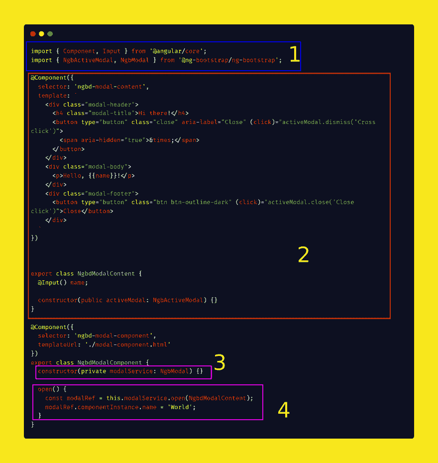
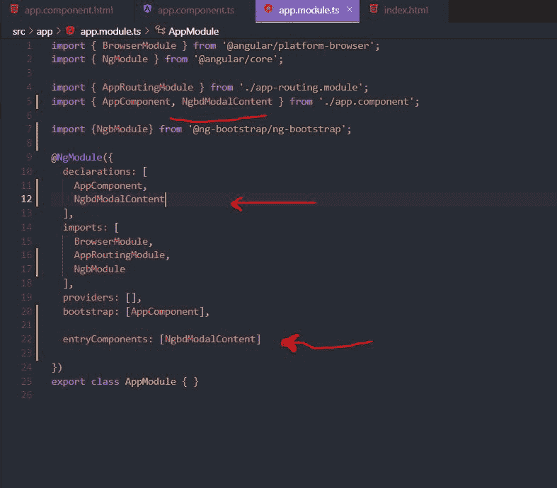

# 如何在角度组件中使用 ng 引导的弹出模式

> 原文:[https://dev . to/udithgayan/how-to-use-ng-bootstrapped-popup-modals-within-angular-components-39pf](https://dev.to/udithgayan/how-to-use-ng-bootstrapped-popup-modals-within-angular-components-39pf)

大家好，这篇文章是关于如何在 Angular 应用程序的组件中添加 ng-bootstrapped 模态的。通过阅读本文，初学者可以学习如何在 Angular 应用程序中添加和使用不同的自举小工具和其他东西。

我已经创建了一个非常简单的项目，但还没有引导。我只需要添加一个弹出消息框时，点击页面上的按钮。下面是我的应用程序现在的样子，我只使用了 app.component.ts 和 app.component.ts 文件。

初始网页

app . component . ts
[T3】](https://res.cloudinary.com/practicaldev/image/fetch/s--ur5gXo4L--/c_limit%2Cf_auto%2Cfl_progressive%2Cq_auto%2Cw_880/https://thepracticaldev.s3.amazonaws.com/i/ul9skddwxq2kscgp53i8.JPG)

现在让我们开始添加要求继续。

**<u>第一步</u>**

*   转到项目的根项目文件夹。*   运行`npm install --save @ng-bootstrap/ng-bootstrap`将 ng-bootstrap 安装到您的项目中*   转到 app.module.ts 文件，在导入数组中导入 Ngbmodule。 `import {NgbModule} from '@ng-bootstrap/ng-bootstrap';`

app . module . ts
[T3】](https://res.cloudinary.com/practicaldev/image/fetch/s--I73_YO9P--/c_limit%2Cf_auto%2Cfl_progressive%2Cq_auto%2Cw_880/https://thepracticaldev.s3.amazonaws.com/i/g9e0sjbpidyzrt34yxlb.JPG)

*   去*index.html*复制 [bootstrap CDN](https://getbootstrap.com/docs/4.3/getting-started/introduction/) 代码 snippent 从 bootstrap 站点，在标签范围内。
( For now, )

**<u>第二步</u>**

*   转到 ng-bootstrap 站点，找到 Modal 的引导代码部分。( [Modal-ng-bootstrap](https://ng-bootstrap.github.io/#/components/modal/examples)

段为情态动词
 

*   在我圈出的部分中，当您单击名为“> Code”的按钮时，您可以找到一个名为 modal-component.ts 的代码文件，其代码片段如下。

[T2】](https://res.cloudinary.com/practicaldev/image/fetch/s--Ngvq_Sup--/c_limit%2Cf_auto%2Cfl_progressive%2Cq_auto%2Cw_880/https://thepracticaldev.s3.amazonaws.com/i/nbwr7uci1hmuse4xcksp.png)

*   在上面的代码中，您可以找到两个类 NgbdModalContent(红色正方形)和 NgbdModalComponent(紫色正方形)。
*   现在是时候从这个片段复制代码并粘贴到您的 app.component.ts 文件中了。
*   首先，将上图第 1 节中显示的模块导入到 app.component.ts 文件中。
*   其次，复制第二部分中的整个代码，并将其粘贴到 app.component.ts 文件的最末尾。
*   第三，将服务注入到 app.component.ts 文件中的 AppComponent 类的构造函数中，如第 3 节所示。
*   最后，复制第 4 节中显示的方法“Copy()”作为 AppComponent 类的一个 netive 方法。
*   这个方法现在可以用在 html 文件中的按钮内的(click)事件中。

**<u>第三步</u>**

*   在声明数组中输入 NgbdModalContent 类，并在 app.module.ts 文件中输入 entryComponent。

app . module . ts
[T3】](https://res.cloudinary.com/practicaldev/image/fetch/s--nHWku6Mr--/c_limit%2Cf_auto%2Cfl_progressive%2Cq_auto%2Cw_880/https://thepracticaldev.s3.amazonaws.com/i/c7cw9ms1sexvf1j1f4oq.JPG)

**<u>最后</u>**

这是我的 app.component.ts 文件和 html 文件。

app . component . ts
[T3】](https://res.cloudinary.com/practicaldev/image/fetch/s--ISOjdS-O--/c_limit%2Cf_auto%2Cfl_progressive%2Cq_auto%2Cw_880/https://thepracticaldev.s3.amazonaws.com/i/u7udaqzejmatw6jcz93b.JPG)

最终查看时点击页面上的
 按钮

享受自举！！！