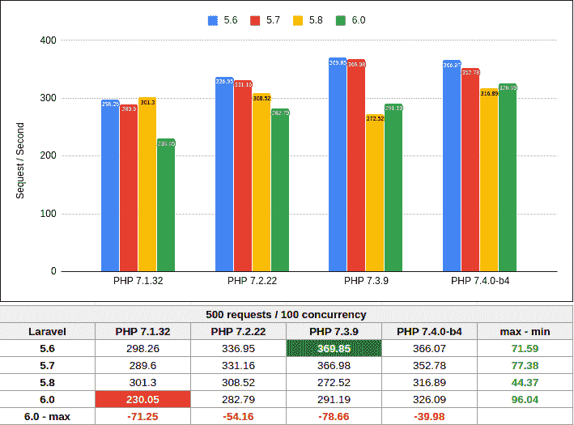
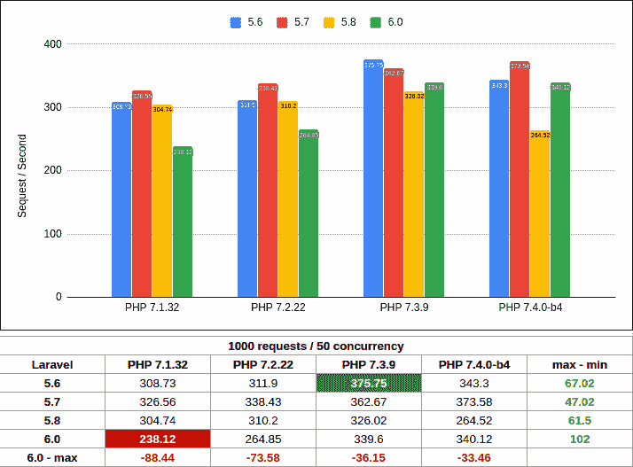
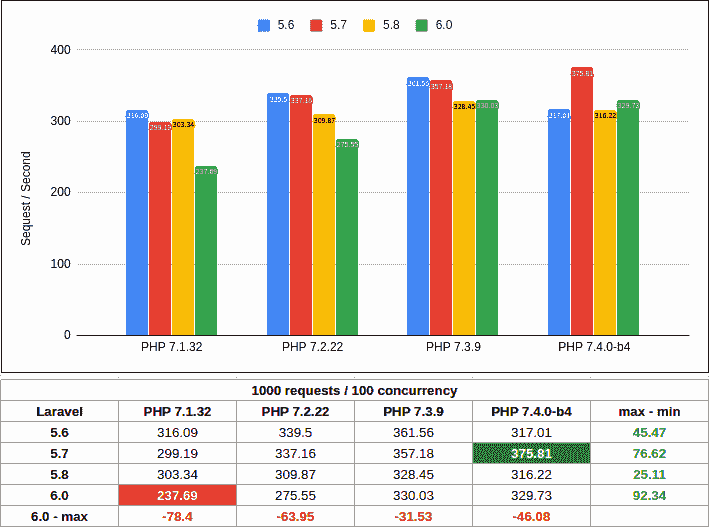

# Laravel 5.6 5.7 5.8 6.0 与 PHP 7.1 7.2 7.3 7.4 的性能测试

> [https://dev . to/lito/性能测试在 laravel-5-6-5-7-8-6-0-vs PHP-7-7-2-7-3-7-4-2 bpj](https://dev.to/lito/pruebas-de-rendimiento-en-laravel-5-6-5-7-5-8-6-0-vs-php-7-1-7-2-7-3-7-4-2bpj)

利用 Laravel 6.0 的发布，我进行了测试，分析了不同版本 Laravel 对不同 PHP 版本的时间和响应能力。

作为基础项目，我使用了一个名为 [BeMyCrown](https://bemycrown.com) 的个人项目，该项目与所有选定的 Laravel 和 PHP 版本兼容。

无法包含 Laravel 5.4，因为框架代码与以下版本不完全兼容。

其想法是分析在不同版本的 Laravel 和 PHP 中应用的改进是否真正体现在应用性能上。

测试伺服器配备 Intel core i5-8600k @ 3.60 GHz CPU，配备 16gb ram 和 NVME 磁碟。

Composer 相依性设定如下:

```
"require": {
 "php": ">=7.1.3",
 "laravel/framework": "X.X.*",
 "predis/predis": "^1.1",
 "eusonlito/disposable-email-validator": "^0.1",
 "eusonlito/laravel-packer": "^2.1",
 "eusonlito/laravel-meta": "^3.1",
 "eusonlito/laravel-gettext": "^2.0",
 "eusonlito/laravel-form-manager": "^1.0",
 "eusonlito/amazon-mws": "dev-master",
 "h4cc/wkhtmltopdf-amd64": "0.12.3",
 "mikehaertl/phpwkhtmltopdf": "^2.3",
 "sentry/sentry-laravel": "^1.0",
 "braintree/braintree_php": "^3.39"
} 
```

y 为了测试，我编写了以下脚本[:https://gist . github . com/euonlito/b8ca 1 e 80220 f 3791 B3 AE 8 BFA 1 d3c 8d 76](https://gist.github.com/eusonlito/b8ca1e80220f3791b3ae8bfa1d3c8d76)

运行将生成一系列工具日志`ab`，并创建 CSV 以允许我生成比较图表。

作为服务器，我使用一系列 Apache virtual hosts 作为不同 PHP-FPM 版本的代理，所有这些版本都配置相同。

aquíestn los resultados al completo[https://docs . Google . com/spreadsheets/d/e/2 pacx-1 vrt 4 dypz 0 ypg 4 fjkjyoctk 71n 91 istkinefxm 8 aejjevixqfkv 5 skxxkopzv 9 x 5 HTR 4 duzjvigsptg/publibhtml](https://docs.google.com/spreadsheets/d/e/2PACX-1vRt4dYPz0YPg4FjKjYOCtk71n91IstKIIneFxM8aEJJEviXqFkV5SKXXkOpZv9x5htR4DuzJvigsptg/pubhtml)

[T2】](https://res.cloudinary.com/practicaldev/image/fetch/s--VlVOEOJu--/c_limit%2Cf_auto%2Cfl_progressive%2Cq_auto%2Cw_880/https://thepracticaldev.s3.amazonaws.com/i/byoz8nnobmf6m35odk32.png)

<figcaption>500 peticiones - 50 concurrentes</figcaption>

[T2】](https://res.cloudinary.com/practicaldev/image/fetch/s--3-aQZhfv--/c_limit%2Cf_auto%2Cfl_progressive%2Cq_auto%2Cw_880/https://thepracticaldev.s3.amazonaws.com/i/r9oy57fclt3zh2hv6yq3.png)

<figcaption>500 peticiones - 100 concurrentes</figcaption>

[T2】](https://res.cloudinary.com/practicaldev/image/fetch/s--kvz1TkQx--/c_limit%2Cf_auto%2Cfl_progressive%2Cq_auto%2Cw_880/https://thepracticaldev.s3.amazonaws.com/i/icokbwbc3986evlffk3c.png)

<figcaption>1000 peticiones - 50 concurrentes</figcaption>

[T2】](https://res.cloudinary.com/practicaldev/image/fetch/s--ewUyH0Cu--/c_limit%2Cf_auto%2Cfl_progressive%2Cq_auto%2Cw_880/https://thepracticaldev.s3.amazonaws.com/i/etyz7gc245rc3ana4lxc.png)

<figcaption>1000 peticiones - 100 concurrentes</figcaption>

如您所见，Laravel 6.0 的到来并没有带来任何性能改进，甚至远远落后于 5.6 或 5.7，而且正如您所看到的那样，每一个新版本的性能都显着下降。

总之，**我认为 Laravel 应该认真地把**电池与整体的框架性能结合起来，也许可以去除雄辩中的一些魔力，尽量减少面部的使用，优化服务容器或者一点一点地做到这一点。

虽然它的性能优于 PHP 的其他框架，但作为一个成熟的项目，它的开发应着眼于尽可能接近 Symfony，symfony 仍远高于‘t1’，更不用说考虑成为 Express 竞争对手(NodeJS)。

目前，它为开发人员提供了简单和方便，但这可能在不久的将来提供给任何其他开发人员，我们只能根据他们的表现来考虑其中一个。

这是所有的朋友！