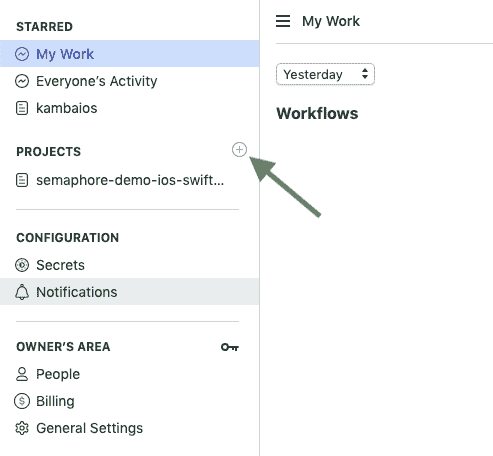
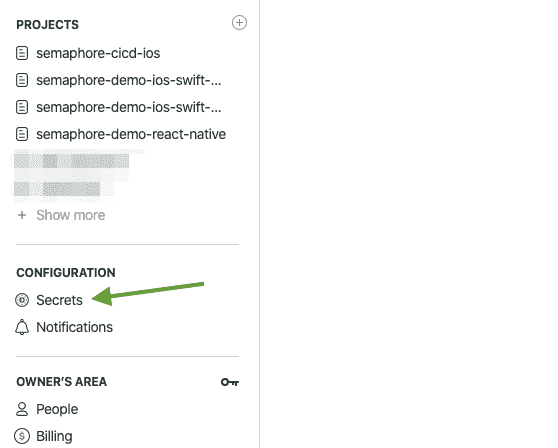
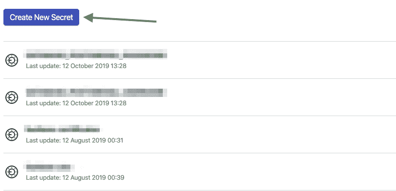
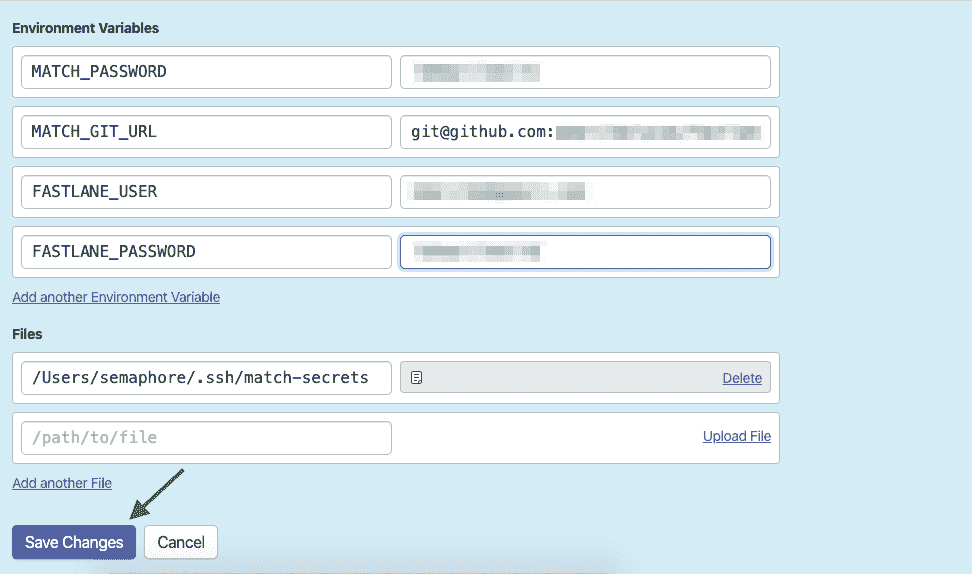
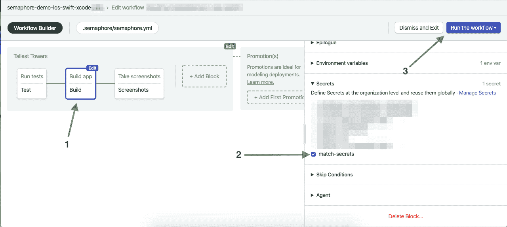
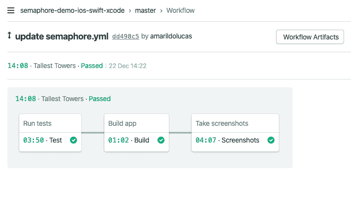

# 教程:使用 CI/CD 构建、测试和部署 iOS 应用程序

> 原文:[https://dev . to/semaphore/tutorial-build-test-deploy-an-IOs-app-with-ci-CD-37k 4](https://dev.to/semaphore/tutorial-build-test-deploy-an-ios-app-with-ci-cd-37k4)

当我们开发 iOS 应用程序时，我们通常使用 Xcode 管理器来管理应用程序发布过程。然后我们签名，测试，构建，存档，提交，修改版本，一次又一次地向 TestFlight 或 AppStore 提交新的构建。

如果我们每天都生成我们的构建，这个过程是乏味和累人的。迟早，你会问自己:

## 我们如何自动化整个过程？

[iOS 的持续集成和持续交付(CI/CD)](https://semaphoreci.com/ios-continuous-integration)使我们能够改进我们的构建部署。我们能够以可持续的方式随时发布更新，而没有每次手动发布的障碍。当我们添加新代码或者在提交到我们的库之前采取试错法时，我们不需要运行所有的测试。

在本教程中，我们将学习如何使用 Semaphore 作为 CI/CD 平台，将我们的应用程序自动部署到 TestFlight。当我们将代码推送到远程存储库时，Semaphore 将测试、构建、部署并生成我们的应用程序的截图。

为了简单起见，我们将本教程分为两部分:

*   [**持续集成**](https://semaphoreci.com/continuous-integration) :构建、测试、归档 app。
*   [](https://semaphoreci.com/cicd)**:提交构建进行试飞。**

 **我们将从以下方面开始:

1.  在 GitHub 中建立我们的仓库。
2.  正在注册信号量 CI。
3.  将我们的 GitHub 库链接到 Semaphore CI 项目。
4.  配置我们的第一个 [CI/CD 管道](https://semaphoreci.com/blog/cicd-pipeline)。
5.  改善我们与浪子的 CI/CD 渠道。

## 与信号量的持续集成

您将需要一个 [iOS](https://semaphoreci.com/product/ios) 应用程序来配置我们的持续集成和交付渠道。然后，您需要配置一个新的存储库。

我们将使用:

1.  [Git](https://git-scm.com/) :用于版本控制。
2.  一个 GitHub 账户来管理我们的仓库。
3.  以 Swift 5.1 为开发工具的 Xcode 11。
4.  构建我们的用户界面。
5.  创建并运行单元测试和 UI 测试。

> **注意:** SwiftUI 预览和检查器仅在 macOS Catalina 10.15 上运行时可用。

您可以下载该项目并跟随本教程，或者从头开始创建一个新的 iOS **单视图应用程序**项目。

**下载** : [信号量演示 iOS Swift Xcode](https://github.com/semaphoreci-demos/semaphore-demo-ios-swift-xcode)

Xcode 会自动为您设置 Git，因为默认情况下它是被选中的。否则，您可以在终端中运行根项目目录中的`git init`来手动设置。

您还可以通过在终端中编写`git status`来检查您的新 git 存储库。

```
$ git status

On branch master
nothing to commit, working tree clean
```

在模拟器上构建并运行应用程序。如果项目中有单元测试和 UI 测试，首先在测试导航器中运行测试用例。如果一切正常，将代码推送到 GitHub 库。几乎每个新的 iOS 项目第一次运行都没有问题。如果你遇到问题，你可以随时从 Github 获取[信号量演示应用，我们将使用它来完成本教程。](https://github.com/semaphoreci-demos/semaphore-demo-ios-swift-xcode)

**信号量流水线被配置为:**

*   运行所有单元和 UI 测试。
*   构建应用程序并生成一个`ipa`档案。
*   生成自动化的应用商店截图。
*   上传存档的`ipa`和截图。

在本教程结束时，您将获得如下图所示的结果:

[T2】](https://res.cloudinary.com/practicaldev/image/fetch/s--3ZxQYI09--/c_limit%2Cf_auto%2Cfl_progressive%2Cq_auto%2Cw_880/https://wpblog.semaphoreci.com/wp-content/uploads/2020/01/68747470733a2f2f746563686e6963616c2d636f6e74656e742e73332d73612d656173742d312e616d617a6f6e6177732e636f6d2f73656d6170686f72652d636963642d737563636573732d626c6f636b732e706e67.png)

### 为 iOS 项目设置信号量

**前往 https://semaphoreci.com/login**用你的 GitHub 账号登录。

点击 **+项目**添加项目。

[T2】](https://camo.githubusercontent.com/0d7c5aaa507385c9e6ab40aca6c071ede1387afd/68747470733a2f2f616d6172696c646f6c756361732e73332d73612d656173742d312e616d617a6f6e6177732e636f6d2f53656d6170686f726543492f696f732d63692d63642f436170747572612b64652b54656c612b323031392d30392d31372b61254343253830732b30382e34382e32372e706e67)

Semaphore 将列出 GitHub 库。如果您还没有推送代码，那么您将需要推送它，这样您就可以看到所列出的存储库。

在创建了新的存储库之后，按照 GitHub 的说明进行操作，这是最重要的部分:

```
$ git remote add origin git@github.com:amarildolucas/ios-semaphore-intro.git
$ git add -A
$ git commit -m "First commit"
$ git push -u origin master
```

这将把你的代码推送到 GitHub。因为这可能是你日常工作流程的一部分，所以我不会在此赘述。记住，如果你不想从头开始一个新项目，你可以像上面推荐的那样，直接叉上[信号量 iOS 演示 app](https://github.com/semaphoreci-demos/semaphore-demo-ios-swift-xcode) 。

现在，在 Semaphore 中，连接新的存储库。如果需要，刷新列表以查看存储库。

[T2】](https://camo.githubusercontent.com/585887c911d351905be02aa6c39382c1fe1bdada/68747470733a2f2f616d6172696c646f6c756361732e73332d73612d656173742d312e616d617a6f6e6177732e636f6d2f53656d6170686f726543492f696f732d63692d63642f436170747572612b64652b54656c612b323031392d30392d31372b61254343253830732b30382e35302e32352e706e67)

将存储库连接到 Semaphore 之后，**选择项目的主要语言**。选择“Swift”继续 iOS 设置。

[T2】](https://res.cloudinary.com/practicaldev/image/fetch/s--S42DM6lt--/c_limit%2Cf_auto%2Cfl_progressive%2Cq_auto%2Cw_880/https://wpblog.semaphoreci.com/wp-content/uploads/2020/01/68747470733a2f2f746563686e6963616c2d636f6e74656e742e73332d73612d656173742d312e616d617a6f6e6177732e636f6d2f73656d6170686f72652d6c616e67756167652d776f726b666c6f772e706e67.png)

您将看到 Semaphore 创建了一个新文件提交给我们的存储库。如果您选择了[信号量演示应用](https://github.com/semaphoreci-demos/semaphore-demo-ios-swift-xcode)来完成本教程，请在根目录`.semaphore/semaphore.yml.`中找到配置好的管道。

```
# Use the latest stable version of Semaphore 2.0 YML syntax:
version: v1.0

# Name your pipeline. If you choose to connect multiple pipelines with
# promotions, the pipeline name will help you differentiate between
# them. For example, you might have a build phase and a delivery phase.
# For more information on promotions, see:
# https://docs.semaphoreci.com/article/67-deploying-with-promotions
name: Tallest Towers

# The agent defines the environment in which your CI runs. It is a combination
# of a machine type and an operating system image. For a project built with
# Xcode you must use one of the Apple machine types, coupled with a macOS image
# running either Xcode 10 or Xcode 11.
# See https://docs.semaphoreci.com/article/20-machine-types
# https://docs.semaphoreci.com/article/161-macos-mojave-xcode-10-image and
# https://docs.semaphoreci.com/article/162-macos-mojave-xcode-11-image
agent:
  machine:
    type: a1-standard-4
    os_image: macos-mojave-xcode11

# Blocks are the heart of a pipeline and are executed sequentially. Each block
# has a task that defines one or more parallel jobs. Jobs define commands that
# should be executed by the pipeline.
# See https://docs.semaphoreci.com/article/62-concepts
blocks:
  - name: Run tests
    task:
      # Set environment variables that your project requires.
      # See https://docs.semaphoreci.com/article/66-environment-variables-and-secrets
      env_vars:
        - name: LANG
          value: en_US.UTF-8
      prologue:
        commands:
          # Download source code from GitHub.
          - checkout

          # Restore dependencies from the cache. This command will not fail in
          # case of a cache miss. In case of a cache hit, bundle  install will
          # complete in about a second.
          # See https://docs.semaphoreci.com/article/68-caching-dependencies
          - cache restore
          - bundle install --path vendor/bundle
          - cache store
      jobs:
        - name: Test
          commands:
            # Select an Xcode version.
            # See https://docs.semaphoreci.com/article/161-macos-mojave-xcode-10-image and
            # https://docs.semaphoreci.com/article/162-macos-mojave-xcode-11-image
            - bundle exec xcversion select 11.2.1

            # Run tests of iOS and Mac app on a simulator or connected device.
            # See https://docs.fastlane.tools/actions/scan/
            - bundle exec fastlane test

  - name: Build app
    task:
      env_vars:
        - name: LANG
          value: en_US.UTF-8
      secrets:
        # Make the SSH key for the certificate repository and the MATCH_PASSWORD
        # environment variable available.
        # See https://docs.semaphoreci.com/article/109-using-private-dependencies
        - name: match-secrets
      prologue:
        commands:
          # Add the key for the match certificate repository to ssh
          # See https://docs.semaphoreci.com/article/109-using-private-dependencies
          - chmod 0600 ~/.ssh/*
          # Add the key to the ssh agent:
          - ssh-add ~/.ssh/*
          # Continue with checkout as normal
          - checkout
          - cache restore
          - bundle install --path vendor/bundle
          - cache store
      jobs:
        - name: Build
          commands:
            - bundle exec xcversion select 11.2.1
            - bundle exec fastlane build

            # Upload the IPA file as a job artifact.
            # See https://docs.semaphoreci.com/article/155-artifacts
            - artifact push job build/TallestTowers.ipa
  - name: Take screenshots
    task:
      env_vars:
        - name: LANG
          value: en_US.UTF-8
      prologue:
        commands:
          - checkout
          - cache restore
          - bundle install --path vendor/bundle
          - cache store
      jobs:
        - name: Screenshots
          commands:
            - bundle exec xcversion select 11.2.1
            - bundle exec fastlane screenshots

            # Upload the screenshots directory as a project artifact.
            # See https://docs.semaphoreci.com/article/155-artifacts
            - artifact push job screenshots
```

每个信号量管道都以**版本**、**名字**和**代理**开始。代理是为管道提供动力的虚拟机。让我们来理解上面的文件，它定义了我们的管道工作流。

#### 版本

第一行`version: v1.0`使用了 Semaphore 2.0 YML 语法的最新稳定版本。

```
version: v1.0
name: Tallest Towers
```

默认情况下，它们以您选择的特定于语言的模板命名。这是我们的管道**名称**。

#### 代理人

接下来，我们有一个`agent`。

```
agent:
  machine:
    type: a1-standard-4
    os_image: macos-mojave-xcode11
```

代理定义了代码运行的环境。有多种可用的机器类型和操作系统映像。这意味着在信号量方面，你的代码将被构建在一个托管的 **macos-mojave** [机器](https://docs.semaphoreci.com/article/20-machine-types#apple-machine-type)中。这是预装 Xcode 11 的自定图像。

在我们的例子中，`a1-standard-4`是我们的机器名，有 4 个虚拟 CPU、8 GB 内存和 50 GB 磁盘。

#### 阻碍

块定义了管道的动作。它们是按顺序执行的，可能是这个文件中最重要的部分。每个块都有一个定义一个或多个作业的任务，这些作业定义要执行的命令。一个块中的所有作业完成后，下一个块开始。本质上，块定义了您的持续集成和持续交付管道流。

在这个文件中，我们有 3 个模块，分别命名为**运行测试**、**构建应用程序**和**截图**。所有这些都定义了包含一些作业的任务。这些作业定义了一些要运行的命令，例如`bundle exec xcversion select 11.2.1 `。下面是对在*运行测试*块中名为*测试*的作业的更详细的说明:

1.  `bundle exec xcversion select 11.2.1 `选择 Xcode 版本。
2.  `bundle exec fastlane test`在模拟器或连接的设备上运行 iOS 和 Mac 应用程序的测试。

第一个模块运行我们所有的单元和 UI 测试。

```
- name: Run tests
  task:
    env_vars:
      - name: LANG
        value: en_US.UTF-8
    prologue:
      commands:
        - checkout
        - cache restore
        - bundle install --path vendor/bundle
        - cache store
    jobs:
      - name: Test
        commands:
          - bundle exec xcversion select 11.2.1
          - bundle exec fastlane test
```

`checkout`命令从 GitHub 下载源代码。接下来的命令是从缓存中恢复依赖项并安装它。最后，我们选择项目的 Xcode 版本，并使用[浪子](https://fastlane.tools/)运行测试。

**下一个块构建应用程序并生成一个`ipa`档案。**

```
- name: Build app
  task:
    env_vars:
      - name: LANG
        value: en_US.UTF-8
    secrets:
      - name: match-secrets
    prologue:
      commands:
        - chmod 0600 ~/.ssh/*
        - ssh-add ~/.ssh/*
        - checkout
        - cache restore
        - bundle install --path vendor/bundle
        - cache store
    jobs:
      - name: Build
        commands:
          - bundle exec xcversion select 11.2.1
          - bundle exec fastlane build
          - artifact push job build/TallestTowers.ipa
```

它与前面的块非常相似。这个模块中的命令配置我们的秘密，签署我们的应用程序，并使用浪子将其上传到 [TestFlight](https://developer.apple.com/testflight/) 。稍后我们将更深入地讨论其他命令和浪子。

**最后一个区块抓拍并上传我们的 app 截图。**

```
- name: Take screenshots
  task:
    env_vars:
      - name: LANG
        value: en_US.UTF-8
    prologue:
      commands:
        - checkout
        - cache restore
        - bundle install --path vendor/bundle
        - cache store
    jobs:
      - name: Screenshots
        commands:
          - bundle exec xcversion select 11.2.1
          - bundle exec fastlane screenshots
          - artifact push job screenshots
```

请注意，我们重复了一些命令，如 checkout、cache 等，以便从我们的存储库和依赖项中获取必要的文件。

要提交您的文件，请点击按钮**运行此工作流**。另外，请注意，在运行之前，您可以通过点击 *Customize it first* 链接来定制默认配置。

都是绿色的**(通过)**？你做到了！🎉

[T2】](https://res.cloudinary.com/practicaldev/image/fetch/s--HgZmp8J6--/c_limit%2Cf_auto%2Cfl_progressive%2Cq_auto%2Cw_880/https://wpblog.semaphoreci.com/wp-content/uploads/2020/01/68747470733a2f2f746563686e6963616c2d636f6e74656e742e73332d73612d656173742d312e616d617a6f6e6177732e636f6d2f73656d6170686f72652d636963642d737563636573732d626c6f636b732e706e67-1.png)

我们有一个真正的工作流程的工作设置，使 iOS 开发人员很容易进入持续交付阶段。运行代码后，一切都以绿色显示“通过”消息。进一步查看每个步骤的输出，方法是在 Semaphore dashboard 中点击您的提交消息或作业名称，以了解在运行管道步骤时控制台后端发生的一切。

如果我们愿意，我们甚至可以有更多的街区。例如，创建构建版本的 changelog 文件或发送 Slack 通知的块，等等。这完全取决于你和你的管道战略。现在，您已经理解了文件和集成过程是如何工作的，让我们深入理解我们的部署过程。

在这样做之前，让我们对持续集成做一个快速的概述。在这个过程中，我们将更改提交到主代码分支，该分支触发自动代码的构建和运行。每个`git push origin branch`将触发`semaphore.yml`配置文件中定义的自动过程。这样，我们就可以专注于我们的工作，而不是每次做更改时都手动构建和测试代码。

持续集成帮助我们归档一个可以部署的构建，并且自动化测试检查每一个测试过的代码是否可以安全部署。

## 用信号量连续部署

在开发应用程序时，我们的代码会不断变化。实际上，我们部署了几个版本的应用程序，有时甚至是在同一天。更确切地说，是修复 bug、添加新功能、重构一些代码等等。这是一个无尽的循环。持续投放正是这个过程。如果我们将我们的项目配置为自动触发我们定义的管道，并且完全自动化将代码从我们的存储库推送到生产的整个过程，那么这个过程就称为持续部署。

我们希望用连续部署的步骤来定义我们的管道，因此我们可以在小迭代中工作时只关注我们的代码，并始终将代码保持在可部署状态。

如果你使用了[信号量演示应用](https://github.com/semaphoreci-demos/semaphore-demo-ios-swift-xcode),你就可以得到所有这些。

确保您:

1.  已将浪子配置为自动部署和发布(连续部署)。
2.  添加了一个块来构建和运行我们的单元和 UI 测试。
3.  添加了一个模块，包含将我们的应用程序构建和部署到 TestFlight 的步骤。

浪子让我们的持续部署生活变得更加轻松。你可能知道它被广泛用于将应用程序部署到应用程序商店。

如果您没有安装浪子，您需要:

1.  安装浪子。
2.  遵循配置浪子文件的说明。
3.  测试是否一切正常。

如果你想要快速设置帮助，你可以在这里看到我们在信号量演示 iOS Swift 应用[的配置中使用的文件。这些文件是在我们第一次安装和运行浪子之后添加的。要了解更多关于浪子安装和配置的过程，你应该阅读这篇](https://github.com/renderedtext/tech-content/blob/master/ios-semaphore-intro.md#)[介绍文章](https://github.com/renderedtext/tech-content/blob/master/ios-semaphore-intro.md#)。

安装后在终端中运行`fastlane init`，并按照说明进行操作。

由于我们将自动将构建发行版部署到 TestFlight，您需要完成以下步骤:

1.  您在苹果开发中心配置的新应用。
2.  您的新应用可在 App Store Connect 中获得。
3.  成功生成的浪子配置。

此外，作为一名 iOS 开发者，我认为这是你每一个新应用的日常工作。所以，这里就不赘述了。

这是我们设置和部署我们的第一个连续部署构建所需的一切。如果您在某些步骤中遇到阻碍，请再次检查 iOS 的[信号量演示的代码来指导您，它非常具体且不言自明。](https://github.com/semaphoreci-demos/semaphore-demo-ios-swift-xcode)

**注意:**当您使用浪子时，请确保 Xcode“自动管理签名”在 Xcode 中处于未选中状态。并且如果您有匹配文件，您的签名(发布)包含所选择的匹配 AppStore 预置描述文件。

### 配置您的密钥和密码

既然我们已经配置了浪子，我们还必须为信号量 CI 提供一种方法来访问 Git 证书库和 Apple Developer portal。

因为我们将访问一个私有存储库，所以我们需要创建一个部署密钥，并将其添加到信号量 CI 机密中。这通常发生在 [SSH](https://en.wikipedia.org/wiki/Secure_Shell) 上。如果您不熟悉 SSH，[这篇文章](https://docs.semaphoreci.com/article/109-using-private-dependencies)将带您完成创建、添加和管理 SSH 密钥的过程，以便在您的管道中使用。

另外，我推荐这篇关于生成新 SSH 密钥的 GitHub 文章。

```
$ cd ~/.ssh
$ ssh-keygen -t rsa -f id_rsa_semaphoreci
```

生成密钥后，您需要将 SSH 密钥连接到项目或用户。将您的密钥部署到 GitHub，以授权访问您的私有存储库。

同样，让我们将部署密钥作为一个秘密文件存储在信号量 CI 环境中。

为您的组织打开**信号量仪表板**。在左侧栏找到**配置**部分，点击**秘密**。

[T2】](https://camo.githubusercontent.com/6b219848ba565f420fc207150f6efff907367d3c/68747470733a2f2f746563686e6963616c2d636f6e74656e742e73332d73612d656173742d312e616d617a6f6e6177732e636f6d2f73656d2d736964656261722d736563726574732e706e67)

要将部署密钥作为一个秘密文件存储在信号量环境中，单击**创建一个新的秘密**按钮。

[T2】](https://camo.githubusercontent.com/22d699ed144a11e2d490176495c62aa0f72ba845/68747470733a2f2f746563686e6963616c2d636f6e74656e742e73332d73612d656173742d312e616d617a6f6e6177732e636f6d2f73656d2d6372656174652d6e65772d7365637265742e706e67)

将这个秘密命名为`match-secrets`，然后输入您的环境变量名称和值，以匹配信号量和浪子配置。

*   **MATCH_GIT_URL** :你的 SSH Git URL。
*   **MATCH_PASSWORD** :匹配证书解密的密码。
*   **FASTLANE_USER** : App Store 开发者的 Apple ID。
*   **fast lane _ PASSWORD**:App Store 开发者的密码。

输入目标文件路径`/Users/semaphore/.ssh/match-secrets`以上传您之前在计算机上生成的 SSH 密钥`id_rsa_semaphoreci`。点击**保存修改**。

[T2】](https://camo.githubusercontent.com/fec1a41511a7be2e227e695acee6a2d68f016e27/68747470733a2f2f746563686e6963616c2d636f6e74656e742e73332d73612d656173742d312e616d617a6f6e6177732e636f6d2f73656d2d736563726574732d636f6e6669672e706e67)

这用必要的环境变量创建了文件`~/.ssh/match-secrets`,并使它可以在 Semaphore CI 作业中访问。

现在你已经创建了你的秘密密钥，进入你的**信号量项目**页面，点击**编辑工作流按钮**，选择你想要连接秘密的块，在你的例子中是`Build app`块。在右边栏，滚动到**秘密**部分，点击箭头按钮并检查您之前创建的秘密`match-secrets`。点击**运行工作流程**按钮添加密码。

[T2】](https://camo.githubusercontent.com/6d116aec60ab9abd35f3c30bb736cf193cdb3417/68747470733a2f2f746563686e6963616c2d636f6e74656e742e73332d73612d656173742d312e616d617a6f6e6177732e636f6d2f73656d2d776f726b666c6f772e706e67)

运行这个命令后，您将在信号量仪表板秘密中找到您的秘密。

我们的*构建应用程序*块将如下所示:

```
- name: Build app
  task:
    env_vars:
      - name: LANG
        value: en_US.UTF-8
    secrets:
      - name: match-secrets
    prologue:
      commands:
        - chmod 0600 ~/.ssh/*
        - ssh-add ~/.ssh/match-secrets
```

让我们解释一下我们在管道块中重复使用的一些命令:

*   **缓存恢复**:恢复匹配任何给定关键字的档案。如果缓存命中，将检索归档文件，并使其在作业环境中的原始路径下可用。
*   **bundle install** :安装所有浪子依赖项。
*   **缓存存储**:归档路径指定的文件或目录，并将其与给定的键关联。
*   **[chmod](https://en.wikipedia.org/wiki/Chmod)** 0600 `~/.ssh/*`:如果是所有者，读写文件。这完全是权限问题！在类似 UNIX 的系统中，您应该对它很熟悉。
*   **ssh-add** `~/.ssh/match-secrets`:给出密钥文件的路径作为 ssh-add 的参数，以添加生成的密钥。
*   **secrets:** 允许 Semaphore 从配置了浪子的私有存储库中下载证书。我们需要创建一个部署密钥，并将其添加到信号量机密中。

### 部署

完成所有更改后，提交它以启动 CI/CD 工作流:

```
$ git add -A
$ git commit -m "Updates pipeline"
$ git push
```

检查你的信号量仪表板和**瞧**！

[T2】](https://res.cloudinary.com/practicaldev/image/fetch/s--C1Z5aVVA--/c_limit%2Cf_auto%2Cfl_progressive%2Cq_auto%2Cw_880/https://wpblog.semaphoreci.com/wp-content/uploads/2020/01/68747470733a2f2f746563686e6963616c2d636f6e74656e742e73332d73612d656173742d312e616d617a6f6e6177732e636f6d2f73656d6170686f72652d636963642d737563636573732d626c6f636b732e706e67-2.png)

现在，您需要不断地将代码推送到您的分支，App Store Connect 处理构建。它在 TestFlight 中可用，您将能够为您的新 iOS 应用程序版本选择它。

让我们快速回顾一下我们在本教程中所做的内容。我们的渠道:

*   运行所有单元和 UI 测试。
*   构建应用程序并生成一个`ipa`档案。
*   生成自动化的应用商店截图。
*   上传存档的`ipa`和截图。

打开完成的项目，自己探索代码。

**下载** : [信号量演示 iOS Swift Xcode](https://github.com/semaphoreci-demos/semaphore-demo-ios-swift-xcode)

## 后续步骤

通过自动化部署，您可以做更多的事情。例如，您可以向管道配置添加更多步骤，如获取 CHANGELOG 文件、将消息推送到 Slack、自动增加内部版本号、将 dSYM 上传到 Crashlytics 等等。

在您花一些时间为您的 iOS 应用程序配置 CI/CD 之后，您可以专注于编写代码，而不是每次都手动交付应用程序。

对本教程有疑问吗？想炫耀自己的成果？在 Twitter 上联系我们。**