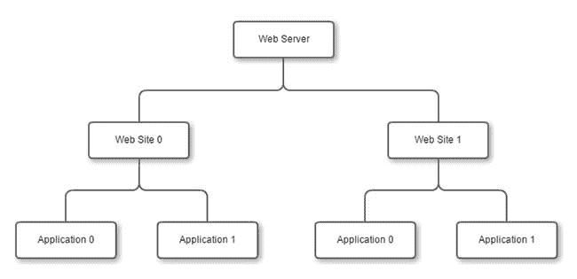
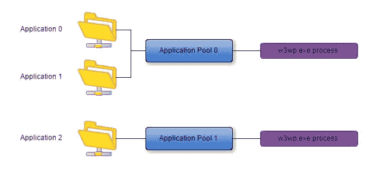
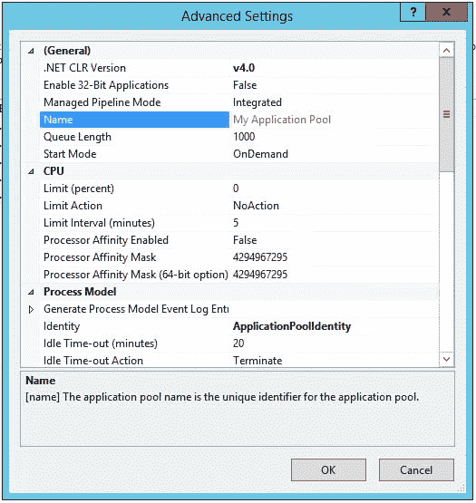
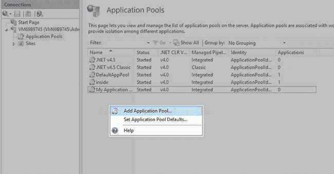

# 揭秘 IIS 应用程序池

> 原文：<https://dev.to/pluralsight/demystifying-iis-application-pools-40d6>

IIS 中的应用程序池可能有点神秘。因为它们是自动为您创建的，很多时候管理员和开发人员不会再考虑它们。

但是当应用程序池出现问题时，它会变得非常混乱。优化应用程序池还会带来一些重大的性能提升。理解应用程序池对于运行良好的 IIS 服务器和更好地运行应用程序至关重要。

### 什么是应用池？

要理解应用程序池，就 IIS 而言，我们必须首先理解应用程序。

一个**应用程序**是一组传递内容的文件和文件夹。任何网站都会有一个默认的应用程序分配给它，即使它只是 HTML 和图像。下图显示了 web 服务器/网站/应用程序的关系:

[](https://res.cloudinary.com/practicaldev/image/fetch/s--xjqbe0nU--/c_limit%2Cf_auto%2Cfl_progressive%2Cq_auto%2Cw_880/https://thepracticaldev.s3.amazonaws.com/i/uwxs06dlnfc4gdkkob12.jpg)

一个**应用程序池**是你的应用程序的容器。它用于将您的应用程序与服务器上的其他应用程序隔离开来。应用程序池中的每个应用程序共享一个工作进程(w3wp.exe)。您可以让几个应用程序共享同一个工作进程，或者每个应用程序一个工作进程。

[](https://res.cloudinary.com/practicaldev/image/fetch/s--5yWHssFn--/c_limit%2Cf_auto%2Cfl_progressive%2Cq_auto%2Cw_880/https://thepracticaldev.s3.amazonaws.com/i/wxb5t08v4t2if1hat8sc.jpg)

在设置应用程序池时，您有几个选择。让我们比较几个模式。

#### 单个池中的多个应用

[](https://res.cloudinary.com/practicaldev/image/fetch/s--mAIgIkX4--/c_limit%2Cf_auto%2Cfl_progressive%2Cq_auto%2Cw_880/https://thepracticaldev.s3.amazonaws.com/i/98pw13jqrzvfxnxugazo.jpg)

通过这种设置，每个应用程序共享同一个池/进程。您可能希望这样做的一些原因:

*   更简单的设计
*   当做出改变时，你只需要做一次。
*   缓存得到了改进，代码可以在应用程序之间共享和缓存

您可能不想这样做的一些原因:

*   一次崩溃关闭所有应用程序
*   高负载的应用程序会降低其他应用程序的速度
*   所有应用程序共享相同的安全配置文件
*   一个应用程序所需的设置可能会破坏另一个应用程序。

#### 每个应用都有自己的应用池

[](https://res.cloudinary.com/practicaldev/image/fetch/s--ymXW7dCy--/c_limit%2Cf_auto%2Cfl_progressive%2Cq_auto%2Cw_880/https://thepracticaldev.s3.amazonaws.com/i/40iaftradbtop6hc7ac5.jpg)

通过这种设置，每个应用程序都有自己独特的流程。

您可能希望这样做的一些原因:

*   隔离操作——如果一个应用程序失败，不会影响到其他应用程序。
*   隔离性能——较高负载的应用程序(很可能)不会降低其他应用程序的速度。
*   可以为每个应用程序单独配置安全性。

您可能不想这样做的一些原因:

*   设置不能全局更改，必须逐个进行。
*   不存在公共代码缓存优势。
*   可能会产生比单个池更多的开销。

对此没有“灵丹妙药”，这将取决于您的网站和您的组织的需求。这绝对是你想尝试以获得最佳效果的东西。

### 应用池设置

对于应用程序池，有一些重要的设置需要考虑。如果你选择基本设置，你不会得到太多:

[](https://res.cloudinary.com/practicaldev/image/fetch/s--ZuBm9RgK--/c_limit%2Cf_auto%2Cfl_progressive%2Cq_auto%2Cw_880/https://thepracticaldev.s3.amazonaws.com/i/lqfihb5zeheh421a4nea.jpg)

这仅允许您更改 CLR 版本和托管管道模式。但是选择高级设置，你会得到更多的选择:

[](https://res.cloudinary.com/practicaldev/image/fetch/s--CC_4k3hG--/c_limit%2Cf_auto%2Cfl_progressive%2Cq_auto%2Cw_880/https://thepracticaldev.s3.amazonaws.com/i/uzjo9l7kbqnc9u9ip6z7.jpg)

以下是我经常看到的一些变化:

*   **。net CLR**——虽然没有很好的理由运行较低版本的。但这确实发生了。通常我发现自己在默认的应用池框架是 2.0 的时候设置这个。

*   **启用 32 位应用程序** -这是向后兼容的常用程序。例如，我工作的上一个应用程序需要使用 C++编写的 32 位 dll，如果没有这个设置，应用程序将无法运行。

*   **托管管道模式** -这是另一种用于向后兼容的模式。对于一些旧的 ASP 应用程序，您可能需要经典模式。

*   队列长度(Queue Length)-这是一个节流设置，很粗略但很有用。我们在这里说的是，我们可以在队列中有 1000 个请求，超过这个数，访问者将得到一个 503 错误。

*   **Limit**——这是另一个节流措施，控制您希望这个应用程序池消耗的 CPU 时间的最大百分比。

*   **极限动作**指定达到极限时要做什么。您可以终止该进程，抑制它，或者什么也不做。

*   **极限区间**用于微调节流。达到上述限制后，此设置控制我们在回收前可以保持该状态的分钟数。如果它太长了，你可以在不再需要它的时候进行节流。太短的时间间隔只会让它节流。

*   **身份**——这很重要，因为这是您的应用程序池正在模拟的用户。大多数情况下，应用程序池标识是您的最佳选择，但是有时您需要特定的用户来运行一个进程。在这种情况下，您可以让此应用程序池在该用户的帐户下运行，并获得他们的权限。除非绝对需要，否则不要这样做。这是我在这个领域看到的很多东西，尤其是在高安全性应用中。

正如我以前说过的，调优也没有灵丹妙药。这真的取决于你的组织和你的网站是如何使用的。一个网站上的好歌可能对另一个网站不利。

### 如何创建应用程序池

在 IIS 中创建应用程序池很容易。您可以进入 IIS 管理器的**应用程序池**功能窗格，右键单击并创建一个新的应用程序池:

[](https://res.cloudinary.com/practicaldev/image/fetch/s--AwbDpYBi--/c_limit%2Cf_auto%2Cfl_progressive%2Cq_auto%2Cw_880/https://thepracticaldev.s3.amazonaws.com/i/gdgp4xguu9km9nslg8kd.jpg)

或者你可以用 PowerShell 创建一个(我的首选):

```
$appPoolName = 'jeremyscoolapp'

if(!(Test-Path IIS:\AppPools\$appPoolName))
{
    $appPool = New-Item $appPoolName
    $appPool | Set-ItemProperty -Name "managedRuntimeVersion" -Value 'v4.0'
}

Set-ItemProperty iis:\Sites\WebsiteName -Name applicationpool -Value $appPoolName 
```

<svg width="20px" height="20px" viewBox="0 0 24 24" class="highlight-action crayons-icon highlight-action--fullscreen-on"><title>Enter fullscreen mode</title></svg> <svg width="20px" height="20px" viewBox="0 0 24 24" class="highlight-action crayons-icon highlight-action--fullscreen-off"><title>Exit fullscreen mode</title></svg>

在这个脚本中，您可以看到我为我的应用程序池定义了一个名称。然后，我测试它是否已经存在。如果没有，我会创建一个新的应用程序池。然后我使用 Set-ItemProperty 将我的运行时版本更改为 4.0。您可以通过这种方式设置任何应用程序池设置。

要查看选项，您可以在 PowerShell 提示符下键入以下内容:

```
Get-Item IIS:\AppPools\DefaultAppPool  | Select-Object * 
```

<svg width="20px" height="20px" viewBox="0 0 24 24" class="highlight-action crayons-icon highlight-action--fullscreen-on"><title>Enter fullscreen mode</title></svg> <svg width="20px" height="20px" viewBox="0 0 24 24" class="highlight-action crayons-icon highlight-action--fullscreen-off"><title>Exit fullscreen mode</title></svg>

如果 DefaultAppPool 与您的应用程序池不同，请用它的名称替换它。

### 结论

我希望这已经很好地向您介绍了 IIS 中的应用程序池。因为这些是自动创建的，所以管理员通常不会花太多心思来设置它们。许多网站在默认设置下运行良好。如果您发现自己需要一个定制配置或者您有一些负载问题，那么您现在已经很好地理解了应用程序池以及在哪里可以改变它们。

我在我的新 Pluralsight 课程 [IIS 管理基础](http://bit.ly/IIS-Admin-Fundamentals)中涵盖了这个和更多 IIS 主题。如果您有兴趣了解有关 IIS 管理的更多信息，请查看它。