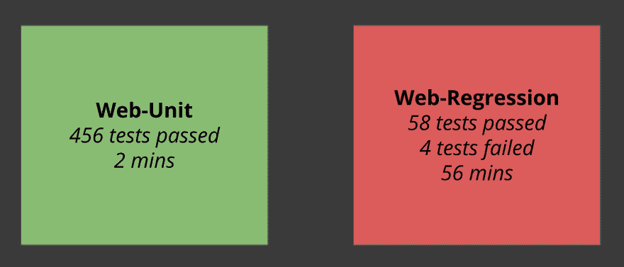
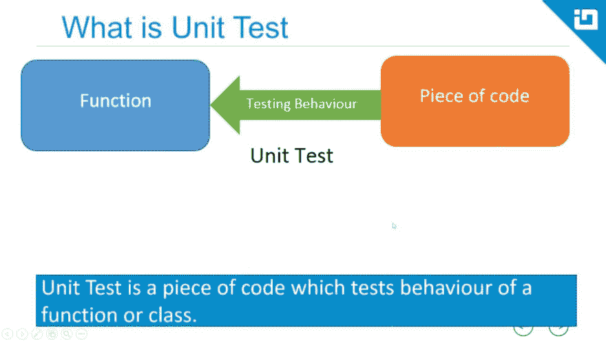
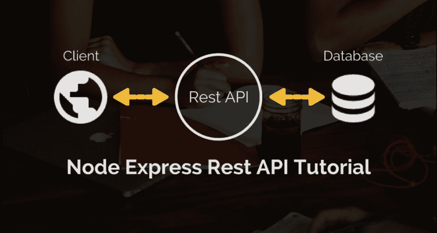

# 加快产品交付的测试金字塔方法

> 原文:[https://dev . to/cuongld 2/test-pyramid-approach-for-fast-product-delivery-54ci](https://dev.to/cuongld2/test-pyramid-approach-for-faster-product-delivery-54ci)

一、为什么要测试金字塔

公司在自动化测试上投入了大量的资金，但是他们

```
not seeing improved quality
not seeing improved productivity
not seeing improved user sentiment 
```

其中一个主要原因是过度依赖基于浏览器的端到端测试。

如果一个技术团队有一个可见的建筑散热器，它可能看起来像这样:

[T2】](https://res.cloudinary.com/practicaldev/image/fetch/s--Ufpfkd-M--/c_limit%2Cf_auto%2Cfl_progressive%2Cq_auto%2Cw_880/https://thepracticaldev.s3.amazonaws.com/i/yu2ibh1z9rgsfcp75t28.png)

```
Long running tests suites; 30 mins-4 hours, sometimes days
Flaky tests fails 1 in 10 or even 1 in 3 runs
Too much time by QA and devs creating and maintaining regression tests; rather than finding and fixing problems
Environments broken or not reflecting production; therefore negating the usefulness of the regression tests 
```

二。什么是测试金字塔

2012 年，马丁·福勒写了一篇关于测试金字塔的文章，这是迈克·科恩提出的概念。

测试金字塔是一个解决过度依赖长时间 UI 测试问题的工具。

金字塔说较低层次的测试编写和维护更便宜，运行更快。上层测试的编写和维护成本更高，运行速度也更慢。因此，你应该有很多单元测试，一些服务测试，和很少的 UI 测试。

我经常看到公司的测试套件看起来像一个冰淇淋蛋筒。

测试冰淇淋蛋卷

这里他们有很少的单元测试，一些 UI 测试，大量的 QA 测试和大量的手动测试。

在这种情况下，QA 部门已经创建了一个自动化测试套件，但是开发团队还没有。这将是一个漫长而古怪的过程，因为开发团队没有帮助构建套件，也没有以一种易于测试的方式设计应用程序。它经常被开发人员破坏，他们依靠质量保证部门来修复它。

大概既有手工测试团队，也有自动化测试团队。测试套件中可能没有足够的信任，因此回归被执行两次，一次是手动的，一次是自动的，因为这种双重工作以及测试团队之间的额外交接，这种方法使得公司走得更慢。

测试沙漏

在这种情况下，有很多单元和 UI 测试，但很少基于服务的测试。

这样更好，没有人工测试，QA 部门创建了一个公司正在依赖的测试套件。开发人员正在编写大量的单元测试，也许他们正在实践 TDD。然而，在单元测试中被测试的许多逻辑也在用户界面测试中被测试。再次导致双重工作。QA 团队几乎完全依赖基于浏览器的回归测试，而不是更便宜的基于服务的测试。

沙漏和冰淇淋甜筒都表明 QA 和开发部门之间缺乏合作和沟通，他们可能在组织上甚至在位置上是分开的。
三世。单元测试(水平单元)

单元测试是软件测试的一个层次，其中测试软件的单个单元/组件。目的是验证软件的每个单元都按照设计执行。单元是任何软件中最小的可测试部分。它通常有一个或几个输入，通常只有一个输出。在过程编程中，一个单元可以是一个单独的程序、函数、过程等。在面向对象编程中，最小的单元是方法，它可能属于基类/超类、抽象类或派生类/子类。(有些人将应用程序的模块视为一个单元。这是不鼓励的，因为在该模块中可能会有许多单独的单元。)单元测试框架、驱动程序、存根和模拟/伪造对象用于辅助单元测试。

[T2】](https://res.cloudinary.com/practicaldev/image/fetch/s--orEynFsI--/c_limit%2Cf_auto%2Cfl_progressive%2Cq_auto%2Cw_880/https://thepracticaldev.s3.amazonaws.com/i/kc7lkaxs551rgjja9cbr.jpg)

在进行单元测试时，为了避免依赖性，您应该使用模拟工具。(Java 是 mockito，Python 在 unittest 中有 mock 函数)
四。合同测试(级别单位)

你可以参考马丁·福勒关于合同测试的页面。

常用于不同团队之间执行微服务。

合同测试由开发人员完成。

一个团队希望另一个团队响应特定类型的结果(可能是字符串、整数或正则表达式)。

我们将用模拟数据来定义测试。
现实世界的例子:

我想在午餐时间去一家新的专业技术商店，但这条路线我以前从未走过，我担心我没有足够的时间在下午 2 点的会议之前往返。我需要这次旅行需要多长时间的信息。

考虑到我目前的资源，我有两种方法可以选择——步行到那里，计算步行的时间，然后用两倍的时间计算出总路程。查看在线路线地图，了解路线的估计值。

一个选项比另一个快得多，没有依赖性，让我相当接近我想要的答案，但忽略了旅程的较低层次的细节(风速，坡度)，我将通过自己计时步行来了解。

这正是契约测试所做的。它模拟或询问一个响应，让您获得一些关于您需要的函数的信息。五、API 测试

API 是 Application Programming Interface 的首字母缩写，它是一个软件中介，允许两个应用程序(服务)相互通信。

更好想象的真实世界示例，如:

在餐馆里，你是那里的一个顾客。

为了得到你想要的食物，你想叫服务员。

他会得到关于你想要的食物的信息，然后去和厨房里的其他厨师交谈。

当食物准备好了，你会从服务员那里拿到食物。

服务员/女服务员就是我说的 API。

[T2】](https://res.cloudinary.com/practicaldev/image/fetch/s--DKQHSn_0--/c_limit%2Cf_auto%2Cfl_progressive%2Cq_auto%2Cw_880/https://thepracticaldev.s3.amazonaws.com/i/abyatkl860q0d5wsmu2c.jpg)

API 测试完全不同于 GUI 测试，主要集中在软件架构的业务逻辑层。这个测试不会关注应用程序的外观和感觉。

在 API 测试中，不使用标准的用户输入(键盘)和输出，而是使用软件向 API 发送调用，获取输出，并记录系统的响应。

API 测试需要应用程序与 API 进行交互。为了测试一个 API，你需要

```
Use Testing Tool to drive the API
Write your own code to test the API 
```

一些用于实现 API 测试的工具:cURL、Postman、Jmeter，或者编写自己的测试脚本向服务调用 HTTP 请求。六。UI 测试

我们将直接在 GUI 中验证应用程序的功能。

这往往更接近客户的实际使用。但是验证所有的测试用例需要时间和努力。手动测试

手动进行验证。

花费大量的时间和资源来做，但几乎可以在这里做各种测试。

这方面的最佳实践是，我们应该只在测试不能自动化时进行(在搜索引擎中进行测试，500 错误..)