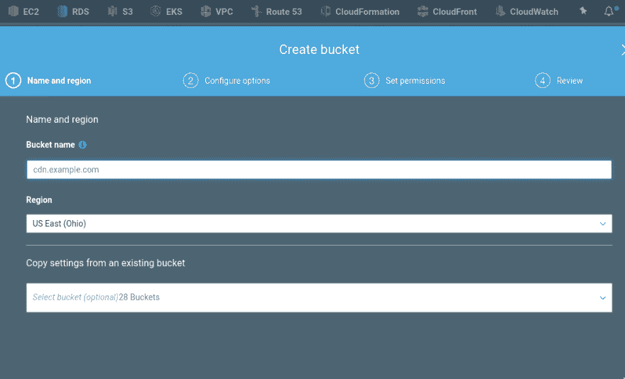
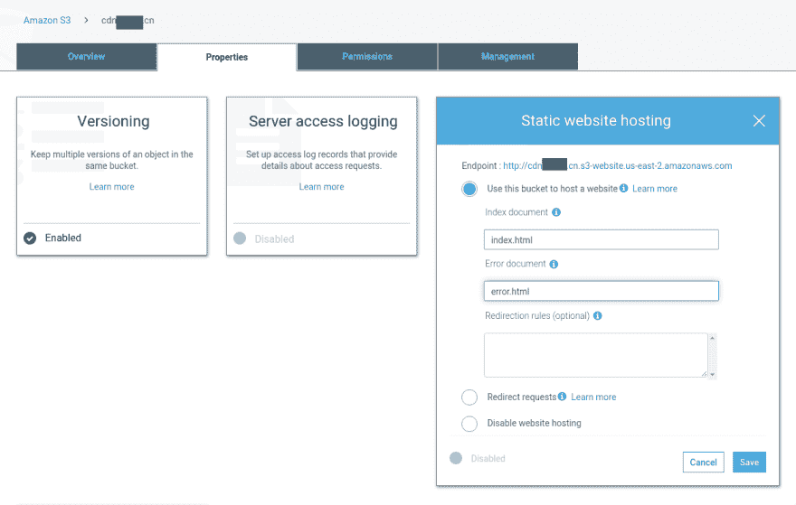
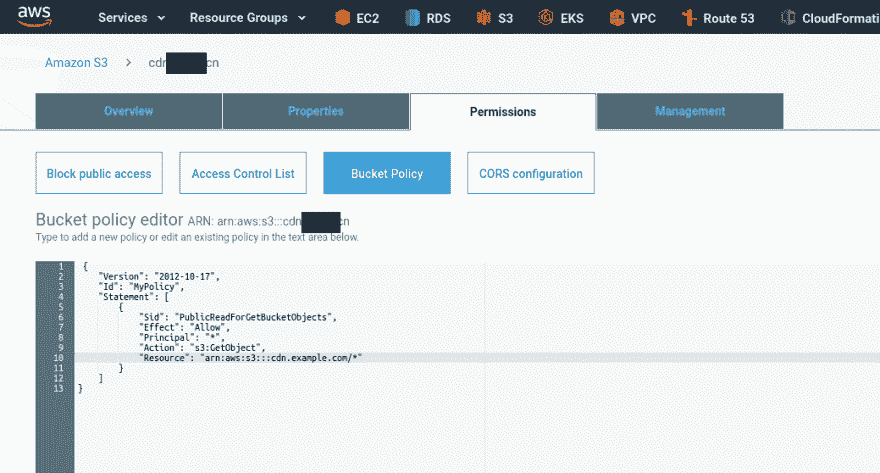
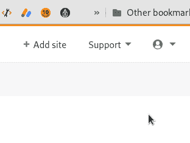
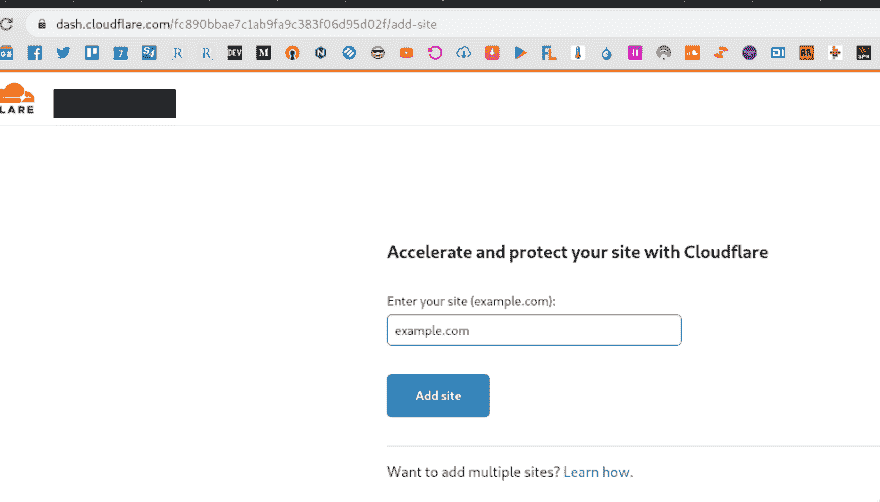
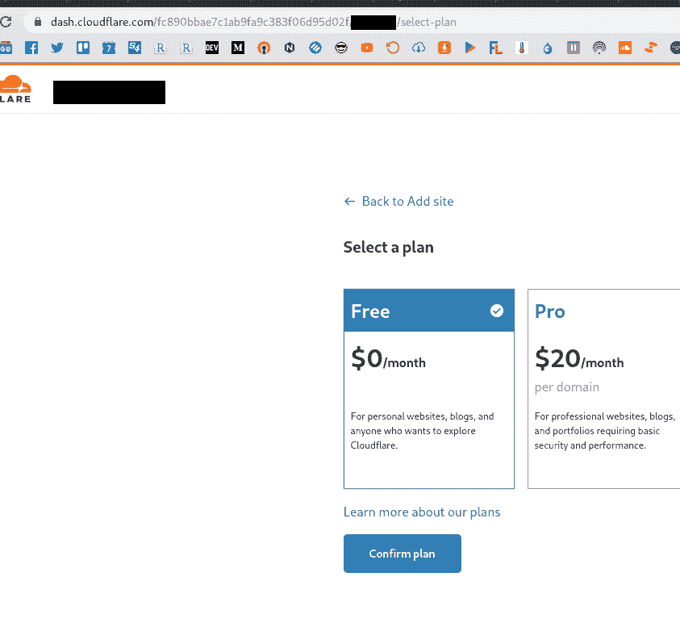
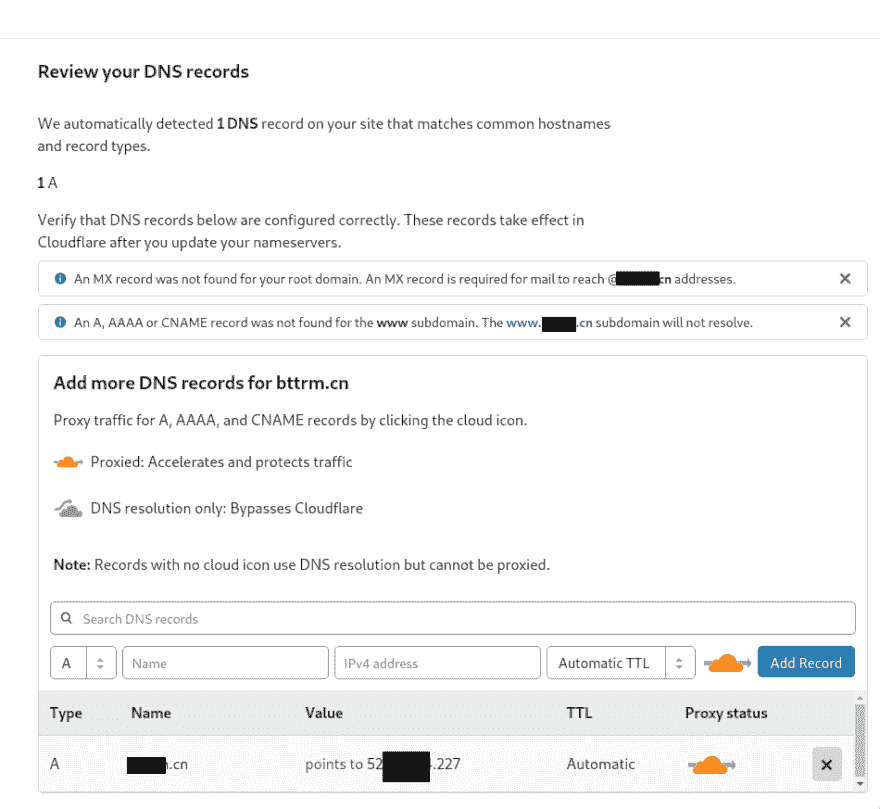
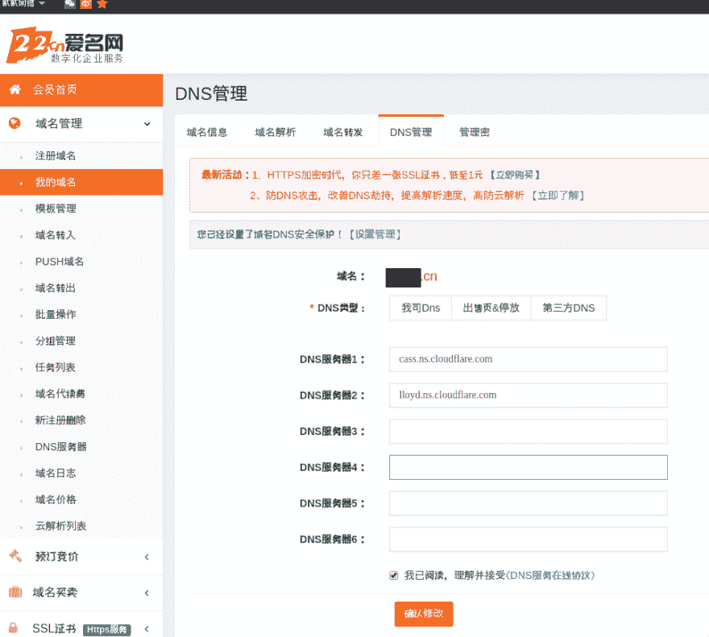
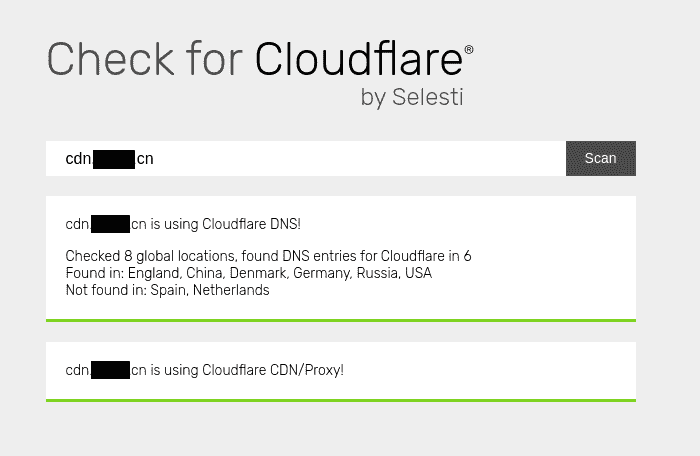

# cloud flare:AWS S3 网站托管的 CDN 配置

> 原文:[https://dev . to/setevoy/cloud flare-cdn-configuration-for-AWS-S3-website-hosting-171 p](https://dev.to/setevoy/cloudflare-cdn-configuration-for-aws-s3-website-hosting-171p)

[](https://res.cloudinary.com/practicaldev/image/fetch/s---zgWcswx--/c_limit%2Cf_auto%2Cfl_progressive%2Cq_auto%2Cw_880/https://rtfm.co.ua/wp-content/uploads/2019/09/cloudflare-logo.png) 需要使用 AWS S3 创建一个静态网站托管，并将 CloudFlare CDN 附加到它。

### [](#aws-s3-bucket)AWS S3 斗

为您的网站创建一个新的存储桶，其名称与它将用于您的网站的名称相同，在这种情况下，它将是*cdn.example.com*:

[T2】](https://rtfm.co.ua/wp-content/uploads/2019/09/Screenshot_20190920_122846.png)

转到*属性*并启用网站托管:

[T2】](https://rtfm.co.ua/wp-content/uploads/2019/09/Screenshot_20190920_123017.png)

进入*权限*，在*桶策略*中启用对该桶
的完全访问权限

```
 {
    "Version": "2012-10-17",
    "Id": "MyPolicy",
    "Statement": [
        {
            "Sid": "PublicReadForGetBucketObjects",
            "Effect": "Allow",
            "Principal": "*",
            "Action": "s3:GetObject",
            "Resource": "arn:aws:s3:::cdn.example.com/*"
        }
    ]
} 
```

[T2】](https://rtfm.co.ua/wp-content/uploads/2019/09/Screenshot_20190920_123416.png)

让我们现在检查它。

创建一个新文件并上传到桶:

```
$ aws --profile bm-backend s3 cp index.html s3://cdn.example.com
upload: ./index.html to s3://cdn.example.com/index.html 
```

使用 bucket 的 URL:
打开它

```
$ curl http://cdn.example.com.s3-website.us-east-2.amazonaws.com
TestCDN 
```

### [](#cloudflare-cdn-configuration)CloudFlare CDN 配置

注册后–前往*添加站点*:

[T2】](https://rtfm.co.ua/wp-content/uploads/2019/09/Screenshot_20190920_122211.png)

CloudFlare 支持两种类型的配置——完全配置，当整个域的 DNS 将发生变化时，它将完全由 CloudFlare DNS 提供服务；部分配置，当您只能配置一个子域时。

第二个要求有一个业务或企业计划，当我们等待我们的企业计划启用时，让我们使用完整的配置。

添加域:

[T2】](https://rtfm.co.ua/wp-content/uploads/2019/09/Screenshot_20190920_122547.png)

在此处选择您的计划，现在试用，企业版将在发送电子邮件至支持@后启用:

[T2】](https://rtfm.co.ua/wp-content/uploads/2019/09/Screenshot_20190920_122617-1.png)

CloudFlare 将获取您的域的所有现有记录:

[T2】](https://rtfm.co.ua/wp-content/uploads/2019/09/Screenshot_20190920_122709.png)

您可以在这里为您的 CDN 创建一个新子域名，例如，*cdn.example.com*为 CNAME 记录类型，并设置您的 bucket 的 URL:

[T2】](https://rtfm.co.ua/wp-content/uploads/2019/09/Screenshot_20190920_123609.png)

最后一步 CloudFlare 告诉我们需要为我们的域设置哪些 DNS:

[T2】](https://rtfm.co.ua/wp-content/uploads/2019/09/Screenshot_20190920_123637.png)

转到您的域注册商并更新其 DNS:

[T2】](https://rtfm.co.ua/wp-content/uploads/2019/09/Screenshot_20190920_124546.png)

等待几分钟并检查:

```
$ whois example.com | grep Name
Domain Name: example.com
Name Server: cass.ns.cloudflare.com
Name Server: lloyd.ns.cloudflare.com 
```

检查云耀斑:

[T2】](https://rtfm.co.ua/wp-content/uploads/2019/09/Screenshot_20190920_125040.png)

例如，通过使用这个服务——[https://checkforcloudflare.selesti.com](https://checkforcloudflare.selesti.com):

[T2】](https://rtfm.co.ua/wp-content/uploads/2019/09/Screenshot_20190920_125129-1.png)

### [](#ssl)SSL

最后要做的是更新一点 SSL 启用 HTTP 到 HTTPS 重定向:

[T2】](https://rtfm.co.ua/wp-content/uploads/2019/09/Screenshot_20190920_125521.png)

CloudFlare 使用自己的证书，但是您可以上传一个额外的证书:

[T2】](https://rtfm.co.ua/wp-content/uploads/2019/09/Screenshot_20190920_125611.png)

完成了。

### [](#similar-posts)类似的帖子

*   <small>07/17/2019</small> [AWS:设置了删除标记的 S3 跨区域复制](https://rtfm.co.ua/en/aws-s3-cross-region-replication-configuration-and-objects-deletemarkers-replication/)
*   <small>09/05/2018</small>[AWS:cloud formation–созданиеS3 网站托管и CloudFront 分布](https://rtfm.co.ua/aws-cloudformation-sozdanie-s3-website-hosting-i-cloudfront-distribution/)
*   <small>2018 年 11 月 27 日</small>[【AWS:云形成–S3′aks′aks′应用负载平衡器](https://rtfm.co.ua/aws-cloudformation-s3-korzina-dlya-logov-application-load-balancer/)